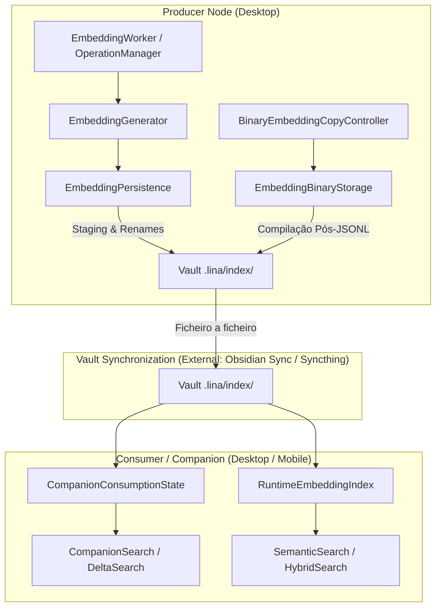
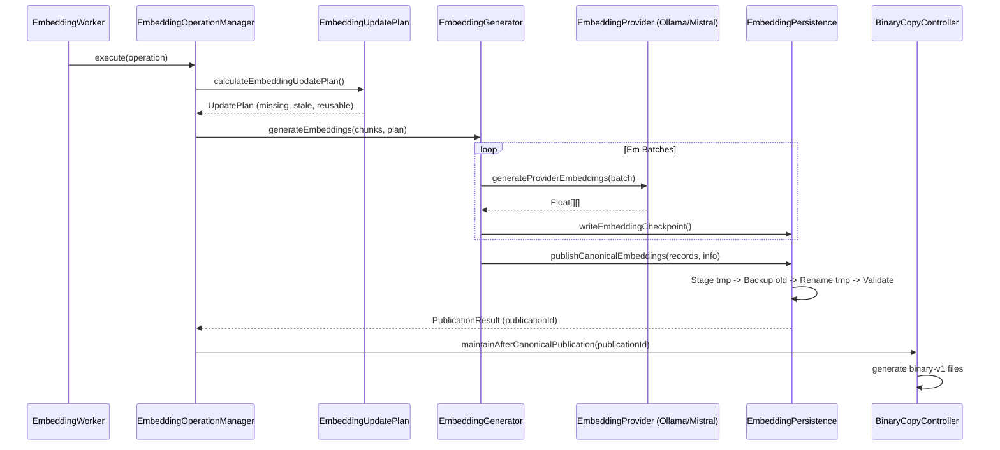
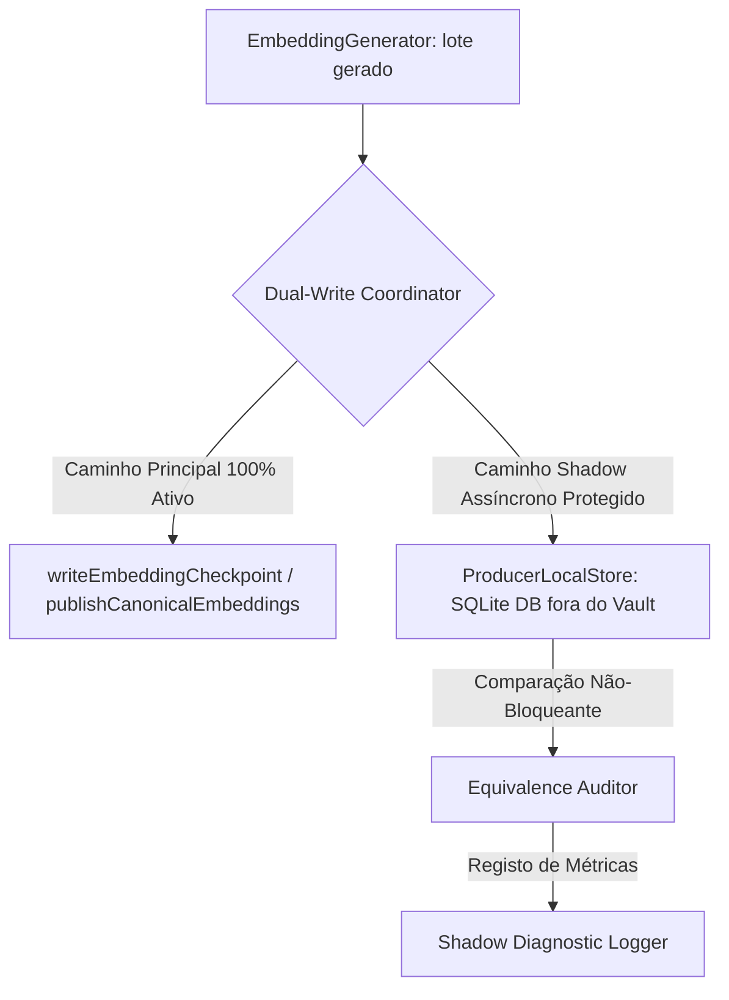
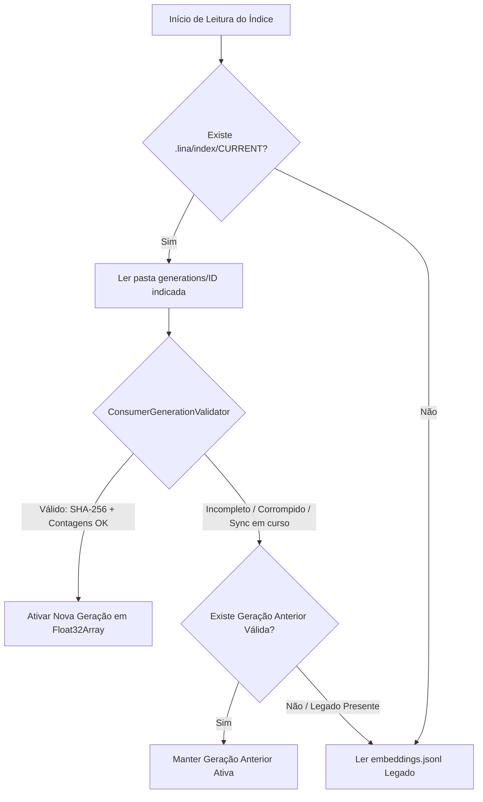

# AUDITORIA DE INTEGRAÇÃO ARQUITETURAL: SQLITE & PUBLICAÇÃO DE EMBEDDINGS NO LINA

**Documento:** `docs/architecture/AUDITORIA-INTEGRACAO-SQLITE-LINA-001.md`  
**Referência:** `PROMPT-LINA-INTEGRACAO-ARQUITETURA-SQLITE-AUDITORIA-001`  
**Autoridade:** 1. `AGENTS.md` · 2. Decisões Arquiteturais Consolidadas · 3. Schemas/Contratos Existentes · 4. Arquitetura Alvo de Persistência e Publicação  
**Estado:** Relatório de Auditoria Arquitetural (Exclusivamente de Análise — Sem Alterações de Código)  
**Data:** Outubro de 2026  

---

## 1. Sumário Executivo

A presente auditoria arquitetural mapeia de forma exaustiva a integração do modelo de persistência local SQLite e publicação canónica por geração no repositório de produção do Lina, sem introduzir alterações de código, migrações, modificações de schema ou remoção de componentes legados.

### 1.1 Diagnóstico do Estado de Partida
Atualmente, o Lina opera com uma persistência baseada em ficheiros de texto estruturados dentro do Vault (`.lina/index/embeddings.jsonl`, `.lina/index/manifest.json`, `.lina/index/notes.json`, `.lina/index/chunks.jsonl`), complementada por uma cópia binária derivada opcional (`.lina/index/embeddings.meta.jsonl`, `.lina/index/embeddings.vectors.f32`, `.lina/index/embeddings.manifest.json`) gerida por [`BinaryEmbeddingCopyController`](file:///d:/_dev/obsidian/lina/src/index/embeddingBinaryCopyController.ts).

Embora as fases LINA-14 e LINA-15H tenham introduzido garantias robustas de *staging*, *backups* determinísticos, *fencing* de autoridade com [`IndexWriteFence`](file:///d:/_dev/obsidian/lina/src/index/writeFence.ts), proteção contra corrupção e modelo determinístico com [`EmbeddingLifecycleSnapshot`](file:///d:/_dev/obsidian/lina/src/index/embeddingLifecycleModel.ts), a persistência primária no Vault apresenta limitações estruturais:
1. **Ineficiência de I/O e Parse:** O ficheiro `embeddings.jsonl` exige serialização/deserialização de grandes arrays de floats em strings JSON, elevando o consumo de CPU e memória heap no Desktop e no Mobile.
2. **Fragilidade de Sincronização Não-Atómica:** Sincronizadores externos (Obsidian Sync, Syncthing, iCloud, Git) propagam ficheiros individualmente, criando janelas transitórias onde `manifest.json` e `embeddings.jsonl` divergem em cardinalidade ou timestamps.
3. **Riscos de Regeneração Indesejada:** A corrupção ou remoção acidental dos ficheiros do Vault pode forçar uma re-geração de embeddings contra os providers de IA (Ollama, Mistral), com custos de computação e quota de API desnecessários.

### 1.2 A Solução Arquitetural Alvo
A arquitetura alvo (`ARQUITETURA-PERSISTENCIA-PUBLICACAO-EMBEDDINGS-001.md`), validada pela Prova de Conceito com `node:sqlite` (`DatabaseSync`), estabelece:
- **Producer Local Store (SQLite Canónico Fora do Vault):** O dispositivo com papel de Active Producer mantém uma base de dados SQLite (`lina-producer.db`) num diretório privado do SO (e.g. `~/.lina/db/` ou AppData), fora da árvore do Vault e 100% excluída de qualquer sincronização externa.
- **Armazenamento Vetorial Nativo:** Embeddings guardados em SQLite como BLOBs binários de `Float32Array` contíguos (little-endian), com modo WAL (`Write-Ahead Logging`) e `synchronous = FULL`.
- **Publicação Imutável por Geração:** O Producer compila e publica no Vault artefactos de leitura rápida (`generation-XXXXXX/` contendo `manifest.json`, `vectors.bin`, `records.json` e um ponteiro atómico `CURRENT`), garantindo atomicidade, tolerância a sincronização parcial e anti-downgrade.
- **Consumer/Companion Leve (Zero SQLite):** Dispositivos Companion (incluindo Mobile) continuam a consumir exclusivamente os artefactos binários estáticos via `DataAdapter` do Obsidian, sem qualquer dependência de bibliotecas de base de dados nativas.
- **Zero Regeneração em Perda de Binários:** Se os artefactos do Vault forem corrompidos ou eliminados, o Producer reconstrói a geração a partir da sua base SQLite local em milissegundos, sem efetuar chamadas a modelos de IA.

---

## 2. Estado Atual Real

### 2.1 Módulos e Componentes em Produção



### 2.2 Inventário de Ficheiros do Sistema Atual

| Domínio | Ficheiro / Caminho | Formato | Papel Atual | Sincronizado |
|---|---|---|---|---|
| **Índice Textual** | `.lina/index/notes.json` | JSON | Metadados de notas indexadas ([`IndexedNote`](file:///d:/_dev/obsidian/lina/src/index/indexStore.ts#L16-L24)) | Sim |
| **Índice Textual** | `.lina/index/chunks.jsonl` | JSONL | Chunks de texto extraídos ([`Chunk`](file:///d:/_dev/obsidian/lina/src/index/chunker.ts)) | Sim |
| **Manifesto Central** | `.lina/index/manifest.json` | JSON | Identidade do índice, embeddings habilitados, contagens, vector contract ([`TextIndexManifest`](file:///d:/_dev/obsidian/lina/src/index/indexStore.ts#L26-L52)) | Sim |
| **Embeddings Canónicos** | `.lina/index/embeddings.jsonl` | JSONL | Vetores numéricos em JSON ([`EmbeddingRecord`](file:///d:/_dev/obsidian/lina/src/index/embeddingPersistence.ts#L62-L74)) | Sim |
| **Cópia Binária (Meta)** | `.lina/index/embeddings.meta.jsonl` | JSONL | Metadados alinhados de chunks ([`RuntimeEmbeddingMetadata`](file:///d:/_dev/obsidian/lina/src/search/runtimeEmbeddingIndex.ts#L11-L17)) | Sim |
| **Cópia Binária (Vetores)** | `.lina/index/embeddings.vectors.f32` | Binário | Buffer contíguo `Float32Array` | Sim |
| **Cópia Binária (Manifesto)** | `.lina/index/embeddings.manifest.json` | JSON | Manifesto com digests SHA-256 ([`BinaryEmbeddingManifestV1`](file:///d:/_dev/obsidian/lina/src/index/embeddingBinaryStorage.ts#L25-L48)) | Sim |
| **Checkpoint Producer** | `.lina/producer/checkpoints/embeddings.checkpoint.jsonl` | JSONL | Estado intermediário de geração de embeddings | Sim (risco) |
| **Checkpoint Meta** | `.lina/producer/checkpoints/embeddings.checkpoint.meta.json` | JSON | Metadados do checkpoint ([`EmbeddingCheckpointMetadata`](file:///d:/_dev/obsidian/lina/src/index/embeddingPersistence.ts#L75-L87)) | Sim (risco) |
| **Staging Producer** | `.lina/producer/staging/*` | Temporários | Ficheiros transitórios de renomeação | Sim (transitório) |
| **Backups Producer** | `.lina/producer/backups/*` | Backups | Cópia de segurança pré-promoção | Sim (transitório) |
| **Autoridade Global** | `.lina/ownership.json` | JSON | Active Producer ID e Epoch ([`OwnershipManifest`](file:///d:/_dev/obsidian/lina/src/device/deviceOwnership.ts#L25-L43)) | Sim |
| **Estado do Produtor** | `.lina/producer-state.json` | JSON | Snapshots de frescura e timestamps ([`ProducerStateV1`](file:///d:/_dev/obsidian/lina/src/device/producerState.ts#L62-L70)) | Sim |
| **Políticas de Exclusão** | `.lina/exclusions.json` | JSON | Pastas, caminhos e termos excluídos ([`ExclusionPolicyV1`](file:///d:/_dev/obsidian/lina/src/index/exclusionPolicy.ts#L45-L52)) | Sim |
| **Estado do Dispositivo** | `.lina/devices/<deviceId>.json` | JSON | Papel local, nome do dispositivo ([`DeviceScopedState`](file:///d:/_dev/obsidian/lina/src/device/deviceState.ts)) | Sim |
| **Identidade Local** | LocalStorage (`lina_device_id`) | Chave-valor | UUID v4 do dispositivo | Não (Device-Local) |
| **Credenciais** | `app.secretStorage` | OS Keychain | API Keys de análise e embeddings ([`LINA_SECRET_KEYS`](file:///d:/_dev/obsidian/lina/src/device/secretStorage.ts#L9-L12)) | Não (Device-Local) |
| **Settings Gerais** | `.obsidian/plugins/lina/data.json` | JSON | Configurações do plugin ([`LinaSettings`](file:///d:/_dev/obsidian/lina/src/settings.ts#L116-L160)) | Sim / Local |

---

## 3. Persistência Atual

### 3.1 Onde e Como são Guardados os Embeddings
1. **Formato Canónico Legado:** Em [`.lina/index/embeddings.jsonl`](file:///d:/_dev/obsidian/lina/src/index/embeddingPersistence.ts#L22). Cada linha serializa uma instância de [`EmbeddingRecord`](file:///d:/_dev/obsidian/lina/src/index/embeddingPersistence.ts#L62-L74):
   ```json
   {"chunkId":"note.md:0","path":"note.md","index":0,"textHash":"abc...","model":"nomic-embed-text","provider":"ollama","dimensions":768,"embedding":[0.012,-0.045,...],"createdAt":"2026-10-04T12:00:00.000Z"}
   ```
2. **Cópia Binária Opcional Derivada:** Em [`.lina/index/embeddings.vectors.f32`](file:///d:/_dev/obsidian/lina/src/index/embeddingBinaryStorage.ts) e `embeddings.meta.jsonl`, gerada por [`BinaryEmbeddingPublisher`](file:///d:/_dev/obsidian/lina/src/index/embeddingBinaryStorage.ts#L367-L440) após a publicação canónica de `embeddings.jsonl`.
3. **Checkpoints:** Em `.lina/producer/checkpoints/embeddings.checkpoint.jsonl` e `.meta.json`, gravados periodicamente durante gerações em lote longas por [`writeEmbeddingCheckpoint`](file:///d:/_dev/obsidian/lina/src/index/embeddingPersistence.ts#L758-L870).

### 3.2 Fencing e Coordenação de Escrita
- **Validação de Autoridade:** A função [`assertIndexWriteFence`](file:///d:/_dev/obsidian/lina/src/index/writeFence.ts#L17-L28) compara o `{ producerDeviceId, epoch }` injetado na operação contra a leitura em tempo real de [`.lina/ownership.json`](file:///d:/_dev/obsidian/lina/src/device/deviceOwnership.ts).
- **Coordenação em Memória:** [`IndexWriteCoordinator`](file:///d:/_dev/obsidian/lina/src/index/indexWriteCoordinator.ts) serializa acessos concorrentes (`startCanonicalPublish`, `startBinaryMaintenance`), garantindo que apenas uma operação mutável ocorre por instância de plugin.

---

## 4. Pipeline de Producer Atual

O pipeline do Producer é orquestrado por [`EmbeddingWorker`](file:///d:/_dev/obsidian/lina/src/maintenance/embeddingWorker.ts), [`EmbeddingOperationManager`](file:///d:/_dev/obsidian/lina/src/index/embeddingOperationManager.ts) e [`EmbeddingGenerator`](file:///d:/_dev/obsidian/lina/src/index/embeddingGenerator.ts):



### 4.1 Pontos Críticos Mapeados no Producer Atual
1. **Cálculo do Plano de Atualização:** [`calculateEmbeddingUpdatePlan`](file:///d:/_dev/obsidian/lina/src/index/embeddingUpdatePlan.ts#L98-L230) compara os chunks lidos de `chunks.jsonl` com o estado de `embeddings.jsonl` ou checkpoints recuperáveis.
2. **Batching e Checkpoints:** Gerações divididas em lotes configuráveis (`embeddingsBatchSize`). A cada lote ou intervalo, grava checkpoints no Vault.
3. **Publicação em Duas Fases:** [`publishCanonicalEmbeddings`](file:///d:/_dev/obsidian/lina/src/index/embeddingPersistence.ts#L919-L1050) escreve em `.tmp`, efetua backup do ficheiro ativo e renomeia.
4. **Acionamento Derivado Binário:** [`BinaryEmbeddingCopyController.maintainAfterCanonicalPublication`](file:///d:/_dev/obsidian/lina/src/index/embeddingBinaryCopyController.ts#L95-L135) lê o JSONL recém-publicado do Vault, converte-o para binário e grava os 3 ficheiros binários.

---

## 5. Pipeline de Consumer/Companion Atual

### 5.1 Descoberta e Consumo de Artefactos
O Companion opera de forma estritamente *read-only* através de [`evaluateCompanionConsumptionState`](file:///d:/_dev/obsidian/lina/src/companion/companionConsumptionState.ts#L182-L350):
- Inspeciona a presença e integridade de `manifest.json`, `notes.json`, `chunks.jsonl`, `embeddings.jsonl` e `embeddings.manifest.json`.
- Avalia a compatibilidade de vetores com [`evaluateVectorContractCompatibility`](file:///d:/_dev/obsidian/lina/src/index/vectorContract.ts#L83-L130).
- Determina o modo de consumo (`full`, `text-only`, `degraded`, `unavailable`).

### 5.2 Carregamento em Runtime
A pesquisa semântica carrega o índice através de [`readRuntimeEmbeddingIndex`](file:///d:/_dev/obsidian/lina/src/search/runtimeEmbeddingIndex.ts#L337-L440):
1. **Tentativa Binária Primária:** Se configurado `prefer-binary` e os ficheiros `embeddings.manifest.json`, `embeddings.vectors.f32` e `embeddings.meta.jsonl` existirem, carrega o buffer binário diretamente para um `Float32Array` via [`readBinaryEmbeddingStorage`](file:///d:/_dev/obsidian/lina/src/index/embeddingBinaryStorage.ts#L225-L330).
2. **Fallback para JSONL:** Se os ficheiros binários estiverem ausentes, corrompidos ou com digest inválido, efetua fallback para o parse linha a linha de `embeddings.jsonl`.
3. **Resource Guard:** [`evaluateEmbeddingBridgeRead`](file:///d:/_dev/obsidian/lina/src/index/embeddingResourceGuard.ts) valida se o tamanho dos ficheiros não excede os limites de memória da plataforma ([`DESKTOP_EMBEDDING_BINARY_RESOURCE_LIMITS`](file:///d:/_dev/obsidian/lina/src/index/embeddingBinaryStorage.ts#L89-L97) vs [`MOBILE_EMBEDDING_BINARY_RESOURCE_LIMITS`](file:///d:/_dev/obsidian/lina/src/index/embeddingBinaryStorage.ts#L99-L107)).

---

## 6. Sincronização Atual e Análise de Concorrência

### 6.1 Classificação Atual dos Ficheiros

| Caminho / Padrão | Classificação | Risco de `.sync-conflict` | Ação Arquitetural Alvo |
|---|---|---|---|
| `.lina/ownership.json` | `shared-canonical` | Baixo (coordenação por epoch) | Manter compartilhado |
| `.lina/exclusions.json` | `shared-canonical` | Baixo (escrita exclusiva do Producer) | Manter compartilhado |
| `.lina/producer-state.json` | `shared-canonical` | Médio (timestamps frequentes) | Manter compartilhado |
| `.lina/index/manifest.json` | `shared-canonical` | Alto (janela com `embeddings.jsonl`) | Substituir por `generation-XXXXXX/` |
| `.lina/index/notes.json` | `shared-canonical` | Médio | Manter ou unificar em geração |
| `.lina/index/chunks.jsonl` | `shared-canonical` | Médio | Manter ou unificar em geração |
| `.lina/index/embeddings.jsonl` | `legacy-to-remove` | Alto (tamanho grande, não atómico) | Eliminar após M6 |
| `.lina/index/embeddings.vectors.f32` | `shared-canonical` | Alto (ficheiro binário grande) | Encapsular em `generation-XXXXXX/` |
| `.lina/index/embeddings.meta.jsonl` | `shared-canonical` | Médio | Encapsular em `generation-XXXXXX/` |
| `.lina/index/embeddings.manifest.json` | `shared-canonical` | Médio | Encapsular em `generation-XXXXXX/` |
| `.lina/producer/checkpoints/*` | `producer-private` | Alto (nunca deveria sincronizar) | **Mover para SQLite privado** |
| `.lina/producer/staging/*` | `producer-private` | Médio | **Mover para SQLite/staging privado** |
| `.lina/producer/backups/*` | `producer-private` | Médio | **Mover para SQLite/staging privado** |
| `.lina/devices/<deviceId>.json` | `device-local` (no vault) | Baixo (namespace por deviceId) | Manter |
| `~/.lina/db/lina-producer.db` | `producer-private` (fora) | **Zero (fora do Vault)** | **Novo Store Canónico** |

---

## 7. Mapeamento Arquitetura-Alvo → Código Real

| Componente Alvo | Código Atual Relacionado | Estado | Gap Identificado | Ação Futura (M0–M7) |
|---|---|---|---|---|
| `ProducerLocalStore` | [`embeddingPersistence.ts`](file:///d:/_dev/obsidian/lina/src/index/embeddingPersistence.ts), `node:sqlite` (PoC) | Inexistente em prod | Checkpoints e vetores gravados no Vault em JSONL/tmp | Criar store SQLite local fora do Vault com `DatabaseSync` (M0, M1) |
| `PublicationBuilder` | [`BinaryEmbeddingPublisher`](file:///d:/_dev/obsidian/lina/src/index/embeddingBinaryStorage.ts#L367), `publishCanonicalEmbeddings` | Parcial / Desacoplado | Publica JSONL primeiro e depois ficheiros binários soltos | Criar construtor que compila `generation-XXXXXX/` diretamente do SQLite (M4) |
| `PublishedGeneration` | [`BinaryEmbeddingManifestV1`](file:///d:/_dev/obsidian/lina/src/index/embeddingBinaryStorage.ts#L25), `CanonicalPairState` | Parcial | Artefactos binários soltos na raiz de `.lina/index/` | Definir contrato de pasta imutável `generation-XXXXXX/` com `CURRENT` (M4) |
| `ConsumerGenerationValidator` | [`inspectCanonicalPair`](file:///d:/_dev/obsidian/lina/src/index/embeddingPersistence.ts#L378), `evaluateCompanionConsumptionState` | Parcial | Validação baseada no par solto JSONL↔manifesto | Implementar validação estrita da pasta de geração ativa antes de promover (M5) |
| `ActiveGenerationManager` | [`readRuntimeEmbeddingIndex`](file:///d:/_dev/obsidian/lina/src/search/runtimeEmbeddingIndex.ts#L337) | Parcial | Leitura com fallback dinâmico entre caminhos fixos | Gerir apontador atómico `CURRENT` e lifecycle de gerações locais (M5, M6) |
| `EmbeddingUpdatePlan` | [`embeddingUpdatePlan.ts`](file:///d:/_dev/obsidian/lina/src/index/embeddingUpdatePlan.ts) | Existente | Calcula diferenças contra JSONL em memória | Adaptar para consultar diretamente índices/tabelas SQLite (M3) |
| `EmbeddingLifecycleModel` | [`embeddingLifecycleModel.ts`](file:///d:/_dev/obsidian/lina/src/index/embeddingLifecycleModel.ts) | Existente | Snapshot puro consolidado | Manter; alimentar com métricas do `ProducerLocalStore` (M3) |
| `BinaryEmbeddingCopyController` | [`embeddingBinaryCopyController.ts`](file:///d:/_dev/obsidian/lina/src/index/embeddingBinaryCopyController.ts) | Existente | Fila de manutenção dependente da leitura do JSONL | Simplificar para orquestrar publicação direta do SQLite (M4, M7) |

---

## 8. Modelo SQLite Proposto para o Producer

### 8.1 Localização Física Fora do Vault
A base de dados será criada no diretório de dados do utilizador do SO:
- **Windows:** `%APPDATA%\lina\db\lina-producer.db` ou `~/.lina/db/lina-producer.db`
- **macOS / Linux:** `~/.lina/db/lina-producer.db` ou `~/.config/lina/db/lina-producer.db`

*Critério de Isolamento:* A verificação programática [`isPathInsideVault`](file:///d:/_dev/obsidian/lina/src/index/embeddingPersistence.ts) confirmará categoricamente que o ficheiro `.db`, `-wal` e `-shm` residem fora da raiz do Vault.

### 8.2 Schema Relacional Proposto (DDL)

```sql
-- Metadados de Schema e Versão do Store
CREATE TABLE IF NOT EXISTS schema_migrations (
    version INTEGER PRIMARY KEY,
    applied_at TEXT NOT NULL,
    description TEXT NOT NULL
);

-- Espaços de Embeddings e Contratos Vetoriais
CREATE TABLE IF NOT EXISTS embedding_spaces (
    space_id TEXT PRIMARY KEY,           -- e.g. "default" ou hash(provider, model, dimensions)
    provider TEXT NOT NULL,              -- e.g. "ollama", "mistral"
    model TEXT NOT NULL,                 -- e.g. "nomic-embed-text"
    dimensions INTEGER NOT NULL,         -- e.g. 768
    vector_contract_id TEXT NOT NULL,    -- e.g. "vc-ollama-nomic-embed-text-768-cosine-v1"
    input_version INTEGER NOT NULL,      -- e.g. 1
    prefix_mode TEXT NOT NULL,           -- e.g. "none", "nomic-search-query-document"
    created_at TEXT NOT NULL,
    updated_at TEXT NOT NULL
);

-- Registo de Chunks e Embeddings (Armazenamento Canónico de Vetores)
CREATE TABLE IF NOT EXISTS embedding_records (
    chunk_id TEXT PRIMARY KEY,           -- e.g. "Notes/Idea.md:0"
    space_id TEXT NOT NULL,
    note_path TEXT NOT NULL,
    chunk_index INTEGER NOT NULL,
    text_hash TEXT NOT NULL,             -- hash do chunk
    input_hash TEXT NOT NULL,            -- hash do texto formatado com prefixo
    embedding_blob BLOB NOT NULL,        -- Float32Array (dimensions * 4 bytes)
    created_at TEXT NOT NULL,
    updated_at TEXT NOT NULL,
    FOREIGN KEY(space_id) REFERENCES embedding_spaces(space_id) ON DELETE CASCADE
);

CREATE INDEX IF NOT EXISTS idx_records_space_path ON embedding_records(space_id, note_path);
CREATE INDEX IF NOT EXISTS idx_records_text_hash ON embedding_records(space_id, text_hash);

-- Checkpoints e Operações em Curso (Substitui checkpoint.jsonl do Vault)
CREATE TABLE IF NOT EXISTS operation_checkpoints (
    operation_id TEXT PRIMARY KEY,
    space_id TEXT NOT NULL,
    status TEXT NOT NULL,                -- "running", "completed", "failed", "cancelled"
    total_chunks INTEGER NOT NULL,
    completed_chunks INTEGER NOT NULL,
    started_at TEXT NOT NULL,
    updated_at TEXT NOT NULL,
    error_summary TEXT,
    FOREIGN KEY(space_id) REFERENCES embedding_spaces(space_id) ON DELETE CASCADE
);

-- Histórico de Gerações Publicadas
CREATE TABLE IF NOT EXISTS published_generations (
    generation_id TEXT PRIMARY KEY,      -- e.g. "gen-1728045600-abc123"
    space_id TEXT NOT NULL,
    epoch INTEGER NOT NULL,
    record_count INTEGER NOT NULL,
    manifest_digest TEXT NOT NULL,
    vectors_digest TEXT NOT NULL,
    records_digest TEXT NOT NULL,
    published_at TEXT NOT NULL,
    vault_relative_path TEXT NOT NULL,   -- e.g. ".lina/index/generations/generation-1728045600-abc123"
    FOREIGN KEY(space_id) REFERENCES embedding_spaces(space_id) ON DELETE CASCADE
);
```

### 8.3 Mapeamento de Campos: Legado vs SQLite

| Dado no Lina Atual | Campo em `EmbeddingRecord` / Manifest | Coluna SQLite | Tipo SQLite | Origem / Derivação |
|---|---|---|---|---|
| ID do Chunk | `record.chunkId` | `chunk_id` | `TEXT` | Direto (`path:index`) |
| Caminho da Nota | `record.path` | `note_path` | `TEXT` | Direto |
| Índice do Chunk | `record.index` | `chunk_index` | `INTEGER` | Direto |
| Hash do Texto | `record.textHash` | `text_hash` | `TEXT` | Direto |
| Hash Formatado | `record.embeddingInputHash` | `input_hash` | `TEXT` | Derivado de [`buildEmbeddingInput`](file:///d:/_dev/obsidian/lina/src/index/embeddingGenerator.ts) |
| Vetor Embedding | `record.embedding: number[]` | `embedding_blob` | `BLOB` | Converte `number[]` para `Buffer.from(new Float32Array(...).buffer)` |
| Provider / Model | `record.provider`, `record.model` | `space_id` (tabela `embedding_spaces`) | `TEXT` | Normalizado em chave estrangeira |
| Dimensões | `record.dimensions` | `dimensions` | `INTEGER` | Normalizado em `embedding_spaces` |
| Vector Contract | `manifest.vectorContract` | `vector_contract_id` | `TEXT` | Normalizado em `embedding_spaces` |
| Checkpoint de Lote | `embeddings.checkpoint.jsonl` | `operation_checkpoints` | Tabela | Substitui ficheiro do Vault |

---

## 9. Arquitetura de Shadow Mode (Fases M1 e M2)

### 9.1 Ponto de Inserção do Dual-Write
O Dual-Write será introduzido no [`EmbeddingOperationManager`](file:///d:/_dev/obsidian/lina/src/index/embeddingOperationManager.ts) e [`EmbeddingGenerator`](file:///d:/_dev/obsidian/lina/src/index/embeddingGenerator.ts) através de um adaptador shadow:



### 9.2 Garantias de Isolamento no Shadow Mode
1. **Falhas em SQLite não afetam o Plugin:** O pipeline legado de escrita no Vault é executado primeiro. A escrita em SQLite é envolvida por `try/catch` defensivo; qualquer exceção em SQLite é capturada, logada em diagnóstico e não interrompe a operação do utilizador.
2. **Comparação de Equivalência:**
   - **Métrica de Chunks:** Cardinalidade total de chunks gerados/reutilizados ($N_{\text{legacy}} == N_{\text{sqlite}}$).
   - **Métrica de Vetores:** Comparação de integridade byte a byte ($L_2$ error $< 10^{-6}$ entre o float parseado do JSONL e o float descarregado do BLOB SQLite).
   - **Métrica de Hashes:** Correspondência de `chunkId` e `textHash`.
3. **Mecanismo de Rollback em Shadow Mode:** Desativar a flag `enableSqliteProducerShadow: false` desliga instantaneamente as chamadas a SQLite sem necessidade de qualquer alteração no Vault.

---

## 10. Publicação por Geração no Vault (Fase M4)

### 10.1 Estrutura de Diretórios de Publicação

```text
.lina/index/
  generations/
    gen-1728045600-a1b2c3/
      manifest.json
      vectors.bin
      records.json
    gen-1728049200-d4e5f6/
      manifest.json
      vectors.bin
      records.json
  CURRENT
  notes.json
  chunks.jsonl
  ownership.json
  producer-state.json
```

### 10.2 Conteúdo dos Artefactos de Geração

1. **`manifest.json` (Imutável da Geração):**
   ```json
   {
     "formatVersion": 2,
     "generationId": "gen-1728049200-d4e5f6",
     "epoch": 3,
     "producerDeviceId": "550e8400-e29b-41d4-a716-446655440000",
     "provider": "ollama",
     "model": "nomic-embed-text",
     "dimensions": 768,
     "recordCount": 15420,
     "dtype": "float32",
     "byteOrder": "little-endian",
     "vectorContract": {
       "provider": "ollama",
       "model": "nomic-embed-text",
       "dimensions": 768,
       "metric": "cosine",
       "prefixMode": "none",
       "inputVersion": 1
     },
     "digests": {
       "vectorsSha256": "sha256:e3b0c44298fc1c149afbf4c8996fb92427ae41e4649b934ca495991b7852b855",
       "recordsSha256": "sha256:ca978112ca1bbdcafac231b39a23dc4da786eff8147c4e72b9807785afee48bb"
     },
     "publishedAt": "2026-10-04T14:20:00.000Z"
   }
   ```
2. **`vectors.bin`:** Buffer binário puro contendo `recordCount * dimensions * 4` bytes.
3. **`records.json`:** Array JSON compacto com metadados dos chunks (`chunkId`, `path`, `index`, `textHash`).
4. **`CURRENT` (Ponteiro Atómico):** Ficheiro de texto pequeno com validação atómica contendo o ID da geração ativa atual:
   ```json
   {
     "activeGenerationId": "gen-1728049200-d4e5f6",
     "epoch": 3,
     "updatedAt": "2026-10-04T14:20:02.000Z"
   }
   ```

### 10.3 Processo de Publicação e Tolerância a Sincronização Não-Atómica
1. O Producer compila a pasta completa `generations/gen-XXXXXX/` em staging e promove-a para o Vault.
2. Apenas após a pasta e todos os seus 3 ficheiros estarem completamente gravados e validados no Vault, o Producer atualiza o ficheiro `CURRENT`.
3. Se um Consumer sincronizar o `CURRENT` antes da pasta `gen-XXXXXX/` estar completa, o validador do Consumer deteta `generation-incomplete`, ignora a nova geração e **mantém a geração anterior ativa** em memória sem falhar nem corromper a pesquisa.

---

## 11. Arquitetura do Novo Consumer (Fase M5)

### 11.1 Ponto de Inserção: `ConsumerGenerationValidator`
Em [`src/companion/`](file:///d:/_dev/obsidian/lina/src/companion/) e [`src/search/runtimeEmbeddingIndex.ts`](file:///d:/_dev/obsidian/lina/src/search/runtimeEmbeddingIndex.ts), a rotina de leitura substitui a inspeção do par legado por:



### 11.2 Regras de Anti-Downgrade
- O Consumer armazena em memória a geração atualmente carregada (`activeGenerationEpoch` e `activeGenerationTimestamp`).
- Se um evento de sincronização trouxer um `CURRENT` que aponte para uma geração com `epoch` inferior ou timestamp anterior ao já carregado, o Consumer recusa o downgrade e emite diagnóstico `sync-downgrade-rejected`.

---

## 12. Impacto em Ownership e Sincronização

### 12.1 Matriz de Classificação de Ficheiros

| Ficheiro | Classificação Canónica | Acesso Producer | Acesso Consumer | Impacto da Nova Arquitetura |
|---|---|---|---|---|
| `~/.lina/db/lina-producer.db` | `producer-private` (local) | Leitura / Escrita (Exclusivo) | Sem Acesso | Novo (100% fora do Vault e do Sync) |
| `.lina/ownership.json` | `shared-canonical` | Leitura / Escrita (sob lock) | Apenas Leitura | Mantém contrato e epoch fencing |
| `.lina/producer-state.json` | `shared-canonical` | Leitura / Escrita | Apenas Leitura | Mantém; reporta generationId ativa |
| `.lina/exclusions.json` | `shared-canonical` | Leitura / Escrita | Apenas Leitura | Mantém contrato |
| `.lina/devices/<id>.json` | `device-local` (no vault) | Leitura / Escrita (próprio ID) | Leitura (todos) | Mantém isolamento por deviceId |
| `.lina/index/CURRENT` | `shared-canonical` | Escrita atómica | Apenas Leitura | Novo apontador atómico no Vault |
| `.lina/index/generations/*` | `shared-canonical` | Criação imutável / Purge | Apenas Leitura | Novas pastas imutáveis |
| `.lina/index/embeddings.jsonl` | `legacy-to-remove` | Descontinuado em M6 | Fallback em M5 | Removido em M7 |
| `.lina/producer/checkpoints/*` | `legacy-to-remove` | Descontinuado em M3 | Sem Acesso | Removido do Vault (migrado para SQLite) |

---

## 13. Análise e Matriz de Riscos

| Risco | Código Afetado | Probabilidade | Impacto | Mitigação Arquitetural | Fase |
|---|---|---|---|---|---|
| **R1: Divergência Dual-Write** | `EmbeddingOperationManager`, `ProducerLocalStore` | Média | Baixo | JSONL legado continua primário; auditoria assíncrona compara vetores e reporta em log | M1, M2 |
| **R2: Schema Drift no SQLite** | `ProducerLocalStore` | Baixa | Alto | Tabela `schema_migrations` com migrações versionadas determinísticas | M0 |
| **R3: Publicação Parcial no Vault** | `PublicationBuilder`, `DataAdapters` | Média | Médio | Publicação em subpasta imutável `generation-XXXXXX/`; ativação via `CURRENT` apenas no fim | M4 |
| **R4: Downgrade por Sincronização** | `ConsumerGenerationValidator`, `RuntimeEmbeddingIndex` | Média | Médio | Validador rejeita apontadores `CURRENT` com epoch ou timestamp inferior ao ativo | M5 |
| **R5: Standby / Producer Concorrente** | `deviceOwnership.ts`, `writeFence.ts` | Baixa | Alto | Preservação integral do `IndexWriteFence` e `ownership.json`; base SQLite é privada do SO | M3, M4 |
| **R6: Sync Conflicts no Vault** | Sincronizador externo (Syncthing/Obsidian Sync) | Média | Baixo | Pastas de geração têm nomes únicos imutáveis com timestamp/hash; sem conflitos de sobrescrita | M4 |
| **R7: Mudança de Modelo / Dimensão** | `vectorContract.ts`, `embedding_spaces` | Baixa | Alto | SQLite isola dados por `space_id`; publicação valida `vectorContract` estrito | M0, M4 |
| **R8: Limitações de Memória Mobile** | `embeddingResourceGuard.ts`, `runtimeEmbeddingIndex.ts` | Média | Médio | Consumer lê `vectors.bin` diretamente via slice/ArrayBuffer com limites mobile já validados | M5 |
| **R9: Perda de Base SQLite Local** | `ProducerLocalStore` | Muito Baixa | Baixo | Se a base privada for apagada, o Producer reconstrói os dados a partir do JSONL ou novo scan | M3 |

---

## 14. Roadmap de Execução M0–M7 Adaptado ao Lina Real

```text
  M0: Infraestrutura SQLite Isolada (node:sqlite fora do Vault)
   │
   ▼
  M1: Shadow Write no Producer (Dual-Write sem leitura)
   │
   ▼
  M2: Validação de Equivalência (JSONL vs SQLite em produção)
   │
   ▼
  M3: SQLite como Fonte Primária do Producer (Checkpoints fora do Vault)
   │
   ▼
  M4: Publicação por Geração no Vault (generations/ + CURRENT)
   │
   ▼
  M5: Consumer Novo em Shadow Mode (Leitura de gerações com fallback JSONL)
   │
   ▼
  M6: Cutover Geral Controlado (Ativação padrão da nova arquitetura)
   │
   ▼
  M7: Remoção do Código Legado e Limpeza do Vault
```

### Fase M0: Infraestrutura SQLite e Contratos Base
- **Objetivo:** Implementar o módulo `ProducerLocalStore` encapsulando `node:sqlite` (`DatabaseSync`) fora do Vault, com schema inicial, isolamento de caminhos e testes unitários.
- **Ficheiros Novos:** `src/index/producerLocalStore.ts`, `src/index/sqliteStorageTypes.ts`, `tests/index/producerLocalStore.test.ts`.
- **Código Legado Afetado:** Nenhum.
- **Feature Flags:** Nenhuma (módulo inerte, sem invocação em runtime).
- **Critério de Aceitação:** 100% de cobertura de testes em Node/Desktop criando, escrevendo BLOBs e lendo dados fora do Vault.

### Fase M1: Shadow Write no Producer
- **Objetivo:** Ligar o `ProducerLocalStore` ao pipeline de geração de embeddings em modo shadow (dual-write).
- **Ficheiros Afetados:** `src/index/embeddingOperationManager.ts`, `src/index/embeddingGenerator.ts`.
- **Feature Flags:** `enableSqliteProducerShadow: boolean` (padrão: `false` nas settings).
- **Rollback:** Desativar a flag nas settings ou remover o listener shadow.

### Fase M2: Equivalência e Métricas
- **Objetivo:** Recolher métricas determinísticas comparando os dados gravados no JSONL legado e na base SQLite em execuções reais.
- **Evidência Requerida:** Relatório com zero discrepâncias em cardinalidade, hashes de chunk e precisão de vetores.

### Fase M3: SQLite como Fonte Primária do Producer
- **Objetivo:** O Producer passa a ler o seu próprio histórico e checkpoints do SQLite local. Os ficheiros `.lina/producer/checkpoints/*` deixam de ser gravados no Vault.
- **Ficheiros Afetados:** `src/index/embeddingUpdatePlan.ts`, `src/index/embeddingPersistence.ts`.

### Fase M4: Publicação por Geração
- **Objetivo:** Implementar o `PublicationBuilder` para gerar `generations/gen-XXXXXX/` e `CURRENT` no Vault diretamente a partir do SQLite.
- **Ficheiros Novos / Afetados:** `src/index/publicationBuilder.ts`, `src/index/publishedGeneration.ts`.

### Fase M5: Consumer Novo em Shadow Mode
- **Objetivo:** Implementar o `ConsumerGenerationValidator` e `ActiveGenerationManager` no Companion/Desktop/Mobile, lendo gerações imutáveis com fallback transparente para JSONL.
- **Ficheiros Afetados:** `src/companion/companionConsumptionState.ts`, `src/search/runtimeEmbeddingIndex.ts`.

### Fase M6: Cutover Controlado
- **Objetivo:** Ativar por padrão a publicação por geração no Producer e o consumo via `CURRENT` no Consumer.
- **Critério de Aceitação:** Sistema operacional completo sem necessidade de ler `embeddings.jsonl`.

### Fase M7: Limpeza e Remoção do Legado
- **Objetivo:** Remover geradores de JSONL, código de cópia binária solta antiga (`BinaryEmbeddingCopyController`) e rotinas de checkpoint legado do Vault.

---

## 15. Gates Obrigatórios de Passagem

| Gate | Fase | Requisito Mínimo de Evidência para Aprovação |
|---|---|---|
| **Gate M0** | M0 | `DatabaseSync` operacional em Obsidian Desktop; testes unitários de schema, CRUD e BLOBs passando; prova formal de path fora do Vault. |
| **Gate M1** | M1 | Dual-write ativo sem regressão nos testes existentes (649+ testes passando); zero impacto em caso de erro no SQLite. |
| **Gate M2** | M2 | Relatório de equivalência confirmando 100% de paridade entre JSONL e SQLite em pelo menos 3 execuções completas de re-indexação. |
| **Gate M3** | M3 | Checkpoints do Vault desativados; update plan gerado a partir do SQLite com tempo de cálculo $< 50\text{ms}$ para 10.000 chunks. |
| **Gate M4** | M4 | Geração imutável completa (`manifest.json`, `vectors.bin`, `records.json`) publicada com sucesso no Vault e validada por checksum. |
| **Gate M5** | M5 | Consumer valida e ativa a nova geração em Desktop e Mobile sem erros; fallback para JSONL funciona se `CURRENT` for apagado. |
| **Gate M6** | M6 | Cutover bem-sucedido em produção; pesquisa semântica operando 100% via gerações imutáveis. |
| **Gate M7** | M7 | Código legado de JSONL e cópia binária solta removido com suíte de testes limpa e documentação atualizada. |

---

## 16. Estratégia de Rollback

A estratégia de rollback é desenhada para ser simples, segura e sem perda de dados:

1. **Rollback em M0–M2:** Desativar a feature flag `enableSqliteProducerShadow`. O sistema continua a funcionar exclusivamente com o código legado de JSONL e cópia binária.
2. **Rollback em M3–M4:** O Producer mantém a capacidade de exportar a base SQLite para `embeddings.jsonl` clássico no Vault a qualquer momento via comando de emergência.
3. **Rollback em M5–M6:** O Consumer preserva a rotina de leitura de `embeddings.jsonl` como fallback secundário. Se o apontador `CURRENT` for removido, o sistema regressa de imediato à leitura do índice legado.
4. **Sem Risco para Notas do Utilizador:** Todo o pipeline atua estritamente em ficheiros internos de `.lina/` e na base SQLite externa; nenhuma nota de utilizador (`.md`) é alguma vez alterada ou removida.

---

## 17. Matriz Pedido → Evidência

| Exigência da Prompt | Secção no Relatório | Ficheiros e Símbolos Auditados | Estado |
|---|---|---|---|
| 1. Fontes de autoridade | Secção 1 | [`AGENTS.md`](file:///d:/_dev/obsidian/lina/AGENTS.md), Decisões LINA-14/15H | Conforme |
| 2. Contexto arquitetural fechado | Secção 1.2 | `node:sqlite`, BLOB `Float32Array`, WAL, fora do Vault | Conforme |
| 3. Regras a preservar | Secção 1.2, 12.1 | Active Producer único, Companion read-only, Zero alteração de notas | Conforme |
| 4.1 Persistência atual | Secção 2.2, 3 | [`embeddingPersistence.ts`](file:///d:/_dev/obsidian/lina/src/index/embeddingPersistence.ts), [`embeddingBinaryStorage.ts`](file:///d:/_dev/obsidian/lina/src/index/embeddingBinaryStorage.ts) | Conforme |
| 4.2 Pipeline de Producer | Secção 4 | [`embeddingWorker.ts`](file:///d:/_dev/obsidian/lina/src/maintenance/embeddingWorker.ts), [`embeddingGenerator.ts`](file:///d:/_dev/obsidian/lina/src/index/embeddingGenerator.ts) | Conforme |
| 4.3 Pipeline de Consumer | Secção 5 | [`companionConsumptionState.ts`](file:///d:/_dev/obsidian/lina/src/companion/companionConsumptionState.ts), [`runtimeEmbeddingIndex.ts`](file:///d:/_dev/obsidian/lina/src/search/runtimeEmbeddingIndex.ts) | Conforme |
| 4.4 Sincronização | Secção 6 | [`sync-foundations.md`](file:///d:/_dev/obsidian/lina/docs/architecture/sync-foundations.md), [`deviceOwnership.ts`](file:///d:/_dev/obsidian/lina/src/device/deviceOwnership.ts) | Conforme |
| 5. Mapeamento alvo → código | Secção 7 | Tabela comparativa com 8 componentes principais | Conforme |
| 6. Modelo SQLite | Secção 8 | DDL SQL completo, tabelas, chaves, índices e mapeamento de campos | Conforme |
| 7. Shadow mode | Secção 9 | Fluxo dual-write, métricas de equivalência, isolamento de erros | Conforme |
| 8. Publicação por geração | Secção 10 | Estrutura `generation-XXXXXX/`, `CURRENT`, digests e tolerância a sync | Conforme |
| 9. Consumer novo | Secção 11 | `ConsumerGenerationValidator`, anti-downgrade, fallback | Conforme |
| 10. Impacto ownership/sync | Secção 12 | Classificação dos ficheiros, eliminação de checkpoints do Vault | Conforme |
| 11. Riscos | Secção 13 | Tabela com 9 riscos (R1–R9), impacto, probabilidade e mitigação | Conforme |
| 12. Roadmap M0–M7 | Secção 14 | 8 fases detalhadas com objetivos, ficheiros, flags e critérios | Conforme |
| 13. Gates obrigatórios | Secção 15 | Tabela com critérios mínimos de aprovação para cada gate | Conforme |
| 14. Documento obrigatório | Todo o ficheiro | `docs/architecture/AUDITORIA-INTEGRACAO-SQLITE-LINA-001.md` | Conforme |
| 15. Evidência factual | Todas | Links diretos com protocolo `file:///` para código real | Conforme |
| 16. Apenas validação de análise | Execução | `git status`, `git diff --check`, sem alterações de prod | Conforme |
| 17. Git e encerramento | Secção 19 | Sem commit, sem push, relatório de estado do repositório | Conforme |
| 18. Regra de paragem | Fim | Parar após criação do documento sem iniciar M0 | Conforme |

---

## 18. Questões em Aberto

1. **Purge de Gerações Antigas no Vault:** Quantas gerações históricas manter no Vault antes de executar limpeza automática pelo Producer (recomendação: reter a geração atual e a imediatamente anterior, $N=2$, para permitir transições suaves de sincronizadores lentos).
2. **Compressão Opcional de `records.json`:** Avaliar se `records.json` dentro da pasta de geração deve ser comprimido (e.g. gzip) ou mantido em JSON simples (recomendação: JSON simples na primeira iteração M4 para facilidade de diagnóstico no Consumer).
3. **Múltiplos Espaços de Embeddings no SQLite:** Confirmar se o utilizador pode alternar entre modelos (e.g. Ollama nomic vs Mistral) mantendo os embeddings de ambos no SQLite local sem re-geração ao alternar (o schema proposto na Secção 8.2 já suporta isto via `space_id`).

---

## 19. Estado do Repositório e Confirmação Git

- **Branch Atual:** `master`
- **Ficheiro Criado:** [`docs/architecture/AUDITORIA-INTEGRACAO-SQLITE-LINA-001.md`](file:///d:/_dev/obsidian/lina/docs/architecture/AUDITORIA-INTEGRACAO-SQLITE-LINA-001.md)
- **Alterações de Código de Produção:** Nenhuma.
- **Estado Git:** Apenas o novo documento de arquitetura presente como untracked/modificado no repositório.
- **Confirmação Explícita:** **Não foi realizado commit nem push.** Conforme a Regra de Paragem, a execução cessa aqui para revisão e aprovação.
