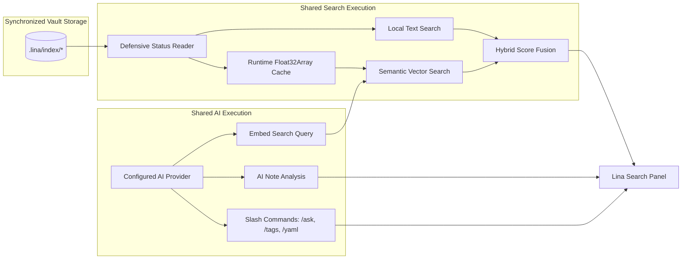

# Lina Architecture — Device Capabilities & Multi-Device Roles

**Status:** Current Architecture Specification (Lina 0.2 Foundation)  
**Scope:** Device capability abstraction, Desktop Producer role, Mobile Companion role, runtime enforcement boundaries, and search preservation.

---

## 1. Overview & Architectural Philosophy

Lina operates on a single plugin codebase deployed across diverse hardware form factors—from powerful multi-core desktop workstations to resource- and battery-constrained mobile devices (phones and tablets).

Rather than branching code with ad-hoc platform checks (`Platform.isMobile`) scattered across various subsystems, Lina 0.2 introduces a centralized **Device Capability Model** (`DeviceCapabilities`).

### Core Principles

1. **Single Plugin, Tailored Roles:** One codebase powers both Desktop and Mobile, with runtime behaviors governed by an explicit capability profile resolved at startup.
2. **Desktop as Producer:** Desktop workstations assume responsibility for intensive background maintenance: watching vault file changes, updating the textual index, calculating embedding diffs, generating vectors, and maintaining binary acceleration copies.
3. **Mobile as Companion:** Mobile devices act as streamlined consumers: reading synchronized search artifacts, executing instant in-memory text search, running vector similarity search, and querying configured AI providers without local index compilation overhead.
4. **Clean Capability Boundaries:** Mobile Companion is **not** a stripped-down or degraded application. It provides the full search, hybrid ranking, and AI interaction experience while protecting mobile hardware from heavy write operations and synchronization race conditions.

```text
┌──────────────────────────────────────────────────────────────────────────┐
│                             LINA PLUGIN CORE                             │
└────────────────────────────────────┬─────────────────────────────────────┘
                                     │
                         DeviceCapabilities Resolver
                                     │
             ┌───────────────────────┴───────────────────────┐
             ▼                                               ▼
   [Desktop Producer Profile]                      [Mobile Companion Profile]
             │                                               │
  ┌──────────┴──────────┐                         ┌──────────┴──────────┐
  │ Maintenance Engine  │                         │ Read-Only Consumer  │
  │ • TextIndexWorker   │                         │ • Ingest Sync Files │
  │ • ReconciliationWkr │                         │ • Parse Float32Array│
  │ • BinaryWorker      │                         │ • No Watcher Writes │
  │ • (EmbeddingWorker) │                         │ • No Diff Reconcile │
  └──────────┬──────────┘                         └──────────┬──────────┘
             │                                               │
             └───────────────────────┬───────────────────────┘
                                     │
                             [Shared Engines]
                                     │
                 ┌───────────────────┴───────────────────┐
                 ▼                                       ▼
        [Query & Search Engine]                     [AI Engine]
        • Text Search (exact/fuzzy)                 • Query Embeddings
        • Semantic Search (vectors)                 • Note Context Analysis
        • Hybrid Search (score fusion)              • Slash Commands (/ask, etc.)
```

---

## 2. The DeviceCapabilities Model

### 2.1 Capability Interface Structure

At startup, Lina resolves a capability contract that governs which subsystems are active during the session:

```typescript
export interface DeviceCapabilities {
  readonly role: "producer" | "companion";

  // Maintenance & Write Capabilities (Producer Only)
  readonly canWatchVaultEvents: boolean;
  readonly canMaintainTextIndex: boolean;
  readonly canGenerateEmbeddings: boolean;
  readonly canMaintainBinaryCopy: boolean;
  readonly canReconcileStartupDiffs: boolean;

  // Query & Ingestion Capabilities (Shared)
  readonly canReadArtifacts: boolean;
  readonly canExecuteTextSearch: boolean;
  readonly canExecuteSemanticSearch: boolean;
  readonly canExecuteHybridSearch: boolean;

  // AI Service Capabilities (Shared / Optional)
  readonly canEmbedSearchQuery: boolean;
  readonly canExecuteAiAnalysis: boolean;

  // Platform Resource Profile
  readonly resourceProfile: "desktop" | "mobile";
  readonly maxVectorFileBytes: number;
  readonly maxEstimatedPeakMemoryBytes: number;
}
```

---

## 3. Desktop Producer Role

### 3.1 Responsibilities
The **Desktop Producer** is the authoritative maintainer of search assets for the vault, orchestrated by the [`MaintenanceEngine`](maintenance-engine.md) via specialized workers. It is responsible for:

* **Text Indexing:** Watches vault file changes and maintains the text index (`TextIndexWorker`) with path-scoped debouncing and batch flushes.
* **Embedding Generation:** Plans diffs and computes vector embeddings for local Ollama or remote providers.
* **Canonical Embedding Publication:** Atomically commits validated embeddings (`embeddings.jsonl`) and updates index manifests.
* **Derived Binary Artifact Creation:** Automatically compiles optimized contiguous vector buffers (`embeddings.vectors.f32`) and lightweight indices (`embeddings.meta.jsonl`, `embeddings.binary.manifest.json`) downstream from canonical publication.
* **Automatic Repair of Missing Derived Artifacts:** Automatically detects and repairs missing or incomplete derived binary search data.
* **Vault Drift & Policy Reconciliation:** Reconciles startup file changes (`ReconciliationWorker`) and runtime exclusion policy modifications.

For full details on worker coordination and execution boundaries, see the [Maintenance Engine Architecture Specification](maintenance-engine.md) and [EmbeddingWorker Specification](embedding-worker.md).


---

## 4. Mobile Companion Role

### 4.1 Responsibilities
The **Mobile Companion** is a streamlined, read-only consumer client:

* **Consumes Synchronized Artifacts:** Ingests `.lina/index/` files synchronized via external tools (e.g., Syncthing, Obsidian Sync) and validates integrity and consistency.
* **Performs Fast Local Search:** Executes instant in-memory text search, semantic vector similarity search within mobile memory budgets (16MB vector file limit / 64MB peak memory limit), and hybrid score fusion.
* **Executes AI Note Enrichment:** Runs note analysis and slash commands (`/ask`, `/tags`, `/yaml`) against configured AI providers.
* **Zero Production Overhead:** Does not generate embeddings and does not create binary artifacts locally.

### 4.2 Prohibited Operations on Mobile Companion
To prevent synchronization split-brain conflicts, corruption of partially synchronized indexes, and battery/memory exhaustion, Mobile Companion strictly deactivates:

```text
Operation                              Desktop Producer        Mobile Companion        Enforcement Mechanism
───────────────────────────────────────────────────────────────────────────────────────────────────────────────
Vault Event Watchers (create/mod/del)  ✅ Active               ❌ Disabled             canWatchVaultEvents = false
Startup Diff Reconciliation            ✅ Active               ❌ Disabled             canReconcileStartupDiffs = false
Text Index Rebuild / Save              ✅ Active               ❌ Disabled             canMaintainTextIndex = false
Embedding Generation Pipeline          ✅ Active               ❌ Disabled             canGenerateEmbeddings = false
Binary Copy Compilation                ✅ Active               ❌ Disabled             canMaintainBinaryCopy = false
```

---

## 5. Shared Query & AI Capabilities

Search and AI capabilities are available across Desktop Producer and Mobile Companion.

Lina cleanly decouples provider capabilities across three independent dimensions:
1. **Analysis / Chat Capability:** Used for note analysis, conversational queries, and contextual suggestions (`/ask`, `/tags`, `/yaml`).
2. **Embedding Capability:** Used for vector index computation and semantic/hybrid search.
3. **Automatic Maintenance Capability:** Governs background automated maintenance (enabled exclusively for local Ollama on Desktop Producer).

| Provider | Analysis / Chat | Embeddings | Automatic embedding maintenance |
| :--- | :---: | :---: | :--- |
| **Ollama** | Supported | Supported | Supported on Desktop Producer |
| **Mistral** | Supported | Supported | Manual only |
| **OpenRouter** | Supported | Supported | Manual only |

External API usage may involve costs charged by the respective providers. Lina does not control or absorb those charges. Mobile Companion can consume compatible synchronized artifacts and use supported configured AI features, but it never generates text indexes, embeddings, or binary copies in the current architecture.



---

## 6. Current State vs. Target Architecture

| Subsystem | CURRENT State (Lina 0.2 Maintenance & Ollama Automation) | TARGET State (Lina 0.2 Automation Engine) |
| :--- | :--- | :--- |
| **Capability Resolution** | `DeviceCapabilities` model defined; runtime enforcement deactivates watchers and diff reconciliation on Mobile Companion. | Adaptive capability profiles with optional user overrides in Advanced Settings. |
| **Maintenance Coordination** | `MaintenanceEngine` supervises `TextIndexWorker`, `ReconciliationWorker`, `BinaryWorker`, `EmbeddingWorker`, and `EmbeddingScheduler` (Ollama auto dispatch) on Desktop Producer; producer maintenance is disabled on Mobile Companion. | Full worker suite with multi-provider background automation. |
| **Text Indexing** | Coordinated by `TextIndexWorker` with debounced vault listeners on Desktop; Mobile reads synchronized data without attaching watchers. | Sharded/partitioned chunk storage to avoid $O(N)$ full-file rewrites in massive vaults. |
| **Embedding Generation** | Automatic Ollama maintenance on Desktop Producer via `EmbeddingScheduler` and `EmbeddingWorker`; remote providers (Mistral, OpenRouter) remain manual-only; disabled on Mobile Companion. | Autonomous background scheduler with remote opt-in caps and safeguards. |
| **Binary Artifacts** | Coordinated by `BinaryWorker` (post-publication compilation on Desktop; read-only streaming ingestion on Mobile). | Fully autonomous refresh pipeline linked to background scheduler. |
| **Settings UI** | Unified settings interface; manual actions exist for recovery. | Simplified settings with producer-specific controls hidden on Companion devices. |

Embedding compatibility is diagnosed separately from generation. Published provider/model identity can be read from the manifest without loading the full embedding JSONL, while the resource guard still controls detailed vector inspection. A local status refresh does not imply a provider call or artifact generation.
