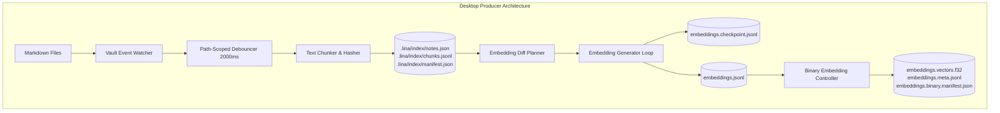
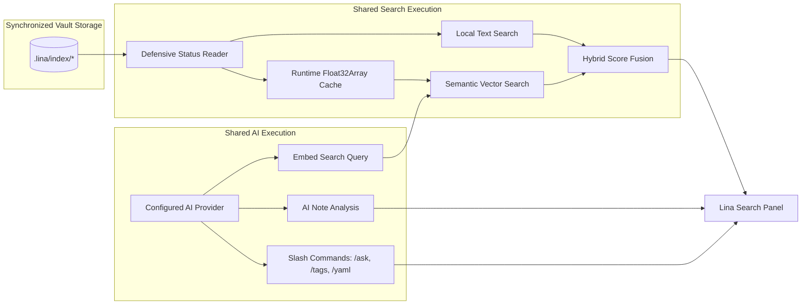

# Lina Architecture — Device Capabilities & Multi-Device Roles

**Status:** Current Architecture Specification (Lina 0.2 Foundation)  
**Scope:** Device capability abstraction, Desktop Producer role, Mobile Companion role, runtime enforcement boundaries, and search preservation.

---

## 1. Overview & Architectural Philosophy

Lina operates on a single plugin codebase deployed across diverse hardware form factors—from powerful multi-core desktop workstations to resource- and battery-constrained mobile devices (phones and tablets).

Rather than branching code with ad-hoc platform checks (`Platform.isMobile`) scattered across various subsystems, Lina 0.2 introduces a centralized **Device Capability Model** (`DeviceCapabilities`).

### Core Principles

1. **Single Plugin, Tailored Roles:** One codebase powers both Desktop and Mobile, with runtime behaviors governed by an explicit capability profile resolved at startup.
2. **Desktop as Producer:** Desktop workstations assume responsibility for intensive background maintenance: watching vault file changes, updating the textual index, calculating embedding diffs, generating vectors, and maintaining binary acceleration copies.
3. **Mobile as Companion:** Mobile devices act as streamlined consumers: reading synchronized search artifacts, executing instant in-memory text search, running vector similarity search, and querying configured AI providers without local index compilation overhead.
4. **Clean Capability Boundaries:** Mobile Companion is **not** a stripped-down or degraded application. It provides the full search, hybrid ranking, and AI interaction experience while protecting mobile hardware from heavy write operations and synchronization race conditions.

```text
┌──────────────────────────────────────────────────────────────────────────┐
│                             LINA PLUGIN CORE                             │
└────────────────────────────────────┬─────────────────────────────────────┘
                                     │
                         DeviceCapabilities Resolver
                                     │
             ┌───────────────────────┴───────────────────────┐
             ▼                                               ▼
   [Desktop Producer Profile]                      [Mobile Companion Profile]
             │                                               │
  ┌──────────┴──────────┐                         ┌──────────┴──────────┐
  │ Maintenance Engine  │                         │ Read-Only Consumer  │
  │ • Watch Vault Events│                         │ • Ingest Sync Files │
  │ • Text Chunker/Index│                         │ • Parse Float32Array│
  │ • Embedding Gen/Diff│                         │ • No Watcher Writes │
  │ • Binary Copier     │                         │ • No Diff Reconcile │
  └──────────┬──────────┘                         └──────────┬──────────┘
             │                                               │
             └───────────────────────┬───────────────────────┘
                                     │
                             [Shared Engines]
                                     │
                 ┌───────────────────┴───────────────────┐
                 ▼                                       ▼
        [Query & Search Engine]                     [AI Engine]
        • Text Search (exact/fuzzy)                 • Query Embeddings
        • Semantic Search (vectors)                 • Note Context Analysis
        • Hybrid Search (score fusion)              • Slash Commands (/ask, etc.)
```

---

## 2. The DeviceCapabilities Model

### 2.1 Capability Interface Structure

At startup, Lina resolves a capability contract that governs which subsystems are active during the session:

```typescript
export interface DeviceCapabilities {
  readonly role: "producer" | "companion";

  // Maintenance & Write Capabilities (Producer Only)
  readonly canWatchVaultEvents: boolean;
  readonly canMaintainTextIndex: boolean;
  readonly canGenerateEmbeddings: boolean;
  readonly canMaintainBinaryCopy: boolean;
  readonly canReconcileStartupDiffs: boolean;

  // Query & Ingestion Capabilities (Shared)
  readonly canReadArtifacts: boolean;
  readonly canExecuteTextSearch: boolean;
  readonly canExecuteSemanticSearch: boolean;
  readonly canExecuteHybridSearch: boolean;

  // AI Service Capabilities (Shared / Optional)
  readonly canEmbedSearchQuery: boolean;
  readonly canExecuteAiAnalysis: boolean;

  // Platform Resource Profile
  readonly resourceProfile: "desktop" | "mobile";
  readonly maxVectorFileBytes: number;
  readonly maxEstimatedPeakMemoryBytes: number;
}
```

---

## 3. Desktop Producer Role

### 3.1 Responsibilities
The **Desktop Producer** is the authoritative maintainer of search assets for the vault:

* **Vault Event Monitoring:** Listens to `create`, `modify`, `delete`, and `rename` vault events with path-scoped debouncing (2000ms delay) and batch coalescing.
* **Text Index Maintenance:** Scans notes, generates overlapping text chunks (1200 chars / 150 overlap), computes content hashes, and persists canonical files (`notes.json`, `chunks.jsonl`, `manifest.json`).
* **Startup Reconciliation:** On startup (after a 5-second grace period), compares vault Markdown files against the indexed note registry and updates any discrepancies.
* **Embedding Generation:** Computes vector diff plans (`embeddingUpdatePlan`), manages batching (up to 50 items), writes recoverable checkpoints (`embeddings.checkpoint.jsonl`), and publishes canonical vector sets (`embeddings.jsonl`) with automatic rollback on error.
* **Binary Artifact Compilation:** Compiles canonical JSONL embeddings into contiguous `Float32Array` buffers (`embeddings.vectors.f32`) and lightweight indices (`embeddings.meta.jsonl`, `embeddings.binary.manifest.json`).



---

## 4. Mobile Companion Role

### 4.1 Responsibilities
The **Mobile Companion** is an active, fast, read-only search and AI query client:

* **Synchronized Artifact Ingestion:** Ingests `.lina/index/` files synchronized via external tools (e.g., Syncthing, Obsidian Sync) and validates manifest integrity, count consistency, and schema versions.
* **Fast Local Text Search:** Loads indexed notes and chunks into memory for instantaneous substring, prefix, and fuzzy matching.
* **Semantic & Hybrid Search:** Loads pre-computed binary vectors (`embeddings.vectors.f32`) or JSONL embeddings within mobile memory budgets (16MB vector file limit / 64MB peak memory limit). Computes a single query vector on demand and runs fast in-memory cosine similarity ranking.
* **AI Note Enrichment:** Executes note analysis, folder summaries, and slash commands (`/ask`, `/tags`, `/yaml`) against configured local network or remote cloud AI providers.

### 4.2 Prohibited Operations on Mobile Companion
To prevent synchronization split-brain conflicts, corruption of partially synchronized indexes, and battery/memory exhaustion, Mobile Companion strictly deactivates:

```text
Operation                              Desktop Producer        Mobile Companion        Enforcement Mechanism
───────────────────────────────────────────────────────────────────────────────────────────────────────────────
Vault Event Watchers (create/mod/del)  ✅ Active               ❌ Disabled             canWatchVaultEvents = false
Startup Diff Reconciliation            ✅ Active               ❌ Disabled             canReconcileStartupDiffs = false
Text Index Rebuild / Save              ✅ Active               ❌ Disabled             canMaintainTextIndex = false
Embedding Generation Pipeline          ✅ Active               ❌ Disabled             canGenerateEmbeddings = false
Binary Copy Compilation                ✅ Active               ❌ Disabled             canMaintainBinaryCopy = false
```

---

## 5. Shared Query & AI Capabilities

Search and AI capabilities are identical across Desktop Producer and Mobile Companion:



---

## 6. Current State vs. Target Architecture

| Subsystem | CURRENT State (Lina 0.2 Foundation) | TARGET State (Lina 0.2 Automation Engine) |
| :--- | :--- | :--- |
| **Capability Resolution** | `DeviceCapabilities` model defined; runtime enforcement deactivates watchers and diff reconciliation on Mobile Companion. | Adaptive capability profiles with optional user overrides in Advanced Settings. |
| **Text Indexing** | Desktop automatically indexes on vault changes; Mobile reads synchronized data without attaching watchers. | Sharded/partitioned chunk storage to avoid $O(N)$ full-file rewrites in massive vaults. |
| **Embedding Generation** | On-demand manual generation on Desktop; disabled on Mobile Companion. | Autonomous background maintenance scheduler with idle detection, debouncing, and rate limits on Desktop. |
| **Binary Artifacts** | Post-publication compilation on Desktop; read-only streaming ingestion on Mobile. | Fully autonomous refresh pipeline linked to background scheduler. |
| **Settings UI** | Unified settings interface; manual actions exist for recovery. | Simplified settings with producer-specific controls hidden on Companion devices. |
