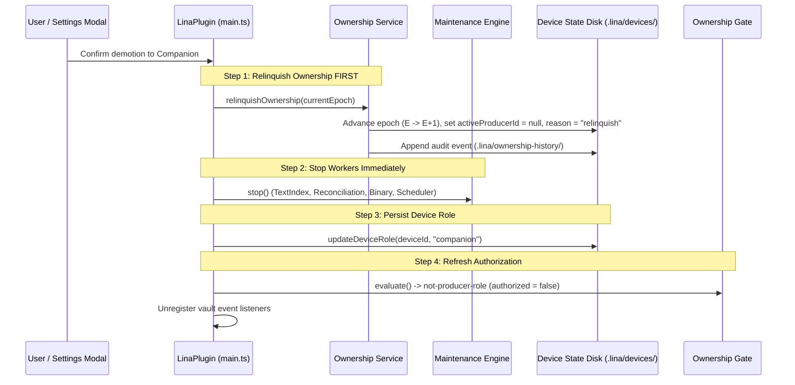

# Lina Architecture — Device Role Model & Lifecycle

**Status:** Implemented & Consolidated (Phases D1, D1.1, and 0.2.2.X.1.1 – 0.2.2.X.1.7)
**Scope:** Canonical `DeviceRole` model, resolution lifecycle (`assigned`, `unassigned`, `legacy-fallback`), first-run assignment UX, legacy compatibility, platform-aware presentation, controlled role changes (`Producer ↔ Companion`), and fail-safe Active Producer demotion.

---

## 1. Overview & Architectural Tiers

Lina organizes device identification, technical capabilities, user-configured operational intent, global ownership authority, and publication fencing into strictly separated architectural tiers:

```text
Platform & Hardware Environment
              ↓
    Device Capabilities
(Technical bounds: canMaintainTextIndex, canGenerateEmbeddings, resourceProfile)
              ↓
      Role Recommendation
(Desktop: producer | Mobile: companion)
              ↓
     Explicit User Choice
              ↓
     Persisted DeviceRole
(.lina/devices/<deviceId>.json: "producer" | "companion")
              ↓
  Canonical Role Resolution
(assignmentState: assigned | unassigned | legacy-fallback)
              ↓
        Ownership Gate
(Evaluates .lina/ownership.json: Active Producer vs Standby Producer)
              ↓
 Single Active Producer Authority
(Monotonic epoch-fenced publication to .lina/index/*)
```

### Core Invariants

> [!IMPORTANT]
> **Fundamental Invariants:**
> - `Platform != Role`: Platform environment recommends a role, but never permanently dictates or silently persists it.
> - `Role != Ownership`: Configuring `role = "producer"` signifies operational intent and capability, not active publication authority. Multiple Producers may exist simultaneously (Active vs Standby).

---

## 2. Canonical Role Model & Types

Implemented in [`src/device/deviceRole.ts`](file:///d:/_dev/obsidian/lina/src/device/deviceRole.ts) and [`src/device/deviceRoleResolver.ts`](file:///d:/_dev/obsidian/lina/src/device/deviceRoleResolver.ts):

### 2.1 Persisted DeviceRole

```typescript
export type DeviceRole = "producer" | "companion";
```

- **Producer (`"producer"`):** Designated to maintain shared vault search assets (text index, vector embeddings, derived fast search caches, and startup reconciliation).
- **Companion (`"companion"`):** Operates as a lightweight consumer of synchronized search assets, performing fast local searches, AI note analysis, and contextual slash commands without running background indexing loops or writing to shared index directories.
- **`unassigned` is NOT a persisted `DeviceRole`:** It is a runtime assignment state. In `.lina/devices/<deviceId>.json`, a device without an explicit user choice has `role?: undefined`.

### 2.2 Canonical Assignment Lifecycle

The canonical role resolver (`getDeviceRoleResolution()`) evaluates device state and determines:

```typescript
export type DeviceRoleAssignmentState = "assigned" | "unassigned" | "legacy-fallback";

export interface DeviceRoleResolution {
  readonly assignmentState: DeviceRoleAssignmentState;
  readonly effectiveRole: DeviceRole | "unassigned";
  readonly recommendedRole: DeviceRole;
  readonly persistedRole?: DeviceRole;
  readonly isLegacyFallbackEligible: boolean;
}
```

1. **`assigned`:** The device state file on disk contains an explicit `role` property (`"producer"` or `"companion"`). `effectiveRole` matches `persistedRole`.
2. **`unassigned`:** A newly initialized device where `role` is missing from disk and the device is not classified as a legacy installation. `effectiveRole` is `"unassigned"`.
3. **`legacy-fallback`:** A pre-existing device state from versions prior to explicit role assignment (`role` is undefined, but device state was created before canonical resolution and has legacy fallback allowed). `effectiveRole` falls back temporarily to the platform recommendation (`desktop → producer`, `mobile → companion`) to preserve continuity without silent persistence.

---

## 3. First-Run Behavior & Explicit Assignment

Fresh installations must never silently claim ownership or start background maintenance before the user has reviewed their device role.

### 3.1 Desktop First-Run Flow

```text
Fresh Desktop Installation
           ↓
assignmentState = "unassigned"
effectiveRole = "unassigned"
recommendedRole = "producer"
           ↓
Settings UI: Prominent First-Run Selector
(⚪ Unconfigured Device / Dispositivo não configurado)
Options: Desktop Producer (Recommended) | Desktop Companion
           ↓
User clicks "Confirm role" / "Confirmar papel"
           ↓
Role persisted to .lina/devices/<deviceId>.json
assignmentState = "assigned"
```

**Runtime Safety Barriers Before Confirmation:**
- **No Ownership Auto-Claim:** `OwnershipGate` treats `unassigned` as unauthorized; it will not claim initial vault ownership.
- **No Background Maintenance:** `MaintenanceEngine`, `TextIndexWorker`, `EmbeddingScheduler`, and `ReconciliationWorker` remain inactive.
- **No Shared Publications:** The device cannot write to `.lina/index/*` or `.lina/ownership.json`.

### 3.2 Mobile First-Run Flow (0.2.x)

```text
Fresh Mobile Installation
           ↓
assignmentState = "unassigned"
effectiveRole = "unassigned"
recommendedRole = "companion"
           ↓
Settings UI: Explicit Confirmation Dialog / Selector
(Mobile Companion)
           ↓
User confirms selection
           ↓
Role persisted as "companion"
```

> [!NOTE]
> **Mobile Producer Architecture Note:**
> The restriction that Mobile devices operate only as Companions is a capability and product decision for the **0.2.x release**, based on mobile memory limits, operating system background execution constraints, and battery conservation. It is **not** a restriction in the `DeviceRole` schema. The architecture remains future-compatible with a potential Mobile Producer in later major versions.

---

## 4. Legacy Compatibility & Migration Flow

To avoid breaking existing active installations during upgrades, Lina includes an explicit legacy compatibility classifier (`isLegacyDeviceStateEligibleForFallback` in `src/device/deviceRoleResolver.ts`).

### 4.1 Temporary Runtime Fallback

- If a device state file exists without a `role` property, but was created prior to explicit role resolution:
  - `assignmentState = "legacy-fallback"`
  - `isLegacyFallbackEligible = true`
  - Desktop receives temporary `effectiveRole = "producer"`
  - Mobile receives temporary `effectiveRole = "companion"`
- **Zero Silent Persistence:** Lina never automatically writes the inferred role to disk. The device remains in `legacy-fallback` until confirmed.

### 4.2 Explicit Legacy Confirmation UX

- In **Settings > Basic > Current Device**, legacy devices display a distinct migration banner:
  - `🟡 Temporary role (needs confirmation) / Papel temporário (requer confirmação)`
  - Displays a dedicated action: **Confirm Producer role** or **Confirm Companion role**.
- Clicking confirm persists the choice to `.lina/devices/<deviceId>.json`, permanently upgrading the device to `assignmentState = "assigned"` (`🟢 Assigned Producer` or `🔵 Assigned Companion`).

---

## 5. Platform-Aware Presentation

Role labels in settings, diagnostics, and notifications must always reflect both the physical platform and the operational role:

| Visual Badge | Canonical State | Description |
| :--- | :--- | :--- |
| `⚪` | **Unconfigured Device** (`unassigned`) | Device role not yet chosen; search is read-only, maintenance paused. |
| `🟡` | **Temporary Role** (`legacy-fallback`) | Upgraded installation operating under temporary fallback awaiting confirmation. |
| `🟢` | **Desktop Producer** (`assigned` + desktop) | Designated desktop maintaining search indexes and vector embeddings. |
| `🔵` | **Desktop Companion** (`assigned` + desktop) | Desktop workstation operating as a lightweight consumer in a multi-PC vault. |
| `🔵` | **Mobile Companion** (`assigned` + mobile) | Phone or tablet consuming synchronized search assets without background compute. |

> [!WARNING]
> Never equate `Companion == Mobile` or `Producer == Desktop`. A desktop machine configured as a consumer must be identified as a **Desktop Companion**, never a "Mobile Companion".

---

## 6. Controlled Role Changes & Active Producer Demotion

Post-first-run device role changes are fully supported on desktop (`Producer ↔ Companion`).

### 6.1 UI Entry Point
On desktop installations with `assignmentState === "assigned"`, **Settings > Basic > Current Device** displays:
- **Change device role…** (`Alterar papel do dispositivo…`)
- Triggers the accessible `DeviceRoleChangeModal`.

### 6.2 Transition Paths & Invariants

#### A. Standby Producer → Companion
- Local role is updated and persisted as `"companion"`.
- Ownership manifest (`.lina/ownership.json`) is **untouched** (the remote Active Producer remains active).
- Local maintenance workers are stopped immediately.
- `OwnershipGate` transitions to `not-producer-role` (`authorized = false`).

#### B. Companion → Producer
- Local role is persisted as `"producer"`.
- **If another Active Producer already exists:** Local device evaluates to **Standby Producer** (`authorized = false`). It does **not** steal or hijack ownership.
- **If the vault has no ownership manifest:** The device executes initial auto-claim (`epoch = 1`, `reason = "initial"`), becoming Active Producer.
- **If vault ownership was previously relinquished (`activeProducerId: null`):** The device becomes a Standby Producer. To become active, the user explicitly initiates a transfer.

#### C. Active Producer → Companion (Critical Path: Safe Relinquish)
Demoting an Active Producer must never leave stale publishing authority behind. The runtime orchestrates the transition in strict, fail-safe order:



### 6.3 Demotion Failure Boundaries & Invariants

- **If Relinquish Fails:** The operation aborts immediately. The device remains `role = "producer"` with its current authority intact. It does **not** save `companion` to disk.
- **If Role Persistence Fails After Relinquish:** Ownership on disk is already safely advanced to epoch $E+1$ with `activeProducerId: null`. The gate immediately revokes publishing authority (`authorized = false`). The device cannot publish with stale epoch $E$ credentials.
- **The Zero-Contradiction Invariant:**
  $$\text{Final state never permits: } \mathbf{role == "companion" \land OwnershipGate.authorized == true}$$

---

## 7. Storage & Persistence Format

Device state is stored in `.lina/devices/<deviceId>.json` (single-writer per device, schema version 2):

```json
{
  "schemaVersion": 2,
  "deviceId": "c9bf9e57-1685-4c89-bafb-ff5af830be8a",
  "deviceName": "Office Workstation",
  "role": "producer",
  "createdAt": "2026-08-31T21:00:00.000Z",
  "updatedAt": "2026-09-03T18:00:00.000Z"
}
```

- **Atomic Writes:** All updates use temporary staging files (`.tmp-<random>`) followed by atomic renames.
- **Multi-Device Isolation:** State files are named by device UUID; external sync transports them without write collisions.
- **Settings Independence:** Device roles are **never stored in `data.json`**.
