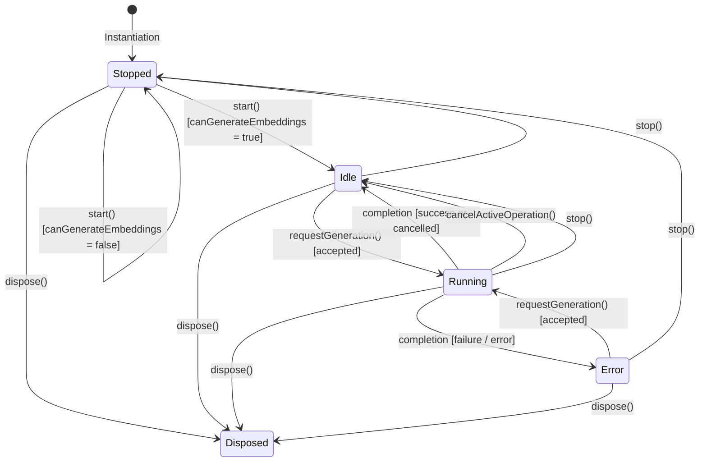

# Lina Architecture — EmbeddingWorker

**Status:** Active Execution Architecture (Lina 0.2)
**Scope:** `EmbeddingWorker` orchestration ownership, execution lifecycle, dependency port contracts, single-flight locking, cancellation, capability gating, relationship with `MaintenanceEngine` & `EmbeddingScheduler`, and downstream `BinaryWorker` handoff.

---

## 1. Overview & Architectural Role

The [`EmbeddingWorker`](file:///d:/_dev/obsidian/lina/src/maintenance/embeddingWorker.ts) is the **authoritative owner of embedding execution orchestration** within the [`MaintenanceEngine`](file:///d:/_dev/obsidian/lina/src/maintenance/maintenanceEngine.ts).

`EmbeddingWorker` coordinates the complete embedding execution lifecycle—whether triggered manually or dispatched automatically by `EmbeddingScheduler`—through host-injected dependency ports ([`EmbeddingWorkerOptions`](#4-dependency-ports-and-architectural-invariants)), encapsulating:
- **Capability Gating:** Enforces `DeviceCapabilities.canGenerateEmbeddings` to guarantee execution occurs strictly on Desktop Producer.
- **Single-Flight Concurrency:** Owns the single-flight operation state machine, preventing concurrent or overlapping embedding tasks.
- **Mutex Lock Scoping:** Acquires, validates, and releases preparation and exclusive generation tokens on [`IndexWriteCoordinator`](file:///d:/_dev/obsidian/lina/src/index/indexWriteCoordinator.ts).
- **Text Index Ingestion Draining:** Automatically awaits pending text index batches in [`TextIndexWorker`](file:///d:/_dev/obsidian/lina/src/maintenance/textIndexWorker.ts) before starting vector computations.
- **Cancellation & State Propagation:** Propagates `AbortSignal` instances and broadcasts phases (`preparing`, `waiting-for-text-index`, `validating`, `generating`, `persisting`, `cancelling`) and progress events.
- **Publication & Binary Handoff:** Finalizes canonical publications, recalculates derived status, and triggers downstream compilation in [`BinaryWorker`](file:///d:/_dev/obsidian/lina/src/maintenance/binaryWorker.ts).

[`main.ts`](file:///d:/_dev/obsidian/lina/main.ts) acts as a thin host adapter: it binds Obsidian runtime dependencies to the worker's injected ports and routes UI commands and scheduler dispatches directly to `MaintenanceEngine`, eliminating duplicate orchestration logic from the plugin entry point.

```text
UI / Commands (Manual)      EmbeddingScheduler (Ollama Auto)
        │                                  │
        ▼                                  ▼
MaintenanceEngine ◄────────────────────────┘
        │
        ▼
 EmbeddingWorker
        │
        ├─► Capability Gating (Desktop Producer only)
        ├─► Single-Flight Concurrency Check
        ├─► Mutex Preparation Reservation
        ├─► Text-Index Batch Drain (TextIndexWorker)
        ├─► Exclusive Writer Token Acquisition
        ├─► Progress & Phase Broadcasting
        ├─► Core Vector Generation (embeddingGenerator.ts)
        ├─► Canonical Persistence & Publication (embeddingPersistence.ts)
        ├─► Mutex Token Release & Text Flush Schedule
        ├─► Status Recalculation (Derived Artifact State)
        └─► Downstream Binary Handoff (BinaryWorker)
```

---

## 2. Current Responsibility vs. Scheduling Policy

Responsibilities are strictly defined between the active execution worker, the scheduling policy, and future background automation:

### 2.1 CURRENT (Implemented Execution Architecture)
- **Execution Orchestration Ownership:** `EmbeddingWorker` owns the entire lifecycle from request initiation to completion, error handling, and cancellation for both manual triggers and automatic scheduler dispatches.
- **Unified Single-Flight Path:** Manual triggers and automatic Ollama maintenance share the identical execution pipeline, mutex scoping, and validation. Concurrently requested operations receive an immediate `already-running` or `text-index-busy` status.
- **Coordinated Text Draining:** Prior to acquiring an exclusive generation token, the worker ensures all pending text changes in `TextIndexWorker` are completely indexed.
- **Strict Mutex Scoping:** Generation tokens are held only during vector generation/publication and guaranteed to be released in `finally` blocks before downstream handoffs.
- **Downstream Binary Handoff:** Triggers `BinaryWorker.maintainAfterPublication(publicationId)` only after the canonical embedding lock is released.
- **Automatic Status Convergence:** Following successful canonical publication, derived embedding status is automatically refreshed from disk artifacts for UI subscribers without requiring manual refresh.
- **Provider Coverage:** Manual execution supports Ollama, Mistral, and OpenRouter embeddings. Automatic execution remains restricted to Ollama on Desktop Producer.
- **Preserved Core Modules:** The mathematical generation loop ([`embeddingGenerator.ts`](file:///d:/_dev/obsidian/lina/src/index/embeddingGenerator.ts)), diff planner ([`embeddingUpdatePlan.ts`](file:///d:/_dev/obsidian/lina/src/index/embeddingUpdatePlan.ts)), persistence layer ([`embeddingPersistence.ts`](file:///d:/_dev/obsidian/lina/src/index/embeddingPersistence.ts)), AI providers, and search engines remain decoupled and unmodified.

### 2.2 SCHEDULING POLICY (Phase 2.2 Implemented)
- **Decoupled Policy Owner:** [`EmbeddingScheduler`](file:///d:/_dev/obsidian/lina/src/maintenance/embeddingScheduler.ts) determines *when* maintenance is eligible (quiet-period debouncing, dirty coalescing, manual preemption, and fresh update-plan checks).
- **Controlled Local Dispatch:** Automatically dispatches background generation runs for the local Ollama provider on Desktop Producer (`origin = "automatic"`).
- **Zero Execution in Scheduler:** The scheduler owns zero execution, provider calls, mutex allocations, or publications; it delegates execution entirely to `MaintenanceEngine.requestEmbeddingGeneration("automatic")`.
- **Manual Preemption:** Manual execution via `MaintenanceEngine.requestEmbeddingGeneration()` automatically clears pending scheduler countdown timers.
- **Remote Provider Safeguard:** Mistral and OpenRouter remain strictly manual-only.

### 2.3 NOT IMPLEMENTED YET (Future Work)
- **Remote Provider Safeguards:** Phase 2.3 will add safeguards for Mistral and OpenRouter; exact policy values remain subject to approval.
- **Opt-In Remote Automation:** Phase 2.4 will add explicit opt-in automatic embedding maintenance for Mistral and OpenRouter.
- **Multi-Device Sync & Recovery Hardening:** Phase 2.5 will enhance zero-diff detection for incoming Syncthing/Obsidian Sync updates and resume interrupted operations cleanly from checkpoints.
- **Autonomous Mobile Companion Production:** Mobile Companion remains strictly a read-only consumer of synchronized vector artifacts.

---

## 3. Worker Lifecycle & State Model

The worker implements a deterministic, multi-layered lifecycle:



### State Definitions

| State | Status | Meaning |
| :--- | :--- | :--- |
| **Stopped** | `started = false` | Worker is inactive (or host device lacks `canGenerateEmbeddings`). |
| **Idle** | `status = "idle"` | Worker is active on Desktop Producer and ready for manual generation requests. |
| **Running** | `status = "running"` | An embedding operation is actively preparing, draining, calculating, or persisting. |
| **Error** | `status = "error"` | The last operation failed; `lastError` contains the diagnostic failure reason. |
| **Disposed** | `disposed = true` | Worker resources and internal operation managers are permanently cleaned up. |

---

## 4. Dependency Ports and Architectural Invariants

`EmbeddingWorkerOptions` is an explicit dependency-injection contract. The worker remains free of direct Obsidian `App`, `Plugin`, or UI dependencies:

```typescript
export interface EmbeddingWorkerOptions {
  readonly capabilities?: EmbeddingWorkerCapabilityPort;
  readonly isTextIndexBusy?: () => boolean;
  readonly drainTextIndex?: (signal?: AbortSignal) => Promise<boolean>;
  readonly scheduleTextIndexFlush?: () => void;
  readonly coordinator?: EmbeddingWorkerCoordinatorPort;
  readonly generationService?: EmbeddingWorkerGenerationServicePort;
  readonly persistence?: EmbeddingWorkerPersistencePort;
  readonly statusNotifications?: EmbeddingWorkerStatusNotificationPort;
  readonly binaryHandoff?: EmbeddingWorkerBinaryHandoffPort;
  readonly messages?: EmbeddingWorkerMessages;
}
```

### Port Responsibility Table

| Port | Bound Implementation (`main.ts`) | Architectural Role |
| :--- | :--- | :--- |
| `capabilities` | `() => getDeviceCapabilities().canGenerateEmbeddings` | Gating against Mobile Companion execution. |
| `isTextIndexBusy` | `() => textIndexRebuildProgress.status === "running"` | Prevents embedding generation during text index rebuilds. |
| `drainTextIndex` | `(signal) => drainAutomaticUpdatesBeforeEmbeddingGeneration(signal)` | Drains pending text modification batches before embedding. |
| `scheduleTextIndexFlush` | `() => schedulePendingAutomaticUpdatesFlush()` | Resumes normal debounced text flushing after embedding. |
| `coordinator` | `IndexWriteCoordinator` adapter | Coordinates preparation reservations and generation locks. |
| `generationService` | `(op, onProg) => runGenerateLocalEmbeddings(...)` | Executes chunk reading, validation probes, diffs, and batches. |
| `persistence` | `onGenerationFinalized` hook | Receives publication diagnostics and notifications. |
| `statusNotifications` | `notify(state)` hook | Propagates worker status changes to host consumers. |
| `binaryHandoff` | `(pubId) => maintainBinaryAfterPublication(pubId)` | Triggers downstream `BinaryWorker` compilation. |
| `messages` | Localized UI strings (`this.L.*`) | Provides localized phase and error descriptions. |

---

## 5. Critical Invariants

The `EmbeddingWorker` architecture strictly enforces the following invariants:

1. **Canonical Publication Precedes Binary Handoff:**
   Canonical `embeddings.jsonl` and `manifest.json` publication completes and its exclusive writer lock is released *before* the downstream `BinaryWorker` handoff is initiated. Binary compilation failure can never invalidate or roll back a successful canonical publication.
2. **Core Embedding Algorithms Remain Independent:**
   [`embeddingGenerator.ts`](file:///d:/_dev/obsidian/lina/src/index/embeddingGenerator.ts), [`embeddingUpdatePlan.ts`](file:///d:/_dev/obsidian/lina/src/index/embeddingUpdatePlan.ts), and [`embeddingPersistence.ts`](file:///d:/_dev/obsidian/lina/src/index/embeddingPersistence.ts) remain pure functional and storage modules.
3. **Storage Formats and Schemas are Preserved:**
   `.lina/index/manifest.json`, `notes.json`, `chunks.jsonl`, `embeddings.jsonl`, `embeddings.checkpoint.jsonl`, and `embeddings.vectors.f32` remain strictly identical.
4. **Search Subsystem Remains Independent:**
   Search querying (`TextSearchEngine`, `SemanticSearch`, `HybridSearch`, `RuntimeEmbeddingIndexCache`) remains read-only, non-locking, and fully decoupled from maintenance lifecycles.
5. **No Duplicate Execution Paths:**
   `EmbeddingWorker` is the sole execution coordinator. Whether triggered manually or dispatched by automatic scheduling, all generation routes through the same single-flight path.
6. **Mobile Companion Does Not Produce Search Assets:**
   On Mobile Companion devices, `capabilities.canGenerateEmbeddings() === false`. The worker returns `not-capable` immediately without allocating coordinator locks, calling network APIs, or touching vector files.
7. **Provider/Model Changes Are Diagnostic Until Execution:**
   A configured provider/model change invalidates local derived compatibility and recalculates the plan, but does not delete canonical embeddings or checkpoints, call the provider, or start generation. Incompatible published identity requires a full embedding rebuild; switching back can restore compatibility without regeneration.
8. **Manifest Identity Survives Detailed Read Limits:**
   Published identity is read from the manifest before the canonical JSONL. Detailed readability is classified as `missing`, `empty`, `readable`, or `unreadable`; unreadable data is never treated as empty or proven up to date.
9. **Atomic Persistence Retry Is Local:**
   Canonical and checkpoint publication uses atomic rename with short bounded retries for transient Windows `EBUSY`/`EPERM` locks. A retry repeats only the local rename, never provider/API generation. Exhaustion remains a persistence failure and does not change file formats.

---

## 6. Worker Execution Pipeline & Semantic Lifecycle

```text
┌─────────────────────────┐
│       Vault Notes       │ ──► User Markdown notes in vault
└────────────┬────────────┘
             │
             ▼
┌─────────────────────────┐
│     TextIndexWorker     │ ──► Produces and commits canonical text chunks (.lina/index/chunks.jsonl)
└────────────┬────────────┘
             │ (1. Worker drains pending text updates before starting)
             ▼
┌─────────────────────────┐
│     EmbeddingWorker     │ ──► Generates and publishes canonical embeddings (.lina/index/embeddings.jsonl)
└────────────┬────────────┘
             │ (2. Canonical lock is released; publicationId is passed downstream)
             ▼
┌─────────────────────────┐
│      BinaryWorker       │ ──► Generates/repairs derived binary search data (.lina/index/embeddings.vectors.f32)
└────────────┬────────────┘
             │
             ▼
┌─────────────────────────┐
│    Semantic Runtime     │ ──► High-speed in-memory vector cache with mobile memory safeguards
└────────────┬────────────┘
             │
             ▼
┌─────────────────────────┐
│     Semantic Search     │ ──► Instant ranked semantic and hybrid search queries
└─────────────────────────┘
```
