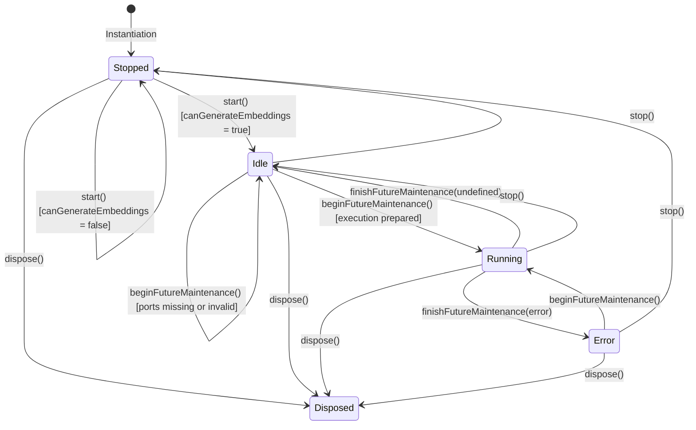

# Lina Architecture — EmbeddingWorker

**Status:** Architectural Foundation & Port Boundary Specification (Lina 0.2)
**Scope:** `EmbeddingWorker` lifecycle, capability gating, dependency ports, relationship with `MaintenanceEngine`, and separation between the current boundary and a future execution migration.

---

## 1. Overview & Architectural Role

The [`EmbeddingWorker`](file:///d:/_dev/obsidian/lina/src/maintenance/embeddingWorker.ts) introduces the lifecycle and state boundary for producer-side embedding maintenance within the [`MaintenanceEngine`](file:///d:/_dev/obsidian/lina/src/maintenance/maintenanceEngine.ts).

In the current Lina 0.2 baseline, the `EmbeddingWorker` provides an **architectural foundation and dependency boundary**. It establishes lifecycle, state, capability gating, and injected ports without taking over embedding execution. Concrete generation remains in existing upstream modules ([`LinaPlugin`](file:///d:/_dev/obsidian/lina/main.ts#L842), [`embeddingGenerator.ts`](file:///d:/_dev/obsidian/lina/src/index/embeddingGenerator.ts), and [`EmbeddingOperationManager.ts`](file:///d:/_dev/obsidian/lina/src/index/embeddingOperationManager.ts)).

```text
                               ┌─────────────────────────┐
                               │       LinaPlugin        │
                               └────────────┬────────────┘
                                            │
                                            ▼
                               ┌─────────────────────────┐
                               │    MaintenanceEngine    │
                               │   (Desktop Producer)    │
                               └────────────┬────────────┘
                                            │
        ┌───────────────────┬───────────────┴───────────────┬───────────────────┐
        ▼                   ▼                               ▼                   ▼
┌───────────────┐   ┌───────────────┐               ┌───────────────┐   ┌───────────────┐
│TextIndexWorker│   │ReconciliationW│               │ BinaryWorker  │   │EmbeddingWorker│
│               │   │               │               │               │   │ (Foundation)  │
│• Vault Events │   │• Startup Recon│               │• Binary Check │   │• Lifecycle    │
│• Debouncing   │   │• Policy Recon │               │• Compile F32  │   │• State Model  │
│• Batch Queue  │   │• Queue Wait   │               │• Post-Publish │   │• Cap Gating   │
└───────────────┘   └───────────────┘               └───────────────┘   └───────────────┘
```

---

## 2. Current Responsibility vs. Target Responsibility

To maintain architectural clarity, responsibilities are strictly separated between the current foundation phase and the target execution migration:

### 2.1 CURRENT (Implemented Foundation)
- **Lifecycle Management:** Manages worker startup (`start()`), shutdown (`stop()`), and disposal (`dispose()`) under `MaintenanceEngine` supervision.
- **Capability Gating:** Strictly evaluates `DeviceCapabilities.canGenerateEmbeddings`. Automatically deactivates on Mobile Companion devices.
- **State Boundary:** Exposes `EmbeddingWorkerState` (`idle`, `running`, `error`) and tracks `lastError`.
- **Dependency Ports:** Accepts `EmbeddingWorkerOptions` ports for capabilities, operation state, generation, persistence, status notifications, and binary handoff. The worker has no direct dependency on `LinaPlugin`, Obsidian UI, or application state.
- **Safe Preparation Check:** `isExecutionPrepared()` and `getMissingDependencies()` expose whether every future execution port is present and callable. Missing or invalid ports block `beginFutureMaintenance()` without invoking a service.
- **Future Maintenance Reservation:** Provides `beginFutureMaintenance()` and `finishFutureMaintenance()` to reserve execution state without prematurely coupling to concrete provider or storage implementations.
- **Zero Execution Mutation:** The active generation flow, batch loop, checkpointing, and canonical publication remain in existing modules during this phase.

### 2.2 TARGET (Future Execution Migration)
- **Operation Orchestration:** Full migration of `requestEmbeddingIndexGeneration` and `runGenerateLocalEmbeddings` into the worker.
- **Text Drain Coordination:** Direct invocation of `TextIndexWorker.drainAutomaticUpdatesBeforeEmbeddingGeneration` before generation starts.
- **Batch & Checkpoint Supervision:** Direct supervision of `embeddingGenerator.ts` batch loops and `embeddingPersistence.ts` checkpoint writes.
- **Publication & Event Broadcasting:** Direct triggering of canonical publication and handoff to `BinaryWorker`.
- **Autonomous Background Scheduler:** Any future idle detection, debouncing, or rate-limited automatic generation remains a separate, unimplemented concern.

---

## 3. Worker Lifecycle & State Model

The worker implements a deterministic lifecycle:



### State Definitions

| State | Status | Meaning |
| :--- | :--- | :--- |
| **Stopped** | `started = false` | Worker is inactive (or host device lacks `canGenerateEmbeddings`). |
| **Idle** | `status = "idle"` | Worker is active, running on Desktop Producer, and ready for maintenance tasks. |
| **Running** | `status = "running"` | An embedding maintenance operation is actively executing. |
| **Error** | `status = "error"` | The last maintenance operation encountered a failure; `lastError` contains the diagnostic reason. |
| **Disposed** | `disposed = true` | Worker resources have been permanently cleaned up. |

---

## 4. Dependency Ports and Architectural Invariants

`EmbeddingWorkerOptions` is an explicit dependency-injection boundary. The ports are typed by responsibility rather than by `LinaPlugin`, Obsidian UI, or direct settings/storage objects:

| Port | Current purpose | Current invocation |
| :--- | :--- | :--- |
| capability provider | Allows lifecycle gating through `canGenerateEmbeddings()`. | Used by `start()`; the active host wires this port. |
| operation-state provider | Reserves a boundary for the existing embedding operation state. | Not invoked by the worker yet. |
| generation service | Reserves the future generation orchestration dependency. | Not invoked by the worker yet. |
| persistence | Reserves canonical publication and checkpoint persistence dependencies. | Not invoked by the worker yet. |
| status notifications | Reserves status propagation to host-owned consumers. | Not invoked by the worker yet. |
| binary handoff | Reserves post-publication binary maintenance coordination. | Not invoked by the worker yet. |

Only the capability port is currently connected by the plugin. The other ports deliberately remain unbound in production, so `isExecutionPrepared()` is false and the worker cannot begin future maintenance. This prevents an accidental execution cutover while retaining a testable extension point.

The `EmbeddingWorker` preserves all fundamental architectural invariants:

1. **Embedding Generation Logic Remains in Existing Modules:**  
   The core generation algorithms ([`embeddingGenerator.ts`](file:///d:/_dev/obsidian/lina/src/index/embeddingGenerator.ts)), diff planning ([`embeddingUpdatePlan.ts`](file:///d:/_dev/obsidian/lina/src/index/embeddingUpdatePlan.ts)), and operation management ([`EmbeddingOperationManager.ts`](file:///d:/_dev/obsidian/lina/src/index/embeddingOperationManager.ts)) remain in their proven functional modules. The worker foundation does not rewrite or duplicate these algorithms.
2. **AI Providers Remain Independent:**  
   Provider implementations ([`ollamaProvider.ts`](file:///d:/_dev/obsidian/lina/src/ai/ollamaProvider.ts), [`mistralProvider.ts`](file:///d:/_dev/obsidian/lina/src/ai/mistralProvider.ts)) and interfaces remain completely decoupled from worker lifecycle logic.
3. **Storage & Persistence Remain Independent:**  
   Disk storage layouts (`.lina/index/embeddings.jsonl`, `manifest.json`, `embeddings.checkpoint.jsonl`) and file operations in [`embeddingPersistence.ts`](file:///d:/_dev/obsidian/lina/src/index/embeddingPersistence.ts) remain unchanged.
4. **Binary Maintenance Handled Exclusively by `BinaryWorker`:**  
   Compilation and verification of derived `Float32Array` buffers (`embeddings.vectors.f32`) remain the exclusive responsibility of [`BinaryWorker`](file:///d:/_dev/obsidian/lina/src/maintenance/binaryWorker.ts), triggered downstream of canonical publication.
5. **Mobile Companion Does Not Execute Embedding Maintenance:**  
   On Mobile Companion devices, `canGenerateEmbeddings === false`. `MaintenanceEngine` never starts `EmbeddingWorker` on mobile, preventing network API calls, battery drain, and synchronization conflicts.

---

## 5. Relationship With Existing Workers

The following is the **future coordination route** represented by the prepared ports; it is not the current execution path:

```text
┌─────────────────────────┐
│     TextIndexWorker     │ ──► Produces and commits canonical text chunks (.lina/index/chunks.jsonl)
└────────────┬────────────┘
             │ (Pre-generation drain ensures text index is clean)
             ▼
┌─────────────────────────┐
│     EmbeddingWorker     │ ──► Prepared generation, persistence, and handoff ports
└────────────┬────────────┘
             │ (Post-publication signal carries publicationId)
             ▼
┌─────────────────────────┐
│      BinaryWorker       │ ──► Compiles hardware-accelerated binary vectors (.lina/index/embeddings.vectors.f32)
└─────────────────────────┘
```

* **`TextIndexWorker` Precedes `EmbeddingWorker`:** Vector generation requires a stable, committed text index. A future execution migration may use a port to drain pending text batches before computing vectors.
* **`EmbeddingWorker` Precedes `BinaryWorker`:** Binary compilation requires a published canonical vector dataset. A future execution migration may use the binary-handoff port after a successful publication.
* **`ReconciliationWorker` Integrates Upstream:** Startup and exclusion reconciliation feeds changes into `TextIndexWorker`, which in turn invalidates embedding status for `EmbeddingWorker`.
