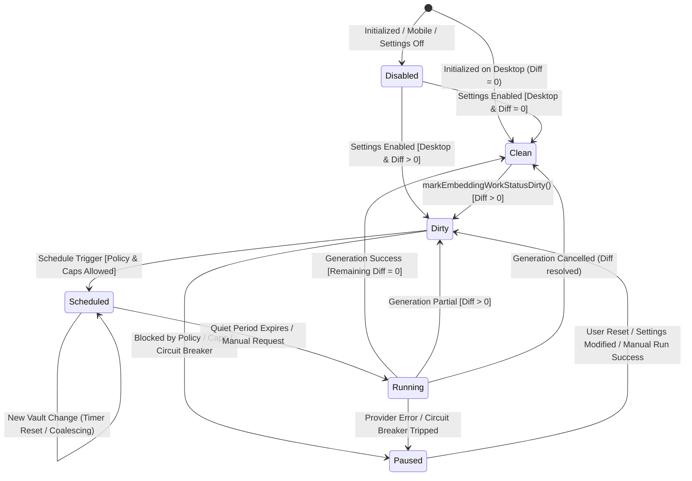

# Lina 0.2 — Phase 2.0 Automatic Maintenance Orchestration Analysis

**Status:** Architecture Analysis & Design Specification (Phase 2.2 Ollama Maintenance Validated)
**Role:** Senior Software Architect & Systems Engineer  
**Scope:** Design of the automatic embedding maintenance scheduler, cost-safety boundaries for local (Ollama) vs remote (Mistral, OpenRouter) providers, dirty-state detection, failure recovery, manual/automatic execution contracts, and phased implementation roadmap.

---

## 1. Executive Verdict & Summary

### Verdict: `READY WITH SMALL PREPARATION`

The Lina codebase is in an ideal architectural position for automatic maintenance. With the completion of Phase 1.9B, `EmbeddingWorker` fully encapsulates execution orchestration, mutex lock scoping, text-index draining, single-flight gating, and downstream binary handoffs. Furthermore, `EmbeddingWorkStatusController` already provides decoupled, single-flight dirty detection and diff plan previews.

### Key Analysis Conclusions

1. **No Monolithic Scheduler:** Automatic scheduling must not be conflated with execution. `EmbeddingWorker` remains the pure execution owner. A lightweight, decoupled policy component—**`EmbeddingScheduler`** (supervised by `MaintenanceEngine`)—should listen to dirty signals, manage quiet-period debouncing, enforce provider cost caps, and invoke `MaintenanceEngine.requestEmbeddingGeneration("automatic")`.
2. **Strict Local vs Remote Provider Asymmetry:**
   - **Local Provider (Ollama):** Safe to automate **by default** on Desktop Producer with a 30-second quiet-period debounce (zero monetary cost, local execution).
   - **Remote Providers (Mistral, OpenRouter):** Must remain **strictly opt-in (disabled by default)**, bounded by pre-flight diff estimation, per-run batch caps (e.g., maximum 50 chunks per automatic run), daily limits, and aggressive circuit breakers.
3. **Derived Ground Truth, Transient Scheduler:**
   - Work availability is derived dynamically from disk artifacts (`chunks.jsonl` vs `embeddings.jsonl` via pure `calculateEmbeddingUpdatePlan`).
   - Scheduler states (`idle`, `dirty`, `scheduled`, `running`, `paused`) are strictly transient in-memory states. Zero disk lockfiles or fragile persistence flags are introduced.
4. **Preserved Invariants:**
   - Mobile Companion remains strictly a read-only consumer (`canGenerateEmbeddings === false`).
   - Manual execution always preempts scheduled timers and shares the identical single-flight execution path.
   - Downstream `BinaryWorker` compilation remains an automatic consequence of canonical publication.

---

## 2. Current-State Map: Maintenance Workers & Status Controllers

The current maintenance architecture separates responsibilities cleanly:

```text
┌──────────────────────────────────────────────────────────────────────────────────────────────────┐
│                                 CURRENT ARCHITECTURAL BASELINE                                   │
├────────────────────────┬────────────────────────────────┬────────────────────────────────────────┤
│ Component              │ Mode of Operation              │ Current Responsibilities               │
├────────────────────────┼────────────────────────────────┼────────────────────────────────────────┤
│ TextIndexWorker        │ Automatic (Desktop Producer)   │ Vault event watchers (create, modify,  │
│                        │                                │ delete, rename), 2000ms debounce,      │
│                        │                                │ batch coalescing, 1000ms timer flushes.│
├────────────────────────┼────────────────────────────────┼────────────────────────────────────────┤
│ ReconciliationWorker   │ Automatic (Desktop Producer)   │ Post-startup vault drift scan (5s      │
│                        │                                │ grace period) & runtime exclusion sync.│
├────────────────────────┼────────────────────────────────┼────────────────────────────────────────┤
│ BinaryWorker           │ Automatic Downstream Trigger   │ Binary validation, compile, remove,    │
│                        │ + Manual UI Actions            │ and post-canonical-publication compile.│
├────────────────────────┼────────────────────────────────┼────────────────────────────────────────┤
│ EmbeddingScheduler     │ Automatic Policy (Desktop      │ Transient state model, 30s quiet timer,│
│                        │ Producer + Ollama)             │ 300s max delay, fresh diff check, and  │
│                        │                                │ automatic dispatch to EmbeddingWorker. │
├────────────────────────┼────────────────────────────────┼────────────────────────────────────────┤
│ EmbeddingWorker        │ Unified Single-Flight          │ Single-flight gating, coordinator lock │
│                        │ Execution (Manual & Auto)      │ scoping, text-index drain, progress,   │
│                        │                                │ publication, and BinaryWorker handoff. │
├────────────────────────┼────────────────────────────────┼────────────────────────────────────────┤
│ EmbeddingWorkStatus-   │ Reactive Runtime Read-Only     │ Listens to markEmbeddingWorkStatusDirty│
│ Controller             │ Dirty Status Provider          │ events, computes diff plan previews,   │
│                        │                                │ and exposes hasEmbeddingWorkAvailable. │
└────────────────────────┴────────────────────────────────┴────────────────────────────────────────┘
```

**Automation Status:**
- Local Ollama automatic maintenance is fully implemented and validated on Desktop Producer with quiet-period debouncing, coalescing, fresh diff checking, and post-publication status convergence.
- Remote provider cost safeguards, per-run batch caps, circuit breakers, and opt-in automation remain future work for Mistral and OpenRouter (Phases 2.3 & 2.4).EmbeddingScheduler     │ Foundation Active              │ Transient state model, 30s quiet timer,│
│                        │ (Execution Disabled)           │ coalescing, & manual preemption.       │
├────────────────────────┼────────────────────────────────┼────────────────────────────────────────┤
│ EmbeddingWorker        │ Strictly Manual Orchestration  │ Single-flight gating, coordinator lock │
│                        │                                │ scoping, text-index drain, progress,   │
│                        │                                │ publication, and BinaryWorker handoff. │
├────────────────────────┼────────────────────────────────┼────────────────────────────────────────┤
│ EmbeddingWorkStatus-   │ Reactive Runtime Read-Only     │ Listens to markEmbeddingWorkStatusDirty│
│ Controller             │ Dirty Status Provider          │ events, computes diff plan previews,   │
│                        │                                │ and exposes hasEmbeddingWorkAvailable. │
└────────────────────────┴────────────────────────────────┴────────────────────────────────────────┘
```

**What is missing for full automation:**
- An automatic trigger mechanism connecting `EmbeddingWorkStatusController` dirty signals to `EmbeddingWorker` execution.
- A quiet-period debounce timer to prevent continuous API calls during active note editing.
- Cost-control policies, per-run caps, and circuit breakers for remote paid providers.

---

## 3. Proposed Automatic Maintenance Architecture

To preserve single-responsibility boundaries, scheduling policy is decoupled from execution:

```text
Vault Events (User Typing / Modifications)
     │
     ▼
TextIndexWorker (Debounces 2000ms, flushes batch to chunks.jsonl)
     │
     ▼
markEmbeddingWorkStatusDirty("text-index-published")
     │
     ▼
EmbeddingWorkStatusController (Evaluates calculateEmbeddingUpdatePlan)
     │
     ▼ (workAvailable === true)
EmbeddingScheduler (Supervised by MaintenanceEngine)
     ├─ 1. Check DeviceCapabilities.canGenerateEmbeddings (Desktop only)
     ├─ 2. Check Provider Safety Policy (Ollama vs Mistral/OpenRouter opt-in)
     ├─ 3. Check Circuit Breaker & Per-Run Cost Caps
     ├─ 4. Run Quiet-Period Timer (30s quiet period / coalescing)
     │
     ▼ (Timer expires with vault quiet)
MaintenanceEngine.requestEmbeddingGeneration("automatic")
     │
     ▼
EmbeddingWorker
     ├─► Mutex preparation reservation
     ├─► TextIndexWorker.drainAutomaticUpdatesBeforeEmbeddingGeneration()
     ├─► Acquire exclusive IndexWriteCoordinator generation token
     ├─► Pure batch loop & checkpoints (embeddingGenerator.ts / embeddingPersistence.ts)
     ├─► Atomic canonical publication (.jsonl.tmp ──► embeddings.jsonl)
     ├─► Release generation lock & schedule text flush
     └─► Downstream BinaryWorker handoff (maintainAfterPublication)
```

---

## 4. Trigger Matrix & Gating Strategy

| Trigger Event | Source | Marks Dirty? | Auto-Schedules? | Requires Confirmation? | API Risk Level | Action Taken |
| :--- | :--- | :---: | :---: | :---: | :---: | :--- |
| `text-index-published` | `TextIndexWorker` | Yes | Yes (after 30s quiet) | No (if within caps) | Low–Medium | Resets/starts 30s quiet timer. |
| `startup-reconciled` | `ReconciliationWorker` | Yes | Yes (after 15s grace) | No (if within caps) | Low–Medium | Evaluates diff; schedules if needed. |
| `text-index-rebuilt` | Manual Rebuild | Yes | Local: Yes / Remote: Opt-in | Remote: Yes if > cap | High | Large diff possible; caps enforce safety. |
| `settings-changed` (model/provider) | Settings UI | Yes | **Never Auto** | **Mandatory Explicit Action** | **Extreme (Full Vault Recompute)** | Model change invalidates vector space; requires explicit manual regeneration. |
| `exclusion-changed` | Settings UI | Yes | Yes (after quiet) | No | Zero (Pruning / Deletions) | Removes obsolete chunks locally; no new API generation required. |
| `checkpoint-changed` | File Watcher / Startup | Yes | Yes (after grace) | No | Low | Resumes interrupted batch from checkpoint. |
| `external-sync-detected` | Syncthing / Sync | Yes | Yes (after quiet) | No | Zero–Low | If synced embeddings match text, diff is 0 (no-op). |
| `manual-request` | User Command/UI | N/A | **Immediate** | No | User-Authorized | Cancels scheduled timer; executes immediately without cap. |

---

## 5. Cost-Safety & Provider Policy

Automatic embedding maintenance must never generate surprise monetary charges on remote provider accounts.

```text
                                  Provider Check
                                        │
                    ┌───────────────────┴───────────────────┐
                    ▼                                       ▼
            Local Provider                          Remote Provider
               (Ollama)                         (Mistral / OpenRouter)
                    │                                       │
     ┌──────────────┴──────────────┐         ┌──────────────┴──────────────┐
     ▼                             ▼         ▼                             ▼
Enabled by Default          Configurable    Disabled by Default      Strict Opt-In
(Zero API Billing)          Quiet Period    (Avoid Surprise Bills)   Required
                            (30s default)                            │
                                                                     ├─ Max Chunks / Run (e.g. 50)
                                                                     ├─ Pre-flight Diff Estimation
                                                                     ├─ Circuit Breaker (3 errors)
                                                                     └─ Daily Batch Threshold
```

### 5.1 Local Provider Policy: Ollama
- **Cost Risk:** Zero monetary API billing.
- **Default:** **Enabled by default on Desktop Producer.**
- **Throttling:** 30-second quiet-period debounce to prevent CPU/GPU thrashing while typing.
- **Concurrency:** Single-flight worker prevents concurrent model executions.

### 5.2 Remote Provider Policy: Mistral & OpenRouter
- **Cost Risk:** Real monetary cost per request / token.
- **Default:** **Disabled by default (Manual-Only).**
- **Requirements to Enable:**
  1. **Explicit User Opt-In:** A dedicated setting (`Enable automatic embeddings for remote provider`) with an explicit confirmation dialog explaining API billing.
  2. **Pre-Flight Diff Estimation:** Pure calculation of missing/stale chunks before dispatching network requests. If diff = 0, zero network traffic.
  3. **Automatic Per-Run Chunk Cap:** Default limit of **50 chunks per automatic run**. If a vault modification adds 500 chunks (e.g., bulk file import), the scheduler processes 50 chunks and pauses automatic maintenance with a notification:  
     *“Lina: 450 chunks pending embeddings. Automatic batch paused to protect API budget; trigger manual generation to process all notes.”*
  4. **Circuit Breaker:** If a remote provider returns `401 Unauthorized`, `402 Payment Required`, `429 Rate Limit`, or fails 3 consecutive requests, automatic scheduling is **immediately paused**. It does not retry in a continuous loop.

---

## 6. Scheduler & Dirty-State Model

### 6.1 State Machine



### 6.2 State Definitions

| State | Condition | Meaning |
| :--- | :--- | :--- |
| **`disabled`** | `canGenerateEmbeddings === false` or setting disabled | Automatic scheduler is inactive; manual runs remain available on Desktop. |
| **`clean`** | Diff plan indicates 0 missing and 0 stale chunks | Vault embeddings are fully synchronized with text chunks. |
| **`dirty`** | Diff plan indicates work available | Text changes have occurred; scheduler is evaluating policy/caps. |
| **`scheduled`** | Quiet-period timer is running (e.g., 30s countdown) | Vault changes are being coalesced; will execute when typing stops. |
| **`running`** | `EmbeddingWorker` is actively executing | Single-flight generation operation is in progress. |
| **`paused`** | Circuit breaker tripped, rate limit hit, or cap exceeded | Automatic execution halted to protect stability and API budget. |

---

## 7. Scheduling Strategy (Quiet Period, Coalescing & Debouncing)

### 7.1 Rationale for the 30-Second Quiet Period
- Editing in Obsidian is bursty. When writing a note, a user generates repeated `modify` events over several minutes.
- `TextIndexWorker` already debounces file writes by 2000ms and flushes to disk.
- If embeddings fired immediately after every text index flush:
  - Local models (Ollama) would spike CPU/GPU continuously, draining battery and heating laptop hardware.
  - Remote models (Mistral, OpenRouter) would generate dozens of micro-requests, increasing latency and network overhead.
- A **30-second quiet period** ensures vector generation occurs only when the user has paused active writing.

### 7.2 Coalescing Behavior
- If the user resumes typing within the 30-second window, any new text index write resets the 30-second countdown.
- **Bounded Max Delay (5 minutes):** If the user types continuously without a 30-second pause for more than 5 minutes, the scheduler will trigger an incremental background batch at the 5-minute mark to prevent vector drift from accumulating excessively.

### 7.3 Startup Grace Period
- When Obsidian starts, a **15-second grace period** is observed before the scheduler evaluates automatic generation.
- This allows Obsidian core indexing, community plugins, and `ReconciliationWorker` (5s grace) to stabilize without competing for CPU and I/O.

---

## 8. Manual vs. Automatic Execution Contract

Manual execution and automatic maintenance share the single-flight `EmbeddingWorker` without duplicate code paths:

```text
┌──────────────────────────────────────────────────────────────────────────────────────────────────┐
│                             MANUAL VS AUTOMATIC EXECUTION CONTRACT                               │
├──────────────────────────┬───────────────────────────────┬───────────────────────────────────────┤
│ Dimension                │ Manual Execution              │ Automatic Maintenance                 │
├──────────────────────────┼───────────────────────────────┼───────────────────────────────────────┤
│ Origin Tag               │ origin = "command" / "sidebar"│ origin = "automatic"                  │
├──────────────────────────┼───────────────────────────────┼───────────────────────────────────────┤
│ Quiet-Period Delay       │ 0 seconds (Immediate)         │ 30 seconds (Coalesced Quiet Period)   │
├──────────────────────────┼───────────────────────────────┼───────────────────────────────────────┤
│ Scheduled Timer Action   │ Cancels pending timer & runs  │ Resets countdown on new text changes  │
├──────────────────────────┼───────────────────────────────┼───────────────────────────────────────┤
│ Chunk Batch Caps         │ Uncapped (Processes full diff)│ Capped (Default 50 chunks for remote) │
├──────────────────────────┼───────────────────────────────┼───────────────────────────────────────┤
│ UI Modals & Notices      │ Progress Modal + Notices      │ Silent background + Status Bar / Icon │
├──────────────────────────┼───────────────────────────────┼───────────────────────────────────────┤
│ Concurrency & Locks      │ Shared IndexWriteCoordinator  │ Shared IndexWriteCoordinator          │
│                          │ generation token              │ generation token                      │
└──────────────────────────┴───────────────────────────────┴───────────────────────────────────────┘
```

---

## 9. Downstream Binary Maintenance Contract

The relationship between canonical embeddings and binary vector artifacts remains strictly linear:

```text
Text Index (chunks.jsonl) ──► Embeddings (embeddings.jsonl) ──► Binary Vectors (embeddings.vectors.f32)
```

1. **Automatic Downstream Consequence:**  
   The `EmbeddingScheduler` targets canonical embeddings only. It does not schedule or manage `BinaryWorker`.
2. **Lock Release Invariant:**  
   When `EmbeddingWorker` finalizes a canonical publication (whether automatic or manual), it releases its exclusive writer lock and invokes `BinaryWorker.maintainAfterPublication(publicationId)`.
3. **Fault Isolation:**  
   If binary compilation fails or is cancelled, canonical `embeddings.jsonl` remains 100% valid, and the scheduler treats the embedding run as successful.

---

## 10. Multi-Device & Synchronization Safety

1. **Mobile Companion Prohibition:**  
   `DeviceCapabilities.canGenerateEmbeddings === false` on Mobile Companion. `EmbeddingScheduler` is never instantiated or started on mobile devices.
2. **Multi-Producer Synchronization (Syncthing / Obsidian Sync):**  
   - When external `.lina/index/` files arrive via sync, `EmbeddingWorkStatusController` detects the change and recalculates the diff plan.
   - If the arriving files contain valid, up-to-date embeddings matching the text chunks, the diff is 0. The scheduler detects `clean` and takes **zero action**.
   - If a partial sync or text change arrives, the 30-second quiet period allows remaining synced files to arrive before local generation starts.

---

## 11. Failure, Circuit Breaker & Recovery Policy

| Error Scenario | HTTP / Error Code | Immediate Action | Scheduler State | Retry / Recovery Policy |
| :--- | :--- | :--- | :--- | :--- |
| **Rate Limit** | HTTP 429 | Abort active batch | `paused` | Backoff 2 min, retry once. If 429 repeats, pause until user intervention. |
| **Authentication** | HTTP 401 | Abort active batch | `paused` | **Zero retries.** Notify user: *"Lina: Invalid API Key"*. |
| **Payment Required** | HTTP 402 | Abort active batch | `paused` | **Zero retries.** Notify user: *"Lina: Insufficient API Credits"*. |
| **Network Down** | Network / DNS error | Abort active batch | `paused` | Exponential backoff (1m, 5m, 15m), max 3 attempts. |
| **Model Unavailable** | 404 / Model Error | Abort active batch | `paused` | Zero retries. Notify user: *"Lina: Embedding model not found"*. |
| **Obsidian Closed** | Interrupted Process | Clean exit / abort | `dirty` on restart | Checkpoint file (`embeddings.checkpoint.jsonl`) preserved; resumes automatically on next run. |

---

## 12. Phased Implementation Plan

```text
Phase 2.1: Scheduler Foundation & Dirty-State Wiring
   │
   ▼
Phase 2.2: Local Provider (Ollama) Automatic Maintenance
   │
   ▼
Phase 2.3: Remote Cost Safeguards & Circuit Breakers (Mistral / OpenRouter)
   │
   ▼
Phase 2.4: Opt-In Remote Provider Automatic Maintenance
   │
   ▼
Phase 2.5: Multi-Device Sync & Recovery Hardening
   │
   ▼
Phase 2.6: Settings UI Simplification (Post-Stability)
```

---

### Phase 2.1: Scheduler Foundation & Dirty-State Wiring [COMPLETED & VALIDATED]
- **Objective:** Create `EmbeddingScheduler` component within `src/maintenance/` with quiet-period timer, coalescing, and manual preemption. Connect to `EmbeddingWorkStatusController` in a testable, disabled-by-default state.
- **Files Affected:** `src/maintenance/embeddingScheduler.ts` (implemented), `src/maintenance/maintenanceEngine.ts` (integrated), `tests/maintenance/embeddingScheduler.test.ts` (validated).
- **Behavior Change:** Scheduler tracks state and quiet periods internally; automatic embedding execution remains deliberately disabled.
- **Risks:** Timer leaks or unhandled cancellation edge cases.
- **Tests Required:** Unit tests for timer resets, coalescing on rapid events, shutdown disposal, and manual preemption (all 8 tests passing).
- **Manual Validation:** Verify Obsidian startup and shutdown without background timer leaks.

---

### Phase 2.2: Local Provider (Ollama) Automatic Maintenance [COMPLETED & VALIDATED]
- **Objective:** Enable automatic embedding maintenance by default for local Ollama provider on Desktop Producer.
- **Files Affected:** `src/maintenance/embeddingScheduler.ts`, `src/maintenance/maintenanceEngine.ts`, `main.ts`, `src/search/linaSearchView.ts`, `tests/maintenance/embeddingScheduler.test.ts`, `tests/maintenance/automaticEmbeddingRuntimeDispatch.test.ts`.
- **Behavior Change:** Editing Markdown notes triggers a 30-second quiet-period debounce (backed by a 300-second bounded maximum delay timer). When the quiet period expires and fresh work is derived (`hasAutomaticEmbeddingWork`), `EmbeddingScheduler` dispatches `MaintenanceEngine.requestEmbeddingGeneration("automatic")` to the shared `EmbeddingWorker`. Following canonical publication, the derived status automatically recalculates for UI subscribers without requiring manual refresh.
- **Runtime Validation Facts Confirmed:**
  - Automatic scheduler dispatch on Desktop Producer for Ollama;
  - Automatic incremental embedding generation after editing ceases;
  - Generation completes without requiring manual `Refresh embedding status` interaction;
  - Full automatic regeneration from zero embeddings (tested with 2148 new embeddings / 0 retained in the zero-state test);
  - Semantic and hybrid search operate seamlessly using the newly generated artifacts;
  - No unnecessary repeated generation after convergence (scheduler settles into `clean` state);
  - Automatic status-panel convergence confirmed in runtime testing (including Phase 2.2C status recalculation).
- **Invariants Maintained:** Mistral and OpenRouter remain strictly manual-only. Mobile Companion remains consumption-only.

---

### Phase 2.2D: OpenRouter Embeddings Capability Alignment [COMPLETED & VALIDATED]
- **Objective:** Add manual vector embedding support for OpenRouter, add domain-specific provider filtering in Settings UI, configure `openai/text-embedding-3-small` default embedding model, and sanitize remote API credentials in error handling.
- **Files Affected:** `src/ai/openRouterProvider.ts` (new), `src/ai/embeddingProvider.ts`, `src/ai/providerDefaults.ts`, `src/ai/embeddingTypes.ts`, `src/settings/pureLocalSettingsModel.ts`, `src/settings/pureLocalSettingAdapters.ts`, `tests/index/openRouterEmbeddingProvider.test.ts` (new).
- **Behavior Change:** OpenRouter can now be selected as an Embeddings Provider. Embeddings are generated manually via OpenRouter's OpenAI-compatible batch embeddings API (`https://openrouter.ai/api/v1/embeddings`). The Settings UI filters providers by capability per domain (Analysis AI: Ollama, Mistral; Embeddings: Ollama, Mistral, OpenRouter). OpenRouter embedding maintenance remains manual-only.
- **Runtime Validation Facts Confirmed:**
  - OpenRouter successfully generates vector embeddings via batch API requests;
  - Batch input ordering is verified and restored from response item indices;
  - Malformed responses, dimension mismatches, and invalid vectors are defensively rejected;
  - HTTP 400, 401, 402, 404, 429, and 529 failures are categorized with Bearer API key redaction in error messages;
  - Connection testing and manual generation execute cleanly through the shared `EmbeddingWorker` pipeline;
  - Automatic scheduling remains strictly Ollama-only.

---

### Phase 2.3: Remote Cost Safeguards & Circuit Breakers
- **Objective:** Implement pre-flight chunk estimation, per-run batch caps (max 50 chunks), and circuit breakers for Mistral and OpenRouter.
- **Files Affected:** `src/maintenance/embeddingCostGuard.ts` (new), `src/maintenance/embeddingScheduler.ts`, `tests/maintenance/embeddingCostGuard.test.ts` (new).
- **Behavior Change:** Remote automatic runs are capped and halted on repeated errors or budget overruns.
- **Risks:** Overly aggressive circuit breakers pausing normal operations.
- **Tests Required:** Unit tests for 401/402/429 status handling, batch cap pausing, and notification dispatch.
- **Manual Validation:** Mock 429 response; verify scheduler pauses cleanly without infinite retry loops.

---

### Phase 2.4: Opt-In Remote Provider Automatic Maintenance
- **Objective:** Add explicit user setting and confirmation dialog to allow opt-in automatic maintenance for Mistral and OpenRouter with configured caps.
- **Files Affected:** `src/settings.ts`, `src/settings/declarativeSettingsCandidateComposition.ts`, `main.ts`.
- **Behavior Change:** Users can optionally enable automatic maintenance for remote providers with visual confirmation of cost limits.
- **Risks:** User confusion regarding API key spending.
- **Tests Required:** Settings toggle persistence, confirmation modal acceptance/rejection tests.
- **Manual Validation:** Toggle setting; verify confirmation dialog appears and correctly arms/disarms remote scheduling.

---

### Phase 2.5: Multi-Device Sync & Recovery Hardening
- **Objective:** Harden scheduler against incoming Syncthing/Obsidian Sync updates, interrupted checkpoints, and mobile capability gating.
- **Files Affected:** `src/maintenance/embeddingScheduler.ts`, `tests/maintenance/multiDeviceScheduler.test.ts` (new).
- **Behavior Change:** Synced complete embeddings produce zero API calls; interrupted runs resume cleanly from checkpoints.
- **Risks:** Sync race conditions during active remote embedding generation.
- **Tests Required:** Tests simulating partial file arrival, complete external vector sync, and checkpoint resumption.
- **Manual Validation:** Test bidirectional Syncthing sync between Desktop Producer and Android Companion.

---

### Phase 2.6: Settings UI Simplification (Post-Stability)
- **Objective:** Simplify user-facing settings tab by transitioning technical maintenance controls into an "Advanced / Developer Tools" section once automatic maintenance is fully validated.
- **Files Affected:** `src/settings.ts`, `docs/manual.md`.
- **Behavior Change:** Default settings interface focuses on search preferences and AI providers; technical maintenance runs silently in the background.
- **Risks:** Loss of direct technical diagnostic visibility if advanced tools are obscured.
- **Tests Required:** Declarative settings parity suite and harness validation.
- **Manual Validation:** Visual review of settings tab for new user onboarding.
