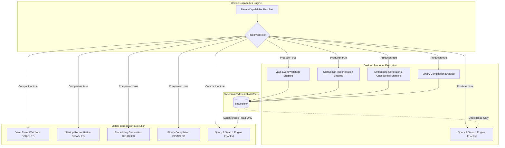
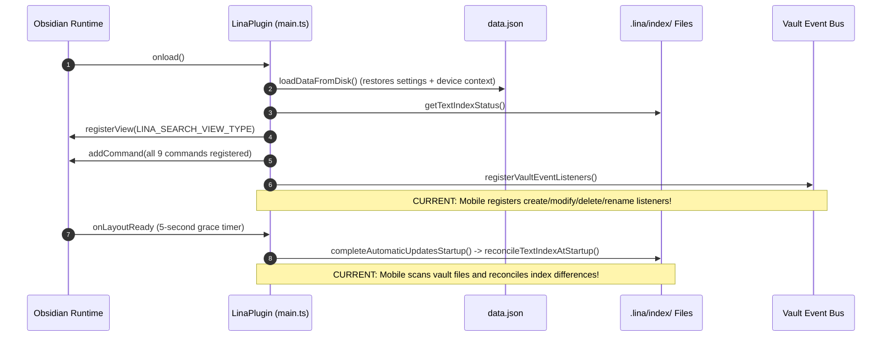
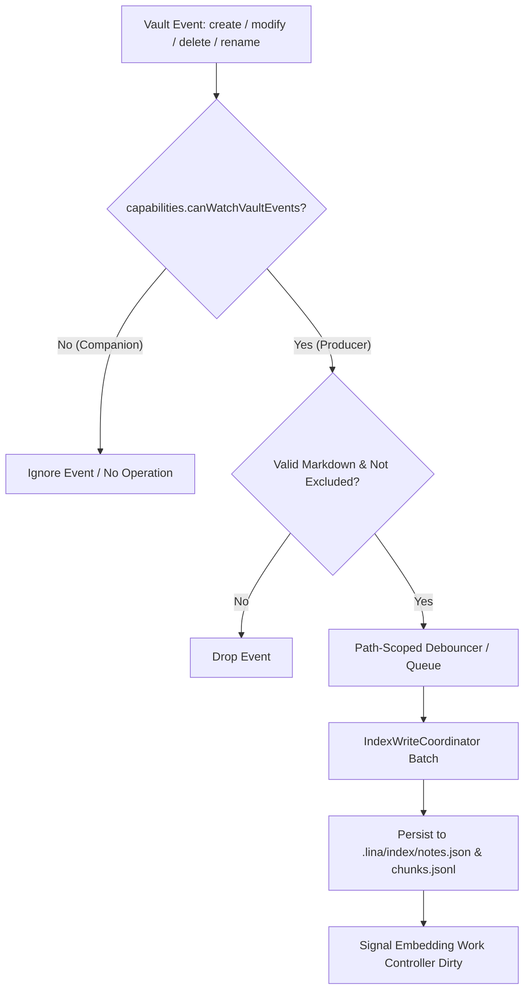
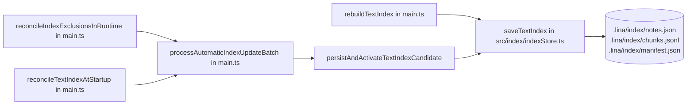
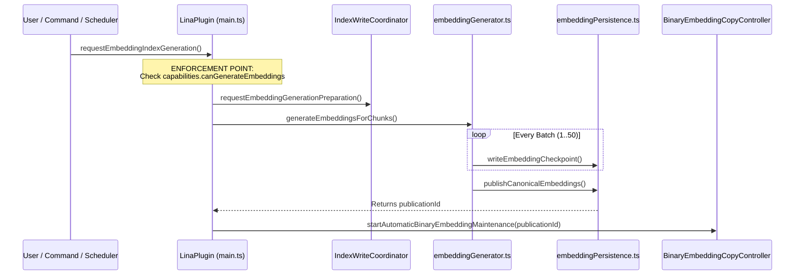
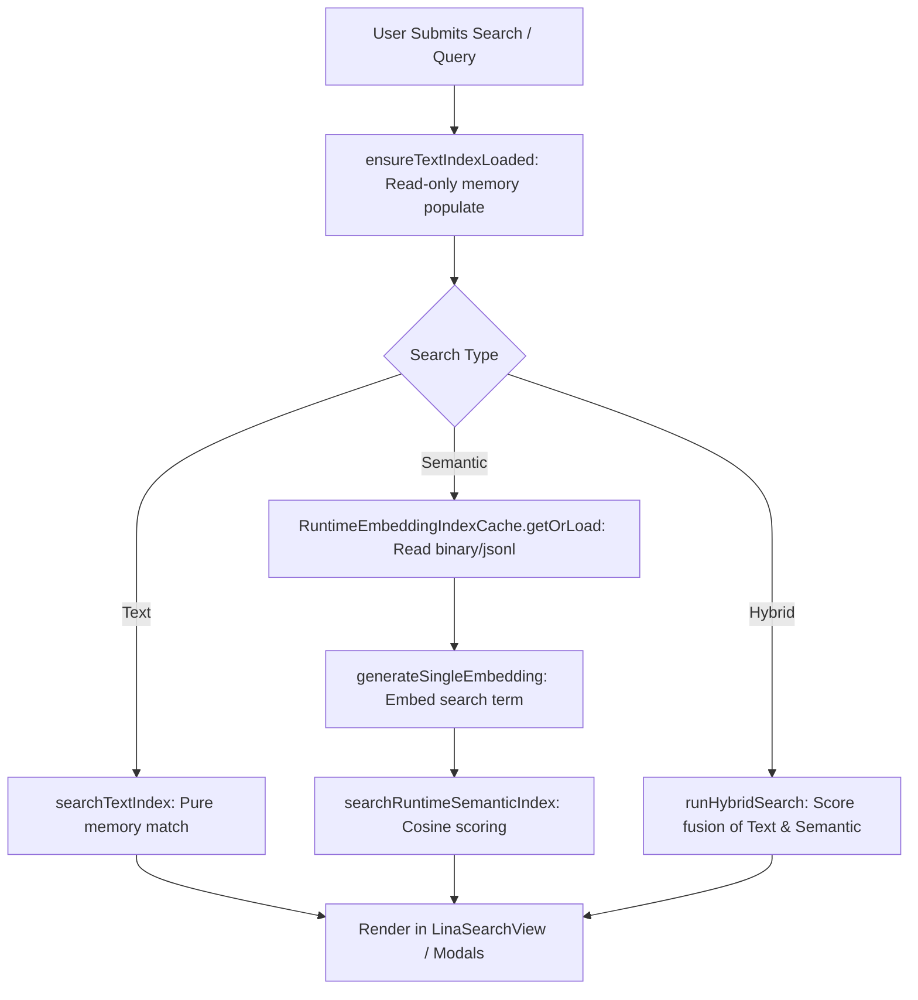
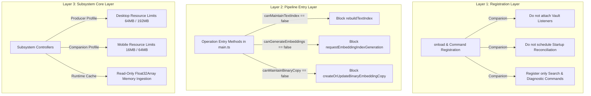

# Lina 0.2 — Phase 0.2 DeviceCapabilities Enforcement Analysis

**Author:** Senior Software Architect & Senior Systems Analyst  
**Date:** August 16, 2026  
**Status:** Pre-Migration Enforcement Analysis (Phase 0.2 — Analysis Only)  
**Target Version:** Lina 0.2.x  
**Scope:** Runtime behavior mapping, vault event listener audit, startup/reconciliation gating, maintenance write paths, search preservation, settings classification, and testing strategy for capability enforcement.

---

## 1. Executive Summary

Following the conceptual definition of the **Device Capability Model** in Phase 0, this analysis identifies the exact runtime enforcement points where `DeviceCapabilities` must govern Lina's behavior.

The primary objective is transitioning the system from:
* **Current State:** Desktop and Mobile executing the same producer pipelines (both registering vault write listeners, both executing startup diff reconciliations, both exposing full artifact compilation).
* **Target State (Lina 0.2):**
  * **Desktop Producer:** Authoritatively creates, updates, reconciles, and publishes `.lina/index/` artifacts (`manifest.json`, `notes.json`, `chunks.jsonl`, `embeddings.jsonl`, and binary vector copies).
  * **Mobile Companion:** Operates purely as a consumer of synchronized artifacts, executing local textual, semantic, and hybrid search queries and accessing optional AI enrichment without modifying search index files or running background maintenance loops.



---

## 2. Current Runtime Behavior

### 2.1 Unified Lifecycle Analysis (`main.ts`)

In the current 0.1.x codebase, [`LinaPlugin.onload()`](file:///d:/_dev/obsidian/lina/main.ts#L340-L577) runs an identical sequence regardless of host platform:



### 2.2 Findings on Runtime Symmetry

* **CURRENT:** [`main.ts:1693-1743`](file:///d:/_dev/obsidian/lina/main.ts#L1693-L1743) evaluates only `settings.autoUpdateIndexOnFileChanges`. If enabled in `data.json`, Mobile actively attaches listeners to `this.app.vault.on("create" | "modify" | "delete" | "rename")`.
* **CURRENT:** [`main.ts:351-357`](file:///d:/_dev/obsidian/lina/main.ts#L351-L357) unconditionally schedules `reconcileTextIndexAtStartup()` on layout ready after 5 seconds on both Desktop and Mobile.
* **RISK:** A mobile user editing Markdown notes triggers local debounced indexing batches that overwrite `notes.json`, `chunks.jsonl`, and `manifest.json`. When external synchronization (Obsidian Sync / Syncthing) runs, bidirectional index writes create file conflicts (`manifest.sync-conflict-...`) and mark the index `isUsable: false`.
* **TARGET:** In Lina 0.2, Mobile Companion must **never register vault write listeners** and must **never run startup diff reconciliation**.

---

## 3. Vault Event Analysis

### 3.1 Exhaustive Vault Event Inventory

| Event Type | Handler Function | Current Implementation Details | Writes Maintenance Data? | Required Capability |
| :--- | :--- | :--- | :---: | :---: |
| **`create`** | [`handleVaultEvent("create", file)`](file:///d:/_dev/obsidian/lina/main.ts#L1708-L1710) $\to$ [`handleVaultFileChange`](file:///d:/_dev/obsidian/lina/main.ts#L1839) | Validates path and exclusions; enqueues into `pendingAutomaticUpdates`; flushes after 1000ms. | **YES** (Writes `notes.json`, `chunks.jsonl`, `manifest.json`) | `canWatchVaultEvents` & `canMaintainTextIndex` |
| **`modify`** | [`handleVaultEvent("modify", file)`](file:///d:/_dev/obsidian/lina/main.ts#L1712-L1714) $\to$ [`handleVaultFileChange`](file:///d:/_dev/obsidian/lina/main.ts#L1877) | Routes to `modifyDebouncer` (2000ms delay per file); computes `hashContent`; if changed, re-chunks and enqueues. | **YES** (Writes `notes.json`, `chunks.jsonl`, `manifest.json`) | `canWatchVaultEvents` & `canMaintainTextIndex` |
| **`delete`** | [`handleVaultEvent("delete", file)`](file:///d:/_dev/obsidian/lina/main.ts#L1716-L1718) $\to$ [`handleVaultFileChange`](file:///d:/_dev/obsidian/lina/main.ts#L1839) | Enqueues path removal without reading disk; removes note and matching chunks from index. | **YES** (Writes `notes.json`, `chunks.jsonl`, `manifest.json`) | `canWatchVaultEvents` & `canMaintainTextIndex` |
| **`rename`** | [`handleVaultEvent("rename", file, oldPath)`](file:///d:/_dev/obsidian/lina/main.ts#L1720-L1722) $\to$ [`handleVaultFileChange`](file:///d:/_dev/obsidian/lina/main.ts#L1839) | Removes entries for `oldPath` and `newPath`; indexes note under new path; generates updated chunks. | **YES** (Writes `notes.json`, `chunks.jsonl`, `manifest.json`) | `canWatchVaultEvents` & `canMaintainTextIndex` |



### 3.2 Recommendations for Vault Events
* **CURRENT:** [`registerVaultEventListeners()`](file:///d:/_dev/obsidian/lina/main.ts#L1693) is executed at startup if `settings.autoUpdateIndexOnFileChanges` is true.
* **RECOMMENDATION:** Wrap `registerVaultEventListeners()` in an explicit capability check:
  ```typescript
  if (!this.capabilities.canWatchVaultEvents) {
    this.addDiagnosticEvent({
      eventType: "ignored",
      path: "plugin",
      message: "vault event listeners disabled by device capability profile (companion)",
    });
    return;
  }
  ```

---

## 4. Startup and Reconciliation Analysis

### 4.1 Startup Operations Breakdown

```text
Startup Operation                  Current Execution Path                  0.2 Desktop Producer    0.2 Mobile Companion
──────────────────────────────────────────────────────────────────────────────────────────────────────────────────────────
1. Load Settings (data.json)       LinaPlugin.loadDataFromDisk()           ACTIVE                  ACTIVE
2. Read Index Status               LinaPlugin.getTextIndexStatus()         ACTIVE (Validates)      ACTIVE (Validates)
3. Register LinaSearchView         LinaPlugin.registerView()               ACTIVE                  ACTIVE
4. Attach Vault Listeners          LinaPlugin.registerVaultEventListeners()ACTIVE                  DISABLED
5. Startup Reconciliation (5s)     reconcileTextIndexAtStartup()           ACTIVE (Diffs & writes) DISABLED (Read-only)
6. Startup Embedding Automation    runStartupEmbeddingAutomation()         DISABLED (Lightweight)  DISABLED
7. Startup Sync Status Notice      runStartupIndexAutomation()             ACTIVE (Diagnostic)     ACTIVE (Diagnostic)
```

### 4.2 Reconciliation Execution Analysis

In [`main.ts:930-984`](file:///d:/_dev/obsidian/lina/main.ts#L930-L984), `reconcileTextIndexAtStartup()` performs a complete comparison between all Markdown files in the vault and `indexedNotes` from `.lina/index/notes.json`:
1. It calls `this.app.vault.getMarkdownFiles()`.
2. It executes [`buildStartupReconciliationPlan()`](file:///d:/_dev/obsidian/lina/src/index/automaticUpdateEvents.ts#L198) calculating `newCount`, `modifiedCount`, and `deletedCount`.
3. If differences exist, it enqueues them into `pendingAutomaticUpdates` and immediately executes [`processNextAutomaticUpdateBatch()`](file:///d:/_dev/obsidian/lina/main.ts#L2001), writing modified `notes.json` and `chunks.jsonl` to disk.

* **CURRENT:** Both Desktop and Mobile execute this startup reconciliation.
* **RISK:** If mobile starts up while synchronized files are partially written or before Syncthing finishes transferring notes, mobile will detect "deleted" or "modified" files and write a partial index back to `.lina/index/`.
* **TARGET:** On Mobile Companion, `completeAutomaticUpdatesStartup()` must mark `this.automaticUpdatesReady = true` **without invoking `reconcileTextIndexAtStartup()`**.

---

## 5. Index Maintenance Enforcement Points

### 5.1 Comprehensive Write-Path Map

All textual index disk writes route through a single persistence pipeline in [`src/index/indexStore.ts`](file:///d:/_dev/obsidian/lina/src/index/indexStore.ts):



### 5.2 Enforcement Point Matrix

| Operation | Trigger Points | Current Guard | 0.2 Recommended Enforcement |
| :--- | :--- | :--- | :--- |
| **Manual Rebuild** | Command `"reconstruir-indice-textual"`, Settings button | `IndexWriteCoordinator.startTextRebuild()` | Check `capabilities.canMaintainTextIndex`. On Companion: return error or hide button. |
| **Automatic Batch Update** | `processAutomaticIndexUpdateBatch()` | `IndexWriteCoordinator.startAutomaticBatch()` | Gated at listener level (`canWatchVaultEvents`). Add assertion inside `processNextAutomaticUpdateBatch()`. |
| **Startup Reconciliation** | `reconcileTextIndexAtStartup()` | None | Check `capabilities.canReconcileStartupDiffs` before execution. |
| **Exclusion Reconciliation** | `reconcileIndexExclusionsAfterSettingsChange()` | None | Check `capabilities.canMaintainTextIndex`. (Settings tab should also prevent exclusion editing on Companion). |
| **Core File Persistence** | `saveTextIndex()` in `src/index/indexStore.ts` | File-level atomic rename | Core write function remains generic; calling callers in `main.ts` enforce capabilities. |

---

## 6. Embedding Maintenance Enforcement Points

### 6.1 Generation and Persistence Map



### 6.2 Enforcement Recommendations for Embeddings
* **`requestEmbeddingIndexGeneration()` in [`main.ts:723`](file:///d:/_dev/obsidian/lina/main.ts#L723):**
  * **CURRENT:** Accepts requests from command `"gerar-embeddings-locais"` or sidebar regardless of platform.
  * **RECOMMENDATION:** If `!this.capabilities.canGenerateEmbeddings`, reject immediately:
    ```typescript
    if (!this.capabilities.canGenerateEmbeddings) {
      return {
        status: "disposed",
        state: this.getEmbeddingOperationManager().getState(),
      };
    }
    ```
* **Command Registration in [`main.ts:450-503`](file:///d:/_dev/obsidian/lina/main.ts#L450-L503):**
  * On Mobile Companion, the commands `"gerar-embeddings-locais"` and `"cancelar-geracao-embeddings"` should not be registered in the command palette.
  * The command `"estado-embeddings-locais"` remains available as a read-only status diagnostic.

---

## 7. Binary Maintenance Enforcement Points

### 7.1 Binary Operations Classification

The binary copy subsystem in [`src/index/embeddingBinaryCopyController.ts`](file:///d:/_dev/obsidian/lina/src/index/embeddingBinaryCopyController.ts) contains four primary operations:

```text
Binary Controller Operation                 Producer (Desktop)      Companion (Mobile)      Action on Companion
──────────────────────────────────────────────────────────────────────────────────────────────────────────────────
check(enabled)                             ACTIVE                  ACTIVE                  Read-only validation of sync copy.
createOrUpdate()                           ACTIVE                  DISABLED                Reject: Producer-only operation.
maintainAfterCanonicalPublication(id)      ACTIVE                  DISABLED                No-op (Publication never runs on mobile).
remove()                                   ACTIVE                  ACTIVE (Diagnostic)     Allow: Cleans disk space if needed.
```

### 7.2 Enforcement Recommendations for Binary Copy
* **`createOrUpdateBinaryEmbeddingCopy()` in [`main.ts:690`](file:///d:/_dev/obsidian/lina/main.ts#L690):**
  * Gated by `this.capabilities.canMaintainBinaryCopy`.
* **`checkBinaryEmbeddingCopy()` in [`main.ts:686`](file:///d:/_dev/obsidian/lina/main.ts#L686):**
  * Remains **fully active** on Mobile Companion so the UI and runtime cache can verify the integrity and publication match of synchronized binary files.

---

## 8. Search Capability Preservation

### 8.1 Verification of Read-Only Search Independence

An architectural audit of all search components confirms that query paths do not write to disk or mutate index state:

| Search Mode | Execution File & Function | Disk Access | API Call | Gating Requirement |
| :--- | :--- | :--- | :---: | :---: |
| **Text Search** | [`searchTextIndex`](file:///d:/_dev/obsidian/lina/src/search/textSearch.ts#L151) | None (In-memory `indexedNotes` & `indexedChunks`) | None | `canExecuteTextSearch: true` (Shared) |
| **Semantic Search** | [`searchRuntimeSemanticIndex`](file:///d:/_dev/obsidian/lina/src/search/semanticSearch.ts#L160) | Read-only load via `RuntimeEmbeddingIndexCache` | 1 vector embed for query | `canExecuteSemanticSearch: true` (Shared) |
| **Hybrid Search** | [`runHybridSearch`](file:///d:/_dev/obsidian/lina/src/search/hybridSearch.ts#L430) | Read-only load | 1 vector embed (if semantic used) | `canExecuteHybridSearch: true` (Shared) |
| **AI Note Analysis** | [`generateMistralText`](file:///d:/_dev/obsidian/lina/src/ai/mistralProvider.ts#L85) / [`generateOllamaText`](file:///d:/_dev/obsidian/lina/src/ai/ollamaProvider.ts#L100) | Read-only note content | Prompt tokens | `canExecuteAiAnalysis: true` (Shared) |
| **Slash Commands** | `/ask`, `/tags`, `/yaml` in [`linaSearchView.ts`](file:///d:/_dev/obsidian/lina/src/search/linaSearchView.ts) | Read-only note context | Prompt tokens | `canExecuteAiAnalysis: true` (Shared) |



* **Accidental Dependencies Audit:** No search function invokes `saveTextIndex`, `startAutomaticBatch`, or `writeEmbeddingCheckpoint`.
* **Conclusion:** Query functionality is 100% safe to run on Mobile Companion.

---

## 9. Settings Impact

### 9.1 Systematic Setting Classification

*(Analysis and classification only — no settings modified)*

```text
Setting Identifier                     Classification          Runtime Role in Lina 0.2
──────────────────────────────────────────────────────────────────────────────────────────────────────────
aiProvider                             Shared                  Active on both (local or cloud choice).
aiBaseUrl                              Shared (Per-Device)     Active on both (LAN/cloud endpoint).
aiApiKey                               Shared (Per-Device)     Active on both (device-isolated secret).
aiAnalysisModel                        Shared (Per-Device)     Active on both.
aiRequestTimeoutSeconds                Shared (Per-Device)     Active on both.
aiOutputLanguage                       Shared                  Active on both.
aiProfiles                             Shared                  Active on both.
embeddingsEnabled                      Desktop Only            Active on Desktop Producer only.
embeddingProvider                      Shared (Per-Device)     Active on both (needed for query embed).
embeddingBaseUrl                       Shared (Per-Device)     Active on both (needed for query embed).
embeddingApiKey                        Shared (Per-Device)     Active on both (needed for query embed).
embeddingModel                         Shared (Per-Device)     Active on both (needed for query embed).
embeddingBatchSize                     Desktop Only            Active on Desktop Producer only.
embeddingRequestTimeoutSeconds         Shared (Per-Device)     Active on both (timeout for query embed).
generateEmbeddingsOnStartup            Desktop Only            Active on Desktop Producer only.
generateOnlyMissingEmbeddings          Desktop Only            Active on Desktop Producer only.
checkSyncOnStartup                     Shared                  Active on both (startup health badge).
updateIndexOnStartup                   Desktop Only            Active on Desktop Producer only.
indexExcludedFolders                   Desktop Only            Active on Desktop Producer only.
indexExcludedPathContains              Desktop Only            Active on Desktop Producer only.
indexExcludedContentContains           Desktop Only            Active on Desktop Producer only.
autoUpdateIndexOnFileChanges           Desktop Only            Active on Desktop Producer only.
debugIndexUpdates                      Advanced Diagnostic     Active on both for troubleshooting.
hybridSearchTextWeight                 Shared                  Active on both.
hybridSearchSemanticWeight             Shared                  Active on both.
yamlSuggestionsEnabled                 Shared                  Active on both.
yamlAllowedProperties                  Shared                  Active on both.
yamlIncludeTags                        Shared                  Active on both.
maxSuggestedTags                       Shared                  Active on both.
interfaceLanguage                      Shared                  Active on both.
embeddingDefaultLanguage               Shared                  Active on both.
inboxFolderPath                        Shared                  Active on both.
maxInboxNotesToAnalyze                 Shared                  Active on both.
folderAnalysisMaxNotes                 Shared                  Active on both.
folderAnalysisIncludeSubfolders        Shared                  Active on both.
deviceSettingsById                     Shared (Envelope)       Active on both (underlying storage).
embeddingStorageReadPreference         Shared (Per-Device)     Active on both (jsonl vs prefer-binary).
maintainBinaryEmbeddingCopy            Desktop Only            Active on Desktop Producer only.
```

---

## 10. Recommended Enforcement Strategy

### 10.1 Three-Layer Enforcement Architecture



1. **Layer 1 (Registration Gating):** Prevent attaching event listeners, background timers, and producer commands at startup when running in Companion mode.
2. **Layer 2 (Entry Point Guarding):** Assert capability flags at the top of maintenance methods in `main.ts` as a fail-safe defense.
3. **Layer 3 (Resource Guarding):** Feed resolved resource limits (`maxVectorFileBytes`, `maxEstimatedPeakMemoryBytes`) into `RuntimeEmbeddingIndexCache` and `embeddingResourceGuard`.

---

## 11. Files Potentially Affected in Future Implementation

*(For planning purposes only — no files modified during this analysis)*

1. [`main.ts`](file:///d:/_dev/obsidian/lina/main.ts):
   * Instantiate `DeviceCapabilities` in `onload()`.
   * Gate `registerVaultEventListeners()` with `capabilities.canWatchVaultEvents`.
   * Gate `reconcileTextIndexAtStartup()` with `capabilities.canReconcileStartupDiffs`.
   * Gate `rebuildTextIndex()` with `capabilities.canMaintainTextIndex`.
   * Gate `requestEmbeddingIndexGeneration()` with `capabilities.canGenerateEmbeddings`.
   * Gate `createOrUpdateBinaryEmbeddingCopy()` with `capabilities.canMaintainBinaryCopy`.
   * Conditionally register commands based on capability flags.
2. `src/capabilities/deviceCapabilities.ts` *(New module)*:
   * Definitions for `DeviceRole`, `DeviceCapabilities`, and `resolveDeviceCapabilities(platform, overrides)`.
3. [`src/search/linaSearchView.ts`](file:///d:/_dev/obsidian/lina/src/search/linaSearchView.ts):
   * Conditionally hide or reword producer maintenance affordances when running under Companion role.
4. [`src/settings.ts`](file:///d:/_dev/obsidian/lina/src/settings.ts) & `src/settings/*`:
   * Future settings UI filtering (scheduled for Phase 4 post-engine stabilization).

---

## 12. Testing Strategy

To ensure zero regressions when capability enforcement is introduced, the test suite must implement:

1. **Capability Resolver Unit Tests:**
   * Verify default desktop resolution (`role: "producer"`, all maintenance capabilities `true`).
   * Verify default mobile resolution (`role: "companion"`, all maintenance capabilities `false`, all query capabilities `true`).
   * Verify custom role overrides.
2. **Listener Gating Tests:**
   * Mock `Platform.isMobile = true` $\to$ verify `registerVaultEventListeners()` registers 0 event listeners on `app.vault`.
   * Verify modifying notes on mobile does not trigger `processAutomaticIndexUpdateBatch()`.
3. **Startup Gating Tests:**
   * Mock `Platform.isMobile = true` $\to$ verify `completeAutomaticUpdatesStartup()` completes without invoking `reconcileTextIndexAtStartup()`.
4. **Maintenance Block Tests:**
   * Verify calling `rebuildTextIndex()`, `requestEmbeddingIndexGeneration()`, and `createOrUpdateBinaryEmbeddingCopy()` on Companion returns immediate failure/rejection without mutating files.
5. **Search Parity & Consumption Tests:**
   * Verify that textual search, semantic search, and hybrid search continue to load and execute with 100% correctness on Companion nodes consuming synchronized fixtures.

---

## 13. What Should NOT Change Yet

* **Do NOT modify production code or implement capability checks yet.**
* **Do NOT delete manual commands, recovery modals, or diagnostic tools.**
* **Do NOT redesign the Settings UI or change `data.json` schemas.**
* **Do NOT alter existing file structures or serialization logic in `.lina/index/*`.**

---

## 14. Architectural Conclusion & Stop Condition

This analysis establishes the concrete blueprint for Phase 0.2: enforcing `DeviceCapabilities` primarily at the registration and entry-point layers of `main.ts` to cleanly isolate Desktop Producer maintenance from Mobile Companion query execution while preserving 100% search functionality.

**Phase 0.2 Capability Enforcement Analysis is COMPLETE. Awaiting user review before implementation planning.**
