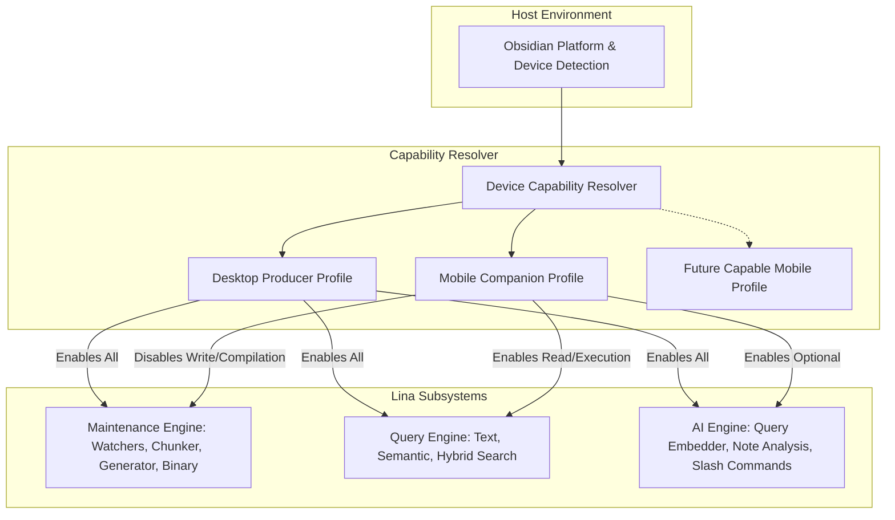
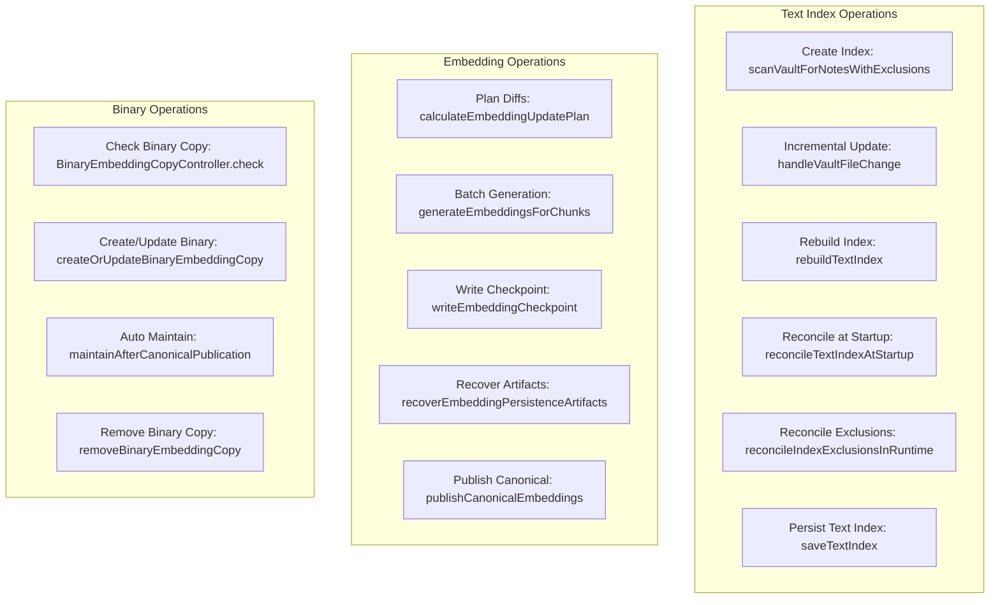
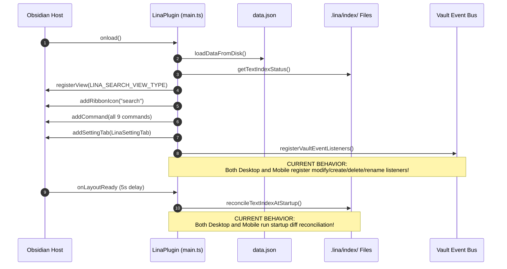
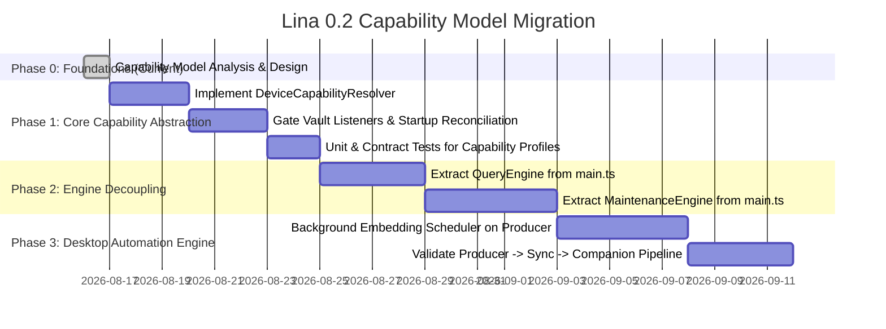

# Lina 0.2 — Device Capability Model Analysis

**Author:** Senior Software Architect & Senior Systems Analyst  
**Date:** August 16, 2026  
**Status:** Pre-Migration Capability Analysis (Phase 0 — Analysis Only)  
**Target Version:** Lina 0.2.x  
**Scope:** Platform detection inventory, maintenance operation mapping, mobile vs desktop behavior audit, settings categorization, risk assessment, and device capability model architecture.

---

## 1. Executive Summary

Lina 0.2 introduces a strategic architectural evolution: establishing a clean distinction between **Desktop Producer** and **Mobile Companion** within a single unified plugin codebase.

* **Desktop Producer:** The authoritative producer and maintainer of Lina's derived search assets (`.lina/index/manifest.json`, `notes.json`, `chunks.jsonl`, `embeddings.jsonl`, and binary vector copies).
* **Mobile Companion:** A fast, resource-constrained consumer that ingests synchronized search artifacts, executes local textual search, runs semantic/hybrid search when synchronized vectors allow, and accesses optional AI features without burdening mobile hardware with index compilation or heavy vector generation.
* **Core Architectural Principle:** Capability boundaries over hardcoded platform forks. Rather than hardcoding `if (Platform.isMobile) return;` across disparate modules, Lina should centralize device responsibilities into an explicit, testable **Device Capability Model**.



---

## 2. Current Platform Detection

### 2.1 Codebase Inventory of Platform Checks

A comprehensive search of the repository reveals that platform detection is currently scattered across multiple decoupled locations rather than centralized into a single capability authority:

| Location | Component / Function | Purpose | Scope |
| :--- | :--- | :--- | :--- |
| [`main.ts:655`](file:///d:/_dev/obsidian/lina/main.ts#L655) | `LinaPlugin.getRuntimeEmbeddingIndex()` | Selects memory profile (`"mobile"` vs `"desktop"`) when initializing `RuntimeEmbeddingIndexCache`. | Resource limits (controls max file sizes and memory buffers). |
| [`src/index/embeddingGenerator.ts:37`](file:///d:/_dev/obsidian/lina/src/index/embeddingGenerator.ts#L37) | `defaultEmbeddingResourceProfile()` | Provides fallback resource profile (`"mobile"` vs `"desktop"`) when reading canonical embedding records. | Resource limits (evaluates `evaluateEmbeddingBridgeRead`). |
| [`src/search/hybridSearch.ts:281`](file:///d:/_dev/obsidian/lina/src/search/hybridSearch.ts#L281) | `loadSearchableEmbeddings()` | Evaluates embedding bridge read size limit before loading embeddings into memory for hybrid search. | Runtime search safety guard. |
| [`src/search/semanticSearchModal.ts:43`](file:///d:/_dev/obsidian/lina/src/search/semanticSearchModal.ts#L43) | `SemanticSearchModal.onOpen()` | Checks file size against mobile resource profile before opening legacy semantic search modal. | UI / runtime guard. |
| [`src/settings.ts:220-245`](file:///d:/_dev/obsidian/lina/src/settings.ts#L220-L245) | `getCurrentDeviceSettingsId()` | Hashes `navigator.userAgent`, `language`, `hardwareConcurrency`, and `maxTouchPoints` to generate a device token (`device-${hash}`). | Per-device settings isolation in `data.json`. |

### 2.2 Critical Findings on Current Platform Detection

1. **CURRENT:** Platform detection is exclusively used for **resource limits** (e.g., maximum memory/file thresholds) and **device settings isolation**.
2. **CURRENT:** Platform detection is **NOT** used to disable vault event listeners, text index updates, startup reconciliation, or embedding generation commands.
3. **RISK:** Because `main.ts` does not check device capabilities before registering vault listeners, a mobile device currently registers the exact same event listeners as a desktop machine and will attempt to rebuild or update `notes.json` and `chunks.jsonl` when notes are edited on mobile.

---

## 3. Current Maintenance Operations

### 3.1 Exhaustive Mapping of Maintenance Operations



### 3.2 Operation Responsibility Matrix

| Subsystem | Operation | Trigger Location | Runs on Mobile Today? | 0.2 Target Assignment |
| :--- | :--- | :--- | :---: | :---: |
| **Index** | Full Scan & Create | [`main.ts:1211`](file:///d:/_dev/obsidian/lina/main.ts#L1211) (`rebuildTextIndex`) | **Yes** (if command run) | **Desktop Producer Only** |
| **Index** | Incremental Batch Update | [`main.ts:2040`](file:///d:/_dev/obsidian/lina/main.ts#L2040) (`processAutomaticIndexUpdateBatch`) | **Yes** (on vault events) | **Desktop Producer Only** |
| **Index** | Full Rebuild | [`main.ts:1176`](file:///d:/_dev/obsidian/lina/main.ts#L1176) (`rebuildTextIndex`) | **Yes** (if command run) | **Desktop Producer Only** (Advanced Diagnostic on Companion) |
| **Index** | Startup Reconciliation | [`main.ts:930`](file:///d:/_dev/obsidian/lina/main.ts#L930) (`reconcileTextIndexAtStartup`) | **Yes** (after 5s grace) | **Desktop Producer Only** |
| **Index** | Exclusion Policy Sync | [`main.ts:1076`](file:///d:/_dev/obsidian/lina/main.ts#L1076) (`reconcileIndexExclusionsInRuntime`) | **Yes** (on setting save) | **Desktop Producer Only** |
| **Index** | Atomic Disk Save | [`src/index/indexStore.ts:291`](file:///d:/_dev/obsidian/lina/src/index/indexStore.ts#L291) (`saveTextIndex`) | **Yes** | **Desktop Producer Only** |
| **Embeddings** | Diff Planning | [`src/index/embeddingUpdatePlan.ts:210`](file:///d:/_dev/obsidian/lina/src/index/embeddingUpdatePlan.ts#L210) | **Yes** (during generator) | **Desktop Producer Only** |
| **Embeddings** | Provider Validation | [`src/index/embeddingGenerator.ts:1612`](file:///d:/_dev/obsidian/lina/src/index/embeddingGenerator.ts#L1612) | **Yes** (during generator) | **Desktop Producer Only** |
| **Embeddings** | Batch Generation | [`src/index/embeddingGenerator.ts:474`](file:///d:/_dev/obsidian/lina/src/index/embeddingGenerator.ts#L474) | **Yes** (if command run) | **Desktop Producer Only** |
| **Embeddings** | Checkpoint Writing | [`src/index/embeddingPersistence.ts:562`](file:///d:/_dev/obsidian/lina/src/index/embeddingPersistence.ts#L562) | **Yes** (during generator) | **Desktop Producer Only** |
| **Embeddings** | Canonical Publish | [`src/index/embeddingPersistence.ts:703`](file:///d:/_dev/obsidian/lina/src/index/embeddingPersistence.ts#L703) | **Yes** (during generator) | **Desktop Producer Only** |
| **Binary** | Binary Check | [`src/index/embeddingBinaryCopyController.ts:45`](file:///d:/_dev/obsidian/lina/src/index/embeddingBinaryCopyController.ts#L45) | **Yes** | **Shared** (Producer verifies; Companion verifies integrity) |
| **Binary** | Create / Update Copy | [`src/index/embeddingBinaryCopyController.ts:67`](file:///d:/_dev/obsidian/lina/src/index/embeddingBinaryCopyController.ts#L67) | **Yes** (if triggered) | **Desktop Producer Only** |
| **Binary** | Post-Publish Maintain | [`src/index/embeddingBinaryCopyController.ts:70`](file:///d:/_dev/obsidian/lina/src/index/embeddingBinaryCopyController.ts#L70) | **Yes** (post-publish) | **Desktop Producer Only** |
| **Binary** | Remove Binary Copy | [`src/index/embeddingBinaryCopyController.ts:181`](file:///d:/_dev/obsidian/lina/src/index/embeddingBinaryCopyController.ts#L181) | **Yes** (if triggered) | **Shared** (Diagnostic / space cleanup) |

---

## 4. Current Mobile Behavior vs Desktop Behavior

### 4.1 Startup Flow Comparison (`onload`)



### 4.2 Detailed Flow Analysis

```text
Lifecycle Step             Desktop (Current)                   Mobile (Current)                    0.2 Target (Mobile Companion)
────────────────────────────────────────────────────────────────────────────────────────────────────────────────────────────────────
1. Settings Load           Loads data.json + Device Context    Loads data.json + Device Context    Loads data.json + Device Context
2. Index Status Read       Reads .lina/index/manifest.json     Reads .lina/index/manifest.json     Reads .lina/index/manifest.json
3. View Registration       Registers LinaSearchView            Registers LinaSearchView            Registers LinaSearchView
4. Commands Registered     All 9 Commands                      All 9 Commands                      Query & Diagnostic Commands only
5. Vault Event Listeners   Listens to create/modify/del/rename Listens to create/modify/del/rename **DISABLED (No-op)**
6. Startup Reconciliation  Diffs vault notes vs index          Diffs vault notes vs index          **DISABLED (Consumes sync only)**
7. Runtime Embedding Cache Uses Desktop Limits (64MB/96MB)     Uses Mobile Limits (16MB/24MB)      Uses Mobile Limits (16MB/24MB)
8. Search Execution        Text, Semantic, Hybrid Search       Text, Semantic, Hybrid Search       Text, Semantic, Hybrid Search
```

---

## 5. Vault Event Handling & Synchronization Risks

### 5.1 The Dual-Device Modification Race

```text
                  Desktop Producer                           Mobile Companion (Current Code)
                  ────────────────                           ───────────────────────────────
1. User edits Note A on Desktop                               User edits Note B on Mobile
2. Debouncer fires (2000ms)                                  Debouncer fires (2000ms)
3. Desktop indexes Note A                                     Mobile indexes Note B
4. Desktop writes notes.json & chunks.jsonl                   Mobile writes notes.json & chunks.jsonl
5. Desktop updates manifest.json (totalNotes: X)              Mobile updates manifest.json (totalNotes: Y)
                              \                                     /
                               \                                   /
                                ▼                                 ▼
                     External Synchronization Engine (Obsidian Sync / Syncthing)
                     ───────────────────────────────────────────────────────────
                     CONFLICT: Both devices simultaneously updated manifest.json,
                     notes.json, and chunks.jsonl.
                     Result: Sync conflict files generated, index marked "invalid",
                     search temporarily broken on both devices.
```

### 5.2 Findings on Vault Events
* **CURRENT:** When `settings.autoUpdateIndexOnFileChanges` is enabled globally, Mobile executes the full `processAutomaticIndexUpdateBatch` pipeline upon local edits.
* **RISK:** Bidirectional concurrent indexing creates immediate synchronization conflicts on `.lina/index/` files.
* **TARGET:** In Lina 0.2, Mobile Companion **must not register vault write listeners**. Local note edits on mobile remain in Markdown; Desktop Producer indexes them once synchronized to desktop.

---

## 6. Settings Analysis

### 6.1 Classification Matrix for Device Capabilities

```text
Setting Key                            Current Scope           0.2 Classification      Rationale
──────────────────────────────────────────────────────────────────────────────────────────────────────────────────────────
aiProvider                             Global / Per-Device     Keep                    Useful on both devices if user configures AI on mobile.
aiBaseUrl                              Global / Per-Device     Keep                    Device-specific endpoint (e.g., localhost on PC, LAN on phone).
aiApiKey                               Global / Per-Device     Keep                    Device-specific secret storage.
aiAnalysisModel                        Global / Per-Device     Keep                    Model choice for note analysis.
aiRequestTimeoutSeconds                Global / Per-Device     Keep                    Timeout configuration.
aiOutputLanguage                       Global                  Keep                    User language preference.
aiProfiles                             Global                  Keep                    Shared profile catalog.
embeddingsEnabled                      Global                  Desktop Only            Enables embedding generation pipeline (Producer role).
embeddingProvider                      Global / Per-Device     Keep                    Needed on desktop for generation; on mobile for query embed.
embeddingBaseUrl                       Global / Per-Device     Keep                    Endpoint for vector calculations.
embeddingApiKey                        Global / Per-Device     Keep                    Credential for vector provider.
embeddingModel                         Global / Per-Device     Keep                    Specifies model to ensure compatibility with index.
embeddingBatchSize                     Global / Per-Device     Desktop Only            Batch size for generation loop (irrelevant on Companion).
embeddingRequestTimeoutSeconds         Global / Per-Device     Keep                    Timeout for query-time single vector embed.
generateEmbeddingsOnStartup            Global                  Desktop Only            Automation trigger on Producer.
generateOnlyMissingEmbeddings          Global                  Desktop Only            Diffing policy for generation.
checkSyncOnStartup                     Global                  Keep                    Diagnostic status notification.
updateIndexOnStartup                   Global                  Desktop Only            Startup textual index compiler.
indexExcludedFolders                   Global                  Desktop Only            Defines producer indexing scope.
indexExcludedPathContains              Global                  Desktop Only            Defines producer indexing scope.
indexExcludedContentContains           Global                  Desktop Only            Defines producer indexing scope.
autoUpdateIndexOnFileChanges           Global                  Desktop Only            Vault watcher toggle on Producer.
debugIndexUpdates                      Global / Per-Device     Advanced Diagnostic     Technical troubleshooting logs.
hybridSearchTextWeight                 Global                  Keep                    Query scoring balance.
hybridSearchSemanticWeight             Global                  Keep                    Query scoring balance.
yamlSuggestionsEnabled                 Global                  Keep                    Note enrichment feature.
yamlAllowedProperties                  Global                  Keep                    Note enrichment feature.
yamlIncludeTags                        Global                  Keep                    Note enrichment feature.
maxSuggestedTags                       Global                  Keep                    Note enrichment feature.
interfaceLanguage                      Global                  Keep                    UI localization.
embeddingDefaultLanguage               Global                  Keep                    Prompt localization.
inboxFolderPath                        Global                  Keep                    Shared organization folder.
maxInboxNotesToAnalyze                 Global                  Keep                    Batch organization limit.
folderAnalysisMaxNotes                 Global                  Keep                    Folder analysis limit.
folderAnalysisIncludeSubfolders        Global                  Keep                    Folder analysis flag.
deviceSettingsById                     Global (Envelope)       Keep                    Underlying per-device storage model.
embeddingStorageReadPreference         Per-Device              Keep                    Allows mobile to choose prefer-binary or jsonl.
maintainBinaryEmbeddingCopy            Per-Device              Desktop Only            Governs binary compilation on Desktop.
```

---

## 7. Search Capability Analysis

### 7.1 Independence of Search Engines from Maintenance

An architectural inspection of the search engines confirms clean algorithmic independence:

```mermaid
flowchart LR
    subgraph Search Ingestion (Read-Only)
        M[manifest.json] --> ReadCheck[readTextIndexStatus]
        N[notes.json] --> ReadNotes[readIndexedNotes]
        C[chunks.jsonl] --> ReadChunks[readIndexedChunks]
        V[embeddings.vectors.f32 / .jsonl] --> Cache[RuntimeEmbeddingIndexCache]
    end

    subgraph Pure Query Engines
        ReadNotes & ReadChunks --> TextSearch[searchTextIndex]
        Cache --> SemSearch[searchRuntimeSemanticIndex]
        TextSearch & SemSearch --> Hybrid[runHybridSearch]
    end

    subgraph User Interface
        Hybrid --> View[LinaSearchView Results]
    end
```

### 7.2 Verification Findings
1. **Text Search (`searchTextIndex`):** 100% read-only in-memory search. Zero dependency on index generation, file watchers, or AI providers.
2. **Semantic Search (`searchRuntimeSemanticIndex`):** Ingests pre-computed vectors from memory (`Float32Array`). Only requires a provider if embedding a new query string.
3. **Hybrid Search (`runHybridSearch`):** Merges text and semantic ranks. If semantic vectors are missing or query embed fails, degrades to pure text search without crashing.
4. **Structural Decoupling Needed:** While the algorithms in `src/search/` are decoupled, `LinaSearchView` currently references `LinaPlugin` methods directly. In 0.2, this should connect through an explicit `QueryEngine` interface.

---

## 8. Identified Risks & Categorization

### 8.1 Confirmed Risks (Present in Code Today)
1. **Mobile Vault Listener Execution:** Mobile runs the exact same vault event batch pipeline as desktop, risking dual-writer index corruption during sync.
2. **Monolithic Startup Sequence:** `main.ts` executes `reconcileTextIndexAtStartup()` unconditionally on layout ready after 5 seconds, even on mobile devices.

### 8.2 Plausible Architectural Risks (Must Guard Against in 0.2)
1. **Stale Search Artifacts on Mobile:** If Desktop finishes indexing while Mobile is offline, Mobile searches against older synchronized files until sync completes. (*Mitigation:* Lina already compares manifest timestamps and displays non-intrusive status badges).
2. **Premature Binary Fallback:** If `embeddings.vectors.f32` is syncing while `manifest.json` has arrived, Mobile Companion might fall back to `embeddings.jsonl`. (*Mitigation:* Handled safely by `RuntimeEmbeddingIndexCache`, which falls back to JSONL or reports resource limit).
3. **Accidental Cloud API Spend on Mobile:** If automated maintenance is inadvertently triggered on mobile with a cellular data connection and paid API. (*Mitigation:* Mobile Companion disables all automated maintenance pipelines).

### 8.3 Already Solved Risks (Robust in Current Code)
1. **Corrupted File Ingestion:** `readTextIndexStatus`, `validateCheckpointPair`, and `validateCanonicalFiles` validate JSON shape, record counts, and checksums before declaring readiness.
2. **Memory Crashes on Mobile:** `MOBILE_EMBEDDING_BINARY_RESOURCE_LIMITS` (16MB vector / 8MB metadata / 64MB peak) and `evaluateEmbeddingBridgeRead` prevent loading large vector files on lower-powered devices.
3. **Partial Write Rollback:** `publishCanonicalEmbeddings` executes automatic atomic rollback from `.publish.backup` if a write fails.

---

## 9. Capability Model Proposal

### 9.1 Minimum Required Abstraction

Lina 0.2 should introduce an explicit, strongly typed **Capability Model** that governs subsystem activation:

```typescript
/**
 * Role of the device within the Lina mesh.
 */
export type DeviceRole = "producer" | "companion";

/**
 * Concrete capabilities resolved for the active host device.
 */
export interface DeviceCapabilities {
  readonly role: DeviceRole;

  // Maintenance Engine Capabilities (Desktop Producer)
  readonly canWatchVaultEvents: boolean;
  readonly canMaintainTextIndex: boolean;
  readonly canGenerateEmbeddings: boolean;
  readonly canMaintainBinaryCopy: boolean;
  readonly canReconcileStartupDiffs: boolean;

  // Query Engine Capabilities (Shared)
  readonly canReadArtifacts: boolean;
  readonly canExecuteTextSearch: boolean;
  readonly canExecuteSemanticSearch: boolean;
  readonly canExecuteHybridSearch: boolean;

  // AI Engine Capabilities (Shared / Optional)
  readonly canEmbedSearchQuery: boolean;
  readonly canExecuteAiAnalysis: boolean;

  // Resource & Execution Profile
  readonly resourceProfile: "desktop" | "mobile";
  readonly maxVectorFileBytes: number;
  readonly maxEstimatedPeakMemoryBytes: number;
}
```

### 9.2 Capability Resolution Logic

```typescript
export function resolveDeviceCapabilities(
  platform: { isMobile: boolean },
  settings: { customRoleOverride?: DeviceRole }
): DeviceCapabilities {
  const role: DeviceRole = settings.customRoleOverride ?? (platform.isMobile ? "companion" : "producer");
  const isProducer = role === "producer";
  const profile = platform.isMobile ? "mobile" : "desktop";

  return {
    role,

    // Maintenance is active ONLY on Producer
    canWatchVaultEvents: isProducer,
    canMaintainTextIndex: isProducer,
    canGenerateEmbeddings: isProducer,
    canMaintainBinaryCopy: isProducer,
    canReconcileStartupDiffs: isProducer,

    // Query engine is active on BOTH
    canReadArtifacts: true,
    canExecuteTextSearch: true,
    canExecuteSemanticSearch: true,
    canExecuteHybridSearch: true,

    // AI depends on device configuration, enabled on both
    canEmbedSearchQuery: true,
    canExecuteAiAnalysis: true,

    // Resource limits derived from physical platform
    resourceProfile: profile,
    maxVectorFileBytes: profile === "mobile" ? 16 * 1024 * 1024 : 64 * 1024 * 1024,
    maxEstimatedPeakMemoryBytes: profile === "mobile" ? 64 * 1024 * 1024 : 192 * 1024 * 1024,
  };
}
```

---

## 10. Recommended Migration Strategy



---

## 11. Files Potentially Affected in Future Implementation

*(For planning purposes only — no files modified during this analysis)*

1. [`main.ts`](file:///d:/_dev/obsidian/lina/main.ts): Gate `registerVaultEventListeners()` and `reconcileTextIndexAtStartup()` with `capabilities.canWatchVaultEvents` and `capabilities.canReconcileStartupDiffs`.
2. `src/capabilities/deviceCapabilities.ts` *(New target module)*: Pure capability definitions and resolver.
3. [`src/search/linaSearchView.ts`](file:///d:/_dev/obsidian/lina/src/search/linaSearchView.ts): Query `capabilities.canGenerateEmbeddings` to conditionally show/hide or adjust maintenance banners.
4. [`src/search/runtimeEmbeddingIndex.ts`](file:///d:/_dev/obsidian/lina/src/search/runtimeEmbeddingIndex.ts): Accept resolved `resourceProfile` from capability context.
5. [`src/settings.ts`](file:///d:/_dev/obsidian/lina/src/settings.ts) & `src/settings/*`: Future capability awareness for settings tabs (scheduled for post-engine stabilization).

---

## 12. Testing Strategy for Capability Model

Before introducing code changes, the test suite must be prepared to verify:
1. **Resolver Unit Tests:** Verify `resolveDeviceCapabilities` produces expected flags for desktop (`producer`), mobile (`companion`), and custom overrides.
2. **Listener Gating Tests:** Verify that on mobile (`companion`), `registerVaultEventListeners()` registers 0 event listeners and ignores vault events.
3. **Startup Gating Tests:** Verify that on mobile (`companion`), `completeAutomaticUpdatesStartup()` skips `reconcileTextIndexAtStartup()`.
4. **Search Parity Tests:** Verify that text, semantic, and hybrid search continue to function with 100% parity on companion nodes using synchronized test fixtures.

---

## 13. What Should NOT Change Yet

* **Do NOT modify production code or refactor `main.ts` yet.**
* **Do NOT change existing settings interfaces or `data.json` schemas.**
* **Do NOT redesign the Settings UI.**
* **Do NOT alter existing persistent artifact structures (`.lina/index/*`).**
* **Do NOT delete manual commands or recovery modals.**

---

## 14. Important Constraints

* **Single Plugin Artifact:** Desktop and Mobile run the exact same `main.js` bundle generated from `main.ts`.
* **Zero Mobile Maintenance Burden:** Mobile Companion should never write to `.lina/index/` files during normal operation.
* **Safe Degradation:** If synchronized vectors are missing on mobile, search degrades cleanly to textual matching without errors or blocking dialogs.

---

## 15. Architectural Conclusion & Stop Condition

This analysis establishes that Lina's existing indexing, planning, persistence, and search layers are structurally sound and ready for capability separation. The minimum required abstraction is a centralized `DeviceCapabilities` resolver that safely deactivates write watchers and compilation on Mobile Companion while preserving full local search and AI enrichment.

**Phase 0 Capability Analysis is COMPLETE. Awaiting user review before implementation planning.**
