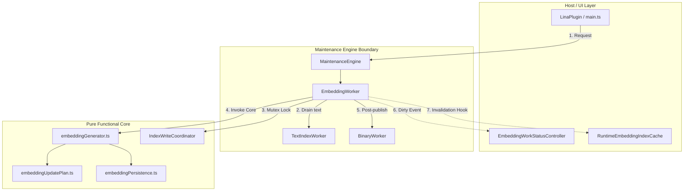

# Lina 0.2 — Phase 1.9 EmbeddingWorker Boundary Assessment

**Status:** Architectural Assessment & Migration Readiness Analysis  
**Role:** Senior Software Architect & Senior Systems Analyst  
**Scope:** Deep-dive analysis of current embedding generation orchestration in [`main.ts`](file:///d:/_dev/obsidian/lina/main.ts), component boundaries, port extraction requirements, safety invariants, and safe migration sequence into [`EmbeddingWorker`](file:///d:/_dev/obsidian/lina/src/maintenance/embeddingWorker.ts).

---

## 1. Executive Summary

Lina 0.2 has successfully introduced the **`MaintenanceEngine`** coordinator and specialized workers ([`TextIndexWorker`](file:///d:/_dev/obsidian/lina/src/maintenance/textIndexWorker.ts), [`ReconciliationWorker`](file:///d:/_dev/obsidian/lina/src/maintenance/reconciliationWorker.ts), and [`BinaryWorker`](file:///d:/_dev/obsidian/lina/src/maintenance/binaryWorker.ts)), alongside the **`EmbeddingWorker` architectural foundation** ([`src/maintenance/embeddingWorker.ts`](file:///d:/_dev/obsidian/lina/src/maintenance/embeddingWorker.ts)).

Currently, the concrete embedding generation pipeline remains orchestrated directly inside [`LinaPlugin` in `main.ts`](file:///d:/_dev/obsidian/lina/main.ts#L844) (`requestEmbeddingIndexGeneration` and `runGenerateLocalEmbeddings`), where it coordinates across [`EmbeddingOperationManager`](file:///d:/_dev/obsidian/lina/src/index/embeddingOperationManager.ts), [`IndexWriteCoordinator`](file:///d:/_dev/obsidian/lina/src/index/indexWriteCoordinator.ts), [`TextIndexWorker`](file:///d:/_dev/obsidian/lina/src/maintenance/textIndexWorker.ts), and [`BinaryWorker`](file:///d:/_dev/obsidian/lina/src/maintenance/binaryWorker.ts).

### Key Assessment Findings
1. **Core Algorithms are Already Isolated:**  
   The heavy mathematical, diff planning, network, and storage logic in [`embeddingGenerator.ts`](file:///d:/_dev/obsidian/lina/src/index/embeddingGenerator.ts), [`embeddingUpdatePlan.ts`](file:///d:/_dev/obsidian/lina/src/index/embeddingUpdatePlan.ts), and [`embeddingPersistence.ts`](file:///d:/_dev/obsidian/lina/src/index/embeddingPersistence.ts) is strictly pure and stateless. These modules require **zero refactoring** and must remain independent.
2. **`main.ts` Contains Orchestration, Not Implementation:**  
   The ~180 lines across `requestEmbeddingIndexGeneration` and `runGenerateLocalEmbeddings` perform pure flow coordination (gating, mutex reservation, text draining, progress callback dispatch, dirty flagging, and binary handoff).
3. **Migration Readiness Verdict: `NEEDS PREPARATION (Port Extraction)`:**  
   Direct cutover without an explicit port-based dependency injection contract (`EmbeddingWorkerOptions`) would risk dragging Obsidian `App`, `LinaPlugin`, and direct UI strings into `EmbeddingWorker`. A clean, port-based adapter boundary must be defined first to preserve unit testability and strict architectural decoupling.

---

## 2. Current Embedding Architecture & Workflow

The current embedding execution flow is initiated manually (via command palette, sidebar buttons, or status modal) and executes in a strictly sequential, fault-tolerant sequence:

```text
┌──────────────────────────────────────────────────────────────────────────────────────────────────┐
│                                 CURRENT EMBEDDING GENERATION FLOW                                │
├──────────────────────────────────────────────────────────────────────────────────────────────────┤
│                                                                                                  │
│ 1. TRIGGER & GATING                                                                              │
│    User Command / Sidebar ──► LinaPlugin.requestEmbeddingIndexGeneration(origin, onProgress)     │
│    ├─ Check DeviceCapabilities.canGenerateEmbeddings (rejection on Mobile Companion)             │
│    ├─ Check textIndexRebuildProgress !== "running"                                               │
│    └─ Check EmbeddingOperationManager.getState() !== "running"                                   │
│                                                                                                  │
│ 2. PREPARATION & COORDINATION                                                                    │
│    ├─ IndexWriteCoordinator.requestEmbeddingGenerationPreparation()                              │
│    ├─ EmbeddingOperationManager.request(origin, async (operation) => ...)                       │
│    ├─ operation.setPhase("preparing")                                                            │
│    ├─ operation.setPhase("waiting-for-text-index")                                               │
│    ├─ TextIndexWorker.drainAutomaticUpdatesBeforeEmbeddingGeneration(signal)                    │
│    └─ IndexWriteCoordinator.startEmbeddingGeneration() (acquires exclusive generation token)     │
│                                                                                                  │
│ 3. EXECUTION (runGenerateLocalEmbeddings)                                                        │
│    ├─ readIndexedChunks(this.app) & filterChunksByUserContentRules()                             │
│    ├─ getEffectiveEmbeddingConfig() (resolves provider, model, baseUrl, apiKey, batchSize)       │
│    ├─ Pre-flight Provider Validation Probe (tests 1–3 chunks against Ollama / Mistral)          │
│    ├─ Diff Plan Calculation: calculateEmbeddingUpdatePlan(chunks, existingEmbeddings)           │
│    ├─ Sequential Batch Generation Loop (1–50 chunks per batch, timeout handling)                 │
│    └─ Incremental Checkpoint Writing: writeEmbeddingCheckpoint() per batch                       │
│                                                                                                  │
│ 4. PERSISTENCE & PUBLICATION                                                                     │
│    ├─ Atomic Canonical Publication: publishCanonicalEmbeddings() (.jsonl.tmp ──► .jsonl)         │
│    ├─ Manifest Update: updates manifest.json with new canonical publicationId                    │
│    └─ Checkpoint Cleanup: deletes embeddings.checkpoint.jsonl upon successful commit             │
│                                                                                                  │
│ 5. POST-PUBLICATION & HANDOFF                                                                    │
│    ├─ Release generation token: IndexWriteCoordinator.finish(generationToken)                    │
│    ├─ Runtime Invalidation: LinaPlugin.invalidateRuntimeEmbeddingIndex("canonical-published")    │
│    ├─ Status Dirty Signal: LinaPlugin.markEmbeddingWorkStatusDirty("embeddings-published")      │
│    └─ Downstream Binary Compilation: BinaryWorker.maintainAfterPublication(publicationId)        │
│                                                                                                  │
└──────────────────────────────────────────────────────────────────────────────────────────────────┘
```

### Orchestration Classification

| Workflow Step | Location in Codebase | Architectural Domain | Migration Action |
| :--- | :--- | :--- | :--- |
| **Capability Check** | `main.ts:848` | Gating | Move to `EmbeddingWorker.start()` / `request()` |
| **Mutex Reservation** | `main.ts:870, 903` | Concurrency Coordination | Move to `EmbeddingWorker` via injected coordinator |
| **Text Drain** | `main.ts:894` | Inter-Worker Pipeline | Move to `EmbeddingWorker` via `MaintenanceEngine` |
| **Operation State Machine** | `embeddingOperationManager.ts` | Lifecycle / State | Encapsulate inside `EmbeddingWorker` |
| **Config Resolution** | `main.ts:1500` | Host Settings / Credentials | Keep in Host; inject via `getEffectiveConfig()` port |
| **Content Filtering** | `main.ts:1710` | User Exclusion Rules | Keep in Host; inject via `filterChunks()` port |
| **Chunk Reading** | `indexStore.ts` | Vault I/O | Keep independent; inject via `readChunks()` port |
| **Batch Vector Generation** | `embeddingGenerator.ts` | Stateless Core Math/API | Keep independent; invoke from worker |
| **Diff Planning** | `embeddingUpdatePlan.ts` | Stateless Core Logic | Keep independent; invoke from generator |
| **Checkpoint & Commit** | `embeddingPersistence.ts` | Storage I/O & Recovery | Keep independent; invoke from generator |
| **Binary Handoff** | `main.ts:930` | Inter-Worker Pipeline | Move to `EmbeddingWorker` via `MaintenanceEngine` |
| **Runtime Cache Invalidation**| `main.ts:1787` | Query Engine Cache | Keep in Host; trigger via `onPublicationReady` hook |

---

## 3. `main.ts` Coupling Analysis

### 3.1 Responsibilities Inside `main.ts`

Lines 840–940 and 1676–1819 in [`main.ts`](file:///d:/_dev/obsidian/lina/main.ts) contain the following responsibilities:

1. **`requestEmbeddingIndexGeneration(origin, onProgress)` (`main.ts:844–941`):**
   - Direct capability checking (`getDeviceCapabilities().canGenerateEmbeddings`).
   - Checking busy flags on `textIndexRebuildProgress`.
   - Acquiring preparation and generation locks on `IndexWriteCoordinator`.
   - Managing `EmbeddingOperationManager` state machine and cancellation tokens.
   - Coordinating the await on `drainAutomaticUpdatesBeforeEmbeddingGeneration`.
   - Scoping `generationToken` cleanup in `finally` blocks.
   - Triggering `startAutomaticBinaryEmbeddingMaintenance(publicationId)`.
2. **`runGenerateLocalEmbeddings(...)` (`main.ts:1676–1819`):**
   - Reading indexed chunks via `readIndexedChunks(this.app)`.
   - Applying exclusion filters via `filterChunksByUserContentRules()`.
   - Resolving provider configurations via `getEffectiveEmbeddingConfig()`.
   - Dispatching progress strings to UI handlers and progress modals.
   - Invoking `generateEmbeddingsForChunks(...)`.
   - Handling diagnostic events (`publication`, `checkpoint`, `rollback`, `recovery`).
   - Firing dirty events (`markEmbeddingWorkStatusDirty`) and cache invalidations (`invalidateRuntimeEmbeddingIndex`).
   - Formatting localized failure notices via `buildEmbeddingGenerationFailureMessage()`.
3. **`cancelActiveEmbeddingOperation()` (`main.ts:840–842`):**
   - Directly cancels the active operation in `EmbeddingOperationManager`.

### 3.2 Hidden Assumptions and Coupling Risks

```text
┌──────────────────────────────────────────────────────────────────────────────────────────────────┐
│                                 COUPLING & HIDDEN ASSUMPTIONS                                    │
├───────────────────────────────┬──────────────────────────────────────────────────────────────────┤
│ HIDDEN COUPLING               │ RISK IF MIGRATED DIRECTLY WITHOUT PORTS                          │
├───────────────────────────────┼──────────────────────────────────────────────────────────────────┤
│ Direct `this.app` access      │ EmbeddingWorker becomes coupled to Obsidian desktop runtime,     │
│                               │ preventing lightweight isolated unit testing.                    │
├───────────────────────────────┼──────────────────────────────────────────────────────────────────┤
│ Direct `this.settings` access │ Exposes volatile global settings schema directly to worker;     │
│                               │ bypasses device-scoped credential/provider overrides.            │
├───────────────────────────────┼──────────────────────────────────────────────────────────────────┤
│ Direct `this.L` localization  │ Worker becomes dependent on host locale switching instead of     │
│                               │ receiving clean, structured error categories.                    │
├───────────────────────────────┼──────────────────────────────────────────────────────────────────┤
│ Direct cache invalidation     │ Tightly couples Maintenance Engine to Query Engine caches        │
│                               │ (`RuntimeEmbeddingIndexCache`).                                  │
└───────────────────────────────┴──────────────────────────────────────────────────────────────────┘
```

### 3.3 Responsibility Classification

```text
┌───────────────────────────────────────────────┬──────────────────────────────────────────────────┐
│ MOVE TO EmbeddingWorker                       │ KEEP OUTSIDE (In LinaPlugin / Host Adapters)     │
├───────────────────────────────────────────────┼──────────────────────────────────────────────────┤
│ • Operation lifecycle state machine           │ • Obsidian Vault File I/O (`App.vault`)          │
│ • Single-flight concurrency gating            │ • Raw settings persistence (`LinaSettings`)      │
│ • Mutex token coordination (IndexWriteCoord)  │ • Runtime search index cache invalidation        │
│ • Text update draining coordination           │ • UI Modal / Toast rendering                     │
│ • Batch execution loop supervision            │ • Reactive UI status view model calculations     │
│ • Downstream BinaryWorker trigger             │ • Locale string management                       │
│ • Checkpoint / rollback event handling        │ • Global event bus dispatching                   │
└───────────────────────────────────────────────┴──────────────────────────────────────────────────┘
```

---

## 4. Existing Component Boundaries



### Component Analysis Table

| Component | Current Role | Ownership Decision | Architectural Rationale |
| :--- | :--- | :--- | :--- |
| **`EmbeddingOperationManager`** | Single-flight queue & abort management | **Internalized by `EmbeddingWorker`** | The operation state machine (`idle`, `running`, `cancelling`, etc.) represents the intrinsic state of embedding maintenance. Internalizing it eliminates dual-state divergence. |
| **`EmbeddingWorkStatusController`** | Read-only reactive status & diff preview for UI | **Remains Independent** | Used predominantly by UI views (sidebar, settings, modals) to compute previews without running operations. Notified by `EmbeddingWorker` via injected `onDirty` port. |
| **`embeddingGenerator.ts`** | Pure vector generation, batching, and provider probe | **Remains Independent (Stateless)** | Functional core; zero internal state. Easily called by worker or test harnesses. |
| **`embeddingUpdatePlan.ts`** | Chunk hash diff calculation | **Remains Independent (Stateless)** | Pure functional comparison between chunk records and existing embeddings. |
| **`embeddingPersistence.ts`** | Atomic file writes, checkpoints, and rollback | **Remains Independent (Storage)** | Low-level storage and JSONL streaming layer. |
| **`IndexWriteCoordinator`** | Concurrency mutex between text & vector writers | **Remains Independent (Coordination)** | Shared cross-subsystem mutex; injected into workers as a port. |
| **`TextIndexWorker`** | Vault event debouncing and text chunk persistence | **Remains Independent (Peer Worker)** | Upstream peer in `MaintenanceEngine`. |
| **`BinaryWorker`** | Compiles and validates `Float32Array` binary vectors | **Remains Independent (Peer Worker)** | Downstream peer in `MaintenanceEngine`. |

---

## 5. Migration Readiness Assessment

### Overall Verdict: `NEEDS PREPARATION (Port Extraction)`

The code is **architecturally mature and robust**, but requires a formal port-based interface before execution logic is moved into `EmbeddingWorker`.

```text
┌──────────────────────────────────────────────────────────────────────────────────────────────────┐
│                                   MIGRATION READINESS MATRIX                                     │
├───────────────────────┬──────────────────────┬───────────────────────────────────────────────────┤
│ SUBSYSTEM             │ CLASSIFICATION       │ READINESS DETAILS                                 │
├───────────────────────┼──────────────────────┼───────────────────────────────────────────────────┤
│ Functional Core       │ READY                │ `embeddingGenerator.ts`, `embeddingUpdatePlan.ts`,│
│                       │                      │ and `embeddingPersistence.ts` are pure & tested.  │
├───────────────────────┼──────────────────────┼───────────────────────────────────────────────────┤
│ Foundation Shell      │ READY                │ `EmbeddingWorker` exists, tracks lifecycle, and   │
│                       │                      │ enforces `canGenerateEmbeddings` capability.      │
├───────────────────────┼──────────────────────┼───────────────────────────────────────────────────┤
│ Inter-Worker Pipeline │ READY                │ `TextIndexWorker.drain` and `BinaryWorker.sync`   │
│                       │                      │ are already exposed via `MaintenanceEngine`.      │
├───────────────────────┼──────────────────────┼───────────────────────────────────────────────────┤
│ Worker Dependency Port│ NEEDS PREPARATION    │ Must define `EmbeddingWorkerOptions` to inject    │
│                       │                      │ config, vault readers, mutex, and event hooks.    │
├───────────────────────┼──────────────────────┼───────────────────────────────────────────────────┤
│ Test Harness Bridges  │ NEEDS PREPARATION    │ Existing integration tests call `main.ts` methods │
│                       │                      │ directly; requires delegation wrapper in plugin.  │
├───────────────────────┼──────────────────────┼───────────────────────────────────────────────────┤
│ Search Querying & I/O │ SHOULD NOT MOVE      │ Query execution and physical filesystem adapters  │
│                       │                      │ must remain outside the maintenance worker.       │
└───────────────────────┴──────────────────────┴───────────────────────────────────────────────────┘
```

---

## 6. Safety Analysis

### 6.1 API Safety & Cost Protection
- **Single-Flight Concurrency:** Gated at worker entry (`state.status === "running"` returns `already-running`). Only one embedding generation can run at any time across the entire plugin.
- **Incremental Diff Planning:** `calculateEmbeddingUpdatePlan` checks text hashes, models, and dimensions before calling AI providers, preventing re-embedding unmodified chunks.
- **Validation Probes:** Runs 1–3 chunks against the provider before launching full batch loops, catching invalid API keys, down servers, or missing models instantly without wasting API quota.
- **Explicit Cancellation:** Propagates standard `AbortSignal` through all HTTP requests and batch loops.

### 6.2 Data Integrity & Atomicity
- **Atomic Canonical Publication:** Canonical `embeddings.jsonl` is written to a temporary file (`.tmp`) and atomically renamed. The canonical `publicationId` in `manifest.json` is updated only after write confirmation.
- **Content Rule Validation:** Excludes notes matching path or term exclusion rules before chunk processing begins.
- **Isolated Binary Generation:** Downstream `BinaryWorker` compiles derived `embeddings.vectors.f32` in a separate step after canonical publication completes, ensuring canonical JSONL is never corrupted by binary compilation failures.

### 6.3 Fault Recovery & Rollback
- **Sequential Batch Checkpointing:** Checkpoints (`embeddings.checkpoint.jsonl`) are committed after every batch. If Obsidian is closed or crashes mid-operation, the next run automatically resumes from the last completed batch.
- **Automatic Rollback:** If canonical publication fails, previous canonical files are restored and the failure is recorded without leaving corrupted temporary files.

### 6.4 Multi-Device Synchronization
- **Desktop Producer Exclusive:** Embedding maintenance is active **only** when `DeviceCapabilities.canGenerateEmbeddings === true`.
- **Mobile Companion Immunity:** Mobile devices never run `EmbeddingWorker`, never call remote embedding APIs, and never write vector files, eliminating split-brain conflicts during Syncthing/Obsidian Sync cycles.

---

## 7. Required Architectural Boundary: `EmbeddingWorkerOptions`

To execute the migration cleanly, `EmbeddingWorker` must accept an explicit dependency injection contract:

```typescript
export interface EmbeddingWorkerOptions {
  readonly capabilities: DeviceCapabilities;
  
  // Configuration & Gating
  readonly getEffectiveConfig: () => EffectiveEmbeddingConfig;
  readonly isTextIndexBusy: () => boolean;
  
  // Data Source & Content Filtering
  readonly readChunks: () => Promise<ChunkRecord[] | null>;
  readonly filterChunks: (chunks: ChunkRecord[]) => ChunkRecord[];
  readonly isContentExcluded: (content: string) => boolean;
  
  // Inter-Worker Coordination
  readonly drainTextIndex: (signal?: AbortSignal) => Promise<boolean>;
  readonly scheduleTextIndexFlush: () => void;
  readonly maintainBinaryAfterPublication: (publicationId?: string) => void;
  
  // Mutex Token Coordinator
  readonly coordinator: {
    requestPreparation: () => IndexWriteCoordinatorResult;
    startGeneration: () => IndexWriteCoordinatorResult;
    finish: (token: IndexWriteCoordinatorToken) => void;
    cancelPreparation: () => void;
  };
  
  // Events & Notifications
  readonly onPublicationReady: (reason: "canonical-published" | "canonical-recovered") => void;
  readonly onRollbackCompleted: () => void;
  readonly onDirty: (reason: EmbeddingWorkInvalidationReason) => void;
  readonly onDiagnostic?: (message: string, details: object) => void;
  
  // Localized Status Messages
  readonly messages: {
    readonly preparing: string;
    readonly waitingForTextIndex: string;
    readonly validatingProvider: string;
    readonly generating: string;
    readonly persisting: string;
    readonly cancelled: string;
    readonly textIndexBusy: string;
    readonly generalError: string;
  };
}
```

---

## 8. Recommended Migration Sequence

```text
┌──────────────────────────────────────────────────────────────────────────────────────────────────┐
│                                   SAFE 5-PHASE MIGRATION PLAN                                    │
├──────────────────────────────────────────────────────────────────────────────────────────────────┤
│                                                                                                  │
│ Phase 1: Define Port Contract & Worker State Machine                                             │
│ ├─ Define `EmbeddingWorkerOptions` interface in `src/maintenance/embeddingWorker.ts`.            │
│ └─ Internalize `EmbeddingOperationManager` state machine and cancellation tokens into worker.    │
│                                                                                                  │
│ Phase 2: Implement Worker Orchestration Logic                                                    │
│ ├─ Implement `EmbeddingWorker.requestGeneration(origin, onProgress)` using injected ports.       │
│ ├─ Implement pre-flight checks, mutex reservation, text draining, and generation loop execution. │
│ └─ Implement checkpoint tracking, rollback handling, and post-publication BinaryWorker handoff.  │
│                                                                                                  │
│ Phase 3: Wire Ports in MaintenanceEngine & LinaPlugin                                            │
│ ├─ Instantiate `EmbeddingWorker` with full port mappings in `main.ts:getMainMaintenanceEngine()`. │
│ └─ Expose `MaintenanceEngine.getEmbeddingWorker()` for external consumers.                      │
│                                                                                                  │
│ Phase 4: Delegate Plugin Entry Points                                                            │
│ ├─ Refactor `LinaPlugin.requestEmbeddingIndexGeneration` to delegate to `EmbeddingWorker`.      │
│ ├─ Refactor `LinaPlugin.cancelActiveEmbeddingOperation` to delegate to `EmbeddingWorker`.       │
│ └─ Remove legacy `runGenerateLocalEmbeddings` from `main.ts`.                                    │
│                                                                                                  │
│ Phase 5: Verification & Architectural Documentation                                              │
│ ├─ Run full test suite (59 files / 757+ tests green).                                            │
│ └─ Update architecture documentation reflecting completed execution migration.                   │
│                                                                                                  │
└──────────────────────────────────────────────────────────────────────────────────────────────────┘
```

---

## 9. What Should Remain Unchanged

The following components and contracts must remain strictly unmodified throughout the migration:

1. **Pure Core Modules:**  
   [`embeddingGenerator.ts`](file:///d:/_dev/obsidian/lina/src/index/embeddingGenerator.ts), [`embeddingUpdatePlan.ts`](file:///d:/_dev/obsidian/lina/src/index/embeddingUpdatePlan.ts), and [`embeddingPersistence.ts`](file:///d:/_dev/obsidian/lina/src/index/embeddingPersistence.ts) remain completely unchanged.
2. **AI Provider Implementations:**  
   [`ollamaProvider.ts`](file:///d:/_dev/obsidian/lina/src/ai/ollamaProvider.ts) and [`mistralProvider.ts`](file:///d:/_dev/obsidian/lina/src/ai/mistralProvider.ts) retain their exact interface contracts.
3. **On-Disk File Formats & Schemas:**  
   `.lina/index/manifest.json`, `notes.json`, `chunks.jsonl`, `embeddings.jsonl`, `embeddings.checkpoint.jsonl`, and `embeddings.vectors.f32` remain strictly byte- and schema-compatible.
4. **Query Engine & Search Execution:**  
   `TextSearchEngine`, `SemanticSearch`, `HybridSearch`, and `RuntimeEmbeddingIndexCache` remain read-only and decoupled from maintenance lifecycles.
5. **Mobile Companion Isolation:**  
   Mobile devices continue to bypass all maintenance worker lifecycles with zero write operations or API calls.
