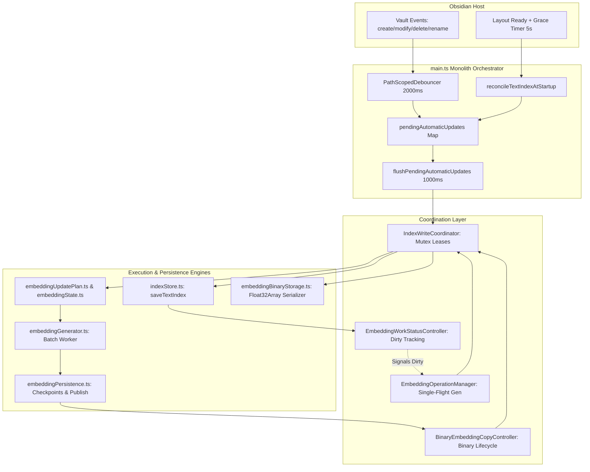
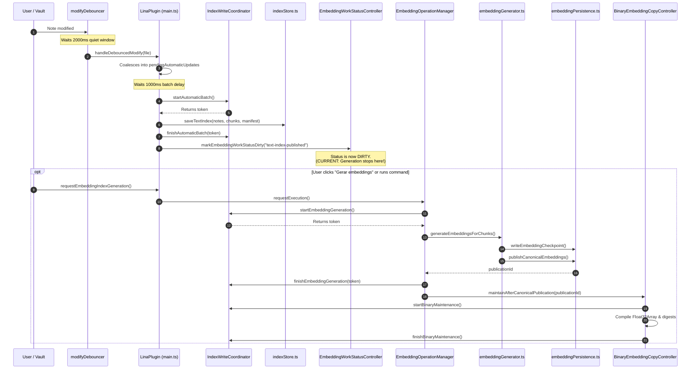
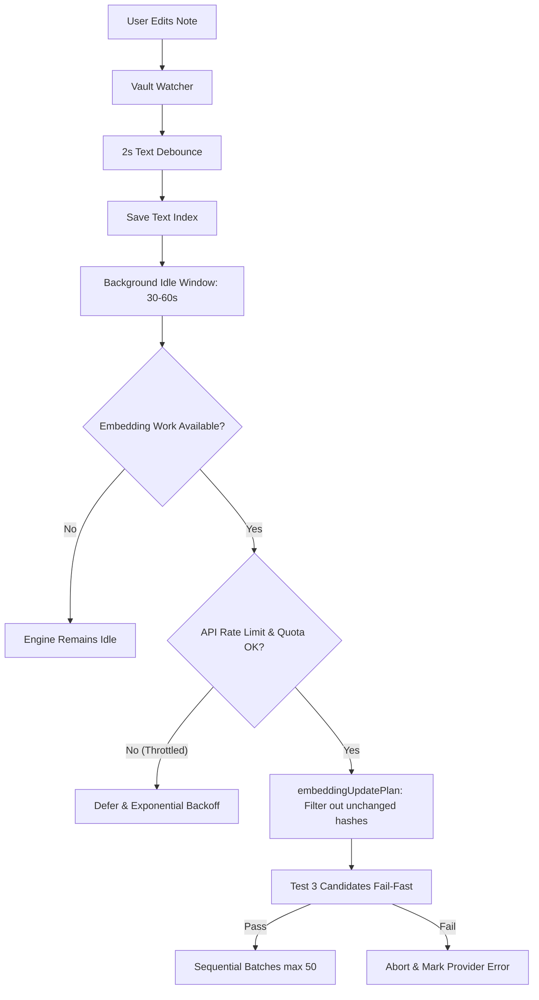
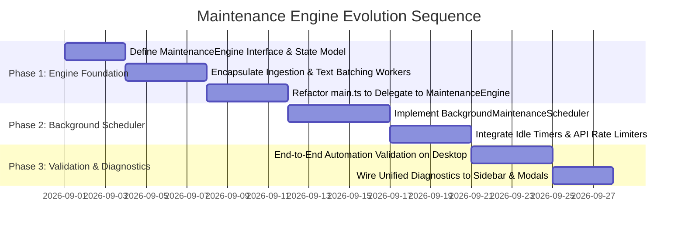

# Lina 0.2 — Phase 1.1 Maintenance Engine Architecture Analysis

**Author:** Senior Software Architect & Senior Systems Analyst  
**Date:** August 16, 2026  
**Status:** Pre-Implementation Architectural Analysis (Phase 1.1 — Analysis Only)  
**Target Version:** Lina 0.2.x  
**Scope:** Maintenance subsystem inventory, execution flows, coordination mechanisms, `main.ts` responsibility decomposition, state models, API cost controls, and the Maintenance Engine target architecture.

---

## 1. Executive Summary

Lina 0.2 introduces an architectural transition from disparate, manually triggered maintenance operations to a unified, autonomous **Maintenance Engine** operating on the **Desktop Producer**.

```text
Vault File Changes (create / modify / delete / rename)
                       │
                       ▼
         ┌───────────────────────────┐
         │    MAINTENANCE ENGINE     │
         │   (Desktop Producer Only) │
         └─────────────┬─────────────┘
                       │
         ┌─────────────┼─────────────┬─────────────┐
         ▼             ▼             ▼             ▼
    Text Index    Embedding Diff    Binary Set   Composite State
    Maintenance    & Generator     Compilation    Publication
```

### Strategic Objectives
1. **Unify Fragmented Maintenance Subsystems:** Replace the ad-hoc coordination currently split between `main.ts`, `IndexWriteCoordinator`, `EmbeddingOperationManager`, `EmbeddingWorkStatusController`, and `BinaryEmbeddingCopyController` with a single cohesive lifecycle engine.
2. **Autonomous Background Pipeline:** Transition from requiring manual clicks on *"Rebuild Index"* or *"Generate Embeddings"* to a conservative, background-driven pipeline with debouncing, idle detection, rate limiting, and failure containment.
3. **Decouple Maintenance from Query:** Ensure the read-only Query Engine (used by both Desktop Producer and Mobile Companion) remains completely isolated from maintenance write locks, disk serialization, and network API operations.

---

## 2. Current Maintenance Architecture

### 2.1 Architectural Component Map



### 2.2 Findings on Current Architecture
* **CURRENT:** The coordination of text updates, embedding dirty tracking, generator loops, and binary serialization is fragmented across **four separate controllers**, with `main.ts` acting as the manual glue.
* **RISK:** Because `main.ts` directly glues these controllers, error handling, token release, and state transitions are vulnerable to edge-case deadlocks if an unhandled exception bypasses a token cleanup block.
* **TARGET:** A cohesive `MaintenanceEngine` that encapsulates the write coordinator, event debouncer, update queue, text worker, embedding worker, and binary compiler behind a single lifecycle interface.

---

## 3. Existing Maintenance Components

### 3.1 Detailed Component Inventory

| Component / Class | File Location | Core Responsibility | Inputs | Outputs | Lifecycle | 0.2 Maintenance Engine Role |
| :--- | :--- | :--- | :--- | :--- | :--- | :--- |
| **`IndexWriteCoordinator`** | [`src/index/indexWriteCoordinator.ts`](file:///d:/_dev/obsidian/lina/src/index/indexWriteCoordinator.ts) | State machine enforcing mutual exclusion across 4 write operations (`text-rebuild`, `text-automatic-batch`, `embedding-generation`, `binary-maintenance`). | Reservation & token requests. | Leased `IndexWriteCoordinatorToken` or rejection status. | Instantiated in `main.ts.onload()`; disposed in `onunload()`. | **Core Sub-component:** Retained as internal mutex engine inside `MaintenanceEngine`. |
| **`PathScopedDebouncer` & Coalescers** | [`src/index/automaticUpdateEvents.ts`](file:///d:/_dev/obsidian/lina/src/index/automaticUpdateEvents.ts) | Debounces file modify events per-path (2000ms); coalesces rapid create/rename/delete transitions. | Vault file events (`TFile`, path strings). | Coalesced `AutomaticUpdateEvent` candidates. | Created in `registerVaultEventListeners()`; cancelled in `cleanup()`. | **Ingestion Sub-component:** Ingestion front-end for the `MaintenanceEngine`. |
| **`EmbeddingOperationManager`** | [`src/index/embeddingOperationManager.ts`](file:///d:/_dev/obsidian/lina/src/index/embeddingOperationManager.ts) | Manages single-flight execution, progress reporting, and cooperative cancellation (`AbortController`) for vector generation. | Run generator callback; cancel signals. | Subscribable `EmbeddingOperationState`, progress metrics, completion promises. | Singleton lifecycle managed in `main.ts`. | **Worker Manager:** Headless worker controller for vector batch execution. |
| **`EmbeddingWorkStatusController`** | [`src/index/embeddingWorkStatusController.ts`](file:///d:/_dev/obsidian/lina/src/index/embeddingWorkStatusController.ts) | Tracks dirty flags and calculates lazy diff previews (missing, stale, obsolete chunk counts) without generating vectors. | Invalidation triggers (`"text-index-published"`, etc.); `refreshSummary` callback. | Subscribable `EmbeddingWorkRuntimeState`. | Instantiated in `main.ts`; refreshed on subscriber demand. | **Trigger Sensor:** Feeds dirty state into the background maintenance scheduler. |
| **`BinaryEmbeddingCopyController`** | [`src/index/embeddingBinaryCopyController.ts`](file:///d:/_dev/obsidian/lina/src/index/embeddingBinaryCopyController.ts) | Coordinates serialization of canonical JSONL embeddings into `Float32Array` binary files after publication. | `publicationId`, canonical `embeddings.jsonl`. | `BinaryEmbeddingManifestV1`, `.f32` vectors, `.meta.jsonl`. | Instantiated in `main.ts`. | **Post-Publication Worker:** Automatic derived artifact compiler. |
| **`TextIndexStore`** | [`src/index/indexStore.ts`](file:///d:/_dev/obsidian/lina/src/index/indexStore.ts) | Handles scanning, chunking, hash validation, and atomic multi-file persistence (`notes.json`, `chunks.jsonl`, `manifest.json`). | In-memory notes/chunks arrays, exclusions. | Persisted files on disk via `.tmp-*` $\to$ `.bak-*` rename dance. | Stateless functional store module. | **Persistence Layer:** Retained as atomic disk I/O layer. |
| **`EmbeddingPersistence`** | [`src/index/embeddingPersistence.ts`](file:///d:/_dev/obsidian/lina/src/index/embeddingPersistence.ts) | Checkpointing (`embeddings.checkpoint.jsonl`), atomic publication with backup rollback, and startup crash recovery. | Vector batches, target identity metadata. | Canonical `embeddings.jsonl`, checkpoint metadata. | Functional persistence library with crash recovery. | **Persistence Layer:** Retained as vector publication/recovery layer. |
| **`EmbeddingBinaryStorage`** | [`src/index/embeddingBinaryStorage.ts`](file:///d:/_dev/obsidian/lina/src/index/embeddingBinaryStorage.ts) | Low-level binary file writer with buffer digests (SHA-256) and resource limits. | Raw vector arrays, metadata. | `embeddings.vectors.f32`, `embeddings.meta.jsonl`. | Functional persistence module. | **Persistence Layer:** Retained as raw binary storage engine. |

---

## 4. Current Data Lifecycle

### 4.1 Detailed Flow Matrix

```text
Operation Trigger        Decision Point                          Queue Location                 Execution Worker              Persistence Target
──────────────────────────────────────────────────────────────────────────────────────────────────────────────────────────────────────────────────────────
Note Creation            handleVaultEvent("create")              pendingAutomaticUpdates Map    processAutomaticIndexBatch    .lina/index/notes.json & chunks
Note Modification        modifyDebouncer (2000ms)                PathScopedDebouncer map        processAutomaticIndexBatch    .lina/index/notes.json & chunks
Note Deletion            handleVaultEvent("delete")              pendingAutomaticUpdates Map    processAutomaticIndexBatch    .lina/index/notes.json & chunks
Note Rename / Move       handleVaultEvent("rename", oldPath)     pendingAutomaticUpdates Map    processAutomaticIndexBatch    .lina/index/notes.json & chunks
Startup (5s grace)       reconcileTextIndexAtStartup()           pendingAutomaticUpdates Map    processAutomaticIndexBatch    .lina/index/notes.json & chunks
Manual Text Rebuild      rebuildTextIndex()                      Direct execution               Batch scanner (10 notes/iter) .lina/index/notes.json & chunks
Manual Embedding Gen     requestEmbeddingIndexGeneration()       Coordinator reservation        generateEmbeddingsForChunks   .lina/index/embeddings.jsonl
Binary Copy Maintenance  startAutomaticBinaryMaintenance()       Coordinator reservation        BinaryEmbeddingCopyController .lina/index/embeddings.vectors.f32
```

### 4.2 Lifecycle Sequence Diagram (Current System)



---

## 5. Coordination Mechanisms & Gaps

### 5.1 Existing Coordination Mechanisms
1. **`IndexWriteCoordinator` Mutex:** Single-flight token lease machine preventing concurrent text writes, embedding generation, and binary compilation.
2. **`PathScopedDebouncer`:** Cancels previous modify timers for a given file path when rapid keystrokes occur.
3. **`EmbeddingOperationManager` AbortSignal:** Propagates cooperative cancellation through all HTTP request loops and batch generators.
4. **Transactional Rollbacks:** Checkpoints and `.backup` files prevent partial writes from corrupting the index.

### 5.2 Identified Architectural Gaps
* **GAP 1: No Background Scheduler:** When `EmbeddingWorkStatusController` detects dirty embeddings, it has no mechanism to schedule an autonomous background run. It only notifies the UI.
* **GAP 2: Duplicated Queue Flushes:** `main.ts` contains manual queue flush logic (`flushPendingAutomaticUpdates`, `drainAutomaticUpdatesBeforeEmbeddingGeneration`, `reconcileTextIndexAtStartup`) instead of delegating to a unified queue processor.
* **GAP 3: Scattered Lock Ownership:** Write tokens are acquired in `main.ts`, in `EmbeddingOperationManager`, and in `BinaryEmbeddingCopyController`.

---

## 6. main.ts Responsibility Analysis

### 6.1 Current Responsibilities in `main.ts` (2,522 lines)

```text
Current Responsibility Group              Lines in main.ts      Target Destination in 0.2 Architecture
──────────────────────────────────────────────────────────────────────────────────────────────────────────
Plugin Lifecycle (onload, onunload)       Lines 340-577         Remains in main.ts (Shell)
Command Palette & Ribbon Registration     Lines 375-562         Remains in main.ts (Shell)
Vault Event Routing & Debouncing          Lines 1693-1935       MaintenanceEngine (Ingestion Layer)
Automatic Batch Processing & Queue        Lines 1936-2352       MaintenanceEngine (Text Index Worker)
Text Index Rebuild Orchestration          Lines 1176-1340       MaintenanceEngine (Rebuild Controller)
Startup Diff Reconciliation               Lines 899-1055        MaintenanceEngine (Startup Reconciler)
Exclusion Setting Change Reconciliation   Lines 1062-1153       MaintenanceEngine (Policy Worker)
Embedding Generation Orchestration        Lines 723-814, 1550+  MaintenanceEngine (Embedding Worker)
Binary Copy Execution Wiring              Lines 673-722         MaintenanceEngine (Binary Worker)
Runtime Index & Search Wiring             Lines 580-660, 816-876QueryEngine (Search Shell)
```

* **RECOMMENDATION:** Extract all maintenance orchestration out of `main.ts` into a dedicated `MaintenanceEngine` class, reducing `main.ts` to a clean Obsidian plugin shell (~300 lines).

---

## 7. State Management Analysis

### 7.1 Current Fragmented State Model

Currently, four independent state machines manage different facets of maintenance:

```text
1. IndexWriteCoordinatorState: { activeOperation: null | "text-rebuild" | "text-automatic-batch" | ... }
2. EmbeddingOperationState:    { status: "idle" | "running" | "cancelling" | "completed" | "failed", phase: ... }
3. EmbeddingWorkRuntimeState:  { status: "unknown" | "dirty" | "calculating" | "ready" | "error" }
4. BinaryCopyState:            { status: "idle" | "busy" | "ready" | "outdated" | "error" }
```

### 7.2 Proposed Unified Maintenance State Model

The `MaintenanceEngine` should expose a single, consolidated state stream:

```typescript
export type MaintenanceOverallStatus = "idle" | "indexing" | "embedding" | "compiling-binary" | "reconciling" | "error";

export interface MaintenanceEngineState {
  readonly status: MaintenanceOverallStatus;
  readonly activeTask: string | null;
  readonly isTextIndexDirty: boolean;
  readonly isEmbeddingDirty: boolean;
  readonly isBinaryDirty: boolean;
  readonly progress: {
    readonly currentStep: number;
    readonly totalSteps: number;
    readonly percentage: number;
    readonly message: string;
  } | null;
  readonly lastCompletedAt: string | null;
  readonly lastError: string | null;
}
```

---

## 8. API Cost and Scheduling Safeguards

### 8.1 API Cost Risks in Autonomous Maintenance
If an autonomous background engine automatically calls cloud embedding APIs (e.g., Mistral), unconstrained execution could generate excessive requests during:
1. **Rapid typing bursts:** Generating vectors before the user finishes editing.
2. **Mass file imports / vault syncs:** Thousands of notes triggering parallel or un-throttled API requests.
3. **Repeated failures:** Retrying failed API requests in tight loops.

### 8.2 Recommended 0.2 Safeguards



* **Safeguard 1: Two-Tier Debouncing:** Text index updates immediately after 2 seconds; vector generation waits for a **30-second vault idle window**.
* **Safeguard 2: Pure Hash Diffing:** `embeddingUpdatePlan.ts` reuses 100% of unchanged chunk hashes, ensuring zero API calls for unmodified text.
* **Safeguard 3: Rate Limiting & Exponential Backoff:** Maximum request rate (e.g., 10 requests/min for paid APIs) with automatic backoff on HTTP 429/500 errors.
* **Safeguard 4: Pause on Mobile / Battery:** Maintenance Engine is inactive on Mobile Companion.

---

## 9. Maintenance Engine Proposal

### 9.1 Target Class Structure

```typescript
export interface MaintenanceEngineOptions {
  app: App;
  settings: LinaSettings;
  capabilities: DeviceCapabilities;
  onStateChange?: (state: MaintenanceEngineState) => void;
}

export class MaintenanceEngine {
  private readonly writeCoordinator: IndexWriteCoordinator;
  private readonly debouncer: PathScopedDebouncer;
  private readonly workStatusController: EmbeddingWorkStatusController;
  private readonly operationManager: EmbeddingOperationManager;
  private readonly binaryController: BinaryEmbeddingCopyController;
  private readonly scheduler: BackgroundMaintenanceScheduler;

  constructor(options: MaintenanceEngineOptions) {
    // Instantiates coordinators and workers internally
  }

  // Lifecycle
  public start(): void;
  public stop(): void;
  public dispose(): void;

  // Event Ingestion (Called by shell)
  public handleVaultEvent(type: "create" | "modify" | "delete" | "rename", file: TFile, oldPath?: string): void;

  // Manual / Diagnostic Commands
  public forceRebuildTextIndex(): Promise<TextIndexRebuildResult>;
  public forceGenerateEmbeddings(origin: EmbeddingOperationOrigin): Promise<EmbeddingOperationCompletion>;
  public cancelActiveOperation(): void;

  // State
  public getState(): MaintenanceEngineState;
  public subscribe(listener: (state: MaintenanceEngineState) => void): () => void;
}
```

### 9.2 Subsystem Boundary Isolation

```mermaid
graph TD
    subgraph Obsidian Host
        AppShell[LinaPlugin in main.ts]
    end

    subgraph Autonomous Maintenance Engine (Desktop Producer)
        Maint[MaintenanceEngine]
        Maint --> Mutex[IndexWriteCoordinator]
        Maint --> Scheduler[BackgroundScheduler]
        Maint --> TextWorker[TextIndexWorker]
        Maint --> EmbWorker[EmbeddingWorker]
        Maint --> BinWorker[BinaryCopyWorker]
    end

    subgraph Autonomous Query Engine (Desktop & Mobile)
        Query[QueryEngine]
        Query --> TextSearch[textSearch.ts]
        Query --> Cache[RuntimeEmbeddingIndexCache]
        Query --> SemSearch[semanticSearch.ts]
        Query --> HybridSearch[hybridSearch.ts]
    end

    AppShell -->|Starts if Producer| Maint
    AppShell -->|Always Starts| Query
    Maint -.->|Publishes Files to Disk| Disk[(.lina/index/*)]
    Disk -.->|Reads Read-Only Files| Query
```

* **Query Engine Isolation:** `QueryEngine` has zero reference to `MaintenanceEngine` or `IndexWriteCoordinator`. It reads published files or in-memory caches.

---

## 10. Migration Strategy



1. **Step 1 — Encapsulation without Behavior Changes:** Create `MaintenanceEngine` and move existing logic from `main.ts` into it without changing timings or triggers.
2. **Step 2 — Introduce Background Scheduler:** Add the idle timer and autonomous trigger connecting `EmbeddingWorkStatusController` to `EmbeddingOperationManager`.
3. **Step 3 — Query Engine Extraction:** Extract `QueryEngine` into a standalone service.

---

## 11. Files Potentially Affected in Future Implementation

*(For planning purposes only — no files modified during this analysis)*

1. `src/maintenance/maintenanceEngine.ts` *(New module)*: Central maintenance orchestrator.
2. `src/maintenance/backgroundScheduler.ts` *(New module)*: Idle timer and throttle manager.
3. [`main.ts`](file:///d:/_dev/obsidian/lina/main.ts): Delegate vault events and maintenance commands to `MaintenanceEngine`.
4. [`src/index/indexWriteCoordinator.ts`](file:///d:/_dev/obsidian/lina/src/index/indexWriteCoordinator.ts): Internalized within `MaintenanceEngine`.
5. [`src/search/linaSearchView.ts`](file:///d:/_dev/obsidian/lina/src/search/linaSearchView.ts): Subscribe to unified `MaintenanceEngineState`.

---

## 12. Testing Strategy

1. **State Machine & Coordinator Tests:** Verify that `MaintenanceEngine` correctly transitions across `idle` $\to$ `indexing` $\to$ `embedding` $\to$ `compiling-binary` and handles token cleanups on unexpected exceptions.
2. **Debounce & Queue Coalescing Tests:** Verify that rapid edits to the same note or rapid renames coalesce into a single execution batch.
3. **Background Scheduler & Idle Tests:** Verify that background embedding generation triggers only after the configured idle delay and respects rate-limiting quotas.
4. **Cancellation & Rollback Tests:** Verify that calling `cancelActiveOperation()` during background vector generation preserves checkpoints and rolls back uncommitted files cleanly.
5. **Producer / Companion Gating Tests:** Verify that on Companion profiles, `MaintenanceEngine` is not started and attaches 0 event listeners.

---

## 13. What Should NOT Change Yet

* **Do NOT modify production source code or create implementation files yet.**
* **Do NOT change existing persistent file formats (`notes.json`, `chunks.jsonl`, `embeddings.jsonl`, `embeddings.vectors.f32`).**
* **Do NOT redesign or alter the Settings UI.**
* **Do NOT alter existing search ranking algorithms in `src/search/`.**

---

## 14. Architectural Conclusion & Stop Condition

This analysis establishes the architectural foundation for the **Maintenance Engine**: encapsulating existing write coordinators, debouncers, and batch workers into a dedicated producer service that automates background maintenance while isolating search query paths.

**Phase 1.1 Maintenance Engine Architecture Analysis is COMPLETE. Awaiting user review before implementation planning.**
