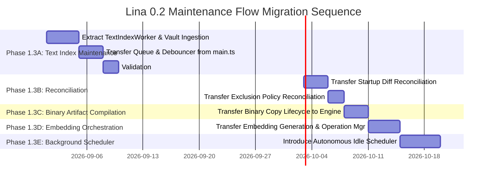
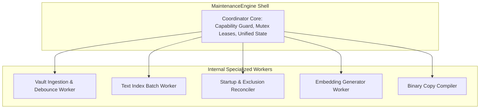

# Lina 0.2 — Phase 1.3 Maintenance Flow Migration Analysis

**Author:** Senior Software Architect & Senior Systems Analyst  
**Date:** August 16, 2026  
**Status:** Pre-Migration Architectural Analysis (Phase 1.3 — Analysis Only)  
**Target Version:** Lina 0.2.x  
**Scope:** Responsibility decomposition of `main.ts`, existing component ownership review, incremental migration sequencing, first migration candidate evaluation, coordinator vs worker boundaries, state/error models, and testing strategy.

---

## 1. Executive Summary

Lina 0.2 has established its foundational boundaries:
1. The **`DeviceCapabilities`** model strictly enforces that **Desktop Producer** authoritatively maintains search assets, while **Mobile Companion** acts as a read-only consumer.
2. The **`MaintenanceEngine`** interface provides the top-level architectural lifecycle and capability-aware gateway.

However, the concrete maintenance logic (vault event debouncing, batch queue processing, text indexing, diff reconciliation, embedding orchestration, and binary compilation) still executes directly inside [`LinaPlugin` in `main.ts`](file:///d:/_dev/obsidian/lina/main.ts#L217).

```text
Current State (0.1.x Monolith)               Target State (Lina 0.2 Modular Architecture)
───────────────────────────────               ────────────────────────────────────────────
LinaPlugin (main.ts ~2,520 lines)            LinaPlugin (main.ts ~300 lines Shell)
  ├── Vault Event Handlers & Debouncer         ├── DeviceCapabilities Resolver
  ├── Pending Update Batch Queue               ├── MaintenanceEngine (Desktop Producer Only)
  ├── Text Index Rebuild & Persistence         │     ├── TextIndexWorker & Debouncer
  ├── Startup & Exclusion Reconciliation       │     ├── Startup & Policy Reconciler
  ├── Embedding Generation Loop                │     ├── EmbeddingUpdateWorker
  ├── Binary Compilation Controller            │     ├── BinaryArtifactCompiler
  └── Search & Query Wiring                    │     └── Consolidated Mutex Coordinator
                                               └── QueryEngine (Desktop & Mobile Shared)
                                                     ├── TextSearchEngine
                                                     ├── RuntimeEmbeddingIndexCache
                                                     └── HybridFusionEngine
```

### Objective of this Analysis
Define a safe, non-breaking, incremental ownership migration sequence that moves maintenance workflows from `main.ts` into the `MaintenanceEngine` without rewrite regressions.

---

## 2. Current Ownership Map

### 2.1 Inventory of Maintenance Logic in `main.ts`

| Maintenance Area | Functions in `main.ts` | Current Execution Flow | Dependencies | Migration Complexity | Recommended Target Destination |
| :--- | :--- | :--- | :--- | :---: | :--- |
| **Vault Event Ingestion** | [`registerVaultEventListeners`](file:///d:/_dev/obsidian/lina/main.ts#L1693)<br>[`handleVaultEvent`](file:///d:/_dev/obsidian/lina/main.ts#L1807)<br>[`handleVaultFileChange`](file:///d:/_dev/obsidian/lina/main.ts#L1839)<br>[`handleDebouncedModify`](file:///d:/_dev/obsidian/lina/main.ts#L1892) | Ingests `create/modify/delete/rename` from Obsidian `app.vault`; routes modify events through `modifyDebouncer` (2000ms). | `app.vault`, `PathScopedDebouncer`, exclusions | **Low** | `MaintenanceEngine` (Ingestion Layer) |
| **Text Batch Queue & Processing** | [`queueOrRunAutomaticIndexUpdate`](file:///d:/_dev/obsidian/lina/main.ts#L1936)<br>[`schedulePendingAutomaticUpdatesFlush`](file:///d:/_dev/obsidian/lina/main.ts#L1972)<br>[`flushPendingAutomaticUpdates`](file:///d:/_dev/obsidian/lina/main.ts#L1989)<br>[`processNextAutomaticUpdateBatch`](file:///d:/_dev/obsidian/lina/main.ts#L2001)<br>[`processAutomaticIndexUpdateBatch`](file:///d:/_dev/obsidian/lina/main.ts#L2039) | Coalesces pending events into `pendingAutomaticUpdates` Map; flushes after 1000ms; acquires `startAutomaticBatch()`; re-chunks notes; calls `persistAndActivateTextIndexCandidate`. | `IndexWriteCoordinator`, `indexStore.ts`, `chunker.ts`, `noteHasher.ts` | **Medium** | `MaintenanceEngine` (`TextIndexWorker`) |
| **Startup Vault Reconciliation** | [`completeAutomaticUpdatesStartup`](file:///d:/_dev/obsidian/lina/main.ts#L899)<br>[`reconcileTextIndexAtStartup`](file:///d:/_dev/obsidian/lina/main.ts#L930) | Executes 5s after layout ready; diffs `app.vault.getMarkdownFiles()` against indexed notes; feeds differences into batch queue. | `app.vault`, `automaticUpdateEvents.ts`, `indexStore.ts` | **Low** | `MaintenanceEngine` (`ReconciliationWorker`) |
| **Exclusion Policy Reconciliation** | [`reconcileIndexExclusionsAfterSettingsChange`](file:///d:/_dev/obsidian/lina/main.ts#L1062)<br>[`reconcileIndexExclusionsInRuntime`](file:///d:/_dev/obsidian/lina/main.ts#L1110) | Triggered when exclusion settings change; purges newly excluded paths and re-indexes unexcluded files. | `indexExclusions.ts`, `processAutomaticIndexUpdateBatch` | **Low** | `MaintenanceEngine` (`ReconciliationWorker`) |
| **Text Index Full Rebuild** | [`rebuildTextIndex`](file:///d:/_dev/obsidian/lina/main.ts#L1176) | Scans vault in chunks of 10 notes; yields to UI thread; serializes and saves entire index to `.lina/index/`. | `IndexWriteCoordinator`, `indexStore.ts`, `chunker.ts` | **Medium** | `MaintenanceEngine` (`TextIndexWorker`) |
| **Embedding Generation Orchestration** | [`requestEmbeddingIndexGeneration`](file:///d:/_dev/obsidian/lina/main.ts#L723)<br>[`drainAutomaticUpdatesBeforeEmbeddingGeneration`](file:///d:/_dev/obsidian/lina/main.ts#L784)<br>[`runGenerateLocalEmbeddings`](file:///d:/_dev/obsidian/lina/main.ts#L1550)<br>[`cancelActiveEmbeddingOperation`](file:///d:/_dev/obsidian/lina/main.ts#L804) | Drains pending text updates; reserves coordinator lock; initiates `EmbeddingOperationManager`; calls `generateEmbeddingsForChunks`. | `EmbeddingOperationManager`, `embeddingGenerator.ts`, `embeddingPersistence.ts` | **Medium** | `MaintenanceEngine` (`EmbeddingWorker`) |
| **Binary Copy Maintenance** | [`checkBinaryEmbeddingCopy`](file:///d:/_dev/obsidian/lina/main.ts#L686)<br>[`createOrUpdateBinaryEmbeddingCopy`](file:///d:/_dev/obsidian/lina/main.ts#L690)<br>[`removeBinaryEmbeddingCopy`](file:///d:/_dev/obsidian/lina/main.ts#L696)<br>[`startAutomaticBinaryEmbeddingMaintenance`](file:///d:/_dev/obsidian/lina/main.ts#L701) | Automatically triggered after canonical embedding publication or manually via settings; compiles `Float32Array` buffers. | `BinaryEmbeddingCopyController`, `embeddingBinaryStorage.ts` | **Low** | `MaintenanceEngine` (`BinaryCopyWorker`) |

---

## 3. Existing Components Analysis

```mermaid
graph TD
    subgraph Retained as Stateless Functional Core
        Store[src/index/indexStore.ts]
        Persist[src/index/embeddingPersistence.ts]
        BinStore[src/index/embeddingBinaryStorage.ts]
        Plan[src/index/embeddingUpdatePlan.ts]
        Chunker[src/index/chunker.ts]
    end

    subgraph Internalized by MaintenanceEngine
        Engine[MaintenanceEngine]
        Coord[IndexWriteCoordinator]
        Debounce[PathScopedDebouncer]
        Queue[AutomaticUpdateQueue]
        OpManager[EmbeddingOperationManager]
        WorkStatus[EmbeddingWorkStatusController]
        BinCtrl[BinaryEmbeddingCopyController]
        
        Engine --> Coord
        Engine --> Debounce
        Engine --> Queue
        Engine --> OpManager
        Engine --> WorkStatus
        Engine --> BinCtrl
    end

    Engine --> Store
    Engine --> Persist
    Engine --> BinStore
    Engine --> Plan
    Engine --> Chunker
```



### 3.1 Component Role & Encapsulation Decisions

1. **`IndexWriteCoordinator` (`src/index/indexWriteCoordinator.ts`):**  
   *Decision:* **Internalize inside `MaintenanceEngine`.**  
   *Rationale:* External callers should not manually request, track, or release lock tokens. The `MaintenanceEngine` provides high-level async methods that handle token leasing internally.

2. **`automaticUpdateEvents.ts` (`PathScopedDebouncer`, `coalesceAutomaticUpdateEvent`):**  
   *Decision:* **Internalize inside `MaintenanceEngine`.**  
   *Rationale:* Vault event coalescing and debouncing are internal ingestion concerns of the maintenance pipeline.

3. **`EmbeddingOperationManager` (`src/index/embeddingOperationManager.ts`):**  
   *Decision:* **Internalize / Wrap inside `MaintenanceEngine`.**  
   *Rationale:* Manages the single-flight `AbortController` and batch execution lifecycle. `MaintenanceEngine` delegates embedding runs to it.

4. **`EmbeddingWorkStatusController` (`src/index/embeddingWorkStatusController.ts`):**  
   *Decision:* **Internalize / Wrap inside `MaintenanceEngine`.**  
   *Rationale:* Serves as the reactive dirty-flag sensor that notifies the maintenance scheduler when embedding work is required.

5. **`BinaryEmbeddingCopyController` (`src/index/embeddingBinaryCopyController.ts`):**  
   *Decision:* **Internalize / Wrap inside `MaintenanceEngine`.**  
   *Rationale:* Provides single-flight binary compilation triggered automatically upon canonical embedding publications.

6. **Functional Persistence Layers (`indexStore.ts`, `embeddingPersistence.ts`, `embeddingBinaryStorage.ts`):**  
   *Decision:* **Remain Independent Functional Modules.**  
   *Rationale:* Pure, stateless persistence libraries with transactional rollback and file integrity guarantees. They require no refactoring.

---

## 4. Migration Risks & Mitigation

| Migration Area | Identified Risk | Severity | Mitigation Strategy |
| :--- | :--- | :---: | :--- |
| **Vault Event Routing** | Dropped events during handoff between `main.ts` and `MaintenanceEngine`. | **Medium** | Atomic listener cutover: `MaintenanceEngine.start()` registers listeners directly; `main.ts` does not touch vault events. |
| **In-Memory Cache Inconsistency** | Query Engine reads stale `indexedNotes`/`indexedChunks` if memory arrays are not updated post-batch. | **High** | `MaintenanceEngine` emits an `onIndexPublished` callback that updates the shared in-memory registry. |
| **Unreleased Write Locks** | An unhandled exception in an asynchronous worker leaves `IndexWriteCoordinator` in a permanent busy state. | **High** | Strict `try ... finally` token release blocks inside `MaintenanceEngine` wrapper methods. |
| **API Cost Overruns** | Automated embedding worker triggering unexpectedly on paid APIs (e.g., Mistral). | **High** | Embedding migration is phased *after* index migration; background worker includes idle timer and rate limiter. |
| **Mobile Companion Regressions** | Mobile devices accidentally starting maintenance workers. | **Critical** | Guard `MaintenanceEngine.start()` with `if (!capabilities.canMaintainTextIndex) return;`. |

---

## 5. Recommended Migration Sequence



### Phase-by-Phase Breakdown

1. **Phase 1.3A — Text Index Maintenance & Vault Ingestion (First Candidate):**
   * Migrate `registerVaultEventListeners`, `PathScopedDebouncer`, `pendingAutomaticUpdates`, `processAutomaticIndexUpdateBatch`, and `rebuildTextIndex` into `MaintenanceEngine`.
   * *Outcome:* Transfers ~800 lines out of `main.ts`; zero API cost; verified immediately by existing 728-test suite.
2. **Phase 1.3B — Startup & Exclusion Reconciliation:**
   * Migrate `reconcileTextIndexAtStartup` and `reconcileIndexExclusionsInRuntime` into `MaintenanceEngine`.
   * *Outcome:* Ensures startup reconciliation and dynamic exclusion updates run through the unified queue.
3. **Phase 1.3C — Binary Artifact Compilation:**
   * Migrate `BinaryEmbeddingCopyController` ownership into `MaintenanceEngine`.
   * *Outcome:* Binary generation automatically chains off canonical publication inside the engine.
4. **Phase 1.3D — Embedding Generation & Checkpoints:**
   * Migrate `requestEmbeddingIndexGeneration`, `drainAutomaticUpdates`, and `EmbeddingOperationManager` into `MaintenanceEngine`.
   * *Outcome:* Embeddings generation becomes a clean engine method.
5. **Phase 1.3E — Autonomous Background Scheduler:**
   * Introduce the conservative background scheduler (30s vault idle delay, rate limiter) on Desktop Producer.
   * *Outcome:* Full autonomous maintenance achieved safely.

---

## 6. First Migration Candidate: Automatic Textual Indexing (Phase 1.3A)

### 6.1 Evaluation of Alternatives

```text
Candidate Domain         Pros                                            Cons / Risks                    Evaluation
──────────────────────────────────────────────────────────────────────────────────────────────────────────────────────────
Text Index Updates       • Zero API cost                                 • Touches core vault watchers   ⭐️ RECOMMENDED FIRST
(Phase 1.3A)             • 100% deterministic & local                                                    • Safest foundation
                         • Already incremental with mature debouncing                                    • Highest line reduction
                         • High test coverage (indexStore, events)                                       • Immediate stability win

Reconciliation           • Clear start/finish bounds                     • Depends on text batch queue   Requires 1.3A first
(Phase 1.3B)             • Low complexity diffing

Binary Artifacts         • Deterministic byte conversion                 • Depends on canonical vectors  Requires 1.3A first
(Phase 1.3C)             • Low complexity

Embedding Generation     • High user value                               • Risks paid API spend          High risk; must build
(Phase 1.3D)             • Reusable diff planner                         • Long-running async worker     on stable text index
```

### 6.2 Implementation Blueprint for Phase 1.3A
* **`MaintenanceEngine` API Expansion:**
  ```typescript
  export class MaintenanceEngine {
    // Ingestion
    public handleVaultEvent(type: "create" | "modify" | "delete" | "rename", file: TFile, oldPath?: string): void;
    
    // Core Execution
    public rebuildTextIndex(): Promise<TextIndexRebuildResult>;
    public flushPendingUpdates(): Promise<void>;
    
    // State & Registry Access
    public getIndexedNotes(): readonly IndexedNote[];
    public getIndexedChunks(): readonly Chunk[];
  }
  ```
* **Changes in `main.ts`:**
  * Remove `pendingAutomaticUpdates` Map, `modifyDebouncer`, and `processAutomaticIndexUpdateBatch`.
  * Forward vault events directly to `this.maintenanceEngine.handleVaultEvent(...)`.

---

## 7. Target Maintenance Engine Responsibilities

To avoid creating a new monolith, the `MaintenanceEngine` acts as an **Orchestrator of Specialized Internal Workers**:



### Division of Responsibilities
1. **Coordinator Core:** Enforces `DeviceCapabilities`, manages write lock transitions via `IndexWriteCoordinator`, publishes consolidated `MaintenanceEngineState`, and exposes public lifecycle methods (`start`, `stop`, `dispose`).
2. **`TextIndexWorker`:** Consumes debounced change events, executes diffing, creates note chunks, and commits updates via `saveTextIndex()`.
3. **`ReconciliationWorker`:** Compares vault files against the note registry on startup and purges/re-indexes files when exclusion settings change.
4. **`EmbeddingWorker`:** Calculates diff plans via `embeddingUpdatePlan.ts`, runs batch loops, writes checkpoints, and publishes canonical `embeddings.jsonl`.
5. **`BinaryWorker`:** Converts canonical JSONL into `Float32Array` vectors and metadata indices.

---

## 8. State and Error Model

### 8.1 Unified State Structure

The `MaintenanceEngine` exposes a single observable state stream:

```typescript
export type MaintenanceTaskKind = "idle" | "indexing" | "reconciling" | "generating-embeddings" | "compiling-binary";

export interface MaintenanceEngineState {
  readonly currentTask: MaintenanceTaskKind;
  readonly isRunning: boolean;
  readonly isTextIndexDirty: boolean;
  readonly isEmbeddingDirty: boolean;
  readonly isBinaryDirty: boolean;
  readonly progress: {
    readonly current: number;
    readonly total: number;
    readonly percentage: number;
    readonly message: string;
  } | null;
  readonly lastCompletedTask: {
    readonly kind: MaintenanceTaskKind;
    readonly completedAt: string;
  } | null;
  readonly lastError: {
    readonly message: string;
    readonly timestamp: string;
    readonly task: MaintenanceTaskKind;
  } | null;
}
```

### 8.2 Error & Recovery Invariants
* **Non-Fatal Degradation:** If a text batch or embedding generation fails, the engine captures the error into `state.lastError`, releases the mutex token in `finally`, and restores the previous canonical index from `.bak-*` or `.publish.backup`.
* **Safe State Recovery:** On engine startup, `recoverEmbeddingPersistenceArtifacts()` automatically cleans orphaned `.publish.tmp` files and restores unfinished checkpoints.

---

## 9. Testing Strategy for Migration

To ensure zero regressions across the migration phases, the test suite must verify:

```text
Test Suite Category            Target Verification                                             Existing Test Assets
──────────────────────────────────────────────────────────────────────────────────────────────────────────────────────────
1. Ingestion & Debouncing      Rapid edits coalesce into a single execution batch              automaticUpdateEvents.test.ts
2. Text Batch Execution        Notes and chunks persist atomically with valid manifest counts  indexStore.test.ts, memoryPersistence.test.ts
3. Mutex Coordination          Rebuild, batch, embedding, and binary operations never overlap  indexWriteCoordinator.test.ts
4. Mobile Gating Safety        Companion role attaches 0 vault listeners and skips all writes  embeddingResourceGuard.test.ts
5. Search Continuity           Query Engine executes text, semantic, and hybrid search safely  runtimeEmbeddingIndex.test.ts, hybridSearch
```

---

## 10. What Should NOT Change Yet

* **Do NOT modify production source code or implement migration steps during this phase.**
* **Do NOT change existing on-disk artifact formats (`.lina/index/*`).**
* **Do NOT redesign or alter the Settings UI.**
* **Do NOT modify search ranking algorithms in `src/search/`.**
* **Do NOT enable autonomous background embedding generation until Phase 1.3E.**

---

## 11. Architectural Conclusion & Stop Condition

This analysis establishes the concrete roadmap for migrating maintenance flows: beginning with **Phase 1.3A (Text Index Maintenance & Vault Ingestion)** as the lowest-risk, highest-value first step, and progressively transferring reconciliation, binary compilation, and embedding orchestration into the modular `MaintenanceEngine`.

**Phase 1.3 Maintenance Flow Migration Analysis is COMPLETE. Awaiting user review before implementation planning.**
