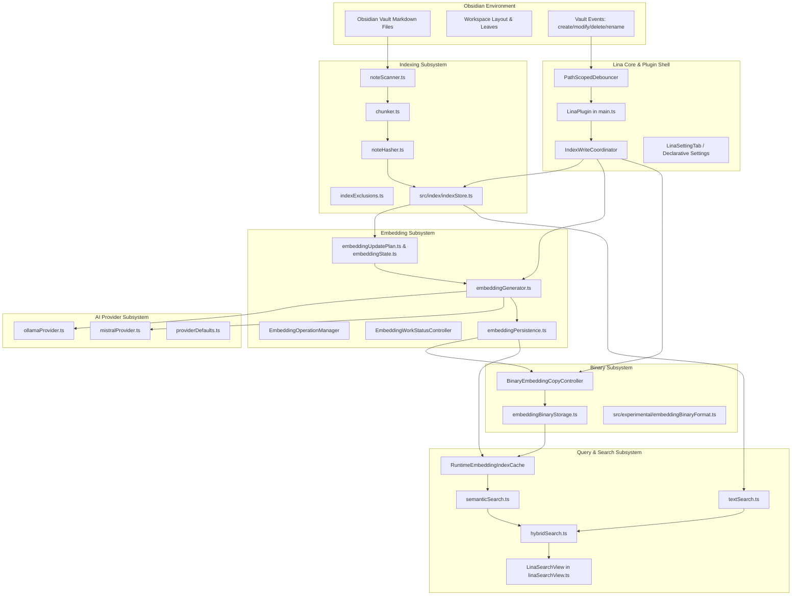
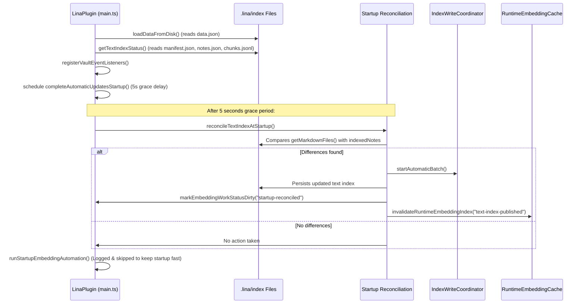
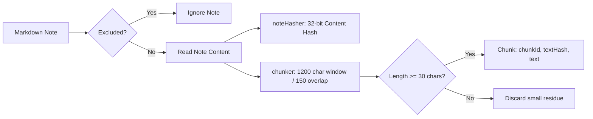
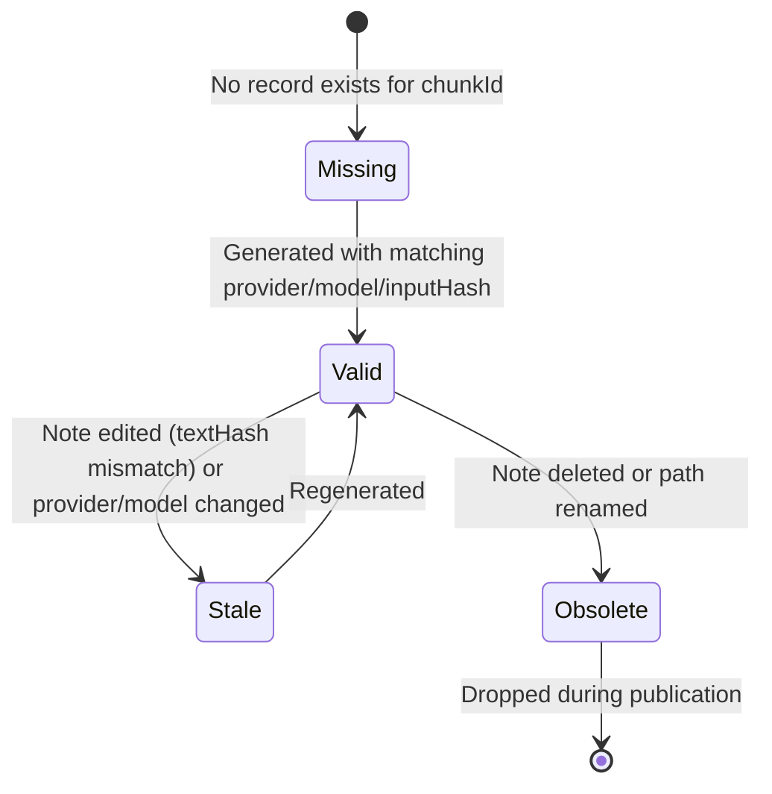
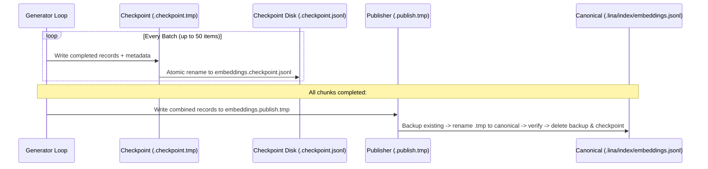
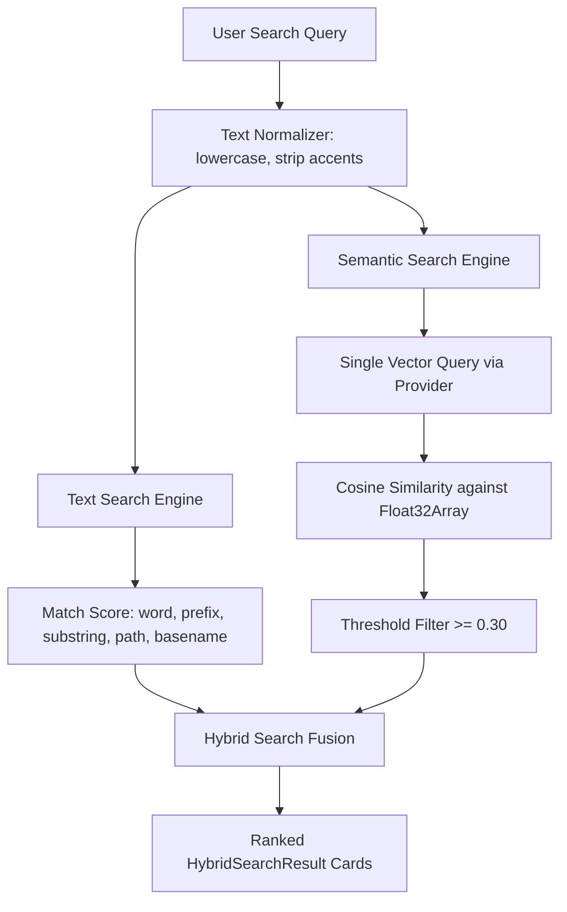
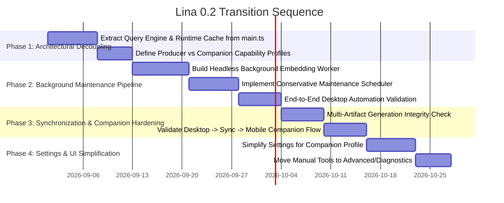

# Lina 0.2 Pre-Transition Architectural Assessment

**Author:** Senior Software Architect, Senior Software Engineer & Senior Systems Analyst  
**Date:** August 16, 2026  
**Status:** Pre-Migration Architectural Review (Analysis Only)  
**Target Version:** Lina 0.2.x  
**Scope:** Structural mapping, data lifecycle reconstruction, synchronization safety, automation readiness, and risk analysis.

---

## 1. Executive Summary

Lina is an Obsidian plugin engineered to provide local textual search, semantic and hybrid search, and optional AI-assisted note enrichment without locking the user into third-party cloud infrastructure.

As Lina prepares for version **0.2.x**, a foundational strategic product decision has been established:
* **Desktop** acts as the primary **Producer and Maintainer** of derived search assets (text index, embeddings, and binary artifacts).
* **Mobile** acts as a lightweight **Companion** that consumes synchronized search artifacts, executes local textual, semantic, and hybrid search queries, and accesses optional AI features without being burdened by local index compilation or heavy vector generation.
* **Autonomous Maintenance:** The system must transition from exposing fragmented manual operations (e.g., "rebuild text index", "generate embeddings", "maintain binary copy") toward a cohesive, conservative, automatic background maintenance pipeline that presents the user with a reliable state: *"Lina is ready"*.

### Strategic Highlights & High-Level Findings

1. **Textual Indexing Automation is Mature but I/O Heavy:**  
   The text indexing subsystem already possesses path-scoped debouncing ([`automaticUpdateEvents.ts`](file:///d:/_dev/obsidian/lina/src/index/automaticUpdateEvents.ts#L145-L190)), batch coalescing, and exclusion reconciliation. However, persistence is executed via full atomic rewrites of `notes.json` and `chunks.jsonl` on every batch, scaling at $O(N)$ with vault size.

2. **Embedding Planning is Sophisticated, but Execution is Manual:**  
   `src/index/embeddingUpdatePlan.ts` and `src/index/embeddingState.ts` provide state-of-the-art diffing between text chunks and vector representations, supporting exact reuse, stale detection, and partial checkpointing. However, this engine is currently triggered only via user commands or sidebar clicks; automatic background execution is deliberately disabled at startup.

3. **Binary Storage Layer is Robust:**  
   The binary format (`embeddings.vectors.f32` and `embeddings.meta.jsonl`) introduces fast $O(1)$ memory-mapped `Float32Array` ingestion and strict resource guards, falling back gracefully to JSONL when incomplete or corrupt.

4. **Multi-Artifact Synchronization Lacks Unified Generation Clock:**  
   External synchronization tools (Obsidian Sync, Syncthing) transmit individual files asynchronously. While Lina validates each file defensibly, there is no monolithic atomic generation envelope across `manifest.json`, `notes.json`, `chunks.jsonl`, `embeddings.jsonl`, and `embeddings.vectors.f32`.

5. **Settings & Monolith Coupling:**  
   The central plugin class ([`LinaPlugin` in `main.ts`](file:///d:/_dev/obsidian/lina/main.ts#L217)) combines event listeners, write locks, background timers, modal lifecycle, and UI view coordination in a single 2,521-line file. Decoupling this into clear capability boundaries (**Maintenance Engine**, **Query Engine**, **AI Engine**) is the critical architectural milestone for 0.2.

---

## 2. Current Architecture Map

### 2.1 Component Structure Diagram



### 2.2 Component Directory Mapping

| Architectural Area | Key Files & Classes | Responsibilities & Current State |
| :--- | :--- | :--- |
| **Plugin Shell & Lifecycle** | [`main.ts`](file:///d:/_dev/obsidian/lina/main.ts#L217) (`LinaPlugin`) | Entry point, lifecycle (`onload`, `onunload`), ribbon, command palette registration, vault event wiring, event coalescing. |
| **Settings & Per-Device Context** | [`src/settings.ts`](file:///d:/_dev/obsidian/lina/src/settings.ts), `src/settings/*` | Global settings, device-specific resolution via `deviceSettingsById`, credentials bridge, declarative parity harness. |
| **Write Lock Coordination** | [`src/index/indexWriteCoordinator.ts`](file:///d:/_dev/obsidian/lina/src/index/indexWriteCoordinator.ts) | Mutex state machine coordinating mutually exclusive operations (`text-rebuild`, `text-automatic-batch`, `embedding-generation`, `binary-maintenance`). |
| **Text Indexing** | [`src/index/indexStore.ts`](file:///d:/_dev/obsidian/lina/src/index/indexStore.ts), [`chunker.ts`](file:///d:/_dev/obsidian/lina/src/index/chunker.ts), [`noteHasher.ts`](file:///d:/_dev/obsidian/lina/src/index/noteHasher.ts), [`indexExclusions.ts`](file:///d:/_dev/obsidian/lina/src/index/indexExclusions.ts) | Scanning notes, generating 1200-char chunks with 150-char overlap, content hashing, exclusion filters, atomic text save to `.lina/index/`. |
| **Embedding State & Planning** | [`src/index/embeddingState.ts`](file:///d:/_dev/obsidian/lina/src/index/embeddingState.ts), [`src/index/embeddingUpdatePlan.ts`](file:///d:/_dev/obsidian/lina/src/index/embeddingUpdatePlan.ts) | Pure evaluation of vector validity, reusable chunks, stale reasons, provider/model identity diffs, execution plan formulation. |
| **Embedding Generation & Execution** | [`src/index/embeddingGenerator.ts`](file:///d:/_dev/obsidian/lina/src/index/embeddingGenerator.ts), [`src/index/embeddingOperationManager.ts`](file:///d:/_dev/obsidian/lina/src/index/embeddingOperationManager.ts) | Batch generation (up to 50 items), 3-candidate provider pre-validation, batch subdivision on failure, cooperative cancellation. |
| **Embedding Persistence & Recovery** | [`src/index/embeddingPersistence.ts`](file:///d:/_dev/obsidian/lina/src/index/embeddingPersistence.ts) | Checkpointing (`embeddings.checkpoint.jsonl`), atomic publication with backup/rollback (`.publish.tmp`, `.publish.backup`), crash recovery. |
| **Embedding Work Controller** | [`src/index/embeddingWorkStatusController.ts`](file:///d:/_dev/obsidian/lina/src/index/embeddingWorkStatusController.ts) | Reactive state tracking dirty flags and pending vector work without initiating automatic background generation. |
| **Binary Embedding Storage** | [`src/index/embeddingBinaryStorage.ts`](file:///d:/_dev/obsidian/lina/src/index/embeddingBinaryStorage.ts), [`src/index/embeddingBinaryCopyController.ts`](file:///d:/_dev/obsidian/lina/src/index/embeddingBinaryCopyController.ts), [`src/experimental/embeddingBinaryFormat.ts`](file:///d:/_dev/obsidian/lina/src/experimental/embeddingBinaryFormat.ts) | Binary vector serialization (`Float32Array`), digest validation, transactional publication, lifecycle control. |
| **Runtime Search Cache** | [`src/search/runtimeEmbeddingIndex.ts`](file:///d:/_dev/obsidian/lina/src/search/runtimeEmbeddingIndex.ts) | In-memory `Float32Array` index cache, single-flight lazy loading, preference-driven fallback (`prefer-binary` $\to$ `jsonl`). |
| **Search Engines** | [`src/search/textSearch.ts`](file:///d:/_dev/obsidian/lina/src/search/textSearch.ts), [`src/search/semanticSearch.ts`](file:///d:/_dev/obsidian/lina/src/search/semanticSearch.ts), [`src/search/hybridSearch.ts`](file:///d:/_dev/obsidian/lina/src/search/hybridSearch.ts) | Exact/prefix/substring textual search, cosine similarity vector scoring, Reciprocal Rank Fusion / normalized weighted hybrid fusion. |
| **Search View UI** | [`src/search/linaSearchView.ts`](file:///d:/_dev/obsidian/lina/src/search/linaSearchView.ts) | Sidebar leaf item view, live search UI, result cards, status banners, AI analysis, slash commands (`/ask`, `/tags`, `/yaml`). |
| **AI Providers** | [`src/ai/ollamaProvider.ts`](file:///d:/_dev/obsidian/lina/src/ai/ollamaProvider.ts), [`src/ai/mistralProvider.ts`](file:///d:/_dev/obsidian/lina/src/ai/mistralProvider.ts), [`src/ai/providerDefaults.ts`](file:///d:/_dev/obsidian/lina/src/ai/providerDefaults.ts) | REST integration with Ollama (`/api/embed`, `/api/embeddings`, `/api/generate`) and Mistral (`/embeddings`, `/chat/completions`). |

---

## 3. Current Data Model and Persistent Artifacts

### 3.1 Directory Layout

```text
<vault-root>/
├── .obsidian/
│   └── plugins/
│       └── lina/
│           └── data.json                              [Plugin Settings & Legacy State]
└── .lina/
    └── index/
        ├── manifest.json                              [Canonical Index & Embedding Metadata]
        ├── notes.json                                 [Indexed Notes Array]
        ├── chunks.jsonl                               [Indexed Text Chunks Lines]
        ├── embeddings.jsonl                           [Canonical Embeddings Lines]
        ├── embeddings.checkpoint.jsonl                [In-progress Work Checkpoint]
        ├── embeddings.checkpoint.meta.json            [Checkpoint Descriptor]
        ├── embeddings.binary.manifest.json            [Derived Binary Descriptor]
        ├── embeddings.meta.jsonl                      [Derived Binary Metadata Index]
        └── embeddings.vectors.f32                     [Raw Little-Endian Float32 Vectors]
```

### 3.2 Detailed Artifact Inventory

| Artifact Path | Producer | Consumer | Format | Identity / Generation Tracking | Atomicity & Safety |
| :--- | :--- | :--- | :--- | :--- | :--- |
| `data.json` | `LinaPlugin.saveDataToDisk` | `LinaPlugin.loadDataFromDisk` | JSON | Stores `settings` and legacy `index` object. | Handled by Obsidian internal storage adapter. |
| `.lina/index/manifest.json` | `saveTextIndex` & `publishCanonicalEmbeddings` | `readTextIndexStatus`, `readEmbeddingStatus`, `RuntimeEmbeddingIndexCache` | JSON | Schema `version: 1`. Tracks `totalNotes`, `totalChunks`, `embeddings.publicationId`, `embeddings.updatedAt`. | Written via `.tmp-*` $\to$ `.bak-*` rename dance. |
| `.lina/index/notes.json` | `saveTextIndex` in [`indexStore.ts`](file:///d:/_dev/obsidian/lina/src/index/indexStore.ts#L343) | `readIndexedNotes`, `TextSearchModal`, `LinaSearchView` | JSON Array | Array of `IndexedNote` objects (`path`, `size`, `mtime`, `contentHash`, `indexedAt`). | Atomic multi-file rename coordinated with manifest. |
| `.lina/index/chunks.jsonl` | `saveTextIndex` in [`indexStore.ts`](file:///d:/_dev/obsidian/lina/src/index/indexStore.ts#L344) | `readIndexedChunks`, `generateEmbeddingsForChunks`, `LinaSearchView` | JSONL | One JSON line per chunk (`chunkId: "${path}::${index}"`, `textHash`, `text`, `createdAt`). | Atomic multi-file rename. Guarded by 50MB and 100k chunk limits. |
| `.lina/index/embeddings.jsonl` | `publishCanonicalEmbeddings` in [`embeddingPersistence.ts`](file:///d:/_dev/obsidian/lina/src/index/embeddingPersistence.ts#L703) | `readExistingEmbeddings`, `RuntimeEmbeddingIndexCache`, `BinaryEmbeddingCopyController` | JSONL | One JSON line per vector (`chunkId`, `path`, `index`, `textHash`, `provider`, `model`, `dimensions`, `embeddingInputHash`, `embedding: number[]`). | High atomicity: published via `.publish.tmp`, canonical backed up to `.publish.backup`, rollback on failure. |
| `.lina/index/embeddings.checkpoint.jsonl` + `.meta.json` | `writeEmbeddingCheckpoint` in [`embeddingPersistence.ts`](file:///d:/_dev/obsidian/lina/src/index/embeddingPersistence.ts#L562) | `loadEmbeddingCheckpoint`, `readRecoverableEmbeddingCheckpointRecords` | JSONL + JSON Pair | Schema `version: 1`, `operationId`, `completedRecords`, `provider`, `model`, `dimension`, `inputFormatVersion`. | Atomic two-file commit with temporary files and backups. Cleaned up on successful canonical publish. |
| `.lina/index/embeddings.binary.manifest.json` | `BinaryEmbeddingPublisher.publish` in [`embeddingBinaryStorage.ts`](file:///d:/_dev/obsidian/lina/src/index/embeddingBinaryStorage.ts#L143) | `readBinaryEmbeddingStorage`, `BinaryEmbeddingCopyController.check` | JSON | Format `lina-embeddings-binary`, `version: 1`, `generationId: "derived-${publicationId}"`, `sourcePublicationId`, `vectorsDigest`, `metadataDigest`. | Validated strictly against canonical `publicationId`. Atomic write. |
| `.lina/index/embeddings.meta.jsonl` | `BinaryEmbeddingPublisher.publish` | `readBinaryEmbeddingStorage` | JSONL | Lightweight metadata without vectors (`chunkId`, `path`, `index`, `textHash`, `vectorOrdinal: number`). | Paired with binary manifest and vectors buffer. |
| `.lina/index/embeddings.vectors.f32` | `BinaryEmbeddingPublisher.publish` | `readBinaryEmbeddingStorage` | Binary (IEEE 754 Float32 Little-Endian) | Contiguous byte array ($N \times D \times 4$ bytes). Verified via SHA-256 digest in manifest. | Transactional staging and backup rollback. |

---

## 4. Current Data Lifecycle

### Scenario A: Lina Starts on Desktop

* **Current Execution Details:** [`main.ts:340-368`](file:///d:/_dev/obsidian/lina/main.ts#L340-L368), [`main.ts:899-984`](file:///d:/_dev/obsidian/lina/main.ts#L899-L984).  
* **Reliability Check:** Startup is non-blocking. The 5-second grace window avoids disk contention while Obsidian indexes plugins.

### Scenario B: User Creates a Markdown Note
1. Obsidian emits `"create"` event $\to$ captured by `handleVaultEvent("create", file)`.
2. Path validation verifies non-internal, `.md` extension, and user exclusion rules.
3. If valid, queued into `pendingAutomaticUpdates` map (`coalesceAutomaticUpdateEvent`).
4. Flush timer (1000ms) fires $\to$ calls `flushPendingAutomaticUpdates()`.
5. Acquires `IndexWriteCoordinator.startAutomaticBatch()`.
6. Generates new note entry, creates chunks, updates memory state, writes `.lina/index/` via `persistAndActivateTextIndexCandidate`.
7. Calls `markEmbeddingWorkStatusDirty("text-index-published")` and invalidates `RuntimeEmbeddingIndexCache`.
8. **Notice:** Embeddings are marked dirty but **NOT** generated automatically.

### Scenario C: User Edits an Existing Note
1. Obsidian emits rapid `"modify"` events as user types.
2. `handleVaultFileChange` routes to `modifyDebouncer` (2000ms delay per file path).
3. Once typing ceases for 2 seconds, debouncer fires `handleDebouncedModify(file)`.
4. Queues into `pendingAutomaticUpdates` $\to$ flushed after 1000ms batch delay.
5. In batch processor: Reads file content, compares `hashContent(newContent)` against `existingNote.contentHash`.
6. If content hash is unchanged (e.g., touched timestamp only), candidate is discarded (`skippedCandidates: "content-unchanged"`).
7. If changed: Re-chunks note, replaces chunks in list, rewrites full text index, marks embedding status dirty.

### Scenario D: User Renames or Moves a Note
1. Obsidian emits `"rename"` event with `(file, oldPath)`.
2. `handleVaultEvent("rename", file, oldPath)` validates both paths.
3. Coalescer updates pending map, preserving `oldPath` origin.
4. Batch processor removes all entries matching `oldPath` and `newPath`, indexes the note under new path, generates chunks with new `chunkId` (`${newPath}::${index}`).
5. Atomically publishes new text index. Old chunk IDs become obsolete; embeddings for old chunk IDs will be cleaned up on next embedding generation.

### Scenario E: User Deletes a Note
1. Obsidian emits `"delete"` event.
2. Handled without reading file content (file no longer exists on disk).
3. Batch processor filters out note and all chunks where `chunk.path === deletedPath`.
4. Writes updated `notes.json`, `chunks.jsonl`, `manifest.json`.

### Scenario F: User Manually Rebuilds the Index
1. Triggered via command `"reconstruir-indice-textual"`.
2. Verifies `IndexWriteCoordinator.startTextRebuild()`.
3. Scans all markdown files in vault in batches of 10 (`TEXT_INDEX_REBUILD_BATCH_SIZE`), yielding to UI event loop between batches.
4. Writes new index to disk, updates in-memory arrays, marks embeddings dirty, invalidates cache.

### Scenario G: User Generates / Updates Embeddings
1. Triggered via command `"gerar-embeddings-locais"` or sidebar button.
2. `requestEmbeddingIndexGeneration("command")` reserves coordinator slot.
3. Drains any pending automatic text updates first (`drainAutomaticUpdatesBeforeEmbeddingGeneration`).
4. Activates coordinator `startEmbeddingGeneration()` token.
5. `calculateEmbeddingUpdatePlan` evaluates existing `embeddings.jsonl` vs current chunks:
   * Incremental mode: Identifies reusable records vs missing/stale chunks.
   * Full rebuild mode: Clears existing records if provider/model/dimensions changed.
6. Tests up to 3 candidate chunks against the embedding provider endpoint.
7. Executes batch generation in loop (batch size 1 to 50):
   * Yields progress callbacks.
   * On batch completion, appends to `embeddings.checkpoint.jsonl` and updates metadata.
   * If an individual chunk fails in batch, subdivides batch sequentially to isolate bad inputs.
8. When all chunks complete: Publishes canonical `embeddings.jsonl` and updates `manifest.json` with new `publicationId`.
9. If maintain binary copy is enabled: Triggers `startAutomaticBinaryEmbeddingMaintenance(publicationId)`.

### Scenario H: User Creates / Updates Binary Artifacts
1. Automatically triggered after canonical embedding publication, or manually via settings.
2. `BinaryEmbeddingCopyController` acquires coordinator token `startBinaryMaintenance()`.
3. Reads `embeddings.jsonl`, validates record count and vectors.
4. Builds contiguous `ArrayBuffer`, computes SHA-256 checksums of metadata and vector buffers.
5. Staged publication writes `.tmp` files, backs up existing `.backup`, replaces canonical binary files.
6. `RuntimeEmbeddingIndexCache.invalidate("manual")` ensures next search loads binary.

### Scenario I: Lina Starts on Mobile with Synchronized Data
1. `LinaPlugin.onload()` initializes.
2. `readTextIndexStatus()` detects existing `.lina/index/manifest.json`.
3. `RuntimeEmbeddingIndexCache.getOrLoad(chunks)` checks user preference (`prefer-binary` or `jsonl`):
   * Evaluates `evaluateEmbeddingBridgeRead` and resource limits (`MOBILE_EMBEDDING_BINARY_RESOURCE_LIMITS`).
   * Loads `embeddings.vectors.f32` into memory as a typed `Float32Array`.
4. User performs text or hybrid search:
   * Text search runs instantly from memory.
   * Semantic search uses memory vectors; if an AI provider is configured on mobile, it requests a single vector for the query text. If no provider is available, search falls back cleanly to text matching.

### Scenario J: Synchronized Data is Incomplete, Stale, or Incompatible
1. If `manifest.json` arrives before `chunks.jsonl`: `readTextIndexStatus` detects count mismatch (`manifest-count-mismatch`) $\to$ marks index `isUsable: false`.
2. If `embeddings.binary.manifest.json` has `sourcePublicationId` different from `manifest.json.embeddings.publicationId`: `BinaryEmbeddingCopyController` flags `outdated` $\to$ `RuntimeEmbeddingIndexCache` falls back immediately to `embeddings.jsonl`.
3. If `embeddings.jsonl` exceeds mobile memory limit (24MB limit): `RuntimeEmbeddingIndexCache` reports `jsonl-resource-limit` and prevents out-of-memory crash.

---

## 5. Indexing Architecture

### 5.1 Scanning, Chunking, and Hashing Pipeline



### 5.2 Algorithmic Findings

* **Chunk Identity Formulation:**  
  `chunkId` is constructed as `${normalizedPath}::${chunkIndex}` in [`chunker.ts:63`](file:///d:/_dev/obsidian/lina/src/index/chunker.ts#L63).  
  *Implication:* Renaming a file changes its chunk IDs, but since `textHash` remains identical, `calculateEmbeddingState` can identify the matching vector and transfer it during incremental maintenance without recalculating embeddings.

* **Content Hashing:**  
  Uses a fast, synchronous 32-bit djb2 variant in [`noteHasher.ts:1-12`](file:///d:/_dev/obsidian/lina/src/index/noteHasher.ts#L1-L12).  
  *Finding:* Sufficient for change detection in local notes, but collision probability over $10^6$ chunks makes it unsuitable as a global cryptographic identity.

* **Persistence Bottleneck:**  
  `saveTextIndex` in [`indexStore.ts:291-389`](file:///d:/_dev/obsidian/lina/src/index/indexStore.ts#L291-L389) writes all indexed notes and all chunks to disk simultaneously. Modifying 1 note in a 10,000-note vault forces serialization of the remaining 9,999 notes and ~30,000 chunks.

---

## 6. Embedding Architecture

### 6.1 State Computation & Update Planning

Lina features a mathematically pure state machine in `src/index/embeddingState.ts` and `src/index/embeddingUpdatePlan.ts`. It categorizes every chunk into one of four states:



### 6.2 The Three Update Modes
1. **`initial-build`**: Triggered when no canonical `embeddings.jsonl` exists. Generates vectors for all valid chunks.
2. **`incremental`**: Triggered when target provider, model, dimension, and input format version match the published manifest. Generates vectors **only** for missing and stale chunks; reuses 100% of matching canonical records.
3. **`full-rebuild`**: Triggered when the user switches provider (e.g., Ollama $\to$ Mistral) or model (e.g., `nomic-embed-text` $\to$ `mistral-embed`). Completely regenerates the index.

### 6.3 Resilient Checkpoint & Publication Protocol



* **Crash Recovery:** If Obsidian crashes during a 10,000-chunk generation at chunk 7,500, the next run reads `embeddings.checkpoint.meta.json`, validates matching provider/model, and resumes from chunk 7,501 without re-querying the API for the first 7,500 items.

---

## 7. Binary Artifact Architecture

### 7.1 Binary Storage Specification (`binary-v1`)

The binary embedding storage format implements zero-copy memory ingestion:
1. **`embeddings.binary.manifest.json`**: Contains `sourcePublicationId`, `recordCount`, `dimensions`, `metadataDigest`, and `vectorsDigest`.
2. **`embeddings.meta.jsonl`**: Lightweight line-delimited index mapping `chunkId`, `path`, and `textHash` to a `vectorOrdinal: number`.
3. **`embeddings.vectors.f32`**: Contiguous buffer of 32-bit floating-point values in IEEE 754 Little-Endian format. Byte length is strictly $N \times D \times 4$.

### 7.2 Memory and Performance Profile

| Metric | JSONL Format (`embeddings.jsonl`) | Binary Format (`embeddings.vectors.f32`) |
| :--- | :--- | :--- |
| **Disk Storage (10k chunks, 768-dim)** | ~75 MB (ASCII numbers, JSON syntax) | **30.7 MB** (Exact raw bytes) |
| **Parsing Time into Memory** | ~800 ms - 2,500 ms (JSON string parsing) | **< 15 ms** (Direct `ArrayBuffer` load) |
| **Memory Allocation Overhead** | Heavy (intermediate strings, JS number arrays) | **Minimal** (Single typed `Float32Array`) |
| **Integrity Check** | Line-by-line validation | SHA-256 buffer digest |

* **Finding:** Binary storage is strictly a **derived acceleration artifact**. The canonical source of truth remains `embeddings.jsonl`. If binary files are deleted or corrupted, Lina seamlessly falls back to JSONL.

---

## 8. Search Architecture

### 8.1 Search Engine Matrix



* **Textual Search:** Pure local execution in [`textSearch.ts`](file:///d:/_dev/obsidian/lina/src/search/textSearch.ts). No API dependencies, zero cost.
* **Semantic Search:** Requires computing a vector for the query string ($1$ single API call) via `generateSingleEmbedding`. It then executes vectorized cosine similarity across in-memory buffers in [`semanticSearch.ts:62-83`](file:///d:/_dev/obsidian/lina/src/search/semanticSearch.ts#L62-L83).
* **Hybrid Search:** Combines text score and semantic similarity using normalized weights (`textWeight: 0.7`, `semanticWeight: 0.3`). If semantic search is unavailable or provider fails, hybrid search gracefully degrades to pure textual results with non-intrusive warning banners.

---

## 9. AI Provider Architecture

### 9.1 Evidence-Based Provider Classification

Based on exhaustive repository analysis:

| Provider | Embeddings Support | Analysis / LLM Support | Status in Codebase |
| :--- | :--- | :--- | :--- |
| **Ollama** | **Supported** (`/api/embed` & `/api/embeddings`) | **Supported** (`/api/generate`) | **Active & Maintained** |
| **Mistral** | **Supported** (`/embeddings`) | **Supported** (`/chat/completions`) | **Active & Maintained** |
| **OpenRouter** | Not Supported in Embeddings Dispatcher | Declared in settings types; client not implemented | **Transitional / Incomplete** |
| **OpenAI** | Not Supported | Not Supported | **Legacy / Dead Code** (explicitly marked `LegacyUnsupportedAIProvider` in [`settings.ts:47`](file:///d:/_dev/obsidian/lina/src/settings.ts#L47)) |
| **Gemini** | Not Supported | Not Supported | **Legacy / Dead Code** (explicitly marked `LegacyUnsupportedAIProvider`) |
| **Claude / Anthropic** | Not Supported | Not Supported | **Legacy / Dead Code** (explicitly marked `LegacyUnsupportedAIProvider`) |
| **Custom** | Not Supported | Not Supported | **Legacy / Dead Code** (explicitly marked `LegacyUnsupportedAIProvider`) |

* **Evidence:** In [`src/ai/embeddingProvider.ts:25-61`](file:///d:/_dev/obsidian/lina/src/ai/embeddingProvider.ts#L25-L61), `generateProviderEmbeddings` strictly dispatches to `generateMistralEmbeddings` or `generateOllamaEmbeddings`, returning `unsupported-provider` for any other value.

---

## 10. Desktop vs Mobile Behavior

### 10.1 Platform Differentiation Matrix

```text
Feature / Subsystem                Desktop (Current)       Mobile (Current)        0.2 Target Boundary
──────────────────────────────────────────────────────────────────────────────────────────────────────────
Text Indexing Event Listeners      Active                  Active                  Desktop Only (Producer)
Text Index Building / Rebuilding   Active                  Active                  Desktop Only (Producer)
Embedding Batch Generation         Active                  Available (Manual)      Desktop Only (Producer)
Binary Copy Generation             Active                  Available (Manual)      Desktop Only (Producer)
Runtime Binary Ingestion           Active (64MB limit)     Active (16MB limit)     Active on Both (Consumer)
Runtime JSONL Ingestion            Active (96MB limit)     Active (24MB limit)     Active on Both (Consumer)
Text Search Execution              Active                  Active                  Active on Both (Query Engine)
Semantic / Hybrid Query Search     Active                  Active (if API set)     Active on Both (Query Engine)
AI Note Analysis                   Active                  Active (if API set)     Active on Both (AI Engine)
```

### 10.2 Architectural Finding on Mobile Companion
Currently, mobile executes the exact same plugin startup code as desktop, including registering vault event listeners and running startup reconciliation ([`main.ts:566-576`](file:///d:/_dev/obsidian/lina/main.ts#L566-L576)).  
*Risk:* If a user edits a note on mobile, mobile may independently rewrite `notes.json` and `chunks.jsonl`, generating a new local index state that conflicts with desktop synchronization.  
*Target Direction:* In Lina 0.2, Mobile Companion should disable local producer operations by default and strictly operate as a Query/Consumer node.

---

## 11. Synchronization and Consistency Analysis

### 11.1 The Multi-Artifact Synchronization Race

When synchronization engines (e.g., Syncthing, Obsidian Sync) sync changes between devices, files arrive in non-deterministic order.

```text
Desktop Producer                              Synchronization Layer                    Mobile Companion
────────────────                             ──────────────────────                    ────────────────
1. Writes chunks.jsonl   ───────────────►    chunks.jsonl arrives  ──────────────►    Observes new chunks
2. Writes embeddings.jsonl ─────────────►    embeddings in flight  ───[delayed]───►   Still has old embeddings
3. Writes manifest.json  ───────────────►    manifest in flight    ───[delayed]───►   Has old manifest
```

### 11.2 Current Resilience Evaluation

| Failure Scenario | Current Behavior | Risk Classification |
| :--- | :--- | :--- |
| **Manifest arrives before Chunks/Notes** | `readTextIndexStatus` detects count mismatch (`manifest.totalNotes !== notes.length`). Index marked `isUsable: false`. Search disabled until sync finishes. | **Handled Defensively** (Safe failure, temporary search outage). |
| **New Chunks arrive with Old Embeddings** | `calculateEmbeddingState` matches by `chunkId` + `textHash`. New chunks are classified as `missing`. Old chunks remain searchable. | **Handled Correctly** (Partial degradation, no crashes). |
| **Binary Manifest arrives before Vectors** | `readBinaryEmbeddingStorage` checks file existence and size. Throws `binary-vectors-missing` $\to$ falls back cleanly to `embeddings.jsonl`. | **Handled Correctly**. |
| **Temporary Files Synced (`.tmp-*`, `.publish.tmp`)** | `getInternalAutomaticUpdateIgnoreReason` ignores all temporary suffixes. | **Handled Correctly**. |
| **Bidirectional Edits / Split Brain** | If desktop and mobile both update `manifest.json`, file conflict created by sync engine (`manifest.sync-conflict-...`). | **Architectural Risk** (Requires single-producer constraint). |

---

## 12. Automatic Maintenance Readiness

### 12.1 Automatic Textual Indexing Readiness: **HIGH**
* **Existing Assets:** Path-scoped debouncing ([`createPathScopedDebouncer`](file:///d:/_dev/obsidian/lina/src/index/automaticUpdateEvents.ts#L145)), event coalescing ([`coalesceAutomaticUpdateEvent`](file:///d:/_dev/obsidian/lina/src/index/automaticUpdateEvents.ts#L112)), startup reconciliation plan ([`buildStartupReconciliationPlan`](file:///d:/_dev/obsidian/lina/src/index/automaticUpdateEvents.ts#L198)), and write coordination ([`IndexWriteCoordinator`](file:///d:/_dev/obsidian/lina/src/index/indexWriteCoordinator.ts)).
* **Gaps:** High disk I/O on small edits (full file rewrite).

### 12.2 Automatic Embedding Maintenance Readiness: **MEDIUM**
* **Existing Assets:** Exact chunk diffing ([`calculateEmbeddingUpdatePlan`](file:///d:/_dev/obsidian/lina/src/index/embeddingUpdatePlan.ts#L210)), resume checkpoints, batch subdivision, transactional publication with rollback.
* **Gaps:** Lacks a background scheduler with rate limiting, idle detection, retry exponential backoff, and quota containment.

### 12.3 Automatic Binary Artifact Readiness: **HIGH**
* **Existing Assets:** `startAutomaticBinaryEmbeddingMaintenance` is already coded in [`main.ts:701-717`](file:///d:/_dev/obsidian/lina/main.ts#L701-L717) and triggers automatically upon canonical publication.
* **Gaps:** None. Only requires invocation within the background pipeline.

---

## 13. API Cost and Resource Risks

| Operation | Trigger | API Risk Level | Mitigation Strategy in Place |
| :--- | :--- | :--- | :--- |
| **Text Indexing** | Vault file modifications | **Zero Cost** (Local execution) | N/A |
| **Embedding Generation** | Manual command / button | **Paid API Cost** (if Mistral/cloud used) | Hash matching prevents re-embedding unchanged chunks. Pre-validation checks 3 candidates before batch run. |
| **Semantic Search Query** | User enters search term | **1 API call per search** | Query embedding is short; unavoidable for vector comparison. |
| **AI Note Analysis** | User clicks note analysis | **Paid API Cost** (Prompt tokens) | Explicit user action only. |
| **Automated Background Embeddings (0.2 Target)** | Background change pipeline | **High Risk if unconstrained** | **Required 0.2 Guards:** Debouncing, batch accumulation, rate limiting, quota caps, and local-first preference. |

---

## 14. Performance Analysis Across Vault Tiers

```text
Vault Scale Category       Note Count     Chunk Count     Memory Footprint (Binary)   I/O per Single-Note Edit (Current)
──────────────────────────────────────────────────────────────────────────────────────────────────────────────────────────
Small Vault                ~100           ~300            ~0.9 MB                     < 200 KB (Negligible)
Medium Vault               ~5,000         ~15,000         ~46 MB                      ~12 MB full index rewrite (Noticeable)
Large Vault                ~50,000        ~150,000        ~460 MB                     ~120 MB full index rewrite (Severe)
```

### Critical Bottleneck: $O(N)$ Disk Serialization
In [`indexStore.ts:342-348`](file:///d:/_dev/obsidian/lina/src/index/indexStore.ts#L342-L348), every text index update serializes `JSON.stringify(indexedNotes)` and `chunks.map(JSON.stringify).join("\n")`.  
*Finding:* In a 50,000-note vault, a user modifying a single bullet point triggers an $O(N)$ string generation and multi-megabyte disk write. In 0.2, this should eventually evolve toward partitioned chunk storage or deferred batched flushes.

---

## 15. Reliability and Recovery Risks

| Identified Risk | Risk Category | Code Evidence & Current Handling |
| :--- | :--- | :--- |
| **Corrupted `manifest.json`** | Confirmed Issue / Handled | `readTextIndexStatus` catches JSON parse error and returns `usability: "invalid"`. Search fails safe without throwing unhandled exceptions. |
| **Interrupted Canonical Embeddings Write** | Handled Reliably | `publishCanonicalEmbeddings` in [`embeddingPersistence.ts:802-838`](file:///d:/_dev/obsidian/lina/src/index/embeddingPersistence.ts#L802-L838) executes automated rollback from `.publish.backup`. |
| **Model / Dimension Change in Settings** | Handled Reliably | `calculateEmbeddingUpdatePlan` checks `targetIdentity` vs `publishedIdentity`. On mismatch, forces `mode: "full-rebuild"` and discards incompatible vectors. |
| **Duplicate Chunks on Rapid Renames** | Handled Reliably | `handleVaultFileChange` removes both `oldPath` and `newPath` before re-indexing. `calculateEmbeddingState` treats duplicate chunk IDs defensively as invalid. |
| **Plugin Unload During Active Generation** | Handled Reliably | `LinaPlugin.onunload()` calls `embeddingOperationManager.cancelActiveOperation()` and disposes write coordinator tokens cleanly. |

---

## 16. Existing Test Coverage

The repository maintains an extensive Vitest test suite (**52 test files, 728 unit/integration tests**, 100% passing):

* **Text Index & Events:** Covered across `tests/index/automaticUpdateEvents.test.ts`, `automaticUpdates.test.ts`, `indexStore.test.ts`, `memoryPersistence.test.ts`.
* **Embedding Mechanics:** Thoroughly verified in `embeddingState.test.ts`, `embeddingUpdatePlan.test.ts`, `embeddingPersistence.test.ts`, `embeddingBatching.test.ts`, `embeddingProviderValidation.test.ts`.
* **Binary Artifacts:** Covered in `embeddingBinaryStorage.test.ts`, `embeddingBinaryCopyController.test.ts`, `tests/experimental/embeddingBinaryFormat.test.ts`.
* **Runtime Cache & Guards:** Verified in `runtimeEmbeddingIndex.test.ts`, `embeddingResourceGuard.test.ts`.
* **Settings Parity Harness:** 29 test files in `tests/settings/` ensuring 100% contract parity between imperative UI and declarative blueprints.

---

## 17. KEEP / ADAPT / REFACTOR / REPLACE / LEGACY Matrix

| Component / Module | Classification | Rationale & 0.2 Recommendation |
| :--- | :--- | :--- |
| `src/index/embeddingState.ts` | **KEEP** | Mathematically pure, fully tested, zero side-effects. Exact foundation for 0.2 change planning. |
| `src/index/embeddingUpdatePlan.ts` | **KEEP** | High-quality diffing and plan generation. Reusable directly by automatic maintenance engine. |
| `src/index/embeddingPersistence.ts` | **KEEP** | Industrial-grade transactional publication, checkpointing, and rollback safety. |
| `src/index/embeddingBinaryStorage.ts` | **KEEP** | Robust binary vector format, resource limits, and streaming digests. |
| `src/search/runtimeEmbeddingIndex.ts` | **KEEP** | Excellent memory management, lazy loading, single-flight semantics, and JSONL fallback. |
| `src/index/automaticUpdateEvents.ts` | **ADAPT** | Keep debouncers and coalescers; adapt to feed a continuous maintenance queue instead of immediate text writes. |
| `src/index/indexWriteCoordinator.ts` | **ADAPT** | Expand write coordinator to support fine-grained pipeline stages (e.g., maintenance queue lock vs query lock). |
| `src/index/embeddingGenerator.ts` | **ADAPT** | Extract batch execution logic from UI modal dependencies to run headlessly in background. |
| `src/index/embeddingWorkStatusController.ts`| **ADAPT** | Evolve from a passive dirty-flag reporter into the trigger source for the background maintenance scheduler. |
| `main.ts` (`LinaPlugin`) | **REFACTOR** | Decompose 2,521-line monolith. Extract background pipeline orchestration into a dedicated `MaintenanceEngine`. |
| `src/search/linaSearchView.ts` | **REFACTOR** | Decouple UI from plugin monolith; connect to explicit Query Engine and AI Engine ports. |
| `src/indexStore.ts` (root) | **REMOVE / LEGACY** | Legacy Phase 1B/2D index stored in `data.json`. Fully superseded by `.lina/index/` files. |
| OpenAI / Gemini / Anthropic Types | **REMOVE / LEGACY** | Unimplemented legacy stubs; clean up dead type declarations during 0.2 maintenance. |

---

## 18. Architectural Blockers for Lina 0.2

1. **Monolithic Wiring in `main.ts`:**  
   `main.ts` directly instantiates and interlaces event listeners, debouncers, coordinator tokens, modals, ribbon icons, settings persistence, and views. Orchestrating a conservative background loop inside this monolith will introduce severe regression risk.

2. **Absence of a Background Pipeline Scheduler:**  
   Currently, textual updates mark embeddings dirty, but there is no engine component responsible for scheduling, debouncing, and safely executing the subsequent embedding generation without user intervention.

3. **Monolithic $O(N)$ Text Index Serialization:**  
   Rewriting entire `notes.json` and `chunks.jsonl` files on every 2-second debounce creates high I/O churn on medium/large vaults.

4. **Mobile Platform Checks Scattered Across Code:**  
   Platform differences are handled via ad-hoc `Platform.isMobile` conditions rather than a clean architectural capability profile (`Producer` vs `Companion`).

5. **Settings UI Exposure:**  
   The Settings tab exposes low-level maintenance knobs that will confuse Mobile Companion users. (Note: Per project constraints, settings redesign is scheduled for after engine stabilization).

---

## 19. Recommended Target Architecture

Lina 0.2 should organize its responsibilities around three clean architectural engines:

```mermaid
graph TD
    subgraph Obsidian Host
        VaultEvents[Vault File Events]
        AppUI[Obsidian Views & Search Leaves]
    end

    subgraph Maintenance Engine (Desktop Producer)
        Queue[Maintenance Event Queue & Coalescer]
        Pipeline[Background Pipeline Orchestrator]
        TextWriter[Text Index Writer]
        EmbWriter[Embedding Update Worker]
        BinWriter[Binary Artifact Generator]
        
        Queue --> Pipeline
        Pipeline --> TextWriter
        Pipeline --> EmbWriter
        Pipeline --> BinWriter
    end

    subgraph Query Engine (Desktop & Mobile Companion)
        TextEngine[Text Search Engine]
        VectorEngine[Vector Cosine Matcher]
        RuntimeCache[Runtime Embedding Index Cache]
        HybridFusion[Score Fusion & Normalizer]
        
        RuntimeCache --> VectorEngine
        TextEngine --> HybridFusion
        VectorEngine --> HybridFusion
    end

    subgraph AI Engine (Optional Integration)
        OllamaClient[Ollama Client]
        MistralClient[Mistral Client]
        QueryEmbedder[Query Embedding Service]
        AnalysisService[Note Analysis Service]
        
        OllamaClient --> QueryEmbedder
        MistralClient --> QueryEmbedder
        OllamaClient --> AnalysisService
        MistralClient --> AnalysisService
    end

    VaultEvents --> Queue
    HybridFusion --> AppUI
    QueryEmbedder --> VectorEngine
    AnalysisService --> AppUI
    BinWriter -.-> RuntimeCache
    TextWriter -.-> TextEngine
```

* **Maintenance Engine:** Runs on Desktop (Producer). Ingests vault events, maintains text index, plans embedding diffs, generates vector batches in background, updates binary copies, publishes consistent generations.
* **Query Engine:** Runs on Desktop and Mobile (Companion). Consumes synchronized `.lina/index/` artifacts. Completely isolated from write locks; provides fast textual, semantic, and hybrid search.
* **AI Engine:** Standalone provider client layer. Serves single-vector query embeddings to the Query Engine and generative analysis prompts to sidebar tools.

---

## 20. Recommended Transition Sequence



1. **Phase 1 — Core Boundary Decoupling:**  
   Extract Query Engine from `main.ts`. Establish strict runtime profiles (`ProducerProfile` for Desktop, `CompanionProfile` for Mobile).
2. **Phase 2 — Desktop Background Maintenance Pipeline:**  
   Connect `EmbeddingWorkStatusController` to a background worker with conservative scheduling (idle detection, debouncing, rate limiting).
3. **Phase 3 — Synchronization & Consistency Validation:**  
   Harden multi-artifact generation markers so Mobile Companion reliably consumes synchronized snapshots without encountering intermediate partial states.
4. **Phase 4 — Settings & Diagnostics Realignment:**  
   Reorganize settings around proven engine profiles; tuck manual maintenance buttons into an Advanced Diagnostics area.

---

## 21. Open Architectural Questions

1. **Multi-File Generation Integrity:**  
   Should Lina introduce a unified composite generation descriptor (e.g., `generation.json` or composite generation ID) that signs the coherent set `(manifest, notes, chunks, embeddings, binary)` to make sync state atomically verifiable on mobile?
2. **Background Automation Triggers on Desktop:**  
   What idle threshold and rate limit should govern background embedding generation? (Recommended default: 30-60 seconds idle after note edit; max 10 API requests per minute for paid cloud providers).
3. **Exclusion Synchronization:**  
   Should exclusion rules be stored in `.lina/index/manifest.json` so Mobile Companion inherits desktop exclusions without requiring duplicate manual setting configuration?
4. **Partitioned Storage for Large Vaults:**  
   Should chunk storage in `.lina/index/chunks.jsonl` eventually be sharded per folder/prefix to avoid full-file rewrites in 50,000-note vaults?

---

## 22. Evidence Appendix (Explicit Answers to Required Questions)

### Q1: Can the current indexer safely become automatic without major redesign?
* **Answer:** **YES.**  
* **Evidence:** [`main.ts:1707-1741`](file:///d:/_dev/obsidian/lina/main.ts#L1707-L1741) and [`src/index/automaticUpdateEvents.ts:145-240`](file:///d:/_dev/obsidian/lina/src/index/automaticUpdateEvents.ts#L145-L240). The indexing pipeline already implements path-scoped debouncing (2000ms), event coalescing, and startup reconciliation. It only requires connecting the end of batch persistence to the background embedding pipeline.

### Q2: Can embeddings be updated incrementally today?
* **Answer:** **YES.**  
* **Evidence:** [`src/index/embeddingUpdatePlan.ts:210-318`](file:///d:/_dev/obsidian/lina/src/index/embeddingUpdatePlan.ts#L210-L318). `calculateEmbeddingUpdatePlan` evaluates `reusableCanonicalRecords` vs `chunksToGenerate` using chunk text hashes and embedding input hashes.

### Q3: Can binary artifacts be updated incrementally today?
* **Answer:** **NO.**  
* **Evidence:** [`src/index/embeddingBinaryCopyController.ts:136-155`](file:///d:/_dev/obsidian/lina/src/index/embeddingBinaryCopyController.ts#L136-L155). Binary copy creation reads the entire `embeddings.jsonl` and regenerates the complete contiguous `ArrayBuffer` and metadata index from scratch.

### Q4: Is there currently enough metadata to know whether index, embeddings, and binaries belong to the same logical generation?
* **Answer:** **PARTIALLY.**  
* **Evidence:** [`src/index/embeddingPersistence.ts:670-701`](file:///d:/_dev/obsidian/lina/src/index/embeddingPersistence.ts#L670-L701) and [`src/index/embeddingBinaryStorage.ts:17-37`](file:///d:/_dev/obsidian/lina/src/index/embeddingBinaryStorage.ts#L17-L37).  
  * Canonical embeddings and binary artifacts are strongly linked via `manifest.json.embeddings.publicationId` $\leftrightarrow$ `embeddings.binary.manifest.json.sourcePublicationId`.  
  * However, text chunks in `chunks.jsonl` do not contain a publication generation token; correspondence with text chunks is verified dynamically by comparing `chunk.textHash` values.

### Q5: Can mobile safely consume desktop-generated artifacts without generating anything itself?
* **Answer:** **YES.**  
* **Evidence:** [`src/search/runtimeEmbeddingIndex.ts:355-535`](file:///d:/_dev/obsidian/lina/src/search/runtimeEmbeddingIndex.ts#L355-L535). `RuntimeEmbeddingIndexCache` loads existing binary or JSONL files into memory for local search without calling any generator or maintenance code.

### Q6: What happens if synchronization occurs halfway through desktop maintenance?
* **Answer:** **FAILS SAFE.**  
* **Evidence:** Desktop writes to temporary files (`.publish.tmp`, `.tmp-*`) and commits via rename. If an incomplete synchronization delivers mismatched manifest and chunk counts, `readTextIndexStatus` returns `usability: "invalid"`, temporarily disabling search until the sync finishes rather than corrupting state.

### Q7: What is the current last-known-good / recovery behavior?
* **Answer:** **ROBUST TRANSACTIONAL ROLLBACKS.**  
* **Evidence:** [`src/index/embeddingPersistence.ts:431-494, 802-838`](file:///d:/_dev/obsidian/lina/src/index/embeddingPersistence.ts#L431-L494). Failed publications automatically restore `.publish.backup` to canonical files. Leftover checkpoints and backups are cleaned up or restored on next launch.

### Q8: What operations currently risk external API cost?
* **Answer:**  
  1. Manual or automatic embedding generation when configured with Mistral.  
  2. Single-query embeddings for Semantic / Hybrid search.  
  3. AI Note / Folder Analysis prompts.  
  4. Slash commands (`/ask`, `/tags`, `/yaml`).  
  5. Settings connection tests.

### Q9: Which current manual buttons/actions should eventually become internal automatic operations?
* **Answer:**  
  * "Reconstruir índice textual" (handled by automatic file events).  
  * "Gerar embeddings locais" (handled by background scheduler).  
  * "Criar / atualizar cópia binária" (handled automatically post-publication).  
  * "Verificar sincronização" (handled by startup health check).

### Q10: Which manual operations should remain available for diagnostics/recovery?
* **Answer:**  
  * "Reconstruir índice textual (Forçar)"  
  * "Reconstruir embeddings (Limpar cache e regenerar)"  
  * "Recriar / remover cópia binária"  
  * "Diagnóstico do estado do índice e vetores"  
  * "Cancelar geração ativa"

### Q11: Which Settings currently make no sense under Mobile Companion?
* **Answer:**  
  * `embeddingsBatchSize`  
  * `generateEmbeddingsOnStartup` / `autoGenerateEmbeddingsOnStartup`  
  * `generateOnlyMissingEmbeddings`  
  * `autoUpdateIndexOnFileChanges`  
  * `updateIndexOnStartup`  
  * `maintainBinaryEmbeddingCopy`  
  * Manual action buttons: check, create, remove binary copy.

### Q12: Is Maintenance sufficiently decoupled from Query today?
* **Answer:** **ALGORITHMICALLY YES, STRUCTURALLY NO.**  
* **Evidence:** Search functions (`searchTextIndex`, `searchRuntimeSemanticIndex`) are pure query functions, but their runtime orchestration is tightly coupled inside the `LinaPlugin` class in `main.ts`.

### Q13: Is AI-provider configuration unnecessarily coupled to local search or maintenance?
* **Answer:** **NO FOR TEXT SEARCH, PARTIALLY FOR SEMANTIC SEARCH.**  
* **Evidence:** Text search operates with zero AI configuration. Semantic search requires an embedding provider only to embed the search query text at search time.

### Q14: What are the largest architectural blockers for 0.2?
* **Answer:**  
  1. Monolithic coordination inside `main.ts`.  
  2. Absence of an autonomous background maintenance scheduler.  
  3. $O(N)$ whole-file rewrites during index saves.  
  4. Platform checks scattered rather than encapsulated into engine profiles.

### Q15: What can be reused with minimal risk?
* **Answer:**  
  * `src/index/embeddingState.ts` & `embeddingUpdatePlan.ts` (100% reusable).  
  * `src/index/embeddingPersistence.ts` (100% reusable).  
  * `src/index/embeddingBinaryStorage.ts` (100% reusable).  
  * `src/search/runtimeEmbeddingIndex.ts` (100% reusable).  
  * `src/index/chunker.ts`, `noteHasher.ts`, `textSearch.ts` (100% reusable).

---

## 23. Lina 0.2 Readiness Verdict

| Dimension | Readiness Rating | Justification |
| :--- | :---: | :--- |
| **Index Automation Readiness** | **HIGH** | File watcher, path debouncing, coalescing, and reconciliation are fully implemented and tested. |
| **Embedding Automation Readiness** | **MEDIUM** | Planning, diffing, checkpointing, and rollbacks are complete; background scheduler and throttle guards needed. |
| **Binary Automation Readiness** | **HIGH** | Binary copy generation after canonical publication is already implemented and verified. |
| **Desktop / Mobile Companion Readiness** | **MEDIUM** | Runtime ingestion is ready; capability profile boundaries must be established to prevent mobile writes. |
| **Synchronization Safety** | **HIGH** | Defensive parsing, file existence checks, and size/count matching prevent corruptions from partial syncs. |
| **Regression-Test Readiness** | **HIGH** | 52 test files and 728 unit tests provide a solid regression safety net. |

---

### Top 5 Blockers
1. **Monolithic `LinaPlugin` in `main.ts`** coupling lifecycle, UI, write coordinator, and settings.
2. **Missing Background Maintenance Scheduler** with idle detection and conservative rate limits.
3. **Full $O(N)$ File Rewrites** on text index updates.
4. **Scattered `Platform.isMobile` logic** preventing clean engine role separation.
5. **Lack of Unified Multi-Artifact Generation Token** across text chunks and embeddings.

### Top 5 Reusable Components
1. **`src/index/embeddingUpdatePlan.ts`** (Pure, rock-solid diff planning).
2. **`src/index/embeddingPersistence.ts`** (Transactional checkpointing, atomic publishing, rollbacks).
3. **`src/index/embeddingBinaryStorage.ts`** (High-efficiency binary vector storage and validation).
4. **`src/search/runtimeEmbeddingIndex.ts`** (Single-flight cache, lazy loading, memory safety).
5. **`src/index/chunker.ts` & `noteHasher.ts`** (Fast, deterministic text segmentation).

### First Architectural Change Recommended
**Extract the Query Engine and Runtime Embedding Cache from `main.ts`** into an autonomous, read-only subsystem, establishing clear boundary contracts before introducing the automatic maintenance scheduler.

### What Must NOT Be Changed Yet
* **Do NOT redesign or alter the Settings UI yet.** (Follow the proven order: Engine $\to$ Automation $\to$ Sync Validation $\to$ Settings).
* **Do NOT delete manual recovery / diagnostic actions.** (Keep them as safety tools).
* **Do NOT alter existing persistent file formats or paths** (`.lina/index/*`).

### Recommended First Implementation Phase
**Phase 1A — Architectural Boundary Definition:** Define `MaintenanceEngine`, `QueryEngine`, and `AiEngine` interfaces, and decouple `LinaSearchView` and search modals from direct `LinaPlugin` internal properties.
