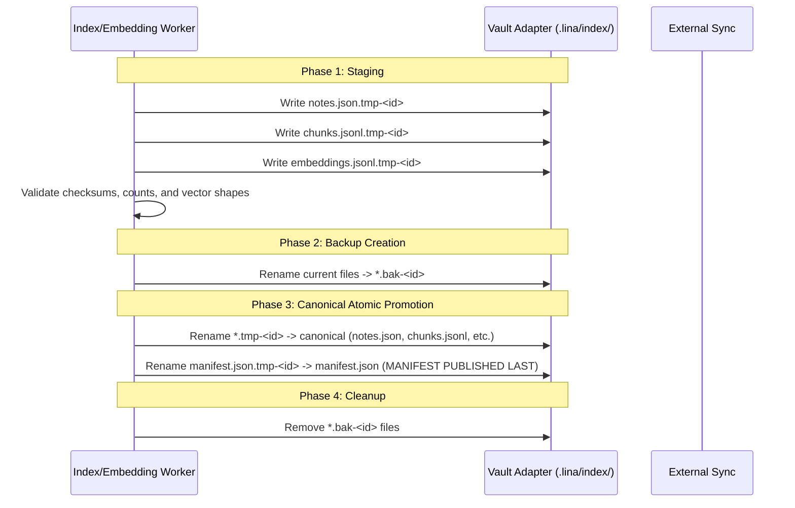

# Lina Architecture — Synchronization Foundations & Multi-Device Coordination

**Status:** Technical Architecture Audit (Read-Only)  
**Author:** Architecture Audit  
**Date:** August 2026  
**Scope:** Multi-device synchronization invariants, provider-agnostic conflict safety, Single-Active-Producer coordination, epoch/generation tracking, and atomic publication mechanics.

---

## 1. Fundamental Synchronization Invariants

Lina's storage architecture is governed by three non-negotiable principles:

1. **Zero-Configuration Correctness:** Lina must maintain complete correctness and data integrity even when every plugin-managed file (including `data.json` and `.lina/*`) is synchronized across devices without any user-configured sync exclusion rules.
2. **Provider Independence:** Lina cannot assume or require knowledge of the underlying synchronization tool. The architecture must operate correctly under Obsidian Sync, Syncthing, Nextcloud, iCloud, Dropbox, OneDrive, Git, or manual filesystem transfers.
3. **Resilience to Asynchronous & Partial Delivery:** External synchronization engines transmit files individually and non-atomically. A device may receive `manifest.json` seconds before or after `chunks.jsonl`. Readers must never crash or enter invalid states when encountering partial or out-of-order file delivery.

---

## 2. Storage Partitioning & Ownership Boundaries

To eliminate write contention across devices, all persistent state is partitioned into four clear ownership tiers:

```
┌────────────────────────────────────────────────────────────────────────────────────────────────────────┐
│                                       STORAGE PARTITIONING MODEL                                       │
├────────────────────────────────────────────────────────────────────────────────────────────────────────┤
│                                                                                                        │
│  1. SHARED CONFIGURATION (`shared-config`)                                                             │
│     • Location: .obsidian/plugins/lina/data.json                                                       │
│     • Ownership: Multi-reader, multi-writer (Last-write-wins at field level)                           │
│     • Content: Global vault preferences only (language, exclusions, UI toggles)                        │
│                                                                                                        │
│  2. DEVICE-SCOPED NAMESPACES (`device-scoped`)                                                         │
│     • Location: .lina/devices/<deviceId>.json                                                          │
│     • Ownership: Strictly Single-Writer (Device X writes ONLY to dev-X.json)                           │
│     • Content: Local hardware limits, device nickname, local model preferences                         │
│                                                                                                        │
│  3. PRODUCER-OWNED ARTIFACTS (`producer-owned`)                                                        │
│     • Location: .lina/index/* (manifest.json, notes.json, chunks.jsonl, embeddings.jsonl, etc.)        │
│     • Ownership: Single-Active-Producer (Coordinated via Epoch & Generation tokens)                    │
│     • Content: Canonical search indices, vectors, binary acceleration caches                           │
│                                                                                                        │
│  4. DEVICE-LOCAL SECRETS (`secret`)                                                                    │
│     • Location: app.secretStorage (Obsidian OS-level / Local credential storage)                       │
│     • Ownership: Strictly Device-Local (NEVER written to vault files or synchronized)                  │
│     • Content: API keys, bearer tokens, provider credentials                                           │
│                                                                                                        │
└────────────────────────────────────────────────────────────────────────────────────────────────────────┘
```

---

## 3. Multiple Producer Analysis & Single-Active-Producer Coordination

### 3.1 The Problem: Uncoordinated Multiple Producers
If two desktop workstations (e.g. Office PC and Home PC) are both configured as Producers:
* If both run background file watchers and index writers simultaneously, they will overwrite `.lina/index/` files concurrently.
* They will re-generate embeddings for the same notes, wasting API quotas and local compute.
* External sync will generate conflict files (e.g. `notes.sync-conflict-20260831.json`), corrupting the index directory.
* Chunk identifiers and vector alignments will diverge, producing split-brain index states.

### 3.2 Why Distributed Locking Fails on File Sync
* **High Latency:** File sync systems take seconds to minutes to propagate files. A lock file (`.lina/lock.json`) cannot provide synchronous mutex semantics.
* **Deadlocks on Disconnect:** If Device A creates a lock and goes offline or sleeps, Device B is permanently locked out.
* **Clock Skew:** Relying on synchronized wall-clock times across disparate machines leads to false expirations and race conditions.

### 3.3 The Solution: Single-Active-Producer with Epoch & Generation Tokens

Instead of distributed locking, Lina adopts a **Single-Writer / Multiple-Reader** model with **optimistic epoch ownership**:

```
                       ┌──────────────────────────────────────┐
                       │ .lina/index/manifest.json            │
                       ├──────────────────────────────────────┤
                       │ "producerId": "dev-Workstation-A",   │
                       │ "producerEpoch": 14,                 │
                       │ "generationId": "gen-k9f2-20260831", │
                       │ "publishedAt": "2026-08-31T18:00:00Z"│
                       └──────────────────┬───────────────────┘
                                          │
                     ┌────────────────────┴────────────────────┐
                     ▼                                         ▼
        [Device A (Active Producer)]              [Device B (Standby Producer)]
        • Matches manifest.producerId             • Sees alien producerId
        • Holds active epoch lease                • Enters standby mode (Passive)
        • Maintains index on file change          • Read-only search active
        • Publishes with generationId++           • Yields background maintenance
```

### 3.4 Operational Scenarios & Conflict Resolutions

| Scenario | Architectural Resolution |
| :--- | :--- |
| **Two Producers Opened Simultaneously** | Both start with known `manifest.producerEpoch`. The first to finish a batch publishes with `generationId_A` and `epoch = E`. When sync delivers this manifest to the second machine, the second detects a newer generation from an external producer, cancels its local in-flight batch, discards pending updates, and ingests the newly published index. |
| **Reconnecting Stale Producer** | Old Producer A reconnects after days offline. Before writing, its `ReconciliationWorker` reads the current `manifest.json`. It observes `generationId` and `publishedAt` are newer and authored by Device B. Device A immediately relinquishes active writer status and operates as a reader until explicitly promoted. |
| **Producer Takeover / Manual Promotion** | When the user explicitly triggers "Set this device as Active Producer" in Settings on Device B: Device B reads the current epoch `E`, increments to `E + 1`, stamps its own `deviceId`, and publishes a new manifest. Device A observes the higher epoch on next sync and automatically demotes to standby. |
| **Split-Brain Prevention** | Companion devices and standby producers only load publications where the manifest matches the notes and chunks count. If an incomplete sync is detected, readers continue using their in-memory cached index without crashing. |
| **Restored Vault Backup** | Restoring an old backup restores both the notes and the matching `.lina/index/` generation. The active producer detects note timestamp drift via `ReconciliationWorker` and performs a clean incremental update. |

---

## 4. Artifact Publication & Conflict Safety

### 4.1 Transactional Publication Protocol
All writes to `.lina/index/` follow a strict four-phase transactional protocol to prevent readers from ever observing partial, corrupt, or mismatched data:



### 4.2 The Manifest-Last Invariant
**Crucial Architectural Rule:** *The publication manifest (`manifest.json`) is ALWAYS written and renamed LAST.*

Because external sync engines transmit files asynchronously:
* If a companion receives new `notes.json` or `chunks.jsonl` first, it continues reading the old index because the existing `manifest.json` references the previous generation.
* Once the new `manifest.json` arrives, the companion reads the manifest and validates:
  $$\text{manifest.totalNotes} == \text{notes.length} \quad \text{AND} \quad \text{manifest.totalChunks} == \text{chunks.length}$$
* If counts do not match (because some chunk files are still syncing), the companion marks the index status as `updating` or `stale` and preserves its existing in-memory search index, preventing UI flicker or broken searches.

---

## 5. Artifact Usability State Machine

The runtime index reader evaluates published artifacts through a formal usability state machine:

```text
               ┌───────────────┐
               │    MISSING    │ (No manifest.json exists)
               └───────┬───────┘
                       │ Valid Manifest & Files Detected
                       ▼
               ┌───────────────┐
               │     READY     │ ◄─────────────────────────────────┐
               └───────┬───────┘                                   │
                       │                                           │
          ┌────────────┴────────────┐                              │
          ▼                         ▼                              │
  ┌───────────────┐         ┌───────────────┐                      │
  │     STALE     │         │    CORRUPT    │                      │
  │ (Vault mtime  │         │ (Count mismatch/                      │
  │  > index time)│         │  Invalid JSON)│                      │
  └───────┬───────┘         └───────┬───────┘                      │
          │                         │                              │
          └────────────┬────────────┘                              │
                       │ Reconciliation / Re-index Completed       │
                       └───────────────────────────────────────────┘
```

* **`missing`:** No `.lina/index/manifest.json` found. Search UI guides user to build index or wait for sync.
* **`ready`:** Manifest exists, all referenced files exist, note/chunk counts match perfectly, binary digests match. Full instant search available.
* **`stale`:** Files are valid and consistent, but vault notes have been modified since index publication. Search remains fully operational over existing index; background reconciliation scheduled on Producer.
* **`corrupt`:** Manifest count mismatch, JSON parse error, or truncated file. Search falls back to text scan; reader never crashes.
* **`incompatible`:** Manifest schema version is higher than supported by current plugin version. Prompts user to update Lina.

---

## 6. Derived Binary Copy Synchronization Safety

The compiled binary vector file (`embeddings.vectors.f32`) provides $O(1)$ zero-parse search loading via `Float32Array`.

### Synchronization Rules for Binary Assets:
1. **Downstream Derivation:** Binary assets are compiled strictly *after* canonical `embeddings.jsonl` is published.
2. **Digest Verification:** `embeddings.binary.manifest.json` contains cryptographic SHA-256 digests (`vectorsDigest`, `metadataDigest`) of the binary files.
3. **Safe Ingestion on Companion:** Before mapping `embeddings.vectors.f32`, the companion computes the digest of the file on disk. If the digest mismatches (due to incomplete sync or network corruption), the companion rejects the binary copy and streams directly from `embeddings.jsonl`.
4. **Self-Healing on Producer:** If a Producer detects a missing or invalid binary copy, `BinaryWorker` automatically recompiles it from `embeddings.jsonl` without re-querying AI embedding providers.

---

## 7. Synchronization-Provider Independence Assessment

| Synchronization System | Expected Behavior & File Handling | Lina Architectural Safeguard |
| :--- | :--- | :--- |
| **Obsidian Sync** | Syncs vault files and optionally `.obsidian/`. Propagates file writes sequentially or in small batches. | Manifest-last validation prevents reading partial batches. `SecretStorage` prevents secret leak even if plugin settings are synced. |
| **Syncthing** | Block-level continuous file synchronization across devices. | Staging `.tmp` files and atomic rename prevent syncing half-written files. Digest check validates binary vector integrity. |
| **iCloud Drive** | May delay file downloads (files marked `.icloud` on demand). | `adapter.read` error handling catches un-downloaded files, marks status `updating`, and preserves in-memory cache without failing. |
| **OneDrive / Dropbox** | Generates conflict copies (e.g. `notes (conflicted copy).json`) on collision. | Lina reads strictly exact paths (`notes.json`); conflict copies are ignored and do not corrupt index state. |
| **Git / Obsidian Git** | Commit-based explicit synchronization. | Transactional publications create clean atomic commits. |

---

## 8. Summary of Synchronization Recommendations

1. **Implement Single-Active-Producer Epoch Tokens:** Embed `producerId`, `producerEpoch`, and `generationId` in `.lina/index/manifest.json`.
2. **Strict Manifest-Last Writing:** Enforce manifest-last atomic promotion in all write coordinators.
3. **Digest Validation on Ingestion:** Verify file lengths and SHA-256 digests before ingesting binary or chunk files.
4. **Isolate Device Configuration:** Use `.lina/devices/<deviceId>.json` to ensure zero write-lock contention across synchronized devices.
