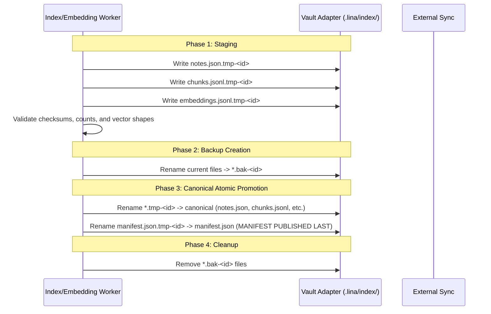

# Lina Architecture — Synchronization Foundations & Multi-Device Coordination

**Status:** Technical Architecture Audit (Read-Only)  
**Author:** Architecture Audit  
**Date:** August 2026  
**Scope:** Multi-device synchronization invariants, provider-agnostic conflict safety, Single-Active-Producer coordination, epoch/generation tracking, and atomic publication mechanics.

---

## 1. Fundamental Synchronization Invariants

Lina's storage architecture is governed by three non-negotiable principles:

1. **Zero-Configuration Correctness:** Lina must maintain complete correctness and data integrity even when every plugin-managed file (including `data.json` and `.lina/*`) is synchronized across devices without any user-configured sync exclusion rules.
2. **Provider Independence:** Lina cannot assume or require knowledge of the underlying synchronization tool. The architecture must operate correctly under Obsidian Sync, Syncthing, Nextcloud, iCloud, Dropbox, OneDrive, Git, or manual filesystem transfers.
3. **Resilience to Asynchronous & Partial Delivery:** External synchronization engines transmit files individually and non-atomically. A device may receive `manifest.json` seconds before or after `chunks.jsonl`. Readers must never crash or enter invalid states when encountering partial or out-of-order file delivery.

---

## 2. Storage Partitioning & Ownership Boundaries

To eliminate write contention across devices, persistent state is partitioned into distinct ownership tiers.

### Current Implemented Storage Tiers (Lina 0.2.x Baseline):

```text
┌────────────────────────────────────────────────────────────────────────────────────────────────────────┐
│                                   CURRENT STORAGE PARTITIONING MODEL                                   │
├────────────────────────────────────────────────────────────────────────────────────────────────────────┤
│                                                                                                        │
│  1. DEVICE IDENTITY (`identity`)                                                                       │
│     • Location: app.loadLocalStorage / app.saveLocalStorage ("lina_device_id")                         │
│     • Ownership: Strictly Device-Local (Platform-independent UUID v4, 100% unsynchronized)             │
│     • Content: Persistent local device identifier                                                      │
│                                                                                                        │
│  2. DEVICE-SCOPED NAMESPACES (`device-scoped`)                                                         │
│     • Location: .lina/devices/<deviceId>.json                                                          │
│     • Ownership: Strictly Single-Writer (Device X writes ONLY to dev-X.json)                           │
│     • Content: Local device role, user-assigned device name, local timestamps                          │
│                                                                                                        │
│  3. GLOBAL OWNERSHIP & AUDIT TRAIL (`ownership-authority`)                                             │
│     • Location: .lina/ownership.json & .lina/ownership-history/                                        │
│     • Ownership: Synchronized Single-Active-Producer (Coordinated via Monotonic Epoch Fencing)          │
│     • Content: Active producer UUID (or null if relinquished), current epoch number, audit history     │
│                                                                                                        │
│  4. PRODUCER-OWNED SHARED ARTIFACTS (`producer-owned`)                                                 │
│     • Location: .lina/index/* (manifest.json, notes.json, chunks.jsonl, embeddings.jsonl, etc.)        │
│     • Ownership: Single-Active-Producer (Gated by OwnershipGate against active epoch)                  │
│     • Content: Canonical search indices, vector embeddings, fast search cache                          │
│                                                                                                        │
│  5. DEVICE-LOCAL SECRETS (`secret`)                                                                    │
│     • Location: app.secretStorage (Obsidian OS-level / local keychain credential storage)              │
│     • Ownership: Strictly Device-Local (NEVER written to vault files or synchronized)                  │
│     • Content: AI provider API keys and credentials                                                    │
│                                                                                                        │
│  6. SHARED CONFIGURATION (`shared-config`)                                                             │
│     • Location: .obsidian/plugins/lina/data.json                                                       │
│     • Ownership: Multi-reader, multi-writer (Global vault preferences)                                 │
│     • Content: Interface language, inbox folder, non-sensitive UI toggles, and (currently) exclusions  │
│                                                                                                        │
└────────────────────────────────────────────────────────────────────────────────────────────────────────┘
```

> [!NOTE]
> **Planned for Phase 0.3.x:** A dedicated tier `exclusion-policy` (`.lina/exclusions.json`) is proposed to move folder and content exclusions out of multi-writer `data.json` and place them under Single-Active-Producer ownership. In the current 0.2.x baseline, exclusions remain in `data.json`.
>
> **Approved for Phase 0.4.x:** A persistent device-local temporary embedding cache for Companion devices, stored strictly outside vault synchronization (leading candidate: host IndexedDB, subject to implementation audit), to cover newly edited notes until canonical Producer embeddings arrive.

---

## 3. Multiple Producer Analysis & Single-Active-Producer Coordination

### 3.1 The Problem: Uncoordinated Multiple Producers
If two desktop workstations (e.g. Office PC and Laptop) are both configured with `role = "producer"`:
* If both run background file watchers and index writers simultaneously, they will overwrite `.lina/index/` files concurrently.
* They will compute vector embeddings for the same notes twice, wasting API quotas and compute.
* External sync will generate conflict files (e.g. `notes.sync-conflict-20260831.json`), corrupting index directories.
* Chunk identifiers and vector alignments will diverge, producing split-brain states.

### 3.2 External Sync Engines are Transport, Not Authority
* **External Sync Is Agnostic:** Obsidian Sync, Syncthing, iCloud, Nextcloud, Git, and Dropbox are purely file delivery transports. They do not understand plugin semantics, transactional locks, or distributed consensus.
* **Why Distributed Locking Fails on File Sync:**
  - **High Latency:** File sync systems take seconds to minutes to deliver files. A lock file (`.lina/lock.json`) cannot provide synchronous mutex semantics.
  - **Deadlocks on Disconnect:** If Device A creates a lock and sleeps, Device B is permanently locked out.
  - **Clock Skew:** Relying on wall-clock times across disparate machines leads to false expirations and race conditions.

### 3.3 The Solution: Single-Active-Producer with Epoch Fencing

Instead of distributed file locking, Lina enforces single-writer safety through an authoritative shared ownership manifest (`.lina/ownership.json`) backed by **Monotonic Epoch Fencing**:

```text
                       ┌──────────────────────────────────────┐
                       │ .lina/ownership.json                 │
                       ├──────────────────────────────────────┤
                       │ "activeProducerId": "dev-Desktop-A", │
                       │ "epoch": 14,                         │
                       │ "reason": "manual-transfer"          │
                       └──────────────────┬───────────────────┘
                                          │
                     ┌────────────────────┴────────────────────┐
                     ▼                                         ▼
        [Device A (Active Producer)]              [Device B (Standby Producer)]
        • Matches manifest.activeProducerId       • Sees different activeProducerId
        • Holds active epoch lease                • Enters standby mode (Passive)
        • Maintains index and embeddings          • Read-only search active
        • Writes stamped with epoch 14            • Yields background maintenance
```

### 3.4 Operational Scenarios & Conflict Resolutions

| Scenario | Architectural Resolution |
| :--- | :--- |
| **Two Producers Configured in Same Vault** | Only one device is recorded as `activeProducerId` in `.lina/ownership.json`. The other device operates as a **Standby Producer** (`authorized = false`). Standby producers safely skip background write batches. |
| **Reconnecting Stale Producer** | Old Producer A wakes up after days offline. Before executing a write, `OwnershipGate` re-reads `.lina/ownership.json`. If sync delivered an updated manifest with a higher epoch or different producer, Producer A immediately disarms its workers without mutating shared files. |
| **Manual Producer Promotion (Transfer)** | When the user on Standby Producer B initiates "Make this device the Active Producer", B prepares an explicit transfer preview, requires confirmation, atomically increments epoch $E \to E + 1$, and records `activeProducerId = deviceB`. When sync delivers the updated manifest to Device A, A detects the higher epoch and yields. |
| **Demotion & Relinquish** | When an Active Producer at epoch $E$ is demoted to Companion, it relinquishes authority first at epoch $E + 1$ (`activeProducerId = null`, reason `"relinquish"`), stops all workers, and persists `role = "companion"`. The vault remains safe without an active publisher until another Producer explicitly takes over. |
| **Synchronization Convergence Reality** | Local authority revocation is immediate on the acting device. Remote devices converge when external sync software delivers the updated manifest file. Remote fencing is not instantaneous before sync delivers updates. |
| **Split-Brain Prevention** | Companions and standby producers only load publications where index manifests match note and chunk counts. If sync is in-flight, readers retain their in-memory cached index without crashing or flickering. |


---

## 4. Artifact Publication & Conflict Safety

### 4.1 Transactional Publication Protocol
All writes to `.lina/index/` follow a strict four-phase transactional protocol to prevent readers from ever observing partial, corrupt, or mismatched data:



### 4.2 The Manifest-Last Invariant
**Crucial Architectural Rule:** *The publication manifest (`manifest.json`) is ALWAYS written and renamed LAST.*

Because external sync engines transmit files asynchronously:
* If a companion receives new `notes.json` or `chunks.jsonl` first, it continues reading the old index because the existing `manifest.json` references the previous generation.
* Once the new `manifest.json` arrives, the companion reads the manifest and validates:
  $$\text{manifest.totalNotes} == \text{notes.length} \quad \text{AND} \quad \text{manifest.totalChunks} == \text{chunks.length}$$
* If counts do not match (because some chunk files are still syncing), the companion marks the index status as `updating` or `stale` and preserves its existing in-memory search index, preventing UI flicker or broken searches.

---

## 5. Artifact Usability State Machine

The runtime index reader evaluates published artifacts through a formal usability state machine:

```text
               ┌───────────────┐
               │    MISSING    │ (No manifest.json exists)
               └───────┬───────┘
                       │ Valid Manifest & Files Detected
                       ▼
               ┌───────────────┐
               │     READY     │ ◄─────────────────────────────────┐
               └───────┬───────┘                                   │
                       │                                           │
          ┌────────────┴────────────┐                              │
          ▼                         ▼                              │
  ┌───────────────┐         ┌───────────────┐                      │
  │     STALE     │         │    CORRUPT    │                      │
  │ (Vault mtime  │         │ (Count mismatch/                      │
  │  > index time)│         │  Invalid JSON)│                      │
  └───────┬───────┘         └───────┬───────┘                      │
          │                         │                              │
          └────────────┬────────────┘                              │
                       │ Reconciliation / Re-index Completed       │
                       └───────────────────────────────────────────┘
```

* **`missing`:** No `.lina/index/manifest.json` found. Search UI guides user to build index or wait for sync.
* **`ready`:** Manifest exists, all referenced files exist, note/chunk counts match perfectly, binary digests match. Full instant search available.
* **`stale`:** Files are valid and consistent, but vault notes have been modified since index publication. Search remains fully operational over existing index; background reconciliation scheduled on Producer.
* **`corrupt`:** Manifest count mismatch, JSON parse error, or truncated file. Search falls back to text scan; reader never crashes.
* **`incompatible`:** Manifest schema version is higher than supported by current plugin version. Prompts user to update Lina.

---

## 6. Derived Binary Copy Synchronization Safety

The compiled binary vector file (`embeddings.vectors.f32`) provides $O(1)$ zero-parse search loading via `Float32Array`.

### Synchronization Rules for Binary Assets:
1. **Downstream Derivation:** Binary assets are compiled strictly *after* canonical `embeddings.jsonl` is published.
2. **Digest Verification:** `embeddings.binary.manifest.json` contains cryptographic SHA-256 digests (`vectorsDigest`, `metadataDigest`) of the binary files.
3. **Safe Ingestion on Companion:** Before mapping `embeddings.vectors.f32`, the companion computes the digest of the file on disk. If the digest mismatches (due to incomplete sync or network corruption), the companion rejects the binary copy and streams directly from `embeddings.jsonl`.
4. **Self-Healing on Producer:** If a Producer detects a missing or invalid binary copy, `BinaryWorker` automatically recompiles it from `embeddings.jsonl` without re-querying AI embedding providers.

---

## 7. Synchronization-Provider Independence Assessment

| Synchronization System | Expected Behavior & File Handling | Lina Architectural Safeguard |
| :--- | :--- | :--- |
| **Obsidian Sync** | Syncs vault files and optionally `.obsidian/`. Propagates file writes sequentially or in small batches. | Manifest-last validation prevents reading partial batches. `SecretStorage` prevents secret leak even if plugin settings are synced. |
| **Syncthing** | Block-level continuous file synchronization across devices. | Staging `.tmp` files and atomic rename prevent syncing half-written files. Digest check validates binary vector integrity. |
| **iCloud Drive** | May delay file downloads (files marked `.icloud` on demand). | `adapter.read` error handling catches un-downloaded files, marks status `updating`, and preserves in-memory cache without failing. |
| **OneDrive / Dropbox** | Generates conflict copies (e.g. `notes (conflicted copy).json`) on collision. | Lina reads strictly exact paths (`notes.json`); conflict copies are ignored and do not corrupt index state. |
| **Git / Obsidian Git** | Commit-based explicit synchronization. | Transactional publications create clean atomic commits. |

---

## 8. Mobile Filesystem Staged Promotion & Rollback Persistence (Phase 0.2.4)

### 8.1 The Mobile Adapter Collision Problem
On Obsidian Desktop (Node.js filesystem environment), renaming a staging file over an existing destination (`adapter.rename(temp, canonical)`) replaces the target file directly at the OS filesystem level.

However, on Obsidian Mobile storage abstraction layers (observed directly in Android runtime and modeled in automated tests), invoking `adapter.rename()` when the destination already exists throws:
```text
Destination file already exists!
```
This caused systematic write failures when attempting to update device-scoped state (`.lina/devices/<deviceId>.json`) or the ownership manifest (`.lina/ownership.json`) on mobile devices during bootstrap or role assignment.

### 8.2 Staged Promotion Sequence with Rollback
To avoid write collisions on adapters where `rename` cannot overwrite an existing file, persistence in `src/device/deviceState.ts` and `src/device/deviceOwnership.ts` implements a multi-step promotion sequence with error recovery:

1. **Write Staging File:** Write serialized JSON payload to an isolated temporary file:
   `temporaryPath = ${targetPath}.tmp-${suffix}`
2. **Back Up Existing Canonical Target:** If `targetPath` already exists, move the current canonical file to a temporary backup:
   `backupPath = ${targetPath}.bak-${suffix}`
   `await adapter.rename(targetPath, backupPath)`
3. **Promote Staging to Canonical:** Move the temporary file into the canonical destination:
   `await adapter.rename(temporaryPath, targetPath)`
4. **Clean Up Backup on Success:** After canonical promotion succeeds, attempt to remove `backupPath`:
   `await adapter.remove(backupPath)`
5. **Roll Back on Failure:** If any error occurs during the sequence:
   - Remove `temporaryPath` if present;
   - If backup was performed, remove any incomplete `targetPath` and restore the backup:
     `await adapter.rename(backupPath, targetPath)`

### 8.3 Invariants, Scope & Validation Evidence:
- **Promotion with Recovery, Not Single-Op OS Atomicity:** This mechanism is a staged application-level sequence with rollback across discrete adapter calls, rather than an operating system atomic primitive.
- **Validation Scope:** Validated through automated regression tests using `FakeAdapter` in strict mobile mode (`strictMobileRenameMode`), and reproduced/observed directly in Android runtime. Broad manual validation across iOS or other platforms has not been performed.
- **Operation-Scoped Rollback:** Rollback protects against exceptions during the active save operation.
- **Post-Crash `.bak-*` Cleanup:** Unlinked leftover `.bak-*` files from abrupt application crashes are not deleted automatically in 0.2.4 pending a unified canonical recovery specification, avoiding premature deletion of diagnostic traces.

---

## 9. Summary of Synchronization Recommendations

1. **Implement Single-Active-Producer Epoch Tokens:** Embed `producerId`, `producerEpoch`, and `generationId` in `.lina/index/manifest.json`.
2. **Strict Manifest-Last Writing:** Enforce manifest-last atomic promotion in all write coordinators.
3. **Digest Validation on Ingestion:** Verify file lengths and SHA-256 digests before ingesting binary or chunk files.
4. **Isolate Device Configuration:** Use `.lina/devices/<deviceId>.json` to ensure zero write-lock contention across synchronized devices.
