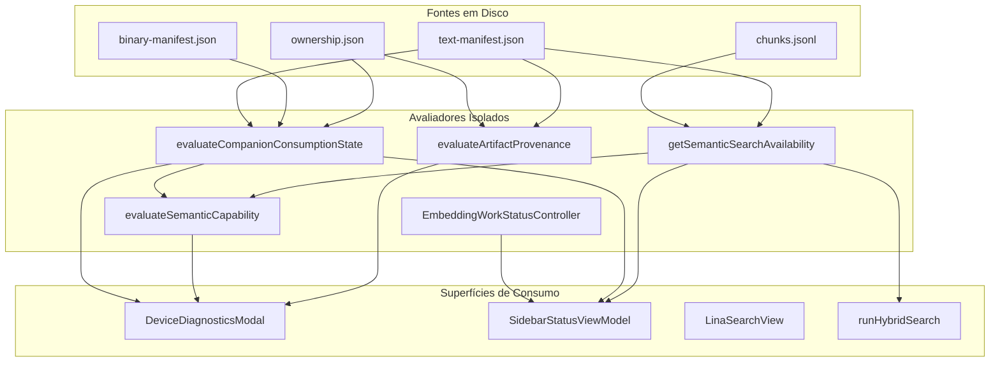

# LINA-07-AUDIT-SEMANTIC-CAPABILITY-CONSISTENCY-001

## Auditoria Arquitetural da Consistência da Capacidade Semântica

**Data:** 28 de Setembro de 2026
**Papel:** Arquiteto de Software Sénior
**Estado:** Concluído
**Tipo:** Exclusivamente Auditoria (Sem alterações de código, UI, schemas, migrations ou commits)

---

# 1. Resumo executivo

Após a introdução com sucesso do `DeviceRuntimeState` (tarefa `LINA-06`), a consistência do modelo de **ownership, papéis de dispositivo e autoridade de publicação** ficou consolidada numa fonte de verdade única (`.lina/ownership.json` e `.lina/devices/<deviceId>.json`). No entanto, foram observadas divergências funcionais e visuais graves na camada de **pesquisa semântica e embeddings**, exemplificadas por:

1. **Diagnostics:** Classifica os embeddings canónicos (JSONL) como `Desatualizado (época 1 vs época ativa 3)`, enquanto o princípio arquitetural basilar do Lina estabelece que a antiguidade da época é não-bloqueante para a pesquisa (`non-blocking search usability`).
2. **Sidebar:** Apresenta `Embeddings: Estado desconhecido` e `Pesquisa semântica indisponível`, enquanto no vault existem ficheiros válidos e o índice textual está operacional.
3. **Diagnostics / Search Capability:** Apresenta o modo de consumo como `Pesquisa Completa (Texto + Vetores)`, enquanto na mesma grelha indica `Embeddings indisponíveis`.

Esta auditoria identificou que a causa raiz reside na **fragmentação de responsabilidades e na mistura de 4 conceitos ortogonais**:
- **Existência Física do Artefacto:** Se os ficheiros `chunks.jsonl` ou `embeddings.bin` existem no vault.
- **Compatibilidade do Contrato Vetorial:** Se o provider, modelo, dimensões e prefix-mode coincidem entre o artefacto publicado e a configuração do dispositivo local.
- **Proveniência e Frescura:** Se a época de publicação corresponde à época de ownership ativa (relevante para manutenção/escrita, irrelevante para execução de pesquisa).
- **Prontidão e Disponibilidade Operacional:** Se o runtime em memória (`RuntimeEmbeddingIndex` ou provider HTTP ativo) consegue processar a query do utilizador no instante atual.

Atualmente, **quatro subsistemas distintos** tomam decisões unilaterais sobre disponibilidade semântica:
1. `getSemanticSearchAvailability()` em `src/search/hybridSearch.ts`.
2. `evaluateSemanticCapability()` em `src/search/semanticCapability.ts`.
3. `evaluateCompanionConsumptionState()` em `src/companion/companionConsumptionState.ts`.
4. `EmbeddingWorkStatusController` + `buildSidebarStatusViewModel()` em `src/search/sidebarStatusViewModel.ts`.

A auditoria define de forma inequívoca o componente canónico de decisão e o modelo unificado que deve alimentar todas as superfícies do Lina.

---

# 2. Fontes atuais de estado

O mapeamento detalhado das estruturas e fontes de cálculo atuais revela uma dispersão de termos e verificações:

| Termo / Propriedade | Ficheiro Fonte | O que avalia | Quem consome |
| :--- | :--- | :--- | :--- |
| `embeddingStatus` / `readEmbeddingStatus()` | `src/index/embeddingGenerator.ts` | Lê `text-manifest.json`, chunks e `chunks.jsonl`. Avalia registos canónicos válidos, desatualizados e obsoletos. | `EmbeddingWorkStatusController`, `main.ts`, `linaSearchView.ts`. |
| `semanticCompatibility` / `getSemanticSearchAvailability()` | `src/search/hybridSearch.ts` | Avalia se o ficheiro físico existe, se provider/modelo coincidem com o dispositivo e se o binário ou memória tem vetores utilizáveis. | `runHybridSearch()`, `linaSearchView.ts`, `main.ts` (`getDeviceDiagnostics`). |
| `companionState` / `evaluateCompanionConsumptionState()` | `src/companion/companionConsumptionState.ts` | Avalia manifestos no disco (`text-manifest.json` e `binary-manifest.json`), digestos SHA-256 e proveniência contra `ownership.json`. | `linaSearchView.ts`, `deviceDiagnostics.ts`, `sidebarStatusViewModel.ts`. |
| `semanticCapability` / `evaluateSemanticCapability()` | `src/search/semanticCapability.ts` | Função pura criada para sintetizar `textIndexAvailable`, `embeddingsDeclared`, `vectorContractState` e `semanticCompatibility`. | `deviceDiagnostics.ts`, `deviceRuntimeState.ts`. |
| `workState` / `EmbeddingWorkStatusController` | `src/index/embeddingWorkStatusController.ts` | Monitoriza se há necessidade de trabalho de embeddings (`dirty`, `ready`, `unknown`, `calculating`) através de debounce de 250ms. | `linaSearchView.ts`, `sidebarStatusViewModel.ts`. |
| `artifactProvenance` / `evaluateArtifactProvenance()` | `src/device/artifactProvenanceValidation.ts` | Compara `producerEpoch` do artefacto com a época de `ownership.json`. | `deviceDiagnostics.ts`, `companionConsumptionState.ts`. |

### Análise dos Módulos Principais

1. **`embeddingPersistence` / `indexStore`:**
   - Publica `.lina/index/text-manifest.json` com `embeddingsEnabled` e secção opcional `embeddings`.
   - Publica `.lina/index/chunks.jsonl` (formato canónico JSONL).
2. **`embeddingBinaryStorage`:**
   - Mantém `.lina/index/binary-manifest.json` e ficheiros `.bin` locais/publicados.
   - Fornece `binaryRecordCount`, `dimensions`, `provider`, `model`.
3. **`VectorContract`:**
   - Define o contrato formal (`VectorContractV1`) contendo provider, model, dimensions, prefixMode e threshold.
   - A avaliação em `vectorContract.ts` compara estritamente as propriedades matemáticas.
4. **`DeviceRuntimeState`:**
   - Atualmente já inclui a secção `embeddings: DeviceRuntimeEmbeddingsState`, mas esta secção **não está a ser consumida** nem pela Sidebar nem pelo Modal de Diagnóstico nem pelo Search View.

---

# 3. Fluxo de decisão atual

Atualmente não existe uma cadeia de decisão hierárquica unificada. Cada consumidor constrói a sua própria lógica ad-hoc:



### Problemas do Fluxo Atual
1. **Curto-circuito do `DeviceRuntimeState`:** O `main.ts` compõe o `DeviceRuntimeState`, mas o `LinaSearchView` continua a invocar diretamente `readCompanionConsumptionState()`, `getSemanticSearchAvailability()` e `EmbeddingWorkStatusController`, ignorando `runtimeState.embeddings`.
2. **Desfasamento Temporal e Assíncrono:**
   - `EmbeddingWorkStatusController` arranca com `status: "unknown"` e atrasa o primeiro cálculo 250ms via timer.
   - O `LinaSearchView` renderiza a UI antes desses 250ms terminarem.
3. **Conflito Semântico entre Modo de Consumo e Prontidão do Dispositivo:**
   - `evaluateCompanionConsumptionState()` decide o modo teórico do cofre (`consumptionMode: "full"` se os artefactos existirem no cofre).
   - `getSemanticSearchAvailability()` decide a capacidade do dispositivo local (`available: false` se o Ollama local estiver desligado ou o modelo local configurado for diferente).
   - O diagnóstico e a sidebar misturam estes dois conceitos, mostrando badge de erro e modo de sucesso na mesma linha.

---

# 4. Divergências encontradas

### Divergência 1: Diagnostics — Embeddings Canónicos "Desatualizado (época 1 vs época ativa 3)"
- **Localização:** `src/device/artifactProvenanceValidation.ts` e `src/device/deviceDiagnostics.ts` (linhas 303-315).
- **Mecanismo:** A função `evaluateArtifactProvenance` compara a época do manifesto dos embeddings (`producerEpoch: 1`) com o `ownership.json` atual (`epoch: 3`). Como `1 < 3`, atribui `status: "stale"`.
- **Divergência:** Na secção de artefactos, isto é apresentado com a etiqueta `Desatualizado`. Contudo, o utilizador interpreta `Desatualizado` como "os embeddings não servem" ou "estão corrompidos". O invariante arquitetural do Lina dita que embeddings de épocas passadas permanecem 100% pesquisáveis. A classificação de proveniência de autoria (quem gerou) foi confundida com validade funcional (se pode ser lido).

### Divergência 2: Sidebar — "Embeddings: Estado desconhecido / Pesquisa semântica indisponível"
- **Localização:** `src/search/sidebarStatusViewModel.ts` (linhas 325-349) e `src/index/embeddingWorkStatusController.ts`.
- **Mecanismo:**
  1. No arranque, o `EmbeddingWorkStatusController` tem estado `"unknown"` e agenda um timer de 250ms para avaliar o sumário.
  2. O `LinaSearchView.refreshState()` constrói o `sidebarStatusViewModel` imediatamente.
  3. No `sidebarStatusViewModel.ts`:
     ```typescript
     let embeddingsStatus: SidebarFreshnessStatus;
     if (!embeddingsEnabled) {
       embeddingsStatus = "disabled";
     } else if (embeddingsChecking) {
       embeddingsStatus = "unknown";
     } else if (!embeddingsReady && !effectiveEmbeddingsUpdated && !companionState?.embeddingState.available) {
       embeddingsStatus = "missing";
     ...
     } else {
       embeddingsStatus = embeddingsReady ? "fresh" : "unknown";
     }
     ```
  4. Quando `companionState.embeddingState.available` é `true` (artefactos existem no disco), a condição de `missing` falha. Se não houver timestamp de atualização local e `embeddingsReady` for falso, cai no `else`: `embeddingsStatus = "unknown"`.
  5. Como resultado, o texto apresentado é `sidebarFreshnessUnknown` ("Estado desconhecido"). E como `semanticAvailable` do `getSemanticSearchAvailability()` deu falso (ou ainda não completou), a headline exibe `sidebarSearchSemanticUnavailable` ("Pesquisa semântica indisponível").

### Divergência 3: Diagnostics — "Pesquisa Completa (Texto + Vetores)" vs "Embeddings indisponíveis"
- **Localização:** `src/device/deviceDiagnosticsModal.ts` (linhas 255-278).
- **Mecanismo:**
  - O Modal exibe o Modo através de:
    ```typescript
    const effectiveDisplayMode = this.diagnostics.companionSearch.operationalMode ?? this.diagnostics.companionSearch.mode;
    compGrid.createDiv({ text: this.getCompanionModeLabel(effectiveDisplayMode) });
    ```
  - E exibe os Artefactos através de:
    ```typescript
    if (this.diagnostics.companionSearch.embeddingsAvailable) {
      artifactsList.push(this.L.deviceDiagnosticsCompanionEmbeddingsAvailable);
    } else {
      artifactsList.push(this.L.deviceDiagnosticsCompanionEmbeddingsMissing); // "Embeddings indisponíveis"
    }
    ```
  - Em `readDeviceDiagnostics` (`src/device/deviceDiagnostics.ts`):
    - `embeddingsAvailable` é mapeado a partir de `companionState.artifactAvailability.embeddings === "available"`.
    - No `companionConsumptionState.ts`, se `manifest.embeddingsEnabled` for true mas a secção `manifest.embeddings` não tiver provider/modelo estruturados no formato antigo (por exemplo, porque foi publicado com Vector Contract v1), `artifactAvailability.embeddings` é classificado como `"invalid"`.
    - Logo, `embeddingsAvailable` fica `false` -> UI imprime: `Embeddings indisponíveis`.
    - Por outro lado, se `operationalMode` for `"full"` (porque `semanticAvailability` local respondeu OK via binário), ou se fizer fallback para `companionSearch.mode` ("full"), a UI imprime: `Pesquisa Completa (Texto + Vetores)`.
  - O utilizador vê em duas linhas consecutivas:
    - **Modo:** `Pesquisa Completa (Texto + Vetores)`
    - **Artefactos:** `Índice textual disponível • Embeddings indisponíveis`

---

# 5. Causa provável

A causa estrutural é a **ausência de separação explícita entre as 4 dimensões de capacidade**:

1. **Confusão entre "Artefacto no Cofre" e "Capacidade do Dispositivo Local":**
   - O `CompanionArtifactConsumptionState` avalia se o *cofre partilhado* tem ficheiros que representam embeddings.
   - O `SemanticCompatibility` avalia se o *dispositivo local* tem um modelo capaz de calcular o embedding da query do utilizador para interrogar esse índice.
   - O diagnóstico e a sidebar misturam estas duas perguntas numa única propriedade booleana `available`.

2. **Confusão entre "Proveniência Histórica" e "Validade Matemática":**
   - A proveniência (`ArtifactProvenanceValidationResult`) destina-se exclusivamente a auditoria de autoria e governação de escrita (saber se o Produtor ativo atual foi quem publicou ou se foi uma máquina anterior).
   - O runtime tratou o status `stale` da proveniência como se fosse um impedimento de consumo ou sinal de degradação da pesquisa.

3. **Fallback Incorreto no Diagnóstico:**
   - Em `deviceDiagnosticsModal.ts`, a linha:
     `const effectiveDisplayMode = this.diagnostics.companionSearch.operationalMode ?? this.diagnostics.companionSearch.mode;`
     faz fallback para `mode` (capacidade teórica do cofre) quando a capacidade operacional falha ou está indefinida, mascarando a indisponibilidade real e gerando texto contraditório com o badge.

4. **Ciclo de Vida Assíncrono Desincronizado na Sidebar:**
   - A Sidebar não espera pela resolução da prontidão semântica; renderiza estados intermédios e provisórios (`unknown`), expondo ao utilizador artefactos temporais de inicialização.

---

# 6. Fonte única recomendada

A disponibilidade da pesquisa semântica não pode ser decidida por vistas (modais, sidebars) nem por avaliadores parciais de ficheiros de disco.

### A Fonte Única de Verdade Arquitetural

A única fonte que deve decidir se a pesquisa semântica está operacionalmente disponível é o:

```text
SemanticCapabilityResolver (centralizado no DeviceRuntimeState.embeddings)
```

Alimentado pelo motor de compatibilidade operacional de baixo nível:

```text
getSemanticSearchAvailability() (em src/search/hybridSearch.ts)
```

### O Modelo Canónico de 4 Níveis

Todas as superfícies (Sidebar, Search View, Diagnostics Modal, Settings) devem obrigatoriamente consumir o mesmo nó: `deviceRuntimeState.embeddings`, que decompõe o estado em 4 níveis estritos e ortogonais:

```typescript
export interface DeviceRuntimeEmbeddingsState {
  // Nível 1: Existência Física no Cofre
  readonly textIndexAvailable: boolean;
  readonly embeddingsDeclared: boolean;
  readonly vectorFileState: "available" | "missing" | "empty" | "invalid";

  // Nível 2: Compatibilidade do Contrato Vetorial
  readonly contractState: "compatible" | "mismatch" | "none";
  readonly targetVectorContract?: VectorContractV1;

  // Nível 3: Prontidão Operacional do Runtime Local
  readonly runtimeState: "ready" | "checking" | "unavailable";
  readonly localProviderReachable: boolean;

  // Nível 4: Capacidade Efetiva para o Utilizador
  readonly semanticAvailable: boolean; // TRUE apenas se Nível 1 OK + Nível 2 OK + Nível 3 OK
  readonly effectiveMode: "full" | "text-only" | "unavailable";
  readonly reasonCode?: SemanticOperationalReasonCode;
  readonly reason?: string;
}
```

### Regras de Ouro da Resolução
1. **Regra da Não-Bloqueância por Época:** A época de publicação (`producerEpoch`) e o status de proveniência (`stale`, `valid`) pertencem exclusivamente a `DeviceDiagnosticsArtifactsSection` e nunca afetam `semanticAvailable` nem `effectiveMode`.
2. **Regra da Conjunção Estrita:** `semanticAvailable` é estritamente:
   $$\text{vectorFileState} = \text{"available"} \land \text{contractState} = \text{"compatible"} \land \text{runtimeState} = \text{"ready"}$$
3. **Regra da UI Determinística:**
   - Se `semanticAvailable === true` $\to$ Modo é `full` ("Pesquisa Completa (Texto + Vetores)").
   - Se `semanticAvailable === false` $\land \text{textIndexAvailable} === true$ $\to$ Modo é `text-only` ("Apenas Texto").
   - É proibido exibir "Pesquisa Completa" se `semanticAvailable` for `false`.

---

# 7. Alterações futuras necessárias

Quando for autorizada a implementação (tarefa posterior), serão necessárias as seguintes alterações coordenadas:

1. **Consolidação do `DeviceRuntimeState` no Plugin:**
   - Fazer com que `refreshDeviceRuntimeState()` em `main.ts` execute a resolução completa de `embeddings` uma única vez, mantendo-o em cache de memória.
   - `LinaSearchView` e `DeviceDiagnosticsModal` devem ler exclusivamente `plugin.getDeviceRuntimeState().embeddings`.
2. **Correção de `deviceDiagnosticsModal.ts`:**
   - Eliminar o fallback `operationalMode ?? companionSearch.mode`.
   - Utilizar estritamente `runtimeState.embeddings.effectiveMode`.
   - Clarificar os rótulos de artefactos: distinguir "Artefacto Publicado no Cofre" de "Disponibilidade no Dispositivo".
3. **Harmonização do `sidebarStatusViewModel.ts`:**
   - Eliminar a lógica redundante de cálculo de frescura que gera `"unknown"` quando os embeddings existem mas ainda não foram indexados em memória local.
   - Receber diretamente `runtimeState.embeddings.semanticAvailable` e `runtimeState.embeddings.effectiveMode`.
   - Se o estado estiver em cálculo (`checking`), exibir explicitamente "A verificar..." em vez de "Estado desconhecido".
4. **Alinhamento do `companionConsumptionState.ts` com Vector Contract v1:**
   - Corrigir a extração de metadados em `companionConsumptionState` para reconhecer o novo formato de manifesto onde o provider e o modelo se encontram normalizados no `vectorContract`.

---

# 8. Riscos

1. **Latência de Inicialização no Mobile (Android):**
   - Verificar a disponibilidade semântica (`getSemanticSearchAvailability`) pode envolver leitura de metadados ou contacto com endpoints de IA.
   - **Mitigação:** Manter a verificação não-bloqueante (`isChecking`), permitindo que a pesquisa textual arranque imediatamente em modo `text-only` enquanto a verificação semântica ocorre em background, transitando suavemente para `full` quando pronta.
2. **Concorrência entre Watchers de Ficheiros e Rerender da UI:**
   - Durante a sincronização (Obsidian Sync / Syncthing), os ficheiros de manifesto e binários podem chegar em momentos ligeiramente desfasados.
   - **Mitigação:** Respeitar os digests criptográficos (`computeTextArtifactDigest`) antes de declarar os ficheiros fisicamente utilizáveis. Se os digests estiverem em transição, manter temporariamente o estado seguro anterior.
3. **Divergência entre Modo Companion e Produtor Standby:**
   - Um Produtor Standby tem capacidade técnica de gerar embeddings, mas não tem autorização para publicar. Não se deve confundir a capacidade de pesquisa (consumo) com a autoridade de escrita (manutenção).
   - **Mitigação:** A autoridade de escrita é governada por `canPublish` do `DeviceRuntimeState`. A capacidade de pesquisa é governada por `embeddings.semanticAvailable`. Devem permanecer completamente desacopladas.

---

# Condição de paragem — Resposta inequívoca

> **Qual é o componente responsável por decidir a disponibilidade da pesquisa semântica?**

O componente único e exclusivo responsável por decidir a disponibilidade da pesquisa semântica no Lina é o:

### `getSemanticSearchAvailability()` (em `src/search/hybridSearch.ts`), consolidado e exposto para toda a aplicação através de `DeviceRuntimeState.embeddings` (em `src/device/deviceRuntimeState.ts`).

Nenhuma superfície de interface (Sidebar Status, Search View, Diagnostics Modal ou Settings) tem autoridade para inspecionar manifestos em disco, épocas de proveniência ou modos teóricos de consumo para determinar se a pesquisa semântica pode ser executada. Todas as superfícies devem consultar exclusivamente:

```typescript
plugin.getDeviceRuntimeState().embeddings.semanticAvailable
```

e o correspondente:

```typescript
plugin.getDeviceRuntimeState().embeddings.effectiveMode
```
