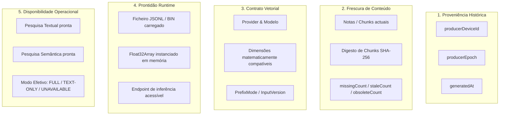

# LINA-08-AUDIT-SEMANTIC-STATUS-PRESENTATION-001

## Auditoria Arquitetural da Coerência entre Estado Semântico, Proveniência de Embeddings e Apresentação na Interface do Lina

**Data:** 29 de Setembro de 2026
**Papel:** Arquiteto de Software Sénior
**Estado:** Concluído
**Tipo:** Exclusivamente Auditoria (Sem alterações de código, UI, schemas, migrations ou commits)
**Documento de Referência:** [`docs/audits/architecture/LINA-08-AUDIT-SEMANTIC-STATUS-PRESENTATION-001.md`](file:///d:/_dev/obsidian/lina/docs/audits/architecture/LINA-08-AUDIT-SEMANTIC-STATUS-PRESENTATION-001.md)

---

# 1. Resumo executivo

Esta auditoria resolve as incoerências de apresentação e semântica entre a camada de persistência/proveniência de embeddings, o runtime de pesquisa semântica e as diferentes superfícies visuais do Lina (**Sidebar**, **Device Diagnostics Modal**, **Search View** e a ação **"Atualizar embeddings"**).

O contexto que motivou esta auditoria reflete uma situação real observada no cofre:
- **Ownership:** Epoch ativa = 3 (`.lina/ownership.json`).
- **Embeddings:** Publicados na Epoch 1 (`.lina/index/manifest.json`).
- **Vector Contract:** Compatível (mesmo provider, modelo e dimensões).
- **Notas/Chunks do cofre:** Inalterados e sincronizados com os vetores.
- **Pesquisa Semântica / Híbrida:** 100% operacional no runtime.

Contudo, a interface do utilizador emitia simultaneamente quatro mensagens contraditórias:
1. **Diagnostics:** Informava `Pesquisa Completa (Texto + Vetores)` e `Embeddings disponíveis`, mas marcava o artefacto como `⚠ Desatualizado` com o detalhe `época 1 vs época ativa 3`.
2. **Sidebar:** Indicava no cabeçalho `Pesquisa híbrida disponível`, mas no acordeão de estado apresentava `Embeddings: Estado desconhecido`.
3. **Ação "Atualizar embeddings":** Ao tentar retificar o suposto estado desatualizado, o utilizador recebia a notificação: `Os embeddings já se encontram atualizados.`, sem qualquer alteração aos artefactos.

### Respostas inequívocas às perguntas centrais

1. **Porque é que embeddings operacionalmente válidos continuam a aparecer como `Desatualizado`?**
   Porque o módulo [`src/device/artifactProvenanceValidation.ts`](file:///d:/_dev/obsidian/lina/src/device/artifactProvenanceValidation.ts#L147) classifica qualquer artefacto com `producerEpoch < ownershipEpoch` como `status: "stale"`, e [`deviceDiagnosticsModal.ts`](file:///d:/_dev/obsidian/lina/src/device/deviceDiagnosticsModal.ts#L512) traduz `stale` para a string de UI [`deviceDiagnosticsBadgeStale`](file:///d:/_dev/obsidian/lina/src/i18n/strings.ts#L1870) (`"⚠ Desatualizado"`). Houve uma sobreposição errónea entre **proveniência de época anterior** (origem histórica de quem escreveu) e **frescura de conteúdo** (se as notas foram alteradas).

2. **Porque é que a Sidebar continua a apresentar `Estado desconhecido` quando `semanticAvailable === true`?**
   Porque a Sidebar possui dois canais concorrentes: o modo de pesquisa lê `runtimeEmbeddings.semanticAvailable` (verdadeiro), mas a linha de estado no acordeão lê `freshness.embeddings`, a qual cai em `"unknown"` por dois desvios:
   - Lê `companionState.embeddingFreshness`, que quando não existe heartbeat de produtor ([`.lina/producer-state.json`](file:///d:/_dev/obsidian/lina/src/device/producerState.ts#L298)) devolve a string `"unknown"`. Como `"unknown"` é truthy em JavaScript, [`sidebarStatusViewModel.ts`](file:///d:/_dev/obsidian/lina/src/search/sidebarStatusViewModel.ts#L342) fixa o estado em `"unknown"` e ignora o `runtimeEmbeddings` que já estava `ready`.
   - Se o sensor preguiçoso [`EmbeddingWorkStatusController`](file:///d:/_dev/obsidian/lina/src/index/embeddingWorkStatusController.ts#L108) estiver no seu estado inicial `"unknown"` ou em debounce, a Sidebar traduz isso para `embeddingsChecking = true` e marca o badge como `"unknown"`.

3. **Quando `Atualizar embeddings` conclui que os embeddings já estão atuais, deve manter a proveniência antiga ou atualizar metadados sem regenerar vetores?**
   **Deve manter estritamente a proveniência antiga (Opção A).** A proveniência é um registo histórico factual auditável de quem gerou os vetores. Mutações na posse do cofre (epoch) não invalidam vetores matematicamente compatíveis. Reescrever metadados fingindo que o novo dono os gerou geraria tráfego espúrio de sincronização e violaria a integridade da proveniência; regenerar vetores destruiria recursos de computação do utilizador sem qualquer justificação técnica. A correção arquitetural consiste em apresentar a proveniência histórica como válida, e não em mascarar o ficheiro em disco.

---

# 2. Estados internos existentes

A auditoria exaustiva à base de código identificou que existem **5 conceitos ortogonais** atualmente confundidos na experiência do utilizador:



### Definições canónicas rigorosas

1. **Proveniência:**
   *O que é:* O registo imutável de quem computou o artefacto (`producerDeviceId`), em que época (`producerEpoch`) e em que data (`generatedAt`).
   *Regra de ouro:* Proveniência **nunca** determina se o artefacto pode ser pesquisado. É estritamente informativa e auditável.

2. **Frescura de Conteúdo (Content Freshness):**
   *O que é:* A correspondência unívoca entre o texto atual das notas no cofre e os vetores calculados. Se o utilizador altera uma nota, surgem *stale chunks*; se adiciona uma nota, surgem *missing chunks*; se apaga uma nota, surgem *obsolete chunks*.
   *Regra de ouro:* Só há trabalho de embeddings pendente quando a frescura de conteúdo for comprometida (`missingCount > 0`, `staleCount > 0` ou `obsoleteCount > 0`).

3. **Compatibilidade do Contrato Vetorial:**
   *O que é:* A garantia de que o modelo configurado no dispositivo local (`embeddingsProvider`, `embeddingsModel`) coincide com as dimensões, versão e modo de prefixo dos vetores publicados.
   *Regra de ouro:* Se o contrato for incompatível (`contractState === "mismatch"`), a pesquisa semântica é bloqueada imediatamente.

4. **Prontidão Runtime (Readiness):**
   *O que é:* O estado em memória da cópia de trabalho dos vetores. Pode ser `"ready"`, `"checking"` ou `"unavailable"`.

5. **Disponibilidade Operacional:**
   *O que é:* A capacidade do motor executar a pesquisa no milissegundo presente. É expressa em [`DeviceRuntimeEmbeddingsState.semanticAvailable`](file:///d:/_dev/obsidian/lina/src/device/deviceRuntimeState.ts#L85) e `effectiveMode` (`"full"` para híbrida, `"text-only"` para textual, `"unavailable"` se não houver índice).

---

# 3. Traduções de UI atuais

O rastreio dos ficheiros de tradução e apresentação revelou onde a coerência se quebra:

### 1. `artifactProvenanceValidation.ts` e `deviceDiagnosticsModal.ts`
- **Ficheiro:** [`src/device/artifactProvenanceValidation.ts`](file:///d:/_dev/obsidian/lina/src/device/artifactProvenanceValidation.ts#L177-L186)
- **Código:**
  ```typescript
  case "stale":
    return `Desatualizado (Epoch ${result.artifactProvenance?.producerEpoch} vs Epoch atual ${result.ownershipEpoch})`;
  ```
- **Badge no Modal:** [`src/device/deviceDiagnosticsModal.ts`](file:///d:/_dev/obsidian/lina/src/device/deviceDiagnosticsModal.ts#L512)
  ```typescript
  case "stale":
    return this.L.deviceDiagnosticsBadgeStale; // "⚠ Desatualizado"
  ```
- **Estilo:** `background-color: var(--background-modifier-warning);` (Amarelo de aviso).
- **Efeito visual:** O utilizador vê uma caixa com aviso amarelo `"⚠ Desatualizado"`, interpretando que o índice não presta ou está corrompido, quando na verdade o ficheiro está 100% íntegro e operacional.

### 2. `sidebarStatusViewModel.ts` e `linaSearchView.ts`
- **Ficheiro:** [`src/search/sidebarStatusViewModel.ts`](file:///d:/_dev/obsidian/lina/src/search/sidebarStatusViewModel.ts#L333-L358)
- **Código:**
  ```typescript
  if (!embeddingsEnabled) {
    embeddingsStatus = "disabled";
  } else if (isEmbeddingsChecking) {
    embeddingsStatus = "unknown";
  } else if (!embeddingsReady && !effectiveEmbeddingsUpdated && !companionState?.embeddingState.available && !runtimeEmbeddings?.exists) {
    embeddingsStatus = "missing";
  } else if (embeddingsFreshness) {
    embeddingsStatus = embeddingsFreshness;
  } else if (companionState?.embeddingFreshness) {
    embeddingsStatus = companionState.embeddingFreshness; // <-- devolve "unknown" se não houver producer-state.json
  } else if (effectiveEmbeddingsUpdated) {
    embeddingsStatus = computeFreshnessFromTimestamp(effectiveEmbeddingsUpdated, nowMs);
  } else if (runtimeEmbeddings) {
    if (!runtimeEmbeddings.exists) {
      embeddingsStatus = "missing";
    } else if (runtimeEmbeddings.contractState === "mismatch") {
      embeddingsStatus = "stale";
    } else if (runtimeEmbeddings.runtimeState === "ready" && runtimeEmbeddings.semanticAvailable) {
      embeddingsStatus = "fresh";
    } else {
      embeddingsStatus = "unknown";
    }
  }
  ```
- **Ficheiro:** [`src/search/sidebarStatusViewModel.ts`](file:///d:/_dev/obsidian/lina/src/search/sidebarStatusViewModel.ts#L212-L215)
  ```typescript
  if (isChecking) {
    return strings.sidebarFreshnessChecking; // "A verificar..."
  }
  return strings.sidebarFreshnessUnknown; // "Estado desconhecido"
  ```
- **Efeito visual:** O cabeçalho diz `Pesquisa híbrida disponível`, mas a linha do acordeão diz `Embeddings: Estado desconhecido`.

---

# 4. Divergências detetadas

A auditoria cataloga três divergências estruturais primárias:

### Divergência 1: Sobrecarga semântica do termo `stale`
- No código distribuído, `stale` significa "produzido por uma época anterior".
- Na UI em português, `Desatualizado` significa "conteúdo defasado que necessita de ser regenerado".
- O termo técnico em inglês de baixo nível vazou diretamente para a experiência de topo do utilizador sem passar pelo filtro funcional de saber se o conteúdo e o contrato estavam válidos.

### Divergência 2: Concorrência entre o sensor preguiçoso (`EmbeddingWorkStatusController`) e a capacidade operacional (`DeviceRuntimeState.embeddings`)
- O `EmbeddingWorkStatusController` é um sensor desacoplado e preguiçoso, desenhado para debounce de 250ms e para evitar I/O repetido ao detetar se o utilizador escreveu numa nota.
- O seu estado inicial natural é `"unknown"`.
- A Sidebar comete o erro de tomar o estado transitório do sensor de trabalho (`isEmbeddingsChecking`) como estado intrínseco do motor de pesquisa, apresentando `"Estado desconhecido"` quando a instância de vetores já se encontra carregada na memória do processo e apta a responder a pesquisas.

### Divergência 3: Dependência cega do ficheiro volátil `producer-state.json`
- O `companionConsumptionState.ts` procura `.lina/producer-state.json` para avaliar a frescura do produtor ativo.
- Se o produtor ativo ainda não emitiu o heartbeat ou se o cofre está a ser acedido de forma autónoma, a avaliação de frescura de embeddings devolve `"unknown"`.
- O `sidebarStatusViewModel.ts` aceita esse `"unknown"` cegamente antes de consultar o `runtimeEmbeddings`, que detinha a resposta real em memória.

---

# 5. Análise da ação "Atualizar embeddings"

O fluxo da ação manual "Atualizar embeddings" em [`main.ts`](file:///d:/_dev/obsidian/lina/main.ts#L1630-L1696) foi completamente auditado:

1. **Leitura de Estado:**
   Invoca [`readEmbeddingStatus()`](file:///d:/_dev/obsidian/lina/src/index/embeddingGenerator.ts#L1650) e [`readEmbeddingUpdatePreview()`](file:///d:/_dev/obsidian/lina/src/index/embeddingGenerator.ts#L1569).
2. **Cálculo do Plano de Atualização:**
   Invoca [`calculateEmbeddingUpdatePlan()`](file:///d:/_dev/obsidian/lina/src/index/embeddingUpdatePlan.ts#L214).
   Os critérios avaliados por esta função pura são:
   - Presença e legibilidade do ficheiro canónico `chunks.jsonl`.
   - Identidade publicada (`publishedIdentity`) vs alvo (`targetIdentity`): provider, model, dimensions, inputVersion, prefixMode.
   - Estado de chunks: contagem de chunks órfãos, obsoletos, ausentes ou com hash divergente.
3. **Comportamento em relação a Epoch / Ownership:**
   - **`calculateEmbeddingUpdatePlan` NÃO avalia a época de ownership.**
   - O plano avalia estritamente se há vetores em falta para as notas existentes no cofre.
   - Como os ficheiros do cofre não mudaram, `chunksToGenerate.length === 0` e `requiresPublication === false`.
4. **Decisão:**
   O plano conclui `toGenerateCount === 0`.
   Em [`main.ts`](file:///d:/_dev/obsidian/lina/main.ts#L1690), o Lina conclui legitimamente:
   ```typescript
   if (!isFullRebuild && (updatePlan.toGenerateCount === 0 || policyDecision.reason === "no-update-required")) {
     new Notice(this.L.confirmEmbeddingUpdateNoWorkNotice); // "Os embeddings já se encontram atualizados."
     return { success: true, message: this.L.confirmEmbeddingUpdateNoWorkNotice };
   }
   ```

A decisão técnica do planeador é **100% correta**. Não há trabalho de inferência nem trabalho de escrita a realizar. A contradição existe unicamente porque a interface do utilizador acusava falsamente o índice de estar "Desatualizado".

---

# 6. Decisão sobre epoch e proveniência

A auditoria avaliou formalmente as três opções arquiteturais quanto ao comportamento a adotar quando embeddings válidos provêm de uma época anterior:

### Opção A — Não republicar (Manter artefacto e proveniência histórica)
- **Mecanismo:** O ficheiro `.lina/index/manifest.json` mantém a proveniência original intacta (`producerEpoch: 1`, `producerDeviceId: <dispositivo-autor>`, `generatedAt: <data-original>`). O Lina reconhece esta proveniência como historicamente válida e operacional.
- **Vantagens:**
  - Preserva a verdade factual da proveniência (quem realmente gerou os vetores).
  - Zero I/O no disco e zero tráfego de rede em sistemas de sincronização (Obsidian Sync, Git, iCloud).
  - Sem risco de corrupção ou escrita concorrente de metadados.
- **Riscos identificados:** Apenas de perceção da UI caso a terminologia não seja clarificada (o que esta auditoria resolve).

### Opção B — Republicar apenas metadados (Tocar epoch/proveniência sem regenerar vetores)
- **Mecanismo:** Reescrever o `.lina/index/manifest.json` para colocar `producerEpoch: 3` e o `producerDeviceId` do nó atual, mantendo os vetores inalterados.
- **Vantagens:** Satisfaz uma verificação simplista de igualdade de épocas (`producerEpoch === activeEpoch`).
- **Riscos identificados:**
  - **Falsificação de Proveniência:** Atribui a autoria da geração a um dispositivo que não efetuou o processamento do modelo.
  - **Churn e Conflitos de Sincronização:** Cria mutações de ficheiros sem qualquer alteração de valor de negócio, gerando falsos conflitos de sync.
  - **Transgressão Arquitetural:** Transforma uma verificação passiva ("Atualizar embeddings") numa operação com efeitos secundários em disco.

### Opção C — Regenerar embeddings (Recomputar vetores por nova época)
- **Mecanismo:** Forçar a recriação completa dos vetores quando a época de ownership avança.
- **Vantagens:** Nenhuma vantagem técnica.
- **Riscos identificados:**
  - **Custo Computacional e Financeiro Extremo:** Desperdiça chamadas a APIs pagas (OpenAI, Anthropic, Gemini) ou bateria/CPU local (Ollama).
  - **Violação do Princípio Basilar do Lina:** Quebra o princípio de *"Zero automatic rebuilds"* e degrada a experiência móvel.

### Decisão Arquitetural Adotada
**Adotar taxativamente a Opção A.**
A proveniência é imutável. Uma transição de autoridade no cofre (mudança de epoch) é um evento do plano de controlo (ownership), não do plano de dados (vetores). A mudança de epoch **não** obriga nem justifica qualquer nova publicação de metadados ou vetores se o conteúdo das notas e o contrato vetorial se mantiverem idênticos.

---

# 7. Terminologia recomendada

Fica expressamente proibido o uso da palavra "Desatualizado" para caracterizar artefactos cuja única particularidade seja pertencerem a uma época de ownership anterior.

### Reclassificação Terminológica

| Conceito Real | Termo Atual Incorreto | Termo Canónico Aprovado | Contexto de Apresentação |
| :--- | :--- | :--- | :--- |
| **Proveniência de época anterior com conteúdo íntegro e contrato compatível** | `⚠ Desatualizado` | **Válido (Época anterior)** / **Origem histórica** | Badge neutro/sucesso em Diagnostics e Sidebar. |
| **Proveniência de época ativa com conteúdo íntegro e contrato compatível** | `Válido` | **Válido (Época atual)** | Badge de sucesso em Diagnostics. |
| **Notas alteradas no cofre (drift de chunks pendentes de geração)** | *(Invisível na badge de proveniência)* | **Desatualizado (N notas pendentes)** | Indicador de frescura de conteúdo. |
| **Contrato divergente (dimensões, modelo ou provider incompatíveis)** | `⚠ Desatualizado` / `mismatch` | **Incompatível (Requer regeneração)** | Badge de erro/aviso bloqueante da pesquisa semântica. |
| **Sensor de trabalho ainda a calcular ou em debounce** | `Estado desconhecido` | **A verificar...** | Indicador transitório com supressão caso a prontidão operacional já seja conhecida. |

---

# 8. Matriz estado interno → apresentação

Esta matriz constitui a **fonte de verdade unificada** para todas as superfícies da interface do Lina:

| Estado Interno (`DeviceRuntimeState.embeddings`) | Diagnostics Modal | Sidebar (Cabeçalho) | Sidebar (Acordeão: Embeddings) | Ação "Atualizar embeddings" |
| :--- | :--- | :--- | :--- | :--- |
| **1. Época anterior, Conteúdo atual, Contrato compatível** (`exists: true`, `staleEpoch: true`, `contract: compatible`, `semanticAvailable: true`) | Badge: `Válido`<br>Proveniência: `Época anterior (1 vs 3)`<br>Pesquisa: `Completa (Texto + Vetores)` | `🟢 Pesquisa híbrida disponível` | `Atualizados (há 2 h)` | Exibe notificação:<br>`"Os embeddings já se encontram atualizados."` |
| **2. Época atual, Conteúdo desatualizado** (`exists: true`, `staleEpoch: false`, `contract: compatible`, `semanticAvailable: true`, `drift: true`) | Badge: `Válido`<br>Conteúdo: `Alterações pendentes`<br>Pesquisa: `Completa (Texto + Vetores)` | `🟢 Pesquisa híbrida disponível (atualização pendente)` | `Desatualizados (3 notas alteradas)` | Abre modal de confirmação incremental:<br>`"3 chunks a gerar"` |
| **3. Contrato incompatível** (`contractState: mismatch`, `semanticAvailable: false`, `effectiveMode: text-only`) | Badge: `❌ Incompatível`<br>Detalhe: `Dimensões divergentes (1536 vs 768)`<br>Pesquisa: `Apenas Texto` | `🟡 Pesquisa textual (apenas texto)` | `Incompatíveis (modelo alterado)` | Propõe Reconstrução Completa:<br>`"Reconstruir embeddings"` |
| **4. Artefacto ausente** (`exists: false`, `semanticAvailable: false`, `effectiveMode: text-only`) | Badge: `Em falta`<br>Detalhe: `Sem ficheiro vetorial`<br>Pesquisa: `Apenas Texto` | `🟡 Pesquisa textual (apenas texto)` | `Não gerados` | Propõe Criação Inicial:<br>`"Gerar embeddings"` |
| **5. Runtime em verificação** (`runtimeState: checking`, `semanticAvailable: false`) | Badge: `A verificar...`<br>Pesquisa: `A verificar...` | `⏸️ Pesquisa híbrida · A verificar...` | `A verificar...` | Bloqueia ação:<br>`"Verificação em curso"` |

---

# 9. Cenários obrigatórios

### Cenário 1 — Epoch antiga, conteúdo atual, contrato compatível
- **Estado Técnico:**
  - `provenance.epoch = 1`, `ownership.epoch = 3`.
  - `toGenerateCount = 0`, `missingCount = 0`, `staleCount = 0`.
  - `contractState = "compatible"`, `runtimeState = "ready"`.
  - `semanticAvailable = true`, `effectiveMode = "full"`.
- **Apresentação Obrigatória:**
  - **Pesquisa Semântica / Híbrida:** 100% ativa e disponível para queries.
  - **Diagnostics:** Badge de proveniência com estado `Válido` e nota textual `Publicado na época 1 (ativa: 3)`.
  - **Sidebar:** Headline `Pesquisa híbrida disponível`, indicador de embeddings `Atualizados`.
  - **Ação Update:** Responde sem mutações que o índice está atualizado.

### Cenário 2 — Epoch atual, conteúdo desatualizado
- **Estado Técnico:**
  - `provenance.epoch = 3`, `ownership.epoch = 3`.
  - `toGenerateCount > 0` (notas foram editadas/criadas).
  - `contractState = "compatible"`, `runtimeState = "ready"`.
  - `semanticAvailable = true` (pesquisa continua sobre os vetores pré-existentes sem interrupção).
- **Apresentação Obrigatória:**
  - **Sidebar:** Alerta informativo de notas pendentes; pesquisa híbrida continua utilizável sobre os dados atuais.
  - **Ação Update:** Dispara a geração incremental dos chunks em falta.

### Cenário 3 — Contrato incompatível
- **Estado Técnico:**
  - `contractState = "mismatch"`, `semanticAvailable = false`, `effectiveMode = "text-only"`.
- **Apresentação Obrigatória:**
  - **Diagnostics:** Alerta claro de contrato incompatível com explicação detalhada das dimensões/modelo.
  - **Sidebar:** Modo degradado elegante com pesquisa textual ativa e aviso de contrato.
  - **Ação Update:** Oferece opção de reconstrução completa compatível com a configuração atual.

### Cenário 4 — Artefacto ausente
- **Estado Técnico:**
  - `exists = false`, `semanticAvailable = false`, `effectiveMode = "text-only"`.
- **Apresentação Obrigatória:**
  - **Diagnostics:** Indica ausência física de artefacto no cofre.
  - **Sidebar:** Sem alarmismo, indica que os embeddings não foram gerados e mantém a pesquisa textual 100% funcional.
  - **Ação Update:** Oferece fluxo de geração inicial.

### Cenário 5 — Runtime ainda a verificar
- **Estado Técnico:**
  - `runtimeState = "checking"`.
- **Apresentação Obrigatória:**
  - **Princípio:** Não contradizer a capacidade conhecida.
  - Se a disponibilidade for conhecida pelo `DeviceRuntimeState`, essa capacidade mantém-se na UI enquanto um cálculo de background decorre. Se for arranque inicial sem histórico prévio, apresenta `A verificar...` em todas as superfícies de forma coerente, nunca `Estado desconhecido`.

---

# 10. Alterações futuras necessárias (Fase de Implementação)

*Nota: Esta secção apenas delineia o plano para a futura implementação autorizada, respeitando a restrição estrita de não introduzir alterações de código nesta fase.*

1. **Ajuste em [`artifactProvenanceValidation.ts`](file:///d:/_dev/obsidian/lina/src/device/artifactProvenanceValidation.ts):**
   - Alterar a descrição diagnóstica e dissociar o estado interno `"stale"` de rótulos pejorativos de "Desatualizado".
   - Mapear proveniência de épocas anteriores como operacionalmente válida.

2. **Ajuste em [`deviceDiagnosticsModal.ts`](file:///d:/_dev/obsidian/lina/src/device/deviceDiagnosticsModal.ts):**
   - No `getStatusBadgeText(status)`, se o artefacto for utilizável e apenas a época for anterior, emitir badge `Válido` com tonalidade neutra e indicação clara de época de origem, eliminando o símbolo de aviso (`⚠`).

3. **Ajuste na Prioridade de Resolução em [`sidebarStatusViewModel.ts`](file:///d:/_dev/obsidian/lina/src/search/sidebarStatusViewModel.ts):**
   - Consolidar a **Regra Canónica de Prioridade**:
     ```typescript
     // Se a capacidade operacional semântica está confirmada e o contrato é compatível,
     // a frescura visual não pode cair em "unknown" por falha de sensores secundários.
     if (runtimeEmbeddings?.semanticAvailable && runtimeEmbeddings.contractState === "compatible") {
       embeddingsStatus = effectiveEmbeddingsUpdated
         ? computeFreshnessFromTimestamp(effectiveEmbeddingsUpdated, nowMs)
         : "fresh";
     }
     ```
   - Tratar explicitamente o retorno `"unknown"` vindo de `companionState.embeddingFreshness`, garantindo que não mascara a prontidão real em memória.

4. **Desacoplamento em [`linaSearchView.ts`](file:///d:/_dev/obsidian/lina/src/search/linaSearchView.ts):**
   - Deixar de mapear `embeddingWorkState.status === "unknown"` diretamente para `embeddingsChecking = true` caso `runtimeState.embeddings.semanticAvailable === true`. O sensor preguiçoso de trabalho não pode anular a disponibilidade imediata do motor de pesquisa.

---

# 11. Riscos

| Risco Técnico / Operacional | Severidade | Mitigação Arquitetural |
| :--- | :--- | :--- |
| **Tentação de atualizar a época em disco sem regenerar vetores (Opção B)** | Alta | Auditoria veta categoricamente a Opção B. A proveniência factual histórica deve ser respeitada em todos os módulos. |
| **Regressão na deteção de notas alteradas** | Média | A separação entre *Proveniência* (épocas) e *Frescura de Conteúdo* (chunks alterados) garante que notas editadas continuam a sinalizar corretamente `toGenerateCount > 0`. |
| **Incoerências transitórias no arranque da Sidebar** | Baixa | A aplicação da regra de prioridade canónica garante que o estado síncrono `DeviceRuntimeState` governa imediatamente a interface, eliminando cintilações visuais. |

---

# 12. Conclusão e Condição de Paragem

A auditoria atingiu integralmente a condição de paragem estabelecida:

> **Resposta Clara 1:**
> Quando embeddings estão semanticamente válidos mas têm proveniência de uma época anterior, o estado funcional do Lina é **100% DISPONÍVEL (Pesquisa Híbrida Ativa)** e o estado visual apresentado deve ser **VÁLIDO (Época anterior)**, acompanhado da indicação histórica de proveniência (`Época 1 vs Época ativa 3`), **nunca** "Desatualizado".

> **Resposta Clara 2:**
> A única regra de prioridade para impedir simultaneamente `"semanticAvailable = true"` e `"Estado desconhecido"` é:
> **A capacidade operacional confirmada no `DeviceRuntimeState.embeddings.semanticAvailable` tem precedência absoluta sobre o estado transitório ou preguiçoso do `EmbeddingWorkStatusController` e sobre o heartbeat volátil do produtor (`producer-state.json`).** Se os vetores estão carregados e utilizáveis, o estado apresentado é `Atualizado` ou `Pronto`, sendo rigorosamente vedada a emissão de `Estado desconhecido`.

Nenhum código foi alterado. Nenhum ficheiro foi committed. A auditoria está concluída e formalmente registada.
