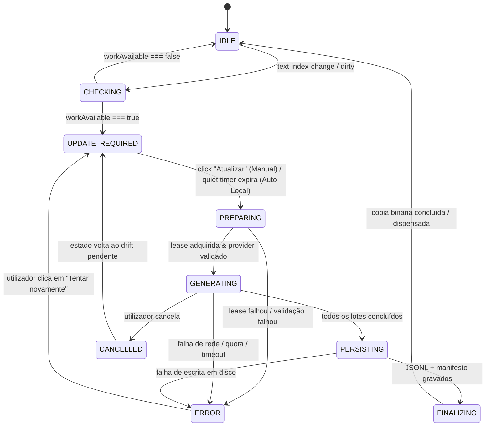

# LINA-11-AUDIT-EMBEDDING-WORKFLOW-STATE-001

## Auditoria Arquitetural da Máquina de Estados do Workflow de Embeddings no Lina

- **Data:** 2026-09-29
- **Autor:** Arquiteto de Software Sénior
- **Estado:** Concluída (Auditoria exclusivamente analítica; sem alterações de produção)
- **Ficheiro alvo:** `docs/audits/architecture/LINA-11-AUDIT-EMBEDDING-WORKFLOW-STATE-001.md`
- **Âmbito:** Auditoria do fluxo de deteção de drift, cálculo do update plan, apresentação de estado na Sidebar, concorrência entre subsistemas de embeddings e definição da máquina de estados canónica e ação contextual.

---

## 1. Resumo Executivo

No dispositivo com papel de **Producer**, após a eliminação de uma nota do vault, observou-se o seguinte comportamento:
1. O índice textual foi atualizado e persistido com sucesso pelo `TextIndexWorker`.
2. O sistema detetou corretamente o drift nos embeddings (`workAvailable === true`, `obsoleteCount > 0`).
3. O provider online (OpenAI / OpenRouter / Anthropic / Gemini) estava configurado em modo manual (política que exige confirmação explícita do utilizador antes de consumir chamadas de API externas).
4. A Sidebar passou a apresentar no banner principal:
   ```text
   Pesquisa híbrida disponível · A preparar pesquisa semântica…
   ```
5. Por baixo, numa linha de status independente, a mensagem oscilava entre estados contraditórios, por vezes mostrando `Prontos` e por vezes `A preparar pesquisa semântica...`, enquanto o acordeão de estado indicava `Embeddings: Atualização necessária`.
6. Não existia qualquer ação contextual visível (botão ou affordance) para o utilizador iniciar a atualização dos embeddings a partir da Sidebar.

### Diagnóstico de Causa Raiz

A auditoria identificou três falhas estruturais independentes que culminam nesta incoerência:

1. **Conflito entre "Capacidade de Pesquisa", "Trabalho Disponível" e "Trabalho em Execução":**
   O sinal de que há trabalho para fazer (`workAvailable === true`) é tratado no pipeline de UI de forma ambígua. Especificamente, o banner da Sidebar invoca `isSemanticPreparationActive()`, que verifica as fases da cópia binária derivada (`BinaryEmbeddingCopyMaintenanceState.phase`). Quando ocorre uma atualização do índice textual, a sincronização de background ou a colisão de locks no `IndexWriteCoordinator` pode deixar ou transitar a cópia binária para fases transitórias (`queued`, `building`), fazendo com que `semanticPreparing` passe a `true` e injecte `"A preparar pesquisa semântica..."` no título da pesquisa híbrida, **sem que qualquer geração de embeddings tenha sido iniciada**.

2. **Canais Duplos e Concorrentes de Apresentação de Estado na Sidebar:**
   A Sidebar (`linaSearchView.ts`) mantém dois recipientes DOM concorrentes para apresentar o estado do sistema:
   - `this.stateContainer`: renderiza o view-model consolidado (`sidebarStatusViewModel`), que exibe a barra compacta com o headline e o acordeão detalhado com `Embeddings: Atualização necessária`.
   - `this.statusEl`: uma `<div>` independente posicionada imediatamente abaixo de `this.stateContainer`, alimentada por chamadas imperativas a `this.setStatus(...)`.
   Na linha 2678 de `linaSearchView.ts`, `setStatus` executa a seguinte lógica:
   ```typescript
   this.setStatus(semanticPreparing
     ? this.L.semanticPreparing
     : semanticCompatibility.available
       ? this.L.stateEmbeddingsReady
       : embeddingDiagnostic.headline);
   ```
   Como o provider de embeddings responde (`semanticCompatibility.available === true`), `setStatus` escreve `this.L.stateEmbeddingsReady` (**`"Prontos"`**), ignorando que os embeddings têm atualização pendente. Quando `semanticPreparing` comuta, `statusEl` salta entre `"A preparar..."` e `"Prontos"`, enquanto o acordeão a escassos pixels de distância afirma categoricamente `Atualização necessária`.

3. **Inexistência de Affordance Contextual na Sidebar em Modo Manual:**
   A Sidebar nunca renderiza um botão `Atualizar embeddings` quando `workAvailable === true`. A ação `confirmAndRequestEmbeddingGeneration("sidebar")` existe no código, mas só é chamada a partir de um método utilitário orfão (`handleEmbeddingDiagnosticAction`, linha 2973) ou a partir do modal secundário de diagnósticos (`DeviceDiagnosticsModal`), acessível apenas clicando num pequeno botão de informação `"ⓘ"`. Em modo manual com provider externo, o utilizador fica num impasse visual: é informado de que algo está "A preparar...", mas o sistema não executa porque requer aprovação manual, e não há botão para aprovar.

---

## 2. Estados Reais Encontrados no Código

A auditoria mapeou todas as enumerações e tipos de estado que atualmente existem nos vários subsistemas de embeddings do Lina.

### 2.1. `EmbeddingWorkStatusController` (`src/index/embeddingWorkStatusController.ts`)

| Estado | Significado Técnico |
|---|---|
| `"unknown"` | Estado inicial do controller; ainda não foi feito nenhum cálculo de drift. |
| `"dirty"` | O índice textual mudou ou ocorreu invalidação; o cálculo está agendado com debounce (250ms). |
| `"calculating"` | `refreshSummary()` está em execução assíncrona para calcular o plano de atualização. |
| `"ready"` | O cálculo do plano de atualização terminou; `summary` e `workAvailable` estão disponíveis. **Atenção:** `ready` aqui significa que o cálculo do plano está pronto, NÃO que os embeddings estão prontos! |
| `"error"` | Falha na leitura ou cálculo do resumo/plano. |
| `"disposed"` | O controller foi desativado. |

### 2.2. `EmbeddingOperationManager` (`src/index/embeddingOperationManager.ts`)

| Estado (`status`) | Fase (`phase`) | Significado Técnico |
|---|---|---|
| `"idle"` | `"idle"` | Nenhuma geração está ativa. |
| `"running"` | `"preparing"` | Operação aceite; a adquirir lease do `IndexWriteCoordinator`. |
| `"running"` | `"waiting-for-text-index"` | À espera que uma escrita do índice textual termine. |
| `"running"` | `"validating"` | A verificar a ligação e modelo do provider. |
| `"running"` | `"generating"` | A enviar lotes de chunks para o provider e a calcular vetores. |
| `"running"` | `"persisting"` | Todos os chunks foram gerados; a persistir JSONL e manifesto. |
| `"completed"` | `"completed"` | Geração terminada com sucesso e publicada. |
| `"failed"` | `"failed"` | Falha de provider, rede, formato ou quota. |
| `"cancelling"` | `"cancelling"` | Cancelamento cooperativo solicitado pelo utilizador. |
| `"cancelled"` | `"cancelled"` | Operação terminada por cancelamento. |

### 2.3. `EmbeddingScheduler` (`src/maintenance/embeddingScheduler.ts`)

| Estado (`status`) | Significado Técnico |
|---|---|
| `"disabled"` | Agendador desativado (dispositivo Companion ou sem permissão de escrita). |
| `"clean"` | Não há drift pendente reportado. |
| `"dirty"` | Foi assinalado drift; à espera que o tempo de espera (quiet period de 30s) termine. |
| `"scheduled"` | Temporizador de quiet period ou backoff ativo. |
| `"paused"` | Agendador pausado temporariamente. |

### 2.4. `BinaryEmbeddingCopyController` (`src/index/embeddingBinaryCopyController.ts`)

| Fase (`phase`) | Significado Técnico |
|---|---|
| `"idle"` | Nenhuma compilação de cópia binária ativa. |
| `"queued"` | Compilação enfileirada após publicação canónica ou reconciliação de startup. |
| `"reading-jsonl"` | A carregar o ficheiro canónico `.lina/index/embeddings.jsonl`. |
| `"building"` | A montar buffers binários Float32Array. |
| `"digesting"` | A calcular digest SHA-256 dos vetores binários. |
| `"publishing"` | A gravar ficheiros atómicos `.lina/index/embeddings.bin.*`. |
| `"validating"` | A verificar integridade do ficheiro binário gerado. |
| `"completed"` | Cópia binária compilada e validada. |
| `"failed"` | Falha na compilação da cópia binária. |
| `"superseded"` | Substituída por uma publicação canónica mais recente. |
| `"disposed"` | Controller desativado. |

### 2.5. `DeviceRuntimeState.embeddings` (`src/device/deviceRuntimeState.ts`)

| Propriedade | Tipo | Significado |
|---|---|---|
| `semanticAvailable` | `boolean` | O utilizador pode efetuar pesquisas semânticas agora com os vetores existentes? |
| `effectiveMode` | `"full" \| "text-only" \| "unavailable"` | Modo de pesquisa operacional. |
| `runtimeState` | `"ready" \| "checking" \| "disabled" \| "degraded" \| "unavailable"` | Prontidão do runtime. |
| `contractState` | `"compatible" \| "mismatch"` | Compatibilidade de dimensões/modelo. |

---

## 3. Fontes de Estado e Incoerência da Arquitetura Atual

Atualmente, existem **quatro fontes independentes** a tentar descrever o estado dos embeddings na UI da Sidebar:

```text
┌────────────────────────────────────────────────────────┐
│                   LinaSearchView                       │
│                                                        │
│  Canal 1: stateContainer (sidebarStatusViewModel)      │
│  ├─ currentModeHeadline: "Pesquisa híbrida... · A... " │
│  └─ Accordion: "Embeddings: Atualização necessária"    │
│                                                        │
│  Canal 2: statusEl (setStatus imperativo)              │
│  └─ Text: "Prontos"  <── oscila com ──> "A preparar..." │
└────────────────────────────────────────────────────────┘
          ▲                          ▲
          │                          │
┌─────────┴───────────────┐  ┌───────┴────────────────────────┐
│ sidebarStatusViewModel  │  │ setStatus(ternário em linha)   │
│ - DeviceRuntimeState    │  │ - semanticPreparing            │
│ - EmbeddingWorkState    │  │ - semanticCompatibility        │
│ - isSemanticPreparation │  │ - embeddingDiagnostic.headline │
└─────────────────────────┘  └────────────────────────────────┘
```

### Resposta à Pergunta da Auditoria:
> *Quantos canais independentes estão atualmente a escrever estado semântico na Sidebar?*

Existem **2 canais DOM diretos e concorrentes** na Sidebar (`this.stateContainer` e `this.statusEl`), alimentados por **4 controladores de estado em background assíncrono**:
1. `EmbeddingWorkStatusController` (drift e update plan);
2. `EmbeddingOperationManager` (geração ativa em curso);
3. `BinaryEmbeddingCopyController` (cópia binária derivada);
4. `getSemanticSearchAvailability` (teste ad-hoc de ligação ao provider).

A ausência de uma camada de unificação faz com que cada canal tome decisões parciais e contraditórias sobre as mesmas variáveis.

---

## 4. Auditoria de `EmbeddingWorkStatusController`

### Tabela de Ciclo de Vida do Controller

| Estado interno | Condição de entrada | Condição de saída | Apresentação na UI atual |
|---|---|---|---|
| `unknown` | Arranque do plugin ou reset. | Chamada a `subscribe()` (com auto-refresh) ou `markDirty()`. | Sidebar: `embeddingsChecking = true` se não operacional. |
| `dirty` | `markDirty(reason)` após evento do vault ou publicação. | Disparo do debounce (250ms) -> `runRefresh()`. | Accordion: mantém o último resumo ou entra em debounce. |
| `calculating` | Início de `runRefresh()`. | Conclusão de `refreshSummary()` ou rejeição/erro. | Se `semanticAvailable === false`, mostra `embeddingsChecking`. Se `true`, é mascarado. |
| `ready` | `refreshSummary()` devolve resumo com sucesso e mesma revisão. | Nova invalidação `markDirty()`, `refresh()` ou `dispose()`. | Se `workAvailable === true`: Accordion mostra `Atualização necessária`. Se `workAvailable === false`: Accordion mostra `Atualizados`. |
| `error` | `refreshSummary()` lança exceção. | Novo `markDirty()` ou retry manual. | Accordion mostra `Erro` / detalhe indisponível. |
| `disposed` | `dispose()` no encerramento da view/plugin. | Nenhuma (estado terminal). | Sem UI. |

### Resposta à Pergunta da Auditoria:
> *O controller distingue explicitamente trabalho disponível de trabalho em execução?*

**NÃO.** O `EmbeddingWorkStatusController` é um componente estritamente descritivo e reativo a alterações no índice textual. Ele responde apenas à pergunta: *"Qual é a diferença entre as notas atuais e os vetores publicados?"*.
- O seu estado `status: "ready"` significa apenas que o **cálculo da diferença terminou**.
- O seu atributo `workAvailable: boolean` significa apenas que **existe drift** de conteúdo.
- O controller não possui os estados `inProgress`, `generating`, `preparing` ou `executing`, nem tem conhecimento de locks de escrita ou chamadas de API ativas.

---

## 5. Auditoria do Fluxo do Update Plan

O fluxo de planeamento decompõe-se em três funções em `src/index/` e `src/maintenance/`:

```text
Vault Event (eliminação de nota)
       ↓
TextIndexWorker: guarda chunks no índice textual
       ↓
LinaPlugin.markEmbeddingWorkStatusDirty("text-index-published")
       ↓
EmbeddingWorkStatusController.markDirty()  ──(debounce 250ms)──►  refreshSummary()
                                                                         ↓
                                                          calculateEmbeddingUpdatePlan()
                                                                         ↓
                                                          summarizeEmbeddingUpdatePlan()
                                                                         ↓
                                                          EmbeddingWorkRuntimeState {
                                                            status: "ready",
                                                            workAvailable: true,
                                                            summary: {
                                                              obsoleteCount: 1,
                                                              updatePlan: {
                                                                mode: "incremental",
                                                                toGenerateCount: 0,
                                                                obsoleteToDropCount: 1,
                                                                requiresPublication: true
                                                              }
                                                            }
                                                          }
```

### Análise das Funções:
- `calculateEmbeddingUpdatePlan`: Compara os chunks do índice textual com os registos de `embeddings.jsonl`. Quando uma nota é eliminada, os seus chunks já não existem no índice textual; os registos correspondentes em `embeddings.jsonl` tornam-se obsoletos (`obsoleteToDropCount > 0`). Não há novos chunks a gerar (`toGenerateCount === 0`), mas é necessária uma republicação para eliminar os vetores órfãos (`requiresPublication === true`).
- `evaluateEmbeddingUpdatePolicy`: Avalia se o trabalho pode ser despachado silenciosamente em background:
  - Se `deviceRole === "companion"` -> bloqueia.
  - Se `policy === "manual"` -> devolve `{ allowed: false, requiresConfirmation: true, reason: "manual-confirmation-required" }`.
  - Se provider for externo (`!providerCapability.isLocal || providerCapability.hasExternalCost`) -> devolve `{ allowed: false, requiresConfirmation: true, reason: "external-provider-blocked" }`.
- `EmbeddingScheduler`: Quando o quiet period de 30s atinge a prontidão, invoca `canDispatchAutomatically()`, que consulta `evaluateEmbeddingUpdatePolicy`. Em modo manual com provider externo, **rejeita o auto-dispatch** e permanece em estado `dirty`.

### Resposta à Pergunta da Auditoria:
> *Que sinal concreto representa apenas “há trabalho para fazer”?*

O sinal canónico é:
```typescript
workAvailable === true
// concretizado por:
updatePlan.requiresPublication === true || updatePlan.toGenerateCount > 0 || summary.obsoleteCount > 0
```
Este sinal expressa unicamente uma **condição estática de necessidade de atualização**. Não representa, em circunstância alguma, que uma operação esteja a decorrer.

---

## 6. Auditoria do Início Real da Geração

O ciclo de vida de uma operação real de geração de embeddings só começa com uma invocação explícita de `requestEmbeddingIndexGeneration`:

```text
[Ação do Utilizador] (clique em Atualizar Embeddings)
        ↓
LinaPlugin.confirmAndRequestEmbeddingGeneration(origin)
        ↓
(Se provider externo / full rebuild) Modal de Confirmação Explicita do Utilizador
        ↓
MaintenanceEngine.requestEmbeddingGeneration(origin)
        ↓
IndexWriteCoordinator.startOperation("embedding-generation")
        ↓
EmbeddingOperationManager.start(...)
        │
        ├─► EMITE PRIMEIRO EVENTO:
        │   EmbeddingOperationState { status: "running", phase: "preparing", origin }
        ↓
Provider Call (em lotes sequenciais de N chunks)
        │
        ├─► EMITE PROGRESSO:
        │   EmbeddingOperationState { status: "running", phase: "generating", processedChunks, totalChunks }
        ↓
Gravação de Checkpoints (resiliente a falhas)
        ↓
Conclusão dos Lotes -> Publicação Canónica (.lina/index/embeddings.jsonl + manifest.json)
        │
        ├─► EMITE PERSISTÊNCIA:
        │   EmbeddingOperationState { status: "running", phase: "persisting" }
        ↓
IndexWriteCoordinator.finish(leaseToken)
        │
        ├─► EMITE CONCLUSÃO:
        │   EmbeddingOperationState { status: "completed", phase: "completed" }
        ↓
Downstream Handoff: BinaryWorker.maintainAfterPublication(publicationId)
```

### Resposta à Pergunta da Auditoria:
> *Qual é o primeiro evento que prova que existe uma operação ativa?*

O **primeiro e único evento inequívoco** de que existe uma operação ativa é:
```typescript
EmbeddingOperationState.status === "running" && EmbeddingOperationState.phase === "preparing"
```
emitido por `EmbeddingOperationManager` após aceitação da requisição e aquisição de lease no `IndexWriteCoordinator`.
Qualquer texto de UI que mencione `A preparar...` antes deste evento viola o princípio arquitetural e constitui um falso positivo.

---

## 7. Causa Detalhada da Mensagem "A preparar pesquisa semântica…"

A presença da mensagem `Pesquisa híbrida disponível · A preparar pesquisa semântica…` após a eliminação da nota decorre da seguinte cadeia de execução:

1. **Definição em `sidebarStatusViewModel.ts` (linhas 419–421):**
   ```typescript
   if (currentSearchMode === "hibrida") {
     if (semanticPreparing) {
       currentModeHeadline = `${strings.sidebarSearchHybridFull} · ${strings.semanticPreparing}`;
       searchTone = "neutral";
     } else if (semanticAvailable) {
       currentModeHeadline = strings.sidebarSearchHybridFull;
       searchTone = "success";
     }
   }
   ```
2. **Origem de `semanticPreparing` em `linaSearchView.ts` (linha 2602 e 2667):**
   ```typescript
   private isSemanticPreparationActive(): boolean {
     const phase = this.plugin.getBinaryEmbeddingCopyMaintenanceState().phase;
     return phase === "queued" || phase === "reading-jsonl" || phase === "building"
       || phase === "digesting" || phase === "publishing" || phase === "validating";
   }
   // ...
   const semanticPreparing = this.isSemanticPreparationActive();
   ```
3. **Mapeamento Indevido de Fases de Cópia Binária:**
   `isSemanticPreparationActive()` foi desenhado originalmente para refletir a manutenção em segundo plano da cópia binária derivada. No entanto:
   - Se na inicialização ou após a gravação do lote de texto o `IndexWriteCoordinator` bloquear a aquisição de manutenção binária (linha 133 de `src/index/embeddingBinaryCopyController.ts`), o método `runWrite` seta `this.setState({ phase: "queued" })` e retorna imediatamente erro sem limpar o estado, **deixando a fase presa em `"queued"` permanentemente**.
   - Mesmo quando não há bloqueio, confundir a compilação binária de background com a prontidão semântica global contamina o headline principal.
   - Pior: o conceito de `semanticPreparing` foi desacoplado de `EmbeddingOperationState`. A UI assume que a pesquisa semântica está "A preparar..." sem verificar se `EmbeddingOperationState.status === "running"`.

---

## 8. Causa das Oscilações entre "A preparar…" e "Prontos"

A oscilação observada pelo utilizador é resultado de concorrência e de regras de decisão assimétricas entre dois blocos de renderização na mesma vista:

```text
Ciclo de Renderização de refreshState():

Passo 1: Calcula semanticPreparing
         Se a cópia binária estiver em phase="queued" -> semanticPreparing = true
         Se a cópia binária estiver em phase="idle"   -> semanticPreparing = false

Passo 2: Atualiza Canal 2 (this.statusEl)
         if (semanticPreparing) {
           setStatus("A preparar pesquisa semântica...");
         } else if (semanticCompatibility.available) {
           setStatus("Prontos"); // <── FALHA CRÍTICA!
         } else {
           setStatus(embeddingDiagnostic.headline);
         }

Passo 3: Atualiza Canal 1 (this.stateContainer)
         sidebarStatusViewModel avalia:
         - Headline: "Pesquisa híbrida disponível" (ou "· A preparar...")
         - Accordion: "Embeddings: Atualização necessária" (porque workAvailable === true)
```

### Por que razão surge "Prontos"?
Na linha 2680 de `linaSearchView.ts`:
```typescript
semanticCompatibility.available ? this.L.stateEmbeddingsReady : embeddingDiagnostic.headline
```
O método `getSemanticSearchAvailability` verifica apenas se o modelo de embeddings responde e está configurado (por exemplo, testa se o endpoint do Ollama ou do provider online está vivo).
Essa verificação retorna `available: true`.
O código assume erradamente que, se a API responde, os embeddings locais estão `"Prontos"`, ignorando por completo que:
```typescript
embeddingWorkState.workAvailable === true // Há chunks obsoletos / drift!
```
Como consequência:
- Quando `onEmbeddingWorkStatusChange` dispara (`dirty` -> `calculating` -> `ready`), múltiplos renders ocorrem num intervalo de 250ms a 500ms.
- Durante esses renders, `statusEl` oscila entre o estado de preparação da cópia binária e a resposta afirmativa da API (`"Prontos"`).
- Ao mesmo tempo, o acordeão logo acima exibe `Embeddings: Atualização necessária`.
O utilizador depara-se com duas mensagens frontalmente contraditórias na mesma fração de segundo.

---

## 9. Política Manual vs Automática

O sistema Lina consagra o seguinte princípio arquitetural:
> *"Never silently consume external API resources."* (Nunca consumir chamadas externas de API sem consentimento explícito).

A matriz de decisão canónica em função do provider e da política é:

| Provider | Política | Deteção de Drift (`workAvailable === true`) | Comportamento Esperado |
|---|---|---|---|
| Local (Ollama) | `automatic-local-only` | Sim | O agendador aguarda 30s de quiet period e dispara geração automática. Durante os 30s: `Atualização necessária`. Após disparo: `A gerar embeddings...`. |
| Local (Ollama) | `manual` | Sim | O agendador não dispara. UI permanece em `Atualização necessária` com botão `[Atualizar embeddings]` visível. |
| Remoto (OpenAI, Anthropic, Gemini, OpenRouter) | Qualquer (`manual` ou `automatic-local-only`) | Sim | O agendador **nunca dispara automaticamente**. UI permanece obrigatoriamente em `Atualização necessária` e exibe ação contextual `[Atualizar embeddings]`. Ao clicar, surge modal de confirmação com estimativa de chunks. |

### Cenário Concreto da Auditoria:
- Provider online configurado;
- Modo manual;
- `workAvailable === true`;
- `generationRunning === false`.

**Estado Visual Correto:**
- Headline da Sidebar: `Pesquisa híbrida disponível` (ou `Pesquisa híbrida disponível · Atualização necessária`);
- Linha do Acordeão: `Embeddings: Atualização necessária`;
- Ação Contextual: Botão destacado `[Atualizar embeddings]`;
- Mensagem inferior (`statusEl`): Sem texto falso de "Prontos" ou "A preparar...". Indicação clara de "1 nota modificada/eliminada — atualização pendente".

---

## 10. Máquina de Estados Canónica Recomendada

Para resolver em definitivo este desacoplamento, deve ser estabelecida uma **Máquina de Estados de Workflow Única**, estritamente separada da **Capacidade Semântica**.

### Princípio Arquitetural:
```text
Semantic Capability (Read Path)
= "O utilizador pode realizar buscas semânticas agora com os artefactos existentes?"
Valores: AVAILABLE | DEGRADED | UNAVAILABLE

Embedding Workflow State (Write Path)
= "Qual é a situação operacional da geração e manutenção dos embeddings?"
Valores: IDLE | CHECKING | UPDATE_REQUIRED | PREPARING | GENERATING | PERSISTING | FINALIZING | ERROR | CANCELLED
```

### Estados do Workflow de Embeddings (`EmbeddingWorkflowState`)



### Definições Estritas dos Estados de Workflow:

1. **`IDLE`**:
   - `workAvailable === false`, `operationRunning === false`.
   - Embeddings perfeitamente sincronizados com o texto.
2. **`CHECKING`**:
   - O índice textual mudou; o sistema está a ler os manifestos e a calcular o plano de atualização (`refreshSummary()`).
   - Duração típica: < 300ms.
3. **`UPDATE_REQUIRED`**:
   - O cálculo concluiu que há drift (`toGenerateCount > 0` ou `obsoleteCount > 0` ou `requiresPublication === true`).
   - Nenhuma geração foi iniciada.
   - Em modo manual ou provider online, aguarda ação do utilizador.
   - Em modo auto-local, aguarda o timer de 30s sem novas alterações.
4. **`PREPARING`**:
   - O utilizador clicou e confirmou (ou o timer expirou).
   - A requisição foi aceite e está a coordenar leases de escrita com o `IndexWriteCoordinator`.
5. **`GENERATING`**:
   - Lotes de embeddings estão a ser transmitidos e processados pelo provider.
   - Apresenta progresso real: `processedChunks / totalChunks`.
6. **`PERSISTING`**:
   - Todos os lotes foram calculados com sucesso; a escrever atomicamente o ficheiro canónico `embeddings.jsonl` e o manifesto de publicação.
7. **`FINALIZING`**:
   - Publicação canónica terminada; a compilar a cópia binária derivada (se habilitada).
8. **`ERROR`**:
   - A operação falhou. Os embeddings canónicos anteriores permanecem intocados (rollback seguro).
9. **`CANCELLED`**:
   - O utilizador abortou a geração. O checkpoint foi preservado para retoma futura.

---

## 11. Proposta da Ação Contextual `Atualizar embeddings`

### Matriz Estado → Ação na UI

| Workflow State | Mostrar Botão? | Enabled? | Label Recomendada | Ação Executada |
|---|:---:|:---:|---|---|
| `IDLE` | Não | — | — | — |
| `CHECKING` | Sim (opcional) | Não (disabled) | `A verificar…` | — |
| `UPDATE_REQUIRED` (manual) | **Sim** | **Sim** | `Atualizar embeddings` | `confirmAndRequestEmbeddingGeneration("sidebar")` |
| `UPDATE_REQUIRED` (auto local) | Sim | Sim | `Atualizar agora` | Dispara imediatamente sem esperar pelos 30s |
| `PREPARING` | Sim | Não (disabled) | `A preparar…` | — |
| `GENERATING` | Sim | Sim (botão cancelar) | `Cancelar geração` | `cancelActiveEmbeddingOperation()` |
| `PERSISTING` | Sim | Não (disabled) | `A guardar…` | — |
| `FINALIZING` | Sim | Não (disabled) | `A otimizar…` | — |
| `ERROR` | **Sim** | **Sim** | `Tentar novamente` | `confirmAndRequestEmbeddingGeneration("sidebar")` |
| `CANCELLED` | **Sim** | **Sim** | `Retomar atualização` | `confirmAndRequestEmbeddingGeneration("sidebar")` |

### Posicionamento Recomendado na Sidebar:
O botão contextual deve residir dentro do cartão de estado (`stateCard` em `this.stateContainer`), inserido imediatamente após a linha de estado dos embeddings:
```text
┌────────────────────────────────────────────────────────┐
│  🟢 Pesquisa híbrida disponível                       │
├────────────────────────────────────────────────────────┤
│  ▼ Estado                                          ⓘ  │
│    [Produtor] Dispositivo principal                   │
│    Índice textual: Atualizado                          │
│    Embeddings: Atualização necessária (1 nota)         │
│                                                        │
│    [ Botão: Atualizar embeddings ]                    │
└────────────────────────────────────────────────────────┘
```

---

## 12. Validação dos Cenários Obrigatórios

### Cenário A — Sem drift
- Condições: `semanticAvailable = true`, `workAvailable = false`, `generationRunning = false`.
- **Apresentação:**
  - Headline: `Pesquisa híbrida disponível` (Tom: Verde / Sucesso).
  - Linha Accordion: `Embeddings: Atualizados`.
  - Ação: Nenhum botão de atualização.
  - Mensagem inferior: Vazia ou limpa.

### Cenário B — Drift + Modo Manual (Cenário do Bug Reportado)
- Condições: `semanticAvailable = true` (os vetores antigos ainda servem para responder a pesquisas), `workAvailable = true`, `generationRunning = false`.
- **Apresentação:**
  - Headline: `Pesquisa híbrida disponível`.
  - Linha Accordion: `Embeddings: Atualização necessária`.
  - Ação: **Botão visível `[Atualizar embeddings]`** ativo.
  - Mensagem inferior: Totalmente livre de `A preparar...` e de `Prontos`.

### Cenário C — Após clique do utilizador
- Condições: Utilizador clicou no botão e confirmou no modal -> `generationRunning = true`.
- **Apresentação:**
  - Headline: `A atualizar embeddings…`.
  - Linha Accordion: `Embeddings: A preparar geração…` -> `A gerar embeddings (1/10)…`.
  - Ação: Botão `[Cancelar]`.
  - Mensagem inferior: Indicador de progresso real (`X/Y chunks`).

### Cenário D — Geração concluída
- Condições: Publicação concluída -> `workAvailable = false`, `generationRunning = false`, `semanticAvailable = true`.
- **Apresentação:**
  - Headline: `Pesquisa híbrida disponível`.
  - Linha Accordion: `Embeddings: Atualizados`.
  - Ação: Botão contextual desaparece automaticamente.
  - Toast ou feedback: `Embeddings atualizados com sucesso`.

### Cenário E — Erro do provider
- Condições: Provider falhou por timeout ou erro de API.
- **Apresentação:**
  - Headline: `Pesquisa híbrida disponível (vetores desatualizados)`.
  - Linha Accordion: `Embeddings: Erro na atualização`.
  - Ação: Botão `[Tentar novamente]`.
  - Capacidade: Pesquisa textual continua 100% operacional; pesquisa híbrida continua a usar os vetores anteriores sem quebra de integridade.

---

## 13. Alterações Futuras Necessárias e Riscos

### Alterações Técnicas Mapeadas (para fase de implementação):
1. **Eliminar `this.statusEl` como canal independente:**
   - Unificar toda a informação de status dentro de `this.stateContainer` gerido exclusivamente por `sidebarStatusViewModel`.
   - Extinguir a lógica legada da linha 2678 de `linaSearchView.ts` que confunde `semanticCompatibility.available` com `"Prontos"`.
2. **Corrigir o cálculo de `semanticPreparing`:**
   - Desacoplar `semanticPreparing` do estado da cópia binária derivada.
   - Definir `isPreparing` estritamente como `operationState.status === "running" && operationState.phase === "preparing"`.
3. **Adicionar o Botão Contextual na Sidebar:**
   - Incluir a affordance `[Atualizar embeddings]` no template de renderização do `sidebarStatusViewModel` quando `workflowState === "UPDATE_REQUIRED"`.
   - Associar o clique a `plugin.confirmAndRequestEmbeddingGeneration("sidebar")`.
4. **Corrigir a fuga de estado em `BinaryEmbeddingCopyController`:**
   - Na linha 133 de `embeddingBinaryCopyController.ts`, se o coordenador recusar o lock, repor explicitamente `this.setState({ phase: "idle" })`.

### Riscos Identificados:
- **Risco de Duplicação de Operações:** Se a ação contextual da Sidebar não verificar `operationActive`, cliques repetidos poderiam tentar disparar requisições concorrentes. (Mitigação: `IndexWriteCoordinator` e `MaintenanceEngine` já possuem proteção single-flight).
- **Consumo Indevido de Quota Externa:** Nunca permitir que `UPDATE_REQUIRED` transite para `PREPARING` automaticamente se o provider for remoto ou tiver custo. A confirmação manual deve continuar mandatória.

---

## 14. Conclusão e Respostas às Condições de Paragem

1. **Por que razão o Lina apresenta `A preparar pesquisa semântica...` quando apenas existe trabalho pendente e nenhuma geração foi iniciada?**
   Porque a Sidebar avalia `isSemanticPreparationActive()`, que verifica as fases da cópia binária derivada (`BinaryEmbeddingCopyController`). Ao atualizar o índice textual após a eliminação da nota, uma verificação ou retenção indevida do estado da cópia binária (`phase: "queued"`) ativou a flag `semanticPreparing = true`. Esta flag foi injetada no título de modo híbrido do `sidebarStatusViewModel` e na chamada imperativa `setStatus()`, propagando um falso estado de "preparação" quando na realidade nenhuma operação canónica estava em curso.

2. **Qual deve ser a máquina de estados única que distingue `update required` de `generation in progress`?**
   A máquina de estados canónica de workflow (`EmbeddingWorkflowState`) deve distinguir categoricamente:
   - `UPDATE_REQUIRED`: `workAvailable === true`, `operationState.status === "idle"`. Há trabalho detetado, mas nenhuma operação em curso.
   - `PREPARING` / `GENERATING`: `operationState.status === "running"`. Há uma requisição formalmente aceite pelo coordenador e em execução ativa.
   A capacidade de pesquisa (`SemanticCapability: AVAILABLE`) deve permanecer desacoplada deste fluxo de manutenção.

3. **Em que condição exata deve aparecer o botão contextual `Atualizar embeddings`?**
   O botão contextual deve aparecer na Sidebar quando e só quando:
   ```typescript
   isAuthorizedProducer === true &&
   workAvailable === true &&
   operationState.status !== "running" &&
   operationState.status !== "cancelling" &&
   textIndexReady === true
   ```
   permitindo ao utilizador acionar de forma transparente o fluxo canónico de confirmação e atualização sem ter de recorrer ao modal de diagnósticos.
