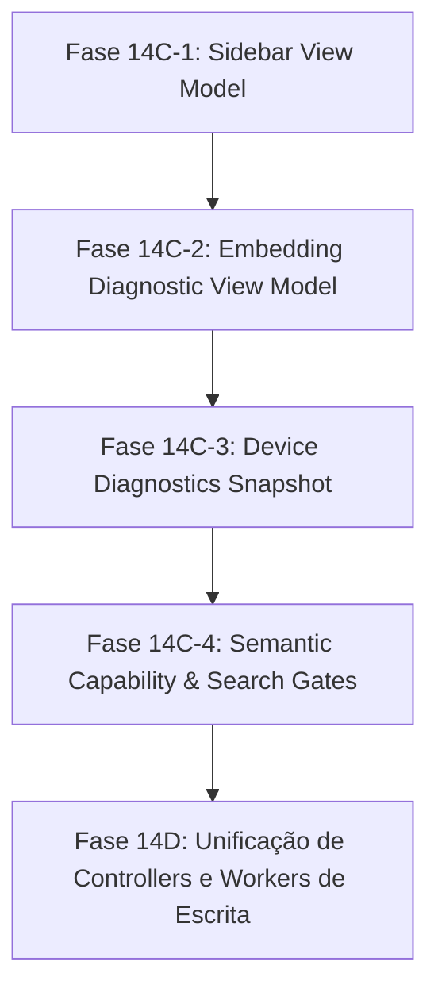

# LINA-14C-AUDIT-CONSUMER-MIGRATION-001: Auditoria de Migração Gradual de Consumidores

**Fase:** LINA-14C  
**Data:** 2026-09-29  
**Status:** AUDITORIA INICIAL APROVADA / PRONTO PARA MIGRAÇÃO 14C-1  
**Contexto:** Planeamento da migração gradual dos subsistemas de leitura e apresentação do Lina para consumirem o modelo canónico `EmbeddingLifecycleSnapshot`.

---

## 1. Mapeamento de Consumidores Atuais

A auditoria identificou os seguintes subsistemas que atualmente consomem, agregam ou projetam o estado dos embeddings no Lina:

| Consumidor | Ficheiro(s) Principal(is) | Papel / Responsabilidade | Risco de Migração |
|---|---|---|---|
| **1. Sidebar View Model** | `src/search/sidebarStatusViewModel.ts`<br>`src/search/linaSearchView.ts` | Apresentação do estado operacional no painel lateral: papel do dispositivo, frescura do índice/embeddings, headline de disponibilidade de pesquisa, alertas degradados unificados e gating de manutenção. | **Baixo** (Puramente de apresentação; contratos bem definidos e testados). |
| **2. Modal de Diagnóstico de Embeddings / Estado** | `src/search/embeddingStatusViewModel.ts`<br>`src/index/indexDiagnosticModal.ts` | Apresentação detalhada das contagens de chunks, métricas de publicação, modelos configurados vs publicados e ações de manutenção. | **Médio** (Consome `EmbeddingWorkRuntimeState` e `EmbeddingOperationState`). |
| **3. Avaliação de Capacidade Semântica** | `src/search/semanticCapability.ts`<br>`src/device/deviceRuntimeState.ts` | Avaliação de prontidão em tempo real da pesquisa semântica para os seletores de modo de pesquisa. | **Médio** (Alimenta o runtime de pesquisa e o `DeviceRuntimeState`). |
| **4. Diagnóstico de Dispositivos** | `src/device/deviceDiagnostics.ts`<br>`src/device/deviceDiagnosticsModal.ts` | Diagnósticos globais de nó (ownership, proveniência de artefactos, integridade de gerações e compatibilidade de contratos). | **Médio** (Consome proveniência e contratos diretamente). |
| **5. Explicação de Políticas de Manutenção** | `src/maintenance/embeddingStatusExplanation.ts` | Tradução de métricas e decisões de políticas de background em resumos legíveis para o utilizador. | **Baixo** (Módulo puro de apresentação). |
| **6. Gating e Controladores de Escrita** | `src/index/embeddingWorkStatusController.ts`<br>`src/maintenance/embeddingWorker.ts`<br>`src/index/embeddingOperationManager.ts` | Orquestração da geração física, checkpoints e publicação. | **Alto** (Fase posterior LINA-14D — não tocar na fase 14C). |

---

## 2. Fontes de Estado Utilizadas vs. Snapshot Canónico

Atualmente, consumidores de apresentação como a Sidebar (`sidebarStatusViewModel.ts`) agregam mais de 15 parâmetros dispersos:
* `textIndexReady`, `textIndexUsability`, `textIndexUpdatedAt`, `textIndexFreshness`;
* `embeddingsEnabled`, `embeddingsReady`, `embeddingsUpdatedAt`, `embeddingsFreshness`, `embeddingsChecking`, `embeddingsWorkAvailable`;
* `workflowState` (`phase`, `status`, `workAvailable`, `operationRunning`);
* `companionState` (`generationIntegrity`, `policyCompatibility`, `vectorContractCompatibility`, `producerFreshness`);
* `runtimeEmbeddings` (`semanticAvailable`, `reason`, `reasonCode`, `contractState`, `exists`);
* Flags dispersas de autorização (`isAuthorizedProducer`, `isStandbyProducer`, `deviceId`, `ownership`).

### Mapeamento para `EmbeddingLifecycleSnapshot`:
O modelo canónico [`EmbeddingLifecycleSnapshot`](file:///d:/_dev/obsidian/lina/src/index/embeddingLifecycleModel.ts) unifica deterministicamente estas fontes:
* **Disponibilidade e Modo de Pesquisa:** `snapshot.read.semanticAvailable`, `snapshot.read.effectiveMode`, `snapshot.read.compatibility`;
* **Estado Primário:** `snapshot.primary` (`READY`, `UPDATE_AVAILABLE`, `INCOMPATIBLE`, `INDEX_ONLY`, `NO_TEXT_INDEX`, `DISABLED`, `STANDBY`, `UPDATING`, `ERROR`, `VERIFYING`);
* **Trabalho e Gating de Escrita:** `snapshot.write.updateRequired`, `snapshot.write.applicable`, `snapshot.write.work`;
* **Progresso da Operação:** `snapshot.process.phase`, `snapshot.process.progress`, `snapshot.process.cancellable`;
* **Capacidade de Ação:** `snapshot.capability.canRequestUpdate`, `snapshot.capability.blockedReason`;
* **Metadados de Publicação:** `snapshot.info.embeddingsPublishedAt`, `snapshot.info.provenance`.

---

## 3. Ordem de Migração Recomendada

Para garantir baixa entropia, reversibilidade e ausência de regressões visuais ou funcionais:



1. **Fase 14C-1 (Alvo Atual):** `src/search/sidebarStatusViewModel.ts`.
   - Permitir a injeção direta de `lifecycleSnapshot?: EmbeddingLifecycleSnapshot` em `BuildSidebarStatusViewModelInput`.
   - Quando fornecido o snapshot canónico, derivar `freshness.embeddings`, `searchAvailability` (modo híbrido, headline, tom) e gating de forma pura e declarativa a partir do snapshot.
   - Preservar compatibilidade retroativa integral quando inputs legados forem passados.
   - Atualizar `src/search/linaSearchView.ts` para construir/adaptar o snapshot através de `adaptCurrentStateToLifecycleSnapshot()` ou consumi-lo diretamente.
2. **Fase 14C-2:** `src/search/embeddingStatusViewModel.ts` (Modal de estado/diagnóstico de embeddings).
3. **Fase 14C-3:** `src/device/deviceDiagnostics.ts` (Snapshot de diagnósticos de nó).
4. **Fase 14C-4:** `src/search/semanticCapability.ts` (Avaliação canónica de prontidão de pesquisa).

---

## 4. Plano Específico para a Fase 14C-1 (Sidebar View Model)

### Alterações Propostas:
1. **Extensão de `BuildSidebarStatusViewModelInput`:**
   Adicionar campo opcional:
   ```ts
   readonly lifecycleSnapshot?: EmbeddingLifecycleSnapshot;
   ```
2. **Resolução de `freshness.embeddings` a partir do Snapshot:**
   - Se `!snapshot.read.semanticAvailable && snapshot.primary === "DISABLED"` $\to$ `"disabled"`.
   - Se `snapshot.primary === "NO_TEXT_INDEX" || snapshot.primary === "INDEX_ONLY"` $\to$ `"missing"`.
   - Se `snapshot.primary === "INCOMPATIBLE"` $\to$ `"stale"`.
   - Se `snapshot.primary === "UPDATE_AVAILABLE"` $\to$ `"stale"`.
   - Se `snapshot.primary === "READY"` $\to$ `"fresh"`.
   - Se `snapshot.primary === "VERIFYING"` $\to$ `"unknown"`.
   - Se `snapshot.primary === "UPDATING"` $\to$ `"fresh"` ou `"stale"` conforme estado anterior.
3. **Resolução de `searchAvailability` a partir do Snapshot:**
   - `semanticAvailable = snapshot.read.semanticAvailable`.
   - `hybridMode = snapshot.read.effectiveMode`.
   - `secondaryReason = snapshot.read.reasonCode ?? snapshot.read.compatibility.reasons[0]`.
4. **Resolução de `degradedAlert`:**
   - Se `snapshot.primary === "INCOMPATIBLE"`, produzir prioritariamente alerta de `vector-mismatch`.
5. **Gating de Manutenção na Sidebar:**
   - `canRequestUpdate` na UI passa a consultar `snapshot.capability.canRequestUpdate`.
6. **Cobertura de Testes:**
   - Testar paridade estrita e novos testes com `lifecycleSnapshot` para `READY`, `UPDATE_AVAILABLE`, `INCOMPATIBLE`, `INDEX_ONLY`, `Companion`, `Producer Standby` e `ERROR`.

---

## 5. Critérios de Sucesso para 14C-1
- Paridade visual 100% idêntica nos testes existentes de `sidebarStatusUX.test.ts`.
- Novos testes cobrindo a derivação via `lifecycleSnapshot`.
- `npm test`, `npm run typecheck`, `npm run lint:obsidian:strict`, `npm run build`, `npm run release-check` verdes.
