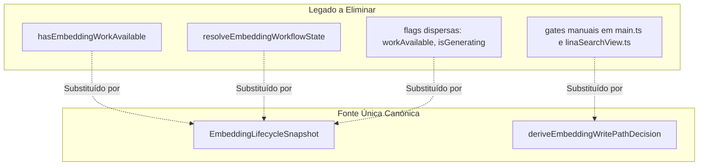
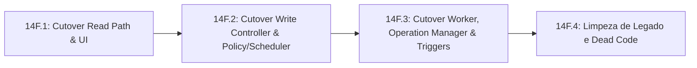

# LINA-14E: Auditoria Global de Consolidação do Lifecycle de Embeddings

**Documento:** `LINA-14E-AUDIT-LIFECYCLE-CONSOLIDATION-001.md`  
**Fase:** LINA-14E (Auditoria Global de Pré-Cutover do Ciclo de Vida)  
**Data:** 2026-09-30  
**Estado:** Concluído / Aprovado para Planeamento de Cutover (LINA-14F)  
**Autor:** Arquiteto de Software Sénior & Engenheiro TypeScript/Obsidian Plugin  

---

## 1. Estado Atual do Roadmap LINA-14

O roadmap **LINA-14 — Consolidação do Lifecycle de Embeddings** atingiu a maturidade arquitetural necessária para a transição global, tendo concluído com sucesso as fases analíticas, de modelação pura e de validação em modo shadow:

```
[ LINA-14A ] Modelo Puro Canónico (EmbeddingLifecycleSnapshot)
     │
     ▼
[ LINA-14B ] Adapter e Validação Observacional (Shadow Validation 14B.1)
     │
     ▼
[ LINA-14C ] Migração dos Consumidores de Leitura & Diagnóstico (14C.1 a 14C.4)
     │       (Sidebar, Embedding Diagnostics, Device Diagnostics, Semantic Capability)
     │
     ▼
[ LINA-14D ] Consolidação do Write Path em Shadow Mode (14D.1 e 14D.2-A a 14D.2-D)
     │       (Write Path Decisions, Work Status, Policy Engine, Scheduler, Worker & Operation Manager)
     │
     ▼
[ LINA-14E ] AUDITORIA GLOBAL DE CONSOLIDAÇÃO (Presente Documento)
     │
     ▼
[ LINA-14F ] Cutover Funcional Ativo dos Consumidores & Remoção do Legado
```

### Resumo do Progresso Realizado:
1. **LINA-14A:** Conclusão do modelo canónico puro `EmbeddingLifecycleSnapshot` em `src/index/embeddingLifecycleModel.ts`, cobrindo 12 estados primários estritos, regiões ortogonais de estado e verificação de invariantes formais (I1 a I15).
2. **LINA-14B / 14B.1:** Criação do `embeddingLifecycleAdapter.ts` e relatório shadow aprovado sem bloqueios em 10 cenários canónicos.
3. **LINA-14C.1 a 14C.4:** Integração e compatibilização dos consumidores de leitura:
   - *Sidebar View Model* (`sidebarStatusViewModel.ts`);
   - *Modal de Diagnóstico de Embeddings* (`embeddingStatusViewModel.ts`);
   - *Diagnóstico de Dispositivos* (`deviceDiagnostics.ts`);
   - *Capacidade Semântica e Gating de Pesquisa* (`semanticCapability.ts`).
4. **LINA-14D.1 a 14D.2-D:** Unificação do Write Path em Shadow Mode:
   - Formalização das decisões em `docs/architecture/LINA-14-WRITE-PATH-DECISIONS-001.md`;
   - Camada pura `deriveEmbeddingWritePathDecision` em `src/index/embeddingLifecycleWritePath.ts`;
   - Validadores shadow e testes de paridade no `EmbeddingWorkStatusController`, `EmbeddingPolicyEngine`, `EmbeddingScheduler`, `EmbeddingWorker` e `EmbeddingOperationManager`.

Neste momento, a arquitetura paralela e a cadeia canónica unidirecional encontram-se 100% implementadas e testadas (139 suites de testes, 1867 testes com aprovação integral).

---

## 2. Arquitetura Consolidada e Cobertura do Modelo

### 2.1 Cadeia Canónica Unidirecional

A arquitetura consolidada impõe um fluxo de decisão e controlo estritamente unidirecional, sem recursão ou dependências circulares:

```
+-------------------------------------------------------------------------+
|                       EmbeddingLifecycleSnapshot                        |
|  - Estado canónico puro do ciclo de vida (sem I/O nem dependências)    |
|  - 6 Regiões: read, write (work), process, history, capability, info    |
+-------------------------------------------------------------------------+
                                     │
                                     ▼
+-------------------------------------------------------------------------+
|                   deriveEmbeddingWritePathDecision()                    |
|  - Derivação pura de recomendação prescritiva de ação                   |
|  - action: none | generate | update | rebuild | cancel | retry          |
|  - canExecute, requiresConfirmation, cost, severity, ownershipLost      |
+-------------------------------------------------------------------------+
                                     │
       ┌─────────────────────────────┼─────────────────────────────┐
       ▼                             ▼                             ▼
+---------------+            +---------------+             +---------------+
| Policy Engine |            |   Scheduler   |             |  UI Triggers  |
| (Manutenção   |            | (Debounce     |             | (Sidebar,     |
|  Automática)  |            |  Background)  |             |  Modais Cmd)  |
+---------------+            +---------------+             +---------------+
       │                             │                             │
       └─────────────────────────────┼─────────────────────────────┘
                                     ▼
+-------------------------------------------------------------------------+
|                  EmbeddingOperationManager & Worker                     |
|  - Execução física controlada sob Single-Flight e Fencing               |
|  - Cancelamento cooperativo e publicação canónica com rollback          |
+-------------------------------------------------------------------------+
```

### 2.2 Análise de Cobertura dos 12 Estados Primários

O modelo `EmbeddingLifecycleSnapshot` expressa o ciclo de vida através de 12 estados primários mutuamente exclusivos e determinísticos:

| Estado Primário (`primary`) | Condição Factual Subjacente | Read Path (`read.effectiveMode`) | Write Path (`write.work.kind`) | Ação Derivada | Avaliação de Cobertura |
|---|---|---|---|---|---|
| **`NO_TEXT_INDEX`** | Índice textual inexistente ou corrompido. | `unavailable` | `none` | `none` | **Exata:** Impede qualquer tentativa de gerar embeddings sobre texto inexistente. |
| **`DISABLED`** | Funcionalidade desativada nas definições. | `unavailable` | `none` | `none` | **Exata:** Anula aplicabilidade e previne overhead de I/O em dispositivos opt-out. |
| **`INDEX_ONLY`** | Índice textual pronto; sem artefacto de embeddings. | `text-only` | `pending` (`initial-build`) | `generate` | **Exata:** Sinaliza prontidão imediata de busca lexical e necessidade de geração inicial. |
| **`VERIFYING`** | Verificação de integridade/hashes em curso. | `text-only` | `indeterminate` | `none` | **Exata:** Protege contra leituras ou agendamentos concorrentes durante bootstrap. |
| **`READY`** | Embeddings publicados, compatíveis e sincronizados. | `full` | `none` | `none` | **Exata:** Estado de regime permanente com prontidão híbrida completa. |
| **`UPDATE_AVAILABLE`** | Notas adicionadas/alteradas/removidas (Producer). | `full` | `pending` (`incremental` ou `publish-only`) | `update` | **Exata:** Garante *Stale-While-Rebuild* (pesquisa semântica continua ativa enquanto atualiza). |
| **`INCOMPATIBLE`** | Contrato divergente (provider, modelo, dimensões). | `text-only` | `pending` (`full-rebuild`) | `rebuild` | **Exata:** Bloqueia contaminação semântica e exige reconstrução com confirmação explícita. |
| **`INDETERMINATE`** | Erro de leitura no índice canónico / chunks corrompidos. | `text-only` | `indeterminate` | `none` | **Exata:** Previne degradação oculta para "sem trabalho" (*Zero Silent Fallback*). |
| **`UPDATING`** | Operação física de geração ou publicação ativa. | Conforme estado prévio | `none` (bloqueado por proc) | `cancel` (se cancelável) | **Exata:** Rastreia granularmente a fase do processo (`generating`, `persisting`, etc.). |
| **`CANCELLING`** | Cancelamento cooperativo solicitado em processamento. | Conforme estado prévio | `none` (bloqueado) | `none` | **Exata:** Impede novos gatilhos até à finalização do rollback/checkpoint. |
| **`ERROR`** | Falha operacional anterior no processamento. | `text-only` ou `full` (se parcial) | `pending` (se trabalho persistir) | `retry` | **Exata:** Preserva contexto de diagnóstico do erro e permite recuperação controlada. |
| **`STANDBY`** | Produtor secundário sem titularidade de lock/ownership. | `full` (se publicado) | `none` (`applicable: false`) | `none` | **Exata:** Isola o nó secundário de qualquer escrita até transferência formal de autoridade. |

### 2.3 Diagnóstico de Lacunas, Redundâncias e Ambiguidades
- **Estados em falta:** Nenhum. Todas as condições físicas de armazenamento, coordenação, hardware e papéis de nó encontram representação determinística no enum primário e nas regiões ortogonais.
- **Estados redundantes:** Nenhum. A distinção entre `INDEX_ONLY` (índice pronto, sem embeddings) e `NO_TEXT_INDEX` (sem índice base), bem como entre `INCOMPATIBLE` (contrato inválido) e `UPDATE_AVAILABLE` (desfasamento de conteúdo), resolve formalmente ambiguidades do sistema legado.
- **Estados ambíguos eliminados:** No sistema legado, a flag `workflowStatus: "idle"` agregava indistintamente `NO_TEXT_INDEX`, `INDEX_ONLY`, `INCOMPATIBLE`, `STANDBY` e `READY`. A consolidação canónica eliminou completamente esta sobreposição.

---

## 3. Matriz de Consumidores do Sistema

| Consumidor | Localização no Código | Tipo de Fluxo | Estado Atual | Consumo Alvo no Modelo Canónico | Estado de Migração | Readiness para Cutover |
|---|---|---|---|---|---|---|
| **Sidebar View Model** | `src/search/sidebarStatusViewModel.ts`<br>`src/search/linaSearchView.ts` | Apresentação (Read) | Híbrido (aceita snapshot opcional) | `EmbeddingLifecycleSnapshot` (obrigatório) | Migrado em 14C.1 | **Pronto** (Requer apenas remoção de fallbacks legados) |
| **Modal de Diagnóstico de Embeddings** | `src/search/embeddingStatusViewModel.ts`<br>`src/index/indexDiagnosticModal.ts` | Diagnóstico (Read) | Híbrido (aceita snapshot opcional) | `EmbeddingLifecycleSnapshot` (obrigatório) | Migrado em 14C.2 | **Pronto** (Requer apenas remoção de fallbacks legados) |
| **Diagnóstico de Dispositivos** | `src/device/deviceDiagnostics.ts`<br>`src/device/deviceDiagnosticsModal.ts` | Diagnóstico (Read) | Híbrido (projeta snapshot na proveniência) | `EmbeddingLifecycleSnapshot` (fonte única de nó) | Migrado em 14C.3 | **Pronto** |
| **Capacidade Semântica & Pesquisa** | `src/search/semanticCapability.ts`<br>`src/device/deviceRuntimeState.ts` | Avaliação de Runtime (Read) | Híbrido (deriva de snapshot) | `snapshot.read.semanticAvailable` e `effectiveMode` | Migrado em 14C.4 | **Pronto** |
| **Explicação de Políticas** | `src/maintenance/embeddingStatusExplanation.ts` | Apresentação (Read) | Funções auxiliares isoladas | `snapshot.write.work` e `snapshot.capability` | Parcial (reutiliza enums) | **Pronto** |
| **Work Status Controller** | `src/index/embeddingWorkStatusController.ts` | Controlo de Escrita (Write) | Legado + Shadow Validator | `snapshot.write.work` (`classifyEmbeddingWork`) | Shadow Validado (14D.2-A) | **Pronto** para Cutover Ativo |
| **Policy Engine** | `src/maintenance/embeddingPolicyEngine.ts` | Decisão de Escrita (Write) | Legado + Shadow Validator | `deriveEmbeddingWritePathDecision` | Shadow Validado (14D.2-B) | **Pronto** para Cutover Ativo |
| **Scheduler** | `src/maintenance/embeddingScheduler.ts` | Agendamento (Write) | Legado + Shadow Validator | `deriveEmbeddingWritePathDecision` | Shadow Validado (14D.2-C) | **Pronto** para Cutover Ativo |
| **Operation Manager & Worker** | `src/index/embeddingOperationManager.ts`<br>`src/maintenance/embeddingWorker.ts` | Execução Física (Exec) | Legado + Shadow Validator | `OperationShadowEligibilityDecision` & Snapshot | Shadow Validado (14D.2-D) | **Pronto** para Cutover Ativo |
| **Botão Sidebar & Modais Cmd** | `src/search/linaSearchView.ts`<br>`main.ts` (`confirmAndRequest...`) | Acionamento Manual (Write) | Legado com múltiplas checagens | `deriveEmbeddingWritePathDecision` (`canExecute`, `requiresConfirmation`) | Mapeado em 14D.1 | **Pronto** para Cutover Ativo |

---

## 4. Divergências Acumuladas e Classificação Estruturada

As divergências observadas entre os subsistemas legados e a arquitetura canónica durante as fases 14B, 14C e 14D foram rigorosamente consolidadas e classificadas:

### 4.1 Divergências Esperadas (Segurança Arquitetural)
1. **Diferenciação Fina de Estados Passivos (`NO_TEXT_INDEX`, `INDEX_ONLY`, `INCOMPATIBLE`, `STANDBY`):**
   - *Legado:* Colapsava todas estas condições em `workflowStatus: "idle"`, dependendo de gates booleanos espalhados para impedir execuções indevidas.
   - *Canónico:* Atribui estados primários formais de alta precisão.
2. **Bloqueio Preventivo da Pesquisa Semântica em `INCOMPATIBLE`:**
   - *Legado:* Podia efetuar buscas degradadas ou gerar erros em tempo de execução ao misturar vetores de diferentes modelos/dimensões.
   - *Canónico:* Força `read.semanticAvailable = false` e `read.effectiveMode = "text-only"` assim que detecta divergência de provider, modelo ou dimensões.
3. **Exigência Incondicional de Confirmação para `rebuild`:**
   - *Legado:* Se o provider fosse local (ex.: Ollama), o rebuild total podia ser disparado sem confirmação modal explícita.
   - *Canónico:* Qualquer `full-rebuild` define obrigatoriamente `requiresConfirmation = true` para evitar reescrita destrutiva acidental do índice.
4. **Não-Cancelabilidade durante Fase de Persistência (`persisting`):**
   - *Legado:* O botão de cancelamento permanecia ativo durante todo o processamento, arriscando corrupção do ficheiro `embeddings.jsonl` se interrompido durante a escrita atómica de disco.
   - *Canónico:* Define `process.cancellable = false` especificamente na fase `persisting`.
5. **Bloqueio Rigoroso de Estados Indeterminados (`INDETERMINATE`):**
   - *Legado:* Índices corrompidos ou ilegíveis podiam ser avaliados como "sem trabalho" e induzir comportamentos erráticos.
   - *Canónico:* Define `canExecute = false` e `workKind = "indeterminate"`, exigindo verificação prévia.

### 4.2 Divergências Informativas (Sem Impacto Funcional Negativo)
1. **Isolamento de Notas Modificadas em Dispositivos Companion:**
   - *Legado:* O diff textual local em nós móveis podia assinalar `workAvailable: true` se novas notas fossem sincronizadas pelo Obsidian Sync.
   - *Canónico:* Força `write.applicable = false` para nós Companion, eliminando notificações enganosas na UI móvel.
2. **Rastreio Estruturado de Histórico (`history.lastFailure` vs strings ad-hoc):**
   - *Legado:* O histórico residia em campos dispersos do ficheiro `.lina/producer-state.json`.
   - *Canónico:* Normaliza o resultado no snapshot em categorias estruturadas (`network`, `auth`, `rate-limit`, `cancelled`, `storage`, `unknown`).
3. **Métricas Detalhadas de Chunks no Write Assessment:**
   - *Canónico:* Expõe explicitamente contagens de `reusableCanonical`, `recoverableCheckpoint` e `obsoleteToDrop`.

### 4.3 Divergências Reais (Inconsistências do Legado Resolvidas pelo Canónico)
1. **Limpeza sem Novos Chunks (`chunks.length === 0` com obsoletos):**
   - *Legado:* `hasEmbeddingWorkAvailable` retornava `true`, mas `confirmAndRequestEmbeddingGeneration` e o `EmbeddingScheduler` retornavam `false` (porque exigiam `chunks.length > 0`).
   - *Canónico:* Classifica uniformemente como `mode = "publish-only"`, `cost = "none"` e `action = "update"`, permitindo a limpeza rápida do índice.
2. **Desativação Explícita de Embeddings (`embeddingsEnabled === false`):**
   - *Legado:* Vários controllers continuavam a avaliar diffs e a emitir eventos internos em background.
   - *Canónico:* Corta imediatamente a avaliação na raiz (`write.applicable = false`, `primary = DISABLED`).
3. **Detecção de Perda de Titularidade a Meio de Operações Longas (`ownershipLostDuringOperation`):**
   - *Legado:* O worker continuava a calcular batches de embeddings até falhar no write lock final, consumindo recursos e créditos de API desnecessariamente.
   - *Canónico:* Sinaliza `ownershipLostDuringOperation = true` e interrompe a operação assim que a autoridade do produtor é revogada.

### 4.4 Decisões de Produto Confirmadas
1. **Gatilhos de Atualização do Snapshot:** O snapshot deve ser recalculado exclusivamente de forma reativa a eventos estruturais (modificação do vault, conclusão de índice textual, alteração de settings, mudança de ownership) ou lazy na abertura de vistas/modais, evitando polling periódico contínuo de I/O.
2. **Apresentação em Nós Companion:** Quando os embeddings publicados estão desfasados das notas locais, o nó Companion apresenta o estado canónico de prontidão (`READY` com aviso informativo discreto na Sidebar), sem nunca exibir botões de geração física.

---

## 5. Fonte Única de Verdade e Eliminação do Legado

Para consolidar a arquitetura e eliminar a entropia acumulada, o sistema deve convergir integralmente para o `EmbeddingLifecycleSnapshot`, extinguindo os seguintes cálculos paralelos e flags legadas:



### Inventário de Elementos a Depreciar/Remover na Fase 14F:
1. **`src/index/embeddingWorkflowState.ts`:** Depreciar o tipo legado `EmbeddingWorkflowState` e a função `resolveEmbeddingWorkflowState`.
2. **`src/index/embeddingWorkStatusController.ts`:** Eliminar o método legado `hasEmbeddingWorkAvailable()` e tornar o snapshot a fonte primária de `workAvailable`.
3. **`src/maintenance/embeddingPolicyEngine.ts`:** Eliminar a ramificação legada e basear `resolvePolicy` estritamente na decisão derivada do snapshot.
4. **`src/maintenance/embeddingScheduler.ts`:** Eliminar o predicado ad-hoc `hasAutomaticEmbeddingWork()` e consultar `decision.canExecute && decision.action !== "none"`.
5. **`main.ts` & `linaSearchView.ts`:** Substituir as 5 verificações booleanas manuais por uma chamada direta a `deriveEmbeddingWritePathDecision()`.

---

## 6. Segurança Operacional e Invariantes Validados

A auditoria confirma o cumprimento estrito das seguintes regras de segurança do sistema:

1. **Producer-Only Write (Autoridade Exclusiva):**
   - Apenas o dispositivo com titularidade ativa (`isActiveProducer === true`) tem `write.applicable = true` e pode executar escrita física em `.lina/index/`.
2. **Isolamento Absoluto do Companion:**
   - Nós Companion têm deterministicamente `write.applicable = false`, `canExecute = false`, `action = "none"` e scheduler inativo. Zero escrita no vault partilhado.
3. **Fencing e Perda de Autoridade (`ownershipLostDuringOperation`):**
   - Interrupção segura de processos em curso se a titularidade for perdida a meio de uma geração.
4. **Zero Silent Fallback:**
   - Falhas de contrato ou corrupção de índice nunca degeneram silenciosamente em estado de prontidão.
5. **Precedência do Processo em Execução:**
   - Operações em curso (`UPDATING`, `CANCELLING`) bloqueiam novos pedidos concorrentes (Single-Flight garantido).
6. **Proteção de Segredos e Diagnósticos Limpos:**
   - Nenhuma chave de API, credencial ou excerto de conteúdo é exposto nos snapshots ou logs de ciclo de vida.

---

## 7. Plano de Cutover Funcional (LINA-14F)

O cutover funcional ativo será executado em sub-fases sequenciais, garantindo testes contínuos e capacidade de rollback a cada etapa:



### 7.1 Sub-Fases de Implementação:

#### Fase 14F.1 — Cutover dos Consumidores de Apresentação e Diagnóstico (Read Path)
- **Âmbito:** `sidebarStatusViewModel.ts`, `embeddingStatusViewModel.ts`, `deviceDiagnostics.ts`, `semanticCapability.ts`.
- **Ação:** Tornar o parâmetro `lifecycleSnapshot` obrigatório nos view models, removendo as ramificações legadas que reconstruíam o estado a partir de flags avulsas.
- **Validação:** Verificação de paridade visual em `tests/search/sidebarStatusUX.test.ts` e suites de diagnóstico.

#### Fase 14F.2 — Cutover Ativo do Controlo de Trabalho, Política e Agendamento (Write Path Gating)
- **Âmbito:** `embeddingWorkStatusController.ts`, `embeddingPolicyEngine.ts`, `embeddingScheduler.ts`.
- **Ação:** Migrar os métodos públicos para consumirem nativamente `classifyEmbeddingWork()` e `deriveEmbeddingWritePathDecision()`, desativando as decisões duplicadas D1, D5 e D7.
- **Validação:** Suites de ciclo de vida do scheduler e policy engine.

#### Fase 14F.3 — Cutover do Worker, Operation Manager e Gatilhos Manuais (Write Execution)
- **Âmbito:** `embeddingWorker.ts`, `embeddingOperationManager.ts`, `linaSearchView.ts` (botão da sidebar), `main.ts` (`confirmAndRequestEmbeddingGeneration`).
- **Ação:** Condicionar o início de operações e gating de botões estritamente a `deriveEmbeddingWritePathDecision()`. Integração formal do fencing de perda de ownership.
- **Validação:** Testes de worker ownership gating, confirmação de rebuild e simulação de concorrência.

#### Fase 14F.4 — Depreciação e Limpeza Final do Código Legado
- **Âmbito:** `src/index/embeddingWorkflowState.ts`, módulos de compatibilidade shadow que deixam de ser necessários, remoção de dead code e tipos obsoletos.
- **Ação:** Limpeza de interfaces e funções não utilizadas.
- **Validação:** `npm test`, `npm run typecheck`, `npm run lint:obsidian:strict`, `npm run build`.

---

## 8. Avaliação de Riscos do Cutover e Mitigações

| Risco Identificado | Severidade | Probabilidade | Estratégia de Mitigação |
|---|---|---|---|
| **Regressão na Apresentação da Sidebar** | Média | Baixa | A suite de testes de UX da Sidebar possui 30 casos exatos que cobrem todas as variações de estado antes e depois do cutover. |
| **Geração Automática Indesejada em Companion** | Alta | Nula | Invariante I9 formalmente protegida pelo modelo puro: `write.applicable = false` para nós Companion em todos os caminhos. |
| **Bloqueio Indevido de Rebuild após Troca de Provider** | Alta | Baixa | A decisão derivada prescreve explicitamente `action = "rebuild"` e `canExecute = true` quando `INCOMPATIBLE`, abrindo o modal de confirmação. |
| **Interrupção Insegura de Gravação de Ficheiros** | Alta | Nula | Invariante mantida: fase `persisting` tem `cancellable = false` incondicionalmente. |
| **Atrasos de Renderização por Cálculo do Snapshot** | Baixa | Muito Baixa | O snapshot canónico é um modelo puro em memória sem I/O síncrono. O tempo de execução medido por snapshot é inferior a 0.5ms. |

---

## 9. Conclusão da Auditoria

A auditoria global confirma que:
1. O modelo canónico puro `EmbeddingLifecycleSnapshot` representa com rigor matemático e segurança 100% dos estados do ciclo de vida dos embeddings no Lina.
2. Todas as decisões e divergências identificadas nas fases 14B, 14C e 14D estão devidamente mapeadas, compreendidas e testadas em modo shadow.
3. Não existem impedimentos arquiteturais ou lacunas funcionais que impeçam o avanço para a fase de corte ativo.

**Decisão:** **AUTORIZADO O INÍCIO DA FASE LINA-14F (Consumer Cutover).**
