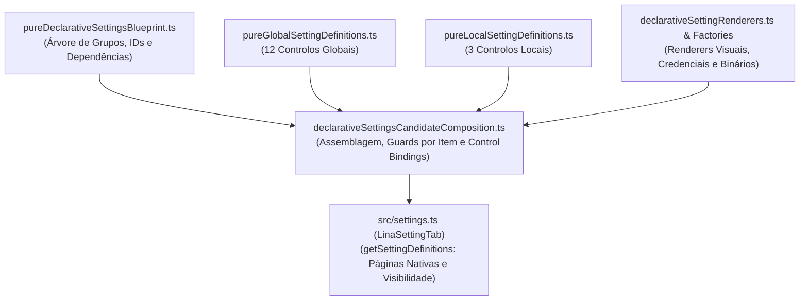

# LINA-05 — Auditoria de Arquitetura de Settings e Definição da Fonte Única de Verdade (v1.0)

**Identificador:** `LINA-05-AUDIT-SETTINGS-SOURCE-OF-TRUTH-001`
**Data:** 2026-09-28
**Autor:** Arquiteto de Software Sénior
**Estado:** Concluída (Auditoria exclusivamente analítica — sem alteração de código, schemas, migrations ou commits)
**Âmbito:** Arquitetura de Informação das Settings do Lina (`src/settings.ts`, `src/settings/*`, Obsidian Desktop & Android)

---

## 1. Resumo executivo

### 1.1 Diagnóstico do problema histórico
A organização das definições do Lina sofreu múltiplas reorganizações sucessivas entre a versão 0.2.x e a versão 0.3.1. A análise técnica e histórica identifica as três causas fundamentais dessa instabilidade:

1. **Inexistência de uma especificação formal prévia de Arquitetura de Informação (IA):**
   As primeiras versões agrupavam definições por proximidade de implementação técnica (ex.: secção monolítica imperativa `display()` com 47 itens), herdando categorias aglutinadoras como *"Diagnostics & Advanced Maintenance"*, que funcionava como depósito indiscriminado de flags, rotinas de indexação, preferências e botões de risco destrutivo.
2. **Conflito sistemático entre dois princípios de UX opostos:**
   - *Tensão entre Coesão de Domínio vs. Ocultação de Complexidade ("Avançado"):* Na migração para *Native Settings Pages* (`LINA-04`), tentou-se inicialmente esvaziar as páginas funcionais movendo endpoints (`base-url`), timeouts, batch sizes e botões de teste para a página *Avançado*. Isto quebrou os fluxos naturais de configuração (o utilizador escolhia o provider de IA ou Embeddings numa página e tinha de navegar para *Avançado* para introduzir o endpoint ou testar a ligação). As fases subsequentes (`REDUCTION` e `FIX-BOUNDARY`) tiveram de mover esses itens de volta para os seus domínios funcionais.
   - *Tensão entre Domínio Funcional (Pesquisa/Vetores) vs. Separação de Papéis (Producer vs. Companion):* As definições de embeddings dividem-se entre consumo/pesquisa (comum a todos os dispositivos via Vector Contract publicado) e geração/manutenção (exclusivo do Producer). Sem uma fronteira conceitual rígida, definições oscilaram entre *Pesquisa*, *Producer* e *Avançado*.
3. **Dispersão da Fonte de Verdade arquitetural:**
   A "verdade" sobre onde uma definição existe, o seu tipo, se está visível e como se comporta estava dispersa por quatro camadas desacopladas sem um modelo unificado:
   - A árvore estrutural de grupos/páginas reside em `pureDeclarativeSettingsBlueprint.ts`;
   - O tipo e metadados base residem em `pureGlobalSettingDefinitions.ts` e `pureLocalSettingDefinitions.ts`;
   - Os renderers visuais e comportamentais residem em `declarativeSettingRenderers.ts`, `declarativeSettingsConnectionCredentialRenderers.ts` e `declarativeSettingsBinaryRenderers.ts`;
   - As regras de visibilidade e desativação por papel residem divididas entre `LinaSettingTab.getSettingDefinitions()` (a nível de página) e `declarativeSettingsCandidateComposition.ts` (a nível de item individual).

### 1.2 Objetivo desta auditoria e estabilização v1.0
Esta auditoria inventaria exaustivamente as **50 definições existentes**, mapeia o fluxo completo de dados e persistência, identifica os pontos de atrito específicos no Android e define a proposta congelada **Settings Information Architecture v1.0** para estancar alterações contínuas de layout.

---

## 2. Inventário completo das definições

A tabela seguinte cataloga todas as 50 definições presentes na arquitetura declarativa do Lina (49 do blueprint canónico + 1 definição interna de compatibilidade de build `development-build-info`).

| ID | Nome | Descrição | Tipo | Página Atual | Visibilidade | Condições / Guardas | Nível de Armazenamento | Mecanismo de Persistência |
|---|---|---|---|---|---|---|---|---|
| `support-introduction` | Nome do Plugin | Descrição e versão | `information` (custom render) | `general` | Sempre visível | Nenhuma (renderiza card de boas-vindas) | Nenhum | Nenhum (estático / memória) |
| `interface-language` | Idioma da interface | Seleção PT-PT / EN | `future-render` (dropdown) | `general` | Sempre visível | Re-renderiza settings na alteração | Global (`LinaSettings`) | `data.json` (`interfaceLanguage`) |
| `multilingual-note` | Multilingue | Informação sobre notas | `information` (static text) | `general` | Sempre visível | Nenhuma | Nenhum | Nenhum |
| `device-name` | Nome deste dispositivo | Identificador amigável local | `local-control` (text input) | `general` | Sempre visível | Desativado se papel for `companion` | Local (`LinaDeviceSettings`) | `data.json` (`deviceSettingsById[id].deviceName`) |
| `development-build-info` | Build | Timestamp de compilação | `information` (invisible) | `general` | `visible: false` | Oculto na UI; compatibilidade com harness | Build metadata | Nenhum |
| `embeddings-enabled` | Ativar pesquisa semântica | Ativação do motor vetorial | `global-control` (toggle) | `search` | Sempre visível | Rollback integral em caso de falha no save | Global (`LinaSettings`) | `data.json` (`embeddingsEnabled`) |
| `embeddings-provider` | Fornecedor de embeddings | Ollama, OpenAI, etc. | `future-render` (dropdown/badge) | `search` | Sempre visível | Em Companion é badge read-only do Vector Contract | Local (`LinaDeviceSettings`) | `data.json` (`deviceSettingsById[id].embeddingsProvider`) |
| `embeddings-model` | Modelo de embeddings | Nome do modelo vetorial | `future-render` (dropdown/text) | `search` | Sempre visível | Em Companion é badge read-only do Vector Contract | Local (`LinaDeviceSettings`) | `data.json` (`deviceSettingsById[id].embeddingsModel`) |
| `embeddings-base-url` | Endereço base (URL) | URL do endpoint de embeddings | `local-control` (text input) | `search` | Sempre visível | Placeholder dinâmico calculado do provider | Local (`LinaDeviceSettings`) | `data.json` (`deviceSettingsById[id].embeddingsBaseUrl`) |
| `embeddings-credential` | Chave de API | Credencial de acesso | `credential` (custom password) | `search` | Condicional (`provider` requer chave) | Campo sempre vazio; salvar/limpar explícito | Seguro por dispositivo | Obsidian `SecretStorage` (`embeddingsApiKey`) |
| `test-embeddings-connection` | Testar ligação de embeddings | Botão de validação de rede | `async-action` (button) | `search` | Sempre visível | Desativado se busy ou sem credencial obrigatória | Estado transitório | Nenhum (execução em memória) |
| `embeddings-test-feedback` | Feedback de ligação | Diagnóstico do teste | `runtime` (status card) | `search` | Condicional (`status !== "idle"`) | Sanitizado; tokens e segredos nunca expostos | Estado transitório | Nenhum (execução em memória) |
| `embeddings-timeout` | Timeout de embeddings | Limite de espera em segundos | `future-render` (numeric text) | `search` | Sempre visível | Nenhuma | Local (`LinaDeviceSettings`) | `data.json` (`deviceSettingsById[id].embeddingsTimeout`) |
| `embedding-language` | Idioma padrão de embeddings | Idioma dos vetores de texto | `global-control` (dropdown) | `search` | Sempre visível | Nenhuma | Global (`LinaSettings`) | `data.json` (`embeddingDefaultLanguage`) |
| `hybrid-text-weight` | Peso da pesquisa textual | Ponderação no ranking (0–1) | `future-render` (numeric text) | `search` | Sempre visível | Auto-normalização combinada | Global (`LinaSettings`) | `data.json` (`hybridSearchTextWeight`) |
| `hybrid-semantic-weight` | Peso da pesquisa semântica | Ponderação no ranking (0–1) | `future-render` (numeric text) | `search` | Sempre visível | Auto-normalização combinada | Global (`LinaSettings`) | `data.json` (`hybridSearchSemanticWeight`) |
| `analysis-provider` | Fornecedor de IA | Fornecedor LLM de notas | `future-render` (dropdown) | `ai-analysis` | Sempre visível | Invalida ligação e credenciais na alteração | Local (`LinaDeviceSettings`) | `data.json` (`deviceSettingsById[id].analysisProvider`) |
| `analysis-model` | Modelo de IA | Modelo para `/ask`, `/tags`, etc. | `future-render` (dropdown/text) | `ai-analysis` | Sempre visível | Opções dinâmicas conforme provider selecionado | Local (`LinaDeviceSettings`) | `data.json` (`deviceSettingsById[id].analysisModel`) |
| `analysis-base-url` | Endereço base (URL) | URL do endpoint LLM | `local-control` (text input) | `ai-analysis` | Sempre visível | Placeholder dinâmico calculado do provider | Local (`LinaDeviceSettings`) | `data.json` (`deviceSettingsById[id].analysisBaseUrl`) |
| `analysis-credential` | Chave de API | Credencial LLM | `credential` (custom password) | `ai-analysis` | Condicional (`provider` requer chave) | Campo sempre vazio; salvar/limpar explícito | Seguro por dispositivo | Obsidian `SecretStorage` (`analysisApiKey`) |
| `analysis-timeout` | Timeout de IA | Limite de espera em segundos | `future-render` (numeric text) | `ai-analysis` | Sempre visível | Nenhuma | Local (`LinaDeviceSettings`) | `data.json` (`deviceSettingsById[id].analysisTimeout`) |
| `test-analysis-connection` | Testar ligação de IA | Botão de validação de rede | `async-action` (button) | `ai-analysis` | Sempre visível | Desativado se busy ou sem credencial obrigatória | Estado transitório | Nenhum (execução em memória) |
| `analysis-test-feedback` | Feedback de ligação | Diagnóstico do teste | `runtime` (status card) | `ai-analysis` | Condicional (`status !== "idle"`) | Sanitizado; tokens e segredos nunca expostos | Estado transitório | Nenhum (execução em memória) |
| `inbox-folder` | Pasta Inbox | Pasta de notas a analisar | `future-render` (text input) | `ai-analysis` | Sempre visível | Caminho relativo dentro do vault | Global (`LinaSettings`) | `data.json` (`inboxFolderPath`) |
| `inbox-max-notes` | Limite de notas Inbox | Máximo de notas por varrimento | `future-render` (numeric text) | `ai-analysis` | Sempre visível | Inteiro positivo | Global (`LinaSettings`) | `data.json` (`maxInboxNotesToAnalyze`) |
| `yaml-enabled` | Ativar sugestões YAML | Sugestões automáticas | `global-control` (toggle) | `ai-analysis` | Sempre visível | Nenhuma | Global (`LinaSettings`) | `data.json` (`yamlSuggestionsEnabled`) |
| `yaml-properties` | Propriedades permitidas | Lista separada por vírgulas | `global-control` (text input) | `ai-analysis` | Sempre visível | Nenhuma | Global (`LinaSettings`) | `data.json` (`yamlAllowedProperties`) |
| `yaml-include-tags` | Incluir tags nas sugestões | Adicionar tags no frontmatter | `global-control` (toggle) | `ai-analysis` | Sempre visível | Nenhuma | Global (`LinaSettings`) | `data.json` (`yamlIncludeTags`) |
| `max-suggested-tags` | Máximo de tags sugeridas | Limite de sugestões em `/tags` | `future-render` (dropdown) | `ai-analysis` | Sempre visível | Lista de valores fixos (ex.: 3, 5, 8, 10, 15) | Global (`LinaSettings`) | `data.json` (`maxSuggestedTags`) |
| `embedding-update-mode` | Modo de atualização | Manual, Incremental, etc. | `global-control` (dropdown) | `producer` | Visível apenas em `producer` | Desativado se papel for `companion` | Global (`LinaSettings`) | `data.json` (`embeddingUpdateMode`) |
| `embeddings-batch-size` | Tamanho do lote | Número de chunks por pedido | `future-render` (numeric text) | `producer` | Visível apenas em `producer` | Limites inteiros (1 a 128) | Local (`LinaDeviceSettings`) | `data.json` (`deviceSettingsById[id].embeddingsBatchSize`) |
| `excluded-folders` | Pastas excluídas | Pastas ignoradas na indexação | `global-control` (textarea) | `producer` | Visível apenas em `producer` | Desativado se `!canEditExclusions` | Ficheiro do Vault | `.lina/exclusions.json` |
| `excluded-path-terms` | Termos no caminho excluídos | Padrões de caminho ignorados | `global-control` (textarea) | `producer` | Visível apenas em `producer` | Desativado se `!canEditExclusions` | Ficheiro do Vault | `.lina/exclusions.json` |
| `excluded-content-terms` | Termos no conteúdo excluídos | Termos de privacidade | `global-control` (textarea) | `producer` | Visível apenas em `producer` | Desativado se `!canEditExclusions` | Ficheiro do Vault | `.lina/exclusions.json` |
| `auto-update-index-on-file-changes` | Atualização automática | Watcher de ficheiros | `future-render` (toggle) | `producer` | Visível apenas em `producer` | Aciona efeito `update-vault-event-listeners` | Global (`LinaSettings`) | `data.json` (`autoUpdateIndexOnFileChanges`) |
| `update-index-on-startup` | Atualizar índice ao iniciar | Verificação no arranque | `global-control` (toggle) | `producer` | Visível apenas em `producer` | Nenhuma | Global (`LinaSettings`) | `data.json` (`updateIndexOnStartup`) |
| `binary-maintenance` | Manter cópia binária | Geração automática de `.bin` | `future-render` (toggle) | `producer` | Visível apenas em `producer` | Requisita atualização de lifecycle do host | Local (`LinaDeviceSettings`) | `data.json` (`deviceSettingsById[id].maintainBinaryEmbeddingCopy`) |
| `create-or-update-binary-copy` | Criar/atualizar cópia binária | Ação pesada de compilação | `async-action` (button) | `producer` | Visível apenas em `producer` | Bloqueado se status for `legacy-manifest` ou busy | Artefacto de Ficheiro | Ficheiro `.lina/index/embeddings.bin` |
| `remove-binary-copy` | Remover cópia binária | Eliminação do ficheiro `.bin` | `async-action` (button destrutivo) | `producer` | Visível apenas em `producer` | Exige confirmação destrutiva prévia em modal | Artefacto de Ficheiro | Remoção de `.lina/index/embeddings.bin` |
| `exclusions-note` | Política de privacidade | Informação sobre exclusões | `information` (custom render) | `companion` | Visível apenas em `companion` | Explica regras herdadas do Producer | Nenhum | Nenhum (apenas visual) |
| `check-sync-on-startup` | Verificar sincronização | Detetar divergências no arranque | `global-control` (toggle) | `synchronization` | Sempre visível | Nenhuma | Global (`LinaSettings`) | `data.json` (`checkSyncOnStartup`) |
| `device-description` | Papel do dispositivo | Badge de papel e atribuição | `information` (custom card) | `diagnostics` | Sempre visível | Ações interativas para definir ou trocar de papel | Metadados do dispositivo | Ficheiro de papel / estado runtime |
| `binary-warning` | Aviso sobre cópia binária | Nota sobre funcionalidade | `information` (static text) | `diagnostics` | Sempre visível | Nenhuma | Nenhum | Nenhum |
| `binary-status` | Estado da cópia binária | Diagnóstico do ficheiro binário | `runtime` (aria-live status card) | `diagnostics` | Sempre visível | Mostra registos, dimensões e tamanho em KiB | Inspeção do artefacto | Leitura de `.lina/index/embeddings.bin` |
| `check-binary-copy` | Verificar integridade binária | Teste não destrutivo de leitura | `async-action` (button) | `diagnostics` | Sempre visível | Desativado enquanto decorre operação binária | Estado transitório | Nenhum (validação de leitura) |
| `binary-preference` | Preferência de leitura | JSONL vs Preferir Binário | `future-render` (dropdown) | `diagnostics` | Sempre visível | Invalida índice runtime na alteração | Local (`LinaDeviceSettings`) | `data.json` (`deviceSettingsById[id].embeddingStorageReadPreference`) |
| `debug-index-updates` | Depuração de atualizações | Registo detalhado no console | `global-control` (toggle) | `advanced` | Sempre visível | Nenhuma | Global (`LinaSettings`) | `data.json` (`debugIndexUpdates`) |
| `support-description` | Suporte e contacto | Informação institucional | `information` (static text) | `support-footer` | Sempre visível (rodapé do hub) | Nenhuma | Nenhum | Nenhum |
| `support-link` | Formulário de suporte | Ligação externa | `action` (button) | `support-footer` | Sempre visível (rodapé do hub) | Abre URL externa no navegador do sistema | Nenhum | Nenhum |
| `support-email` | Enviar e-mail de suporte | Atalho mailto / cópia | `action` (button) | `support-footer` | Sempre visível (rodapé do hub) | Copia e-mail ou abre cliente de correio | Nenhum | Nenhum |

---

## 3. Fonte de verdade atual

### 3.1 Mapeamento das origens e dispersão de regras

A auditoria identificou que a "verdade" sobre as definições está fragmentada em cinco ficheiros/módulos distintos:



1. **Onde cada definição é criada?**
   - **Controlos puros:** 12 em `pureGlobalSettingDefinitions.ts` e 3 em `pureLocalSettingDefinitions.ts`.
   - **Renderers visuais:** Em `declarativeSettingRenderers.ts` (línguas, pesos, modelos, inbox, yaml).
   - **Ações e credenciais:** Em `declarativeSettingsConnectionCredentialRenderers.ts` e `declarativeSettingsBinaryRenderers.ts`.
   - **Definições embutidas no host:** `support-introduction` e `development-build-info` são injetadas diretamente em `src/settings.ts`.
2. **Onde é associada a uma página?**
   - A filiação a um grupo é determinada exclusivamente pelo array `children` em `createPureDeclarativeSettingsBlueprint()`.
   - O host `LinaSettingTab.getSettingDefinitions()` transforma cada grupo (exceto `support-footer`) num objeto `SettingDefinitionPage`.
3. **Onde é definida a visibilidade?**
   - **Visibilidade de página:** No host `src/settings.ts` (linhas 909–915), onde `producer` só é visível se `effectiveRole === "producer"` e `companion` só se `effectiveRole === "companion"`.
   - **Visibilidade de item:** No candidate composition (ex.: `analysis-credential` e `embeddings-credential` avaliam `shouldShowPureLocalApiKey`; cards de feedback avaliam `status !== "idle"`).
4. **Onde é definida a lógica Producer vs. Companion?**
   - **Duplicação de regras:** A verificação de papel está dispersa entre:
     - `src/settings.ts`: Decide a visibilidade das páginas `producer` e `companion`;
     - `declarativeSettingsCandidateComposition.ts`: Decide se `embedding-update-mode` e `device-name` estão desativados e altera a respetiva `desc` para indicar modo Companion;
     - `declarativeSettingRenderers.ts`: No renderer de provider/model de embeddings, verifica se é Companion para substituir os controlos interativos pelo badge informativo do Vector Contract.

### 3.2 Veredito sobre a Fonte de Verdade
**Não existe uma fonte única de verdade.** Existe uma cadeia de decisão hierárquica mas dispersa, onde a criação do item, a filiação na página, a política de autorização e a persistência estão separadas. Esta fragmentação foi a causa direta pela qual refatorações anteriores geraram regressões de UX e inconsistências entre Desktop e Android.

---

## 4. Problemas encontrados por domínio funcional

Avaliando a organização funcional segundo as 8 áreas (`Geral`, `Pesquisa`, `IA`, `Producer`, `Companion`, `Sincronização`, `Diagnóstico`, `Avançado`):

### 4.1 Geral (`general`)
- **Definições:** `support-introduction`, `interface-language`, `multilingual-note`, `device-name`, `development-build-info`.
- **Avaliação:** **Correto com 1 Ambíguo.**
- **Análise detalhada:**
  - `interface-language` e `multilingual-note` pertencem inquestionavelmente a Geral.
  - `device-name` está em Geral, mas a sua relação com o papel (`device-description`) foi colocada em *Diagnóstico*. Isto gera ambiguidade: o utilizador define o nome do dispositivo em Geral, mas para ver o papel ou alterá-lo tem de navegar para Diagnóstico.
  - `development-build-info` é dívida técnica (compatibilidade de harness com `visible: false`), mas inofensivo.

### 4.2 Pesquisa (`search`)
- **Definições:** `embeddings-enabled`, `embeddings-provider`, `embeddings-model`, `embeddings-base-url`, `embeddings-credential`, `test-embeddings-connection`, `embeddings-test-feedback`, `embeddings-timeout`, `embedding-language`, `hybrid-text-weight`, `hybrid-semantic-weight`.
- **Avaliação:** **Correto.**
- **Análise detalhada:**
  - A reintegração de base-url, credencial, teste e timeout junto do provider/modelo (após `LINA-04-FIX-SETTINGS-BOUNDARY-001`) restaurou a integridade do domínio.
  - No Companion, o facto de provider/modelo se transformarem em badges read-only do Vector Contract sem mover os itens de página é uma solução arquitetural excelente que evita duplicação de definições.
  - Os pesos de pesquisa híbrida pertencem legitimamente a esta secção.

### 4.3 IA e Análise de Notas (`ai-analysis`)
- **Definições:** `analysis-provider`, `analysis-model`, `analysis-base-url`, `analysis-credential`, `analysis-timeout`, `test-analysis-connection`, `analysis-test-feedback`, `inbox-folder`, `inbox-max-notes`, `yaml-enabled`, `yaml-properties`, `yaml-include-tags`, `max-suggested-tags`.
- **Avaliação:** **Correto (com densidade elevada).**
- **Análise detalhada:**
  - O fluxo funcional está completo e autónomo (configuração de IA + credencial + teste + Inbox + YAML/tags).
  - Problema de UX: Tem 13 definições na mesma página. Em desktop é aceitável; em ecrãs móveis gera scroll vertical significativo.

### 4.4 Producer (`producer`)
- **Definições:** `embedding-update-mode`, `embeddings-batch-size`, `excluded-folders`, `excluded-path-terms`, `excluded-content-terms`, `auto-update-index-on-file-changes`, `update-index-on-startup`, `binary-maintenance`, `create-or-update-binary-copy`, `remove-binary-copy`.
- **Avaliação:** **Correto.**
- **Análise detalhada:**
  - Condicionamento rigoroso: a página só existe se o dispositivo for Producer ativo/standby.
  - Agrupa todas as ações pesadas que gravam no vault (`.lina/exclusions.json`, `.lina/index/embeddings.bin` e watchers).
  - Remove totalmente o risco de um dispositivo Companion executar manutenção destrutiva ou corromper a política de exclusões do vault.

### 4.5 Companion (`companion`)
- **Definições:** `exclusions-note`.
- **Avaliação:** **Potencialmente errado / Reduzido em excesso.**
- **Análise detalhada:**
  - A página Companion tem exatamente **1 item** informativo (`exclusions-note`).
  - O utilizador Companion clica numa página nativa dedicada e depara-se com um único texto estático.
  - *Causa:* O Vector Contract foi (corretamente) mantido em *Pesquisa* para evitar IDs duplicados. No entanto, ter uma página inteira com apenas uma nota textual é despropositado em termos de UX.

### 4.6 Sincronização (`synchronization`)
- **Definições:** `check-sync-on-startup`.
- **Avaliação:** **Potencialmente errado / Reduzido em excesso.**
- **Análise detalhada:**
  - Semelhante a Companion: uma página nativa completa no menu do Obsidian para conter **um único toggle** (`check-sync-on-startup`).
  - Isto fragmenta a navegação sem ganho de usabilidade.

### 4.7 Diagnóstico (`diagnostics`)
- **Definições:** `device-description`, `binary-warning`, `binary-status`, `check-binary-copy`, `binary-preference`.
- **Avaliação:** **Ambíguo / Fragmentado.**
- **Análise detalhada:**
  - Mistura duas coisas desconexas:
    1. A identidade e papel do dispositivo (`device-description`);
    2. A saúde e preferência de leitura da cópia binária de embeddings (`binary-status`, `check-binary-copy`, `binary-preference`).
  - Como referido em 4.1, a gestão de papel do dispositivo está isolada da definição de nome do dispositivo (`device-name`), que ficou em Geral.

### 4.8 Avançado (`advanced`)
- **Definições:** `debug-index-updates`.
- **Avaliação:** **Potencialmente errado / Reduzido em excesso.**
- **Análise detalhada:**
  - Contém unicamente **1 toggle** (`debug-index-updates`).
  - Ter uma página com o título "Avançado" apenas para um toggle de log de depuração é resíduo da fase de redução anterior.

---

## 5. Análise detalhada da plataforma Android

A auditoria analisou minuciosamente o comportamento das Settings no ambiente mobile (Android):

```text
+-------------------------------------------------------------------------+
| OBSIDIAN ANDROID SETTINGS RUNTIME                                       |
+-------------------------------------------------------------------------+
| [UI Layer]         Native Settings Pages via Obsidian API               |
|                    Totalmente suportado; navegação com botão "< Voltar" |
+-------------------------------------------------------------------------+
| [Touch / Focus]    Campos de texto disparam teclado virtual             |
|                    Risco de perda de foco se host.update() for chamado  |
+-------------------------------------------------------------------------+
| [Storage]          data.json local ao dispositivo (app/vault storage)   |
|                    Sem bloqueios de IO; sincronização tratada à parte  |
+-------------------------------------------------------------------------+
| [SecretStorage]    app.secretStorage nativo (Obsidian Keychain)         |
|                    Isolado; nunca sincronizado em plaintext            |
+-------------------------------------------------------------------------+
```

### 5.1 Campos editáveis e eventos Touch
- **Problema de perda de foco e caret jump:**
  Em Android, ao tocar num input de texto, o teclado do sistema abre e redimensiona a viewport. Se o callback `onChange` do controlo desencadear um re-render completo da UI (`this.update()`), o nó do DOM é destruído e recriado, fazendo com que o teclado virtual feche ou o cursor salte para o início/fim da palavra.
  - *Diagnóstico no Lina:* O código atual protegeu isso em `declarativeSettingRenderers.ts` usando `{ requestUpdate: false }` nos inputs de texto de modelo, mas os controlos derivados de `pureLocalSettingDefinitions` e `pureGlobalSettingDefinitions` utilizam bindings padrão.
  - *Veredito:* **Regra arquitetural.** Todas as mutações de campos de texto puro devem atualizar o estado interno em memória e persistir sem disparar `requestHostUpdate()` no ciclo síncrono de input.

### 5.2 Densidade visual e dimensões de botões
- Na página `ai-analysis` (13 itens) e `search` (11 itens), o utilizador necessita de fazer múltiplos scrolls de ecrã para alcançar os controlos inferiores.
- O bloco de credenciais (`analysis-credential` e `embeddings-credential`) contém na mesma linha: Campo de Password + Botão Guardar/Substituir + Botão Limpar. Em ecrãs móveis verticais de menor resolução (ex.: 360–390dp de largura), estes três elementos quebram a linha de forma desagradável ou comprimem o botão até ficar ilegível.

### 5.3 Textareas de exclusão (`excluded-folders`, etc.)
- A edição de caminhos multiline num elemento `<textarea>` no teclado do Android é propensa a auto-correções agressivas (ex.: inserção de espaços acidentais ou maiúsculas indesejadas em caminhos de ficheiros).
- *Aspeto positivo atual:* Como estas textareas foram confinadas à página `producer`, os utilizadores em Android que usam o telemóvel exclusivamente como `companion` nunca são expostos a estes campos.

### 5.4 Persistência e SecretStorage no Android
- **Persistência de dados:** O ficheiro `data.json` é gravado via API segura do Obsidian (`plugin.saveData()`), funcionando identicamente em Desktop e Android.
- **Armazenamento de chaves:** A API `app.secretStorage` é compatível com Obsidian Mobile v1.4+. O isolamento das credenciais fora de `data.json` previne vazamento acidental de chaves de API caso o utilizador sincronize o vault via serviços de terceiros (Syncthing, Git, etc.).

### 5.5 Resumo da causa do "Problema Android"
O problema no Android **não é de armazenamento, permissões ou componente incompatível**. É **estritamente de UX e ergonomia visual**:
1. Páginas com densidade excessiva (13 itens);
2. Agrupamentos atómicos com 1 único item (ex.: Sincronização e Avançado) que causam fadiga de navegação (entrar na página para tocar num botão e voltar atrás);
3. Agrupamento de botões de credenciais em linhas estreitas.

---

## 6. Organização recomendada

Com base na auditoria, a organização ótima deve eliminar páginas desnecessariamente vazias (unificando conceitos com afinidade lógica direta) e consolidar uma hierarquia clara.

### 6.1 Critérios de reclassificação
- **Regra arquitetural:** Manter separação estrita de persistência (Global vs Local vs Segredo) e guards de papel (Producer vs Companion).
- **Decisão UX:** Consolidar páginas com 1 item em páginas mãe logicamente correlacionadas.
- **Dívida técnica:** Unificar a definição de nome do dispositivo com o cartão de gestão de papel.

### 6.2 Matriz de reclassificação

```text
ESTRUTURA ATUAL (8 Páginas)               PROPOSTA CONSOLIDADA (5 Páginas Lógicas)
1. Geral (5 itens)                  --->  1. Geral e Dispositivo (Geral + Identidade de Papel)
2. Pesquisa (11 itens)              --->  2. Pesquisa e Embeddings (Inalterada - Coesa)
3. IA e Análise (13 itens)          --->  3. Assistente de IA (Inalterada - Coesa)
4. Producer (10 itens)              --->  4. Produtor (Condicional - Inalterada)
5. Companion (1 item)               --->  [Consolidado na página Geral/Dispositivo como info]
6. Sincronização (1 item)           --->  [Consolidado em Avançado ou Geral]
7. Diagnóstico (5 itens)            --->  5. Diagnóstico e Cópia Binária
8. Avançado (1 item)                --->  [Consolidado com Depuração e Sincronização]
+ Suporte (Rodapé)                  --->  + Suporte (Rodapé inalterado)
```

---

## 7. Proposta Settings Information Architecture v1.0

A proposta **Settings Information Architecture v1.0** estabelece a estrutura definitiva, canónica e congelada, eliminando páginas "fantasma" de um só item e aproximando definições interdependentes.

```text
================================================================================
LINA SETTINGS INFORMATION ARCHITECTURE v1.0 (CONGELADA)
================================================================================
[HUB INICIAL - NATIVE SETTINGS HUB]
  │
  ├── 1. GERAL E DISPOSITIVO [ID: "general"]
  │     ├── support-introduction             (Info: Boas-vindas, versão e build)
  │     ├── interface-language               (Dropdown: Idioma da interface)
  │     ├── multilingual-note                (Info: Nota sobre indexação multilingue)
  │     ├── device-description               (Card: Papel ativo, autorização e troca de papel)
  │     ├── device-name                      (Input: Nome local deste dispositivo)
  │     └── [Se Companion] exclusions-note   (Info: Política de exclusões recebida)
  │
  ├── 2. PESQUISA E EMBEDDINGS [ID: "search"]
  │     ├── embeddings-enabled               (Toggle: Ativar motor semântico)
  │     ├── embeddings-provider              (Dropdown ou Badge Vector Contract)
  │     ├── embeddings-model                 (Dropdown/Input ou Badge Vector Contract)
  │     ├── embeddings-base-url              (Input: URL local ou remota)
  │     ├── embeddings-credential            (Password: SecretStorage)
  │     ├── test-embeddings-connection       (Botão: Validação de ligação)
  │     ├── embeddings-test-feedback         (Card: Resultado do teste)
  │     ├── embeddings-timeout               (Input: Timeout em segundos)
  │     ├── embedding-language               (Dropdown: Idioma do embedding)
  │     ├── hybrid-text-weight               (Input: Peso BM25/Textual)
  │     └── hybrid-semantic-weight           (Input: Peso Semântico)
  │
  ├── 3. ASSISTENTE DE IA [ID: "ai-analysis"]
  │     ├── analysis-provider                (Dropdown: Fornecedor LLM)
  │     ├── analysis-model                   (Dropdown/Input: Modelo de análise)
  │     ├── analysis-base-url                (Input: Endpoint URL)
  │     ├── analysis-credential              (Password: SecretStorage)
  │     ├── analysis-timeout                 (Input: Timeout em segundos)
  │     ├── test-analysis-connection         (Botão: Validação de ligação)
  │     ├── analysis-test-feedback           (Card: Resultado do teste)
  │     ├── inbox-folder                     (Input: Pasta de entrada)
  │     ├── inbox-max-notes                  (Input: Limite de análise)
  │     ├── yaml-enabled                     (Toggle: Sugestões YAML)
  │     ├── yaml-properties                  (Input: Chaves permitidas)
  │     ├── yaml-include-tags                (Toggle: Incluir tags no YAML)
  │     └── max-suggested-tags               (Dropdown: Limite de tags)
  │
  ├── 4. PRODUTOR (Condicional: Visível apenas em Producer) [ID: "producer"]
  │     ├── embedding-update-mode            (Dropdown: Modo de atualização)
  │     ├── embeddings-batch-size            (Input: Tamanho do lote)
  │     ├── auto-update-index-on-file-changes(Toggle: Watcher de ficheiros)
  │     ├── update-index-on-startup          (Toggle: Reindexar no arranque)
  │     ├── excluded-folders                 (Textarea: Pastas excluídas do vault)
  │     ├── excluded-path-terms              (Textarea: Termos de caminho excluídos)
  │     ├── excluded-content-terms           (Textarea: Termos de conteúdo excluídos)
  │     ├── binary-maintenance               (Toggle: Manutenção automática do binário)
  │     ├── create-or-update-binary-copy     (Botão: Compilar artefacto binário)
  │     └── remove-binary-copy               (Botão destrutivo com confirmação)
  │
  ├── 5. SISTEMA E DIAGNÓSTICO [ID: "diagnostics"]
  │     ├── check-sync-on-startup            (Toggle: Verificar sincronização ao iniciar)
  │     ├── binary-warning                   (Info: Aviso de funcionalidade experimental)
  │     ├── binary-status                    (Card: Estado e métricas do ficheiro .bin)
  │     ├── check-binary-copy                (Botão: Validação de integridade)
  │     ├── binary-preference                (Dropdown: Preferência JSONL vs Binário)
  │     └── debug-index-updates              (Toggle: Logging de depuração)
  │
  └── [RODAPÉ DO HUB] [ID: "support-footer"]
        ├── support-description              (Info: Texto de ajuda comunitária)
        ├── support-link                     (Botão: Formulário Google)
        └── support-email                    (Botão: Cópia de endereço de e-mail)
================================================================================
```

### 7.1 Ganhos imediatos da Arquitetura v1.0
1. **Redução de 8 para 5 páginas nativas:** Elimina a frustração de abrir páginas vazias (Companion com 1 item, Sincronização com 1 item, Avançado com 1 item).
2. **Reunificação do conceito de Dispositivo:** O nome do dispositivo (`device-name`) e o papel/badge (`device-description`) ficam juntos em `general`. Se o dispositivo for Companion, a nota explicativa de exclusões (`exclusions-note`) surge naturalmente nessa mesma secção de dispositivo.
3. **Página de Sistema e Diagnóstico coesa:** Agrupa `check-sync-on-startup`, todas as opções da cópia binária e a flag de `debug-index-updates`.
4. **Preservação de 100% dos IDs e Persistência:** Não se altera um único identificador, garantindo compatibilidade total com settings guardadas anteriormente em `data.json` e no `SecretStorage`.

---

## 8. Alterações necessárias para congelar a arquitetura

Para transitar da auditoria para a implementação do congelamento da v1.0 (em tarefa futura autorizada), serão necessários exclusivamente os seguintes ajustes controlados:

### 8.1 Ficheiros a ajustar (quando autorizado)
1. `src/settings/pureDeclarativeSettingsBlueprint.ts`:
   - Atualizar a declaração dos grupos de 9 para 6 (5 páginas nativas + 1 rodapé de suporte);
   - Mover `device-description` e `exclusions-note` para `general`;
   - Mover `check-sync-on-startup` e `debug-index-updates` para `diagnostics`;
   - Remover os grupos obsoletos `companion`, `synchronization` e `advanced`.
2. `src/settings.ts`:
   - Atualizar o método `getGroupSummary()` para refletir os 5 grupos canónicos;
   - Remover a guarda de visibilidade da página `companion` (já não é necessária como página separada, pois o item é renderizado condicionalmente em `general`).
3. `src/i18n/strings.ts`:
   - Ajustar o título de `settingsGroupDiagnostics` para "Sistema e Diagnóstico" / "System & Diagnostics".
4. Testes automatizados:
   - Atualizar testes estruturais de blueprint e de paridade de páginas nativas para validar as 5 páginas canónicas e as 50 definições.

### 8.2 O que NÃO deve ser alterado (Invariantes Estritas)
- **Nenhum ID de definição pode ser renomeado.**
- **Nenhum schema ou versão de `data.json` pode ser alterado.**
- **O mecanismo de chaves no `SecretStorage` deve manter-se estritamente isolado.**
- **As guards de autorização do Producer (`OwnershipGate`, `canEditExclusions`) não podem ser relaxadas.**

---

## 9. Conclusão da auditoria e Stop Condition

A auditoria da arquitetura de Settings do Lina está formalmente concluída:
- A causa raiz das sucessivas reorganizações foi diagnosticada com precisão (ausência de IA formal + tensão entre avançado/domínio e papel/pesquisa + dispersão de verdade).
- O inventário completo de 50 definições está documentado e mapeado contra persistência e autorizações.
- O comportamento e os limites no Android foram analisados e clarificados.
- A proposta **Settings Information Architecture v1.0** está consolidada e pronta para congelamento definitivo sem impactar lógica de negócio ou dados persistidos.

**ESTADO: PARAR. Nenhuma implementação de código ou alteração física foi efetuada.**
